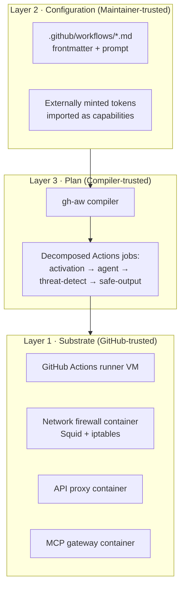
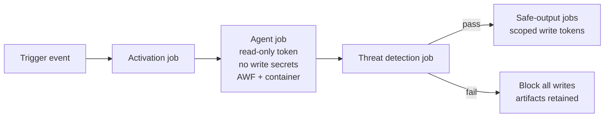
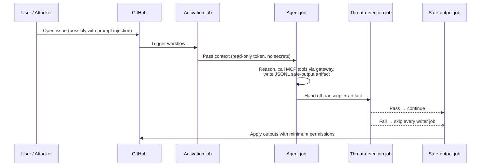

# アーキテクチャとセキュリティ詳解

> _gh-aw v0.61.0 を基準 · 最終レビュー 2026-04_

このドキュメントでは、GitHub Agentic Workflows (gh-aw) が、非決定的な AI
エージェントを GitHub Actions の中で安全に実行するためにどのように設計されて
いるかを解説します。**3 つの信頼レイヤー**、**5 つのセキュリティガードレール**、
**攻撃者モデル**、そして各保証がコンパイル時とランタイムでそれぞれ何を意味
するのかに焦点を当てます。

## TL;DR

- gh-aw は信頼を **3 つのレイヤー** に分離します。GitHub Actions の **基盤
  (substrate)**、リポジトリメンテナが記述する **宣言的設定**、そして信頼された
  コンパイラが生成する **ランタイムプラン** の 3 つです。
- 5 つのガードレールがエンドツーエンドでこのモデルを強制します。すなわち、
  **読み取り専用トークン**、**エージェント内にシークレットを持たせない**、
  **AWF ファイアウォール背後でのコンテナ実行**、**安全な出力 (safe outputs)**、
  そして **エージェント脅威検知** です。
- コンパイラは信頼カーネルです。1 つのワークフローを複数の GitHub Actions ジョブ
  に分解し、書き込み権限がエージェントプロセスと同居しないようにします。
- エージェントは **プロンプトインジェクションを受けたかもしれない信頼できない
  コード** として扱われます。エージェントが読めるものはすべて命令になり得て、
  エージェントが生成するものはすべて世界に影響を与える前に検証されます。
- スコープ外: ハードウェア攻撃、ランナーへのサイドチャネル攻撃、GitHub Actions
  自体のサプライチェーン侵害は対象外です。

## 主要な概念

| 用語 | 定義 |
|------|------|
| **信頼レイヤー (Trust layer)** | gh-aw が異なる脅威モデルを仮定し、異なる制御を適用する境界。基盤・設定・プランの 3 つがあります。 |
| **基盤 (Substrate)** | GitHub Actions のランナー VM と特権サイドカーコンテナ群 (ネットワークファイアウォール、API プロキシ、MCP ゲートウェイ)。 |
| **設定 (Configuration)** | メンテナがコミットする Markdown + YAML のワークフローファイル。認証トークンは外部で発行され、インポートされた能力 (capability) として扱われます。 |
| **プラン (Plan)** | gh-aw コンパイラが 1 つのエージェント的ソースファイルから生成する、低水準化された複数ジョブの GitHub Actions ワークフロー。 |
| **Safe Output** | エージェントが書き出す構造化アーティファクト (JSONL)。別の制限付きジョブが厳密な上限のもとで GitHub に適用します。 |
| **AWF** | Agentic Workflow Firewall。Squid ベースの egress プロキシで、許可されないトラフィックを `iptables` によりカーネルレベルで遮断します。 |
| **脅威検知 (Threat detection)** | エージェント実行後、safe-output ジョブの前に走る AI スキャン。失敗するとすべての書き込みがブロックされます。 |
| **エージェント脅威 (Agentic threat)** | プロンプトインジェクション、シークレット漏洩、エージェントが強制されて生成しうる悪意あるコードなど。 |

## 詳解

### 3 つの信頼レイヤー



**Layer 1 — 基盤 (Substrate)。** GitHub が管理するランナー VM と、3 つの特権
サイドカーコンテナで構成されます。**ネットワークファイアウォールコンテナ**は、
ワークフローの `network.allowed` リストにマッチしない外向き通信を `iptables`
を使ってカーネルレベルで遮断します。**API プロキシコンテナ**は HTTP の egress
を仲介し、検査とログ取得を可能にします。**MCP ゲートウェイ**は Model Context
Protocol の呼び出しをすべて仲介し、エージェントが生のクレデンシャルを保持
しないようにします。このレイヤーは GitHub 自身が保守するため信頼されます。

**Layer 2 — 設定 (Configuration)。** `.github/workflows` 配下のエージェント
ワークフローファイルは、リポジトリ内の他のコードと同程度に信頼されます。
すなわち、メンテナのみが変更でき、変更は通常のプルリクエストレビューを通り
ます。認証トークン (Anthropic API キー、OpenAI キー、Copilot トークンなど) は
ワークフローの **外側** で発行され、GitHub Actions のシークレットとして保存
されます。設定では名前で参照するだけです。これらはワークフロー自身が所有する
シークレットではなく、**インポートされた能力** として扱われます。

**Layer 3 — プラン (Plan)。** 多くのユーザが過小評価するレイヤーです。gh-aw
コンパイラが信頼カーネルです。frontmatter 付きの Markdown ファイル 1 つを
読み取り、必要最小限の権限を持つ複数ジョブの GitHub Actions ワークフローへと
**低水準化** します。エージェントジョブは読み取り専用の `GITHUB_TOKEN` で
実行され、書き込み用シークレットは一切持ちません。書き込み能力が必要な
ダウンストリームジョブ (issue を開く、コミットを push する、コメントを投稿
する) は、エージェントが終了し、かつ脅威検知が通った後にのみ実行されます。

### 5 つのセキュリティガードレール



#### 1. 読み取り専用 GitHub トークン

エージェントが受け取る `GITHUB_TOKEN` は、ワークフローのトップレベル
`permissions:` ブロックが他ジョブ向けに何を要求しているかにかかわらず、
読み取り専用にクランプされます。エージェントは issue、プルリクエスト、コード、
コミットを観察できますが、直接変更することはできません。変更は常に safe-output
の仕組みを通ります。

#### 2. エージェント内にシークレットを持たせない

書き込みトークン、サードパーティサービスの API キー、その他悪用可能な
クレデンシャルは、エージェント後の隔離されたジョブの中に **のみ** 存在します。
エージェントの環境変数はコンパイラによって列挙・スクラブされます。エージェント
ブロック内でシークレットを参照すると、`strict` モードではコンパイルエラーに
なります。

#### 3. AWF 背後でのコンテナ化実行

エージェントプロセスは、AWF (Squid) サイドカーと Pod 状のネットワークを共有
するコンテナ内で実行されます。すべての外向きトラフィックは `iptables` ルール
によってプロキシ経由に強制ルーティングされ、ワークフローの `network.allowed`
リストにないものは **カーネルレベルで遮断** されます (プロキシだけでなく)。
これによりプロキシをバイパスしようとする悪意あるコードを防げます。

#### 4. Safe outputs

エージェントが GitHub API を直接呼ぶのではなく、適用したい出力を記述する
構造化された **JSONL アーティファクト** を書き出します (例: 「タイトル T、本文
B で issue を開く」「PR #42 にコメントを投稿する」)。それを別の、権限を絞った
ジョブが消費し、ワークフロー作者が設定した厳密な上限のもとで適用します
(例: 「1 回の実行で issue は最大 3 件」「ラベルはこの allowlist に限る」「PR
本文は 4096 文字まで」)。完全な一覧は [Safe Outputs Catalog](./06-safe-outputs-catalog.md)
を参照してください。

#### 5. エージェント脅威検知

エージェントが完了し、safe-output ジョブが走る前に、専用の脅威検知ジョブが
LLM を使ってエージェントのトランスクリプトと出力をスキャンし、**プロンプト
インジェクションの兆候**、**シークレット漏洩**、**悪意あるコードパターン** を
検出します。スキャンに失敗すると、すべてのダウンストリーム書き込みジョブが
スキップされます。エージェントのアーティファクト自体はアップロードされ、
人間が確認できます。

### 攻撃者モデル

脅威モデルでは、攻撃者ができることを次のように仮定します。

- issue を立てる、PR を開く、ブランチを push する、コメントを残す。
- エージェントが読むあらゆる入力 (issue 本文、PR 説明、コードコメント、
  ファイル内容、MCP ツールの応答、取得した Web ページ) にプロンプト
  インジェクションのペイロードを仕込む。
- エージェントを誘導してシークレット exfiltration、悪意あるコード生成、
  悪意ある引数でのツール呼び出しを試みさせる。

逆に、攻撃者にできないと仮定することは次のとおりです。

- ワークフローファイル自体を改変する (リポジトリ書き込み権限が必要であり、
  GitHub のレビューと保護ブランチですでにゲートされている)。
- ランナー VM や基盤コンテナを侵害する (基盤への信頼)。
- GitHub 本体や ID プロバイダを侵害する。

**スコープ外:** ハードウェア攻撃、共有ランナーに対する CPU サイドチャネル攻撃、
上流 Actions のサプライチェーン侵害、コンテナランタイムのゼロデイ。これらは
GitHub の責任範囲であり、gh-aw のものではありません。

### コンパイル時 vs ランタイム保証

| 保証 | 強制タイミング | 違反時に何が起きるか |
|------|----------------|---------------------|
| エージェントに書き込みシークレットを持たせない | **コンパイル時** | コンパイラがワークフローを拒否 |
| エージェントトークンが読み取り専用 | **コンパイル時** | コンパイラが権限を書き換える |
| `network.allowed` が明示的 (strict) | **コンパイル時** | strict モードで拒否 |
| GitHub Actions が SHA でピン留め (strict) | **コンパイル時** | strict モードで拒否 |
| egress トラフィックが allowlist に制限 | **ランタイム** | `iptables` がパケットを drop |
| MCP 呼び出しがゲートウェイを経由 | **ランタイム** | ツール呼び出しが失敗 |
| safe-output の上限 (件数、サイズ) | **ランタイム** | 出力が切り詰められるか拒否 |
| プロンプトインジェクション / シークレット漏洩なし | **ランタイム** | 脅威検知が書き込みをブロック |

> [!NOTE]
> コンパイル時チェックは安価かつ決定的で、一度直せばずっと固定されます。
> ランタイムチェックは、本質的に非決定的なエージェントプロセスに対する
> セーフティネットです。

### SafeOutputs がプランレベルの信頼を実体化する仕組み

`safe-outputs:` は、Layer 3 の最も具体的な実装です。コンパイラは次のことを
行います。

1. 宣言された各出力タイプの JSONL スキーマを生成。
2. エージェントのプロンプトに小さな「ライターシム」を注入し、出力の要求方法を
   伝える。
3. 出力タイプごとに別の Actions ジョブを生成し、必要な **最小限** の
   `permissions:` のみを与える (例: `create-issue` には `issues: write` だけ)。
4. 脅威検知ジョブを `needs:` 依存関係としてエージェントとライタージョブの間に
   配線する。

これらの配線のいずれかが切られると (たとえば低水準化されたワークフローを手動で
編集すると)、ライタージョブは `needs:` ガードを失い、モデルが破綻します。
これが、コンパイラを信頼カーネルとして扱い、低水準化された出力をビルド成果物
とみなして手で編集しない理由です。

### 信頼違反: 各レイヤーが何を守るか

| レイヤー | 守る対象 | 失敗時の挙動 |
|----------|----------|--------------|
| 基盤 | allowlist 越えの egress、エージェントへの生クレデンシャル露出 | OS レベルファイアウォールと MCP ゲートウェイがどちらも fail-closed。エージェントはリソースに到達できない |
| 設定 | 誤った権限設定、場当たり的なシークレット使用 | ワークフロー実行前のビルド時にコンパイラがエラー |
| プラン | エージェントによる GitHub への直接変更 | エージェントが暴走しても、読み取り専用トークンと書き込みシークレットの不在により変更不可 |

## 例

### 5 つのガードレールをすべて行使する最小ハードン済みワークフロー

```markdown
---
on:
  issues:
    types: [opened]
  reaction: eyes
  stop-after: +24h
strict: true                    # Guardrail #1, #2, network strictness
permissions:
  contents: read                # Top-level remains read-only for the agent
engine:
  id: copilot
  version: "0.0.422"
network:
  allowed:
    - github                    # Ecosystem identifier (strict-friendly)
    - api.githubcopilot.com
safe-outputs:                   # Guardrail #4
  create-issue:
    max: 1
    labels: [triage, ai-generated]
  add-comment:
    max: 3
threat-detection:               # Guardrail #5 (enabled by default; shown explicitly)
  enabled: true
---

# Triage New Issues

You will receive one freshly opened issue. Read it, classify it,
and either (a) post a single comment summarising next steps, or
(b) open a follow-up issue if the report is actually two bugs.
```

これにより得られるもの:

1. **読み取り専用トークン。** トップレベルの `permissions: contents: read` と
   コンパイラのクランプ。
2. **エージェント内にシークレットなし。** エージェントブロック内に `secrets.*`
   の参照がない。
3. **コンテナ化 + AWF。** エージェントは標準サンドボックスで実行され、egress
   は `github` と `api.githubcopilot.com` のみ許可。
4. **Safe outputs。** `create-issue` と `add-comment` は JSONL として出力され、
   別ジョブが `max:` 上限とラベル allowlist のもとで適用。
5. **脅威検知。** デフォルト ON。明確化のために明示。

### エンドツーエンドのシーケンス



## 落とし穴と FAQ

> [!WARNING]
> **`secrets.*` をエージェントの環境に追加しないでください。** 「1 つのツール
> でしか必要ないから」と言ってもガードレール #2 を破壊します。代わりに
> safe-output ジョブに置き、エージェントには構造化されたリクエストを発行
> させてください。

> [!WARNING]
> **コンパイル後のワークフロー YAML を手で編集しないでください。** エージェント
> → 脅威検知 → safe-output 間の `needs:` グラフこそがプランレベルの信頼を強制
> します。

**Q: 脅威検知を無効化できますか?**
A: `threat-detection: { enabled: false }` で可能ですが、これは safe outputs を
まったく持たないワークフローに限定すべきです。ライターを残したままゲートを
外すと、本システムが防ぐべき攻撃クラスを再び有効化することになります。

**Q: エージェントが `example.com` から取得する必要があります。どうすれば?**
A: `network.allowed` に追加してください。strict モードでは明示する必要があり、
ワイルドカードは拒否されます。

**Q: エージェントがコード中で偶然シークレットを読むのは許されますか?**
A: 読み取り専用トークンの範囲で読めますが、それを safe output に含めようと
した場合は脅威検知が検出します。また safe-output スキーマには「この文字列を
漏洩する」という妥当なアクションは存在しません。

**Q: 脅威検知の偽陰性が出た場合のブラスト半径は?**
A: safe-output ライタージョブが許される範囲に限定されます。たとえば issue
作成ジョブは issue を作るだけで、`max:` 件数とラベル allowlist の制約下です。
エージェントから任意書き込みへのパスはありません。

**Q: なぜ「PAT を持たせて agent を実行」ではダメなのですか?**
A: エージェントは非決定的でプロンプトインジェクションを受ける可能性があるため
です。同一プロセス内に書き込みトークンを持たせることは、攻撃者にそのトークン
を渡すのと等価です。

## 関連ドキュメント

- [Engines](./02-engines.md) — エージェントを駆動する LLM の選択
- [Frontmatter Reference](./03-frontmatter-reference.md) — `network`、
  `safe-outputs`、`threat-detection`、`strict` を含むすべてのフィールド
- 公式: [Architecture](https://github.github.io/gh-aw/introduction/architecture/)
- 公式: [Security overview](https://github.github.io/gh-aw/)
- 公式: [Safe outputs](https://github.github.io/gh-aw/reference/safe-outputs/)
- 公式: [Network permissions](https://github.github.io/gh-aw/reference/network/)
