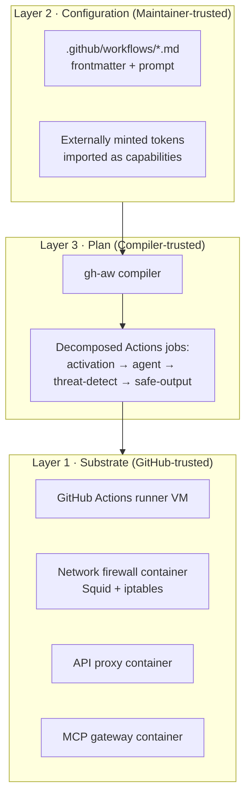
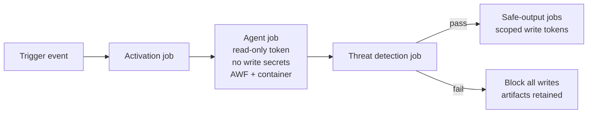
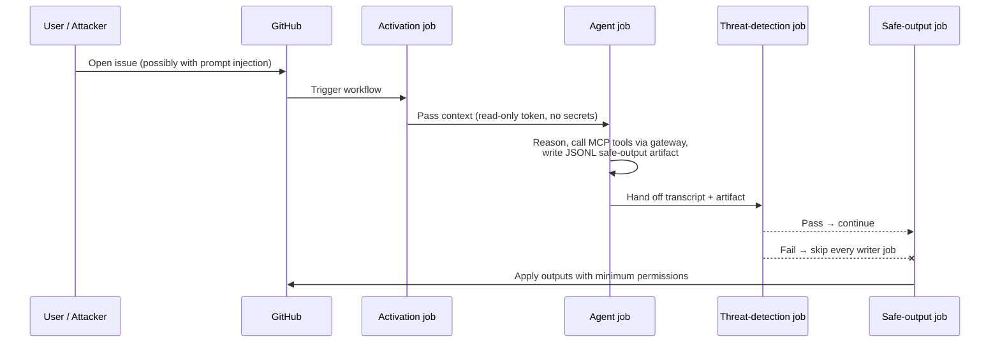

# Architecture & Security Deep Dive

> _Based on gh-aw v0.61.0 · Last reviewed 2026-04_

This document explains how GitHub Agentic Workflows (gh-aw) is engineered to let
non-deterministic AI agents run safely inside GitHub Actions. It focuses on the
**three trust layers**, the **five security guardrails**, the **adversary
model**, and what each guarantee means at compile-time vs. runtime.

## TL;DR

- gh-aw separates trust into **three layers**: the GitHub Actions **substrate**,
  the **declarative configuration** authored by repository maintainers, and the
  **runtime plan** produced by the trusted compiler.
- Five guardrails enforce the model end-to-end: **read-only token**, **zero
  secrets in the agent**, **containerized execution behind the AWF firewall**,
  **safe outputs**, and **agentic threat detection**.
- The compiler is the trust kernel — it lowers a workflow into multiple GitHub
  Actions jobs so write capabilities never co-exist with the agent process.
- The agent is treated as **untrusted code that may have been prompt-injected**.
  Anything it can read can become an instruction; anything it produces is
  validated before it can affect the world.
- Out of scope: hardware exploits, side-channel attacks against the runner, and
  supply-chain compromise of GitHub Actions itself.

## Key Concepts

| Term | Definition |
|------|------------|
| **Trust layer** | A boundary at which gh-aw assumes a different threat model and applies different controls. There are three: substrate, configuration, plan. |
| **Substrate** | The GitHub Actions runner VM and the privileged sidecar containers (network firewall, API proxy, MCP gateway). |
| **Configuration** | The Markdown + YAML workflow files committed by maintainers. Auth tokens are minted externally and treated as imported capabilities. |
| **Plan** | The lowered, multi-job GitHub Actions workflow emitted by the gh-aw compiler from a single agentic source file. |
| **Safe Output** | A structured artifact (JSONL) the agent writes; a separate, gated job applies it to GitHub under hard limits. |
| **AWF** | The Agentic Workflow Firewall: a Squid-based egress proxy that drops disallowed traffic at the kernel level via `iptables`. |
| **Threat detection** | An AI scan that runs after the agent and before any safe-output job. A failure blocks every downstream write. |
| **Agentic threat** | Prompt injection, exfiltration of secrets, or generation of malicious code that the agent might be coerced into producing. |

## Deep Dive

### The Three Trust Layers



**Layer 1 — Substrate.** The GitHub-managed runner VM plus three privileged
sidecar containers. The **network firewall container** drops outbound traffic
that does not match the workflow's `network.allowed` list at the kernel level
using `iptables`. The **API proxy container** mediates HTTP egress so it can be
inspected and logged. The **MCP gateway** brokers all Model Context Protocol
calls so the agent never holds raw credentials. This layer is trusted because
GitHub itself maintains it.

**Layer 2 — Configuration.** The agentic workflow files in `.github/workflows`
are trusted to the same extent as any other code in the repository — i.e. only
maintainers can change them, and changes flow through the normal pull-request
review process. Auth tokens (Anthropic API key, OpenAI key, Copilot token, etc.)
are minted **outside** the workflow and stored as GitHub Actions secrets; the
configuration only references them by name. They are treated as **imported
capabilities** rather than secrets the workflow itself owns.

**Layer 3 — Plan.** This is the layer most users underestimate. The gh-aw
compiler is the trust kernel: it reads one Markdown file with frontmatter and
**lowers** it into a multi-job GitHub Actions workflow in which each job has
exactly the permissions it needs and nothing more. The agent job runs with a
read-only `GITHUB_TOKEN` and no write secrets at all; downstream jobs that need
write capabilities (open an issue, push a commit, post a comment) execute only
after the agent has finished and only after threat detection has passed.

### Five Security Guardrails



#### 1. Read-only GitHub token

The agent receives a `GITHUB_TOKEN` whose permissions are clamped to read-only
regardless of what the workflow's top-level `permissions:` block requests for
**other** jobs. The agent can observe issues, pull requests, code, and commits,
but cannot mutate them directly. Mutations always travel through the safe-output
mechanism.

#### 2. Zero secrets in the agent

Write tokens, API keys for third-party services, and any other credential that
could be misused live **only** in isolated post-agent jobs. The agent's
environment is enumerated and scrubbed by the compiler. If you reference a
secret inside the agent block, the compiler raises an error in `strict` mode.

#### 3. Containerized execution behind AWF

The agent process runs inside a container that shares a Pod-like network with
the AWF (Squid) sidecar. All outbound traffic is force-routed through the proxy
by `iptables` rules; anything not on the workflow's `network.allowed` list is
**dropped at the kernel level**, not merely blocked at the proxy. This defends
against malicious code that tries to bypass the proxy.

#### 4. Safe outputs

Instead of letting the agent call the GitHub API directly, the agent writes a
structured **JSONL artifact** describing the outputs it would like to apply
(e.g. "open issue with title T and body B", "post comment on PR #42"). A
separate, narrowly-scoped job consumes that artifact and applies it under hard
limits configured by the workflow author (e.g. "max 3 issues per run", "labels
must be in this allowlist", "PR body capped at 4096 chars"). See
[Safe Outputs Catalog](./06-safe-outputs-catalog.md) for the full set.

#### 5. Agentic threat detection

After the agent completes and before any safe-output job runs, a dedicated
threat-detection job uses an LLM to scan the agent's transcript and outputs for
**prompt-injection indicators**, **secret leaks**, and **malicious code
patterns**. If the scan fails, every downstream write job is skipped — the
agent's artifacts are still uploaded so a human can inspect them.

### Adversary Model

The threat model assumes an attacker can:

- File issues, open PRs, push branches, leave comments.
- Plant prompt-injection payloads in any input the agent will read: issue
  bodies, PR descriptions, code comments, file contents, MCP tool responses,
  fetched web pages.
- Coerce the agent into trying to exfiltrate secrets, generate malicious code,
  or invoke tools with malicious arguments.

The model assumes the attacker **cannot**:

- Modify the workflow file itself (that requires repository write access, which
  GitHub already gates through reviews and protected branches).
- Compromise the runner VM or the substrate containers (substrate trust).
- Compromise GitHub itself or its identity providers.

**Out of scope:** hardware exploits, CPU side-channel attacks against shared
runners, supply-chain compromise of upstream Actions, and zero-days in the
container runtime. These are GitHub's responsibility, not gh-aw's.

### Compile-Time vs Runtime Guarantees

| Guarantee | Enforced at | What fails if violated |
|-----------|-------------|------------------------|
| Agent has no write secrets | **Compile time** | Compiler rejects the workflow |
| Agent token is read-only | **Compile time** | Compiler rewrites permissions |
| `network.allowed` is explicit (strict) | **Compile time** | Compiler rejects in strict mode |
| GitHub Actions pinned to SHAs (strict) | **Compile time** | Compiler rejects in strict mode |
| Egress traffic restricted to allowlist | **Runtime** | `iptables` drops the packet |
| MCP calls go through the gateway | **Runtime** | Tool call fails |
| Safe-output limits (counts, sizes) | **Runtime** | Output truncated or rejected |
| No prompt injection / secret leak | **Runtime** | Threat detection blocks writes |

> [!NOTE]
> Compile-time checks are cheap and deterministic — fix them once and they stay
> fixed. Runtime checks are the safety net for the inherently
> non-deterministic agent process.

### How SafeOutputs Instantiates Plan-Level Trust

`safe-outputs:` is the most concrete realisation of Layer 3. The compiler:

1. Generates a JSONL schema for every declared output type.
2. Injects a tiny "writer shim" into the agent's prompt so it knows how to
   request outputs.
3. Emits a separate Actions job per output type, each with the **minimum**
   `permissions:` needed (e.g. `issues: write` only for `create-issue`).
4. Wires the threat-detection job between the agent and the writer jobs as a
   `needs:` dependency.

If any of those wires is cut — for example by manually editing the lowered
workflow — the writer jobs lose their `needs:` guard and the model breaks. That
is why the compiler is treated as the trust kernel and lowered output is
considered a build artifact rather than something to hand-edit.

### Trust Violations: What Each Layer Protects

| Layer | Protects against | What happens if it fails |
|-------|------------------|--------------------------|
| Substrate | Egress beyond allowlist, raw credential exposure to agent | The OS-level firewall and MCP gateway both fail-closed; the agent simply cannot reach the resource |
| Configuration | Misconfigured permissions, ad-hoc secret use | Compiler errors at build time before the workflow ever runs |
| Plan | Agent directly mutating GitHub | Even if the agent goes rogue, the read-only token and absence of write secrets mean it cannot |

## Examples

### Minimal hardened workflow exercising all five guardrails

```markdown
---
on:
  issues:
    types: [opened]
  reaction: eyes
  stop-after: +24h
strict: true                    # Guardrail #1, #2, network strictness
permissions:
  contents: read                # Top-level remains read-only for the agent
engine:
  id: copilot
  version: "0.0.422"
network:
  allowed:
    - github                    # Ecosystem identifier (strict-friendly)
    - api.githubcopilot.com
safe-outputs:                   # Guardrail #4
  create-issue:
    max: 1
    labels: [triage, ai-generated]
  add-comment:
    max: 3
threat-detection:               # Guardrail #5 (enabled by default; shown explicitly)
  enabled: true
---

# Triage New Issues

You will receive one freshly opened issue. Read it, classify it,
and either (a) post a single comment summarising next steps, or
(b) open a follow-up issue if the report is actually two bugs.
```

What this gives you:

1. **Read-only token.** Top-level `permissions: contents: read` plus the
   compiler clamp.
2. **Zero secrets in agent.** No `secrets.*` references inside the agent block.
3. **Containerized + AWF.** The agent runs in the standard sandbox; only
   `github` and `api.githubcopilot.com` egress is allowed.
4. **Safe outputs.** `create-issue` and `add-comment` are emitted as JSONL and
   applied by separate jobs with `max:` caps and a label allowlist.
5. **Threat detection.** Default-on; shown explicitly here for clarity.

### End-to-end sequence



## Pitfalls & FAQ

> [!WARNING]
> **Do not add `secrets.*` to the agent's environment.** Even if you "only need
> it for one tool", it breaks Guardrail #2. Put it in the safe-output job
> instead and have the agent emit a structured request.

> [!WARNING]
> **Do not hand-edit the compiled workflow YAML.** The `needs:` graph between
> agent → threat-detection → safe-output is what enforces Plan-Level Trust.

**Q: Can I disable threat detection?**
A: Yes, with `threat-detection: { enabled: false }`, but you should only do
this for workflows that produce no safe outputs at all. Removing the gate while
keeping writers re-enables the very class of attack the system is designed to
prevent.

**Q: My agent needs to fetch from `example.com`. How?**
A: Add it to `network.allowed`. In strict mode you must list it explicitly —
wildcards are refused.

**Q: Is the agent allowed to read secrets it stumbles upon in code?**
A: It can read what the read-only token allows, but threat detection will flag
it if it tries to emit those secrets in a safe output, and the safe-output
schema does not include "leak this string" as a valid action.

**Q: What is the blast radius if threat detection has a false negative?**
A: Bounded by what the safe-output writer jobs are allowed to do — e.g. the
issue-creation job can only create issues, capped at `max:` count, with the
configured label allowlist. There is no path from agent to arbitrary write.

**Q: Why isn't this just "run the agent with a PAT"?**
A: Because the agent is non-deterministic and may be prompt-injected. Holding a
write token in the same process is equivalent to giving the attacker that
token.

## Related Docs

- [Engines](./02-engines.md) — choose the LLM that drives the agent
- [Frontmatter Reference](./03-frontmatter-reference.md) — every field, including
  `network`, `safe-outputs`, `threat-detection`, `strict`
- Official: [Architecture](https://github.github.io/gh-aw/introduction/architecture/)
- Official: [Security overview](https://github.github.io/gh-aw/)
- Official: [Safe outputs](https://github.github.io/gh-aw/reference/safe-outputs/)
- Official: [Network permissions](https://github.github.io/gh-aw/reference/network/)
