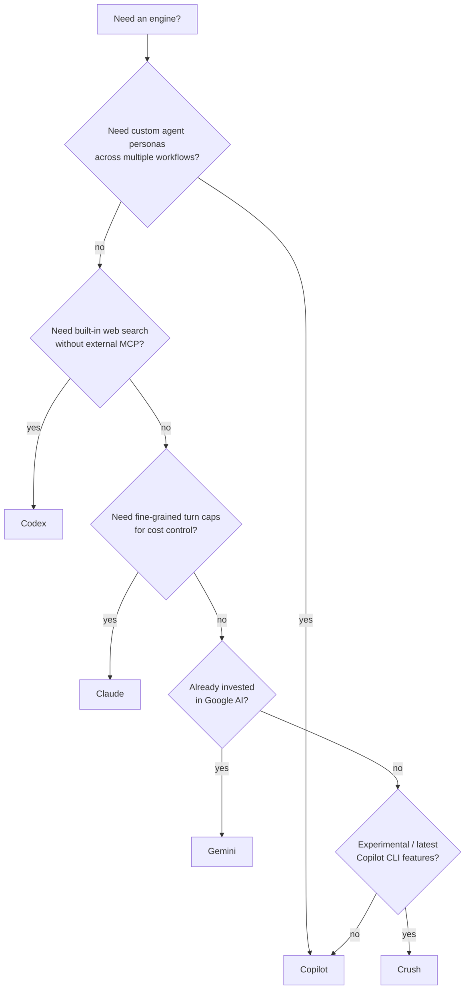

# エンジン詳解

> _gh-aw v0.61.0 を基準 · 最終レビュー 2026-04_

**エンジン (engine)** は、エージェントプロセスを駆動する LLM ランタイムです。
gh-aw は現在 5 種類のエンジンをサポートしており、選択によって機能、課金、
モデルの選択肢、エンタープライズエンドポイントが変わります。本ドキュメントは
エンジンを選び、設定するために必要なすべてをカバーします。

## TL;DR

- 5 つのエンジンがサポートされています: **Copilot** (デフォルト)、**Claude**、
  **Codex**、**Gemini**、**Crush** (実験的)。
- 各エンジンには 1 つのシークレットが必要です。Copilot と Crush は
  `COPILOT_GITHUB_TOKEN` を共有し、その他はベンダの API キーを使います。
- 機能の互換性は **均一ではありません**。`max-turns` は Claude のみ、
  `max-continuations` とカスタム `engine.agent` ファイルは Copilot のみ、
  `web-search` は Codex でのみネイティブで、その他では MCP 経由です。
- 再現性のためにエンジンバージョンをピン留めしましょう。`workflow_call` の
  入力で渡し、シェル補間ではなく **`version:` の env var** 経由で渡します。
- エンタープライズユーザは `engine.api-target` (および Codex / Claude では
  `OPENAI_BASE_URL` / `ANTHROPIC_BASE_URL`) によって GHEC/GHES や
  セルフホストエンドポイントを指せます。

## 主要な概念

| 用語 | 定義 |
|------|------|
| **エンジン** | エージェントを実行する LLM ランタイム + CLI。各エンジンは別バイナリとして配布されます。 |
| **`engine.id`** | ランタイムを選ぶ短い識別子 (`copilot`、`claude`、`codex`、`gemini`、`crush`)。 |
| **`engine.version`** | CLI バイナリのピン留めされたリリース。再現性のために重要。 |
| **`engine.model`** | ランタイムに渡されるモデル ID (例: `gpt-5`、`claude-opus-4.7`)。 |
| **`engine.agent`** | _(Copilot 専用)_ `.github/agents/<name>.agent.md` のカスタムエージェントファイルへの参照。 |
| **`engine.api-target`** | エンタープライズ / GHEC / GHES 用のカスタムエンドポイントホスト。 |
| **`max-turns` / `max-continuations`** | エージェントループ深さの厳密な上限。エンジン依存 (表参照)。 |

## 詳解

### エンジンカタログ

| エンジン | `id` | 必要シークレット | 注記 |
|----------|------|------------------|------|
| GitHub Copilot CLI _(デフォルト)_ | `copilot` | `COPILOT_GITHUB_TOKEN` | デフォルトエンジン。`engine.agent` (カスタムエージェント) と `max-continuations` をサポート。 |
| Claude Code (Anthropic) | `claude` | `ANTHROPIC_API_KEY` | `max-turns` をサポート。 |
| OpenAI Codex | `codex` | `OPENAI_API_KEY` | `web-search` はデフォルト無効。`tools: web-search:` で明示的に有効化。 |
| Google Gemini CLI | `gemini` | `GEMINI_API_KEY` | |
| Crush _(実験的)_ | `crush` | `COPILOT_GITHUB_TOKEN` | 実験的。API 安定性は保証されません。 |

### 機能比較

| 機能 | Copilot | Claude | Codex | Gemini | Crush |
|------|:-------:|:------:|:-----:|:------:|:-----:|
| `max-turns` | ✗ | ✓ | ✗ | ✗ | ✗ |
| `max-continuations` | ✓ | ✗ | ✗ | ✗ | ✗ |
| `tools.web-fetch` | ✓ | ✓ | ✓ | ✓ | ✓ |
| `tools.web-search` | MCP 経由 | MCP 経由 | ✓ (オプトイン) | MCP 経由 | MCP 経由 |
| `engine.agent` (カスタムエージェントファイル) | ✓ | ✗ | ✗ | ✗ | ✗ |
| `engine.api-target` | ✓ | ✓ | ✓ | ✓ | ✓ |
| ツール allowlist | ✓ | ✓ | ✓ | ✓ | ✗ |

> [!NOTE]
> 「MCP 経由」とは、Tavily や Brave のような外部 MCP サーバを配線したときに
> のみ Web 検索が使えることを意味します。Codex のみがネイティブの web-search
> 能力を提供しており、それすらも安全のために **デフォルトでは無効** です。

### 拡張設定

```yaml
engine:
  id: copilot
  version: latest                  # Pin in production: "0.0.422" etc.
  model: gpt-5
  command: /usr/local/bin/copilot  # Optional override of the binary path
  args: ["--add-dir", "/workspace"]
  agent: technical-doc-writer       # Copilot only; .github/agents/technical-doc-writer.agent.md
  api-target: api.acme.ghe.com      # Enterprise endpoint
  env:
    DEBUG_MODE: "true"
```

#### 推奨ピンバージョン

| エンジン | 直近のピンタグ |
|----------|----------------|
| Copilot | `0.0.422` |
| Claude | `2.1.70` |
| Codex | `0.111.0` |
| Gemini | `0.31.0` |
| Crush | `1.2.14` |

> [!TIP]
> `version: latest` はプロトタイピングには便利ですが、サイレントなドリフトを
> 持ち込みます。リリースをゲートしたり PR にコメントを投稿したりする
> ワークフローでは、**特定のバージョンをピン留め** しましょう。

### `workflow_call` でエンジンバージョンをピン留めする

ワークフローを再利用可能 (`on: workflow_call`) にするときは、`engine-version`
を入力として公開し、シェル補間ではなく **環境変数** 経由で渡します。

```yaml
on:
  workflow_call:
    inputs:
      engine-version:
        type: string
        required: false
        default: "0.0.422"
engine:
  id: copilot
  version: ${{ inputs.engine-version }}
```

> [!WARNING]
> `${{ inputs.* }}` を `run:` シェルブロック内で直接使ってはいけません。
> 典型的な GitHub Actions のインジェクション経路です。`version:` フィールド
> は gh-aw コンパイラが消費し、エンジンブートストラップへ env var として
> 安全にエクスポートされるため、この特定の用途は安全です。

### Copilot のカスタムエージェントファイル

Copilot エンジンのみが `engine.agent` をサポートします。エージェントファイルは
`.github/agents/<name>.agent.md` に配置し、以下のような形になります。

```markdown
---
description: Technical documentation writer agent
tools:
  - read
  - write
  - search
---

You are a senior technical writer. When given a topic, produce
a structured Markdown document with TL;DR, deep-dive, and FAQ
sections. Cite sources with link references.
```

ワークフローから参照します。

```yaml
engine:
  id: copilot
  agent: technical-doc-writer
```

これにより、複数のワークフロー間で 1 つのエージェントペルソナを再利用できます。

### エンタープライズエンドポイント

| エンジン | 仕組み | 例 |
|----------|--------|-----|
| Copilot | `engine.api-target` | `api-target: api.acme.ghe.com` |
| Claude | `ANTHROPIC_BASE_URL` env | `env: { ANTHROPIC_BASE_URL: "https://anthropic.acme.com" }` |
| Codex | `OPENAI_BASE_URL` env | `env: { OPENAI_BASE_URL: "https://openai.acme.com/v1" }` |
| Gemini | `engine.api-target` | `api-target: generativelanguage.acme.com` |
| Crush | `engine.api-target` | (Copilot 設定を継承) |

> [!NOTE]
> `engine.api-target` は AWF ファイアウォールを **バイパスしません**。カスタム
> ホストも `network.allowed` に出現する必要があり、そうでなければトラフィック
> はカーネルで遮断されます。

### コストと課金

各エンジンはリンクされたアカウントまたはサブスクリプションに課金します。

- **Copilot / Crush** — `COPILOT_GITHUB_TOKEN` に紐づく GitHub Copilot
  サブスクリプションに課金。アクティブなサブスクリプションがあれば呼び出し
  ごとの課金はなし。
- **Claude** — `ANTHROPIC_API_KEY` を所有する Anthropic アカウントへ
  トークン単位で課金。
- **Codex** — `OPENAI_API_KEY` を所有する OpenAI アカウントへトークン単位で
  課金。
- **Gemini** — `GEMINI_API_KEY` を所有する Google AI アカウントへトークン
  単位で課金。

`max-turns` (Claude) と `max-continuations` (Copilot) が主なコスト制御です。
スケジュールワークフローではこれらを積極的に使ってください。

### エンジンの選び方



実用的な指針:

- **特別な理由がなければ Copilot をデフォルト** にしてください。
- `max-turns` が必要、または Anthropic モデルに統一しているなら **Claude** を
  選択。
- ターン上限よりもネイティブのオプトイン `web-search` が重要なら **Codex**。
- 組織がすでに Google AI に課金を集約しているなら **Gemini**。
- 実験用途であれば **Crush**。動きの早い対象です。

## 例

### 1. ピン留めバージョンとカスタムエージェント付きの Copilot

```yaml
---
on:
  issues:
    types: [opened]
  reaction: eyes
engine:
  id: copilot
  version: "0.0.422"
  model: gpt-5
  agent: triage-bot
network:
  allowed: [github, api.githubcopilot.com]
safe-outputs:
  add-comment:
    max: 1
---
```

### 2. コスト制御のための `max-turns` を使う Claude

```yaml
---
on:
  schedule:
    - cron: "0 6 * * 1"
engine:
  id: claude
  version: "2.1.70"
  model: claude-opus-4.7
  max-turns: 8
network:
  allowed: [github, api.anthropic.com]
safe-outputs:
  create-issue:
    max: 1
---
```

### 3. ネイティブ web-search をオプトインした Codex

```yaml
---
on:
  workflow_dispatch:
engine:
  id: codex
  version: "0.111.0"
  model: gpt-5
tools:
  web-search:
network:
  allowed:
    - github
    - api.openai.com
    - "*.search-domains-you-trust.example"   # strict mode forbids bare *
---
```

### 4. `engine-version` 入力を持つ再利用可能ワークフロー

```yaml
---
on:
  workflow_call:
    inputs:
      engine-version:
        type: string
        default: "2.1.70"
engine:
  id: claude
  version: ${{ inputs.engine-version }}
  model: claude-opus-4.7
---
```

### 5. エンタープライズ GHES の Copilot エンドポイント

```yaml
---
engine:
  id: copilot
  version: "0.0.422"
  api-target: api.acme.ghe.com
network:
  allowed:
    - github
    - api.acme.ghe.com
---
```

## 落とし穴と FAQ

> [!WARNING]
> **エンジンとシークレットの組み合わせを誤らないこと。**
> `COPILOT_GITHUB_TOKEN` は Copilot/Crush 用、`ANTHROPIC_API_KEY`、
> `OPENAI_API_KEY`、`GEMINI_API_KEY` はそれ以外用です。コンパイラは警告し
> ますが、値の入れ替わりを常に検出できるわけではありません。

> [!WARNING]
> **`engine.api-target` はファイアウォールバイパスではありません。** カスタム
> ホストも `network.allowed` に必要で、strict モードではワイルドカードは使え
> ません。

**Q: 同じワークフローで複数のエンジンを使えますか?**
A: いいえ。1 ワークフローファイル → 1 エンジン。エンジンを比較したい場合は、
2 つの並行ワークフローを実行してください。

**Q: Copilot から Claude へ切り替えるには?**
A: `engine.id` を変更し、シークレットを変更し、`engine.agent` を削除/改名し
(Claude では非対応)、`max-continuations` に依存していたなら `max-turns` を
追加します。

**Q: `engine.version` を省略するとどうなりますか?**
A: gh-aw はコンパイル時に `latest` に解決します。再現性が低下するため、本番では
ピン留めしましょう。

**Q: なぜ Codex の web-search はオプトインで、他は「MCP 経由」なのですか?**
A: Codex は OpenAI の web-search エンドポイントを叩く組み込みツールを同梱して
います。他のエンジンでは Tavily などの MCP サーバを `mcp-servers:` で明示的に
配線する必要があります。どちらのルートも AWF ファイアウォールを通ります。

**Q: 当社には Anthropic のエンタープライズエンドポイントがあります。どこに
設定しますか?**
A: `engine:` 内の `env.ANTHROPIC_BASE_URL` を使い、`network.allowed` にホストを
追加してください。

## 関連ドキュメント

- [Architecture & Security](./01-architecture-and-security.ja.md) — どのエンジン
  を選んでもエージェントがどうサンドボックス化されるか
- [Frontmatter Reference](./03-frontmatter-reference.ja.md) — `engine:` ブロック
  と周辺フィールドの完全スキーマ
- 公式: [Engines reference](https://github.github.io/gh-aw/reference/engines/)
- 公式: [Copilot agent files](https://github.github.io/gh-aw/reference/agents/)
- 公式: [Tools / web-search](https://github.github.io/gh-aw/reference/tools/)
