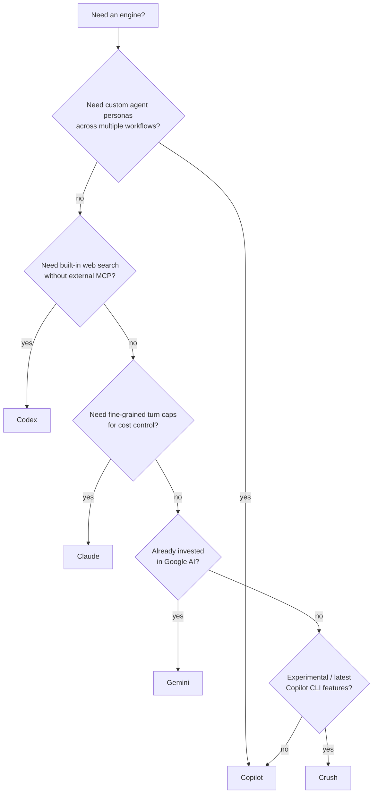

# Engines Deep Dive

> _Based on gh-aw v0.61.0 · Last reviewed 2026-04_

The **engine** is the LLM runtime that drives the agent process. gh-aw supports
five engines today, and the choice affects features, billing, model selection,
and enterprise endpoints. This document covers everything you need to pick one
and configure it.

## TL;DR

- Five engines are supported: **Copilot** (default), **Claude**, **Codex**,
  **Gemini**, and **Crush** (experimental).
- Each engine requires exactly one secret. Copilot and Crush share
  `COPILOT_GITHUB_TOKEN`; the others use vendor API keys.
- Feature parity is _not_ uniform. `max-turns` is Claude-only;
  `max-continuations` and custom `engine.agent` files are Copilot-only;
  `web-search` is built-in for Codex but only via MCP for the others.
- Pin engine versions for reproducibility — pass via `workflow_call` inputs and
  the **`version:` env var**, never via shell interpolation.
- Enterprise users can point at GHEC/GHES or self-hosted endpoints with
  `engine.api-target` (and `OPENAI_BASE_URL` / `ANTHROPIC_BASE_URL` for Codex /
  Claude).

## Key Concepts

| Term | Definition |
|------|------------|
| **Engine** | The LLM runtime + CLI that executes the agent. Each engine ships as a separate binary. |
| **`engine.id`** | The short identifier (`copilot`, `claude`, `codex`, `gemini`, `crush`) selecting the runtime. |
| **`engine.version`** | A pinned release of the CLI binary — critical for reproducibility. |
| **`engine.model`** | Model identifier passed to the runtime (e.g. `gpt-5`, `claude-opus-4.7`). |
| **`engine.agent`** | _(Copilot only)_ Reference to a custom agent file under `.github/agents/<name>.agent.md`. |
| **`engine.api-target`** | Custom endpoint host for enterprise / GHEC / GHES. |
| **`max-turns` / `max-continuations`** | Hard caps on agent loop depth. Engine-specific (see table). |

## Deep Dive

### Engine Catalog

| Engine | `id` | Required Secret | Notes |
|--------|------|-----------------|-------|
| GitHub Copilot CLI _(default)_ | `copilot` | `COPILOT_GITHUB_TOKEN` | Default engine. Supports `engine.agent` (custom agent file) and `max-continuations`. |
| Claude Code (Anthropic) | `claude` | `ANTHROPIC_API_KEY` | Supports `max-turns`. |
| OpenAI Codex | `codex` | `OPENAI_API_KEY` | `web-search` disabled by default; opt in via `tools: web-search:`. |
| Google Gemini CLI | `gemini` | `GEMINI_API_KEY` | |
| Crush _(experimental)_ | `crush` | `COPILOT_GITHUB_TOKEN` | Experimental; API stability not guaranteed. |

### Feature Comparison

| Feature | Copilot | Claude | Codex | Gemini | Crush |
|---------|:-------:|:------:|:-----:|:------:|:-----:|
| `max-turns` | ✗ | ✓ | ✗ | ✗ | ✗ |
| `max-continuations` | ✓ | ✗ | ✗ | ✗ | ✗ |
| `tools.web-fetch` | ✓ | ✓ | ✓ | ✓ | ✓ |
| `tools.web-search` | via MCP | via MCP | ✓ (opt-in) | via MCP | via MCP |
| `engine.agent` (custom agent file) | ✓ | ✗ | ✗ | ✗ | ✗ |
| `engine.api-target` | ✓ | ✓ | ✓ | ✓ | ✓ |
| Tools allowlist | ✓ | ✓ | ✓ | ✓ | ✗ |

> [!NOTE]
> "via MCP" means web search is only available if you wire in an external MCP
> server such as Tavily or Brave. Codex is the only engine that ships a native
> web-search capability — and even there it is **disabled by default** for
> safety.

### Extended Configuration

```yaml
engine:
  id: copilot
  version: latest                  # Pin in production: "0.0.422" etc.
  model: gpt-5
  command: /usr/local/bin/copilot  # Optional override of the binary path
  args: ["--add-dir", "/workspace"]
  agent: technical-doc-writer       # Copilot only; .github/agents/technical-doc-writer.agent.md
  api-target: api.acme.ghe.com      # Enterprise endpoint
  env:
    DEBUG_MODE: "true"
```

#### Recommended pinned versions

| Engine | Recent pinned tag |
|--------|-------------------|
| Copilot | `0.0.422` |
| Claude | `2.1.70` |
| Codex | `0.111.0` |
| Gemini | `0.31.0` |
| Crush | `1.2.14` |

> [!TIP]
> `version: latest` is convenient during prototyping but introduces silent
> drift. For workflows that gate releases or post comments on PRs, **pin a
> specific version**.

### Pinning Engine Version via `workflow_call`

When a workflow is reusable (`on: workflow_call`), expose `engine-version` as
an input and pass it through an **environment variable**, not via shell
interpolation:

```yaml
on:
  workflow_call:
    inputs:
      engine-version:
        type: string
        required: false
        default: "0.0.422"
engine:
  id: copilot
  version: ${{ inputs.engine-version }}
```

> [!WARNING]
> Never use `${{ inputs.* }}` directly inside a `run:` shell block — that is a
> classic GitHub Actions injection vector. The `version:` field is consumed by
> the gh-aw compiler and exported safely as an env var to the engine
> bootstrap, so this specific use is safe.

### Custom Copilot Agent Files

Only the Copilot engine supports `engine.agent`. The agent file lives at
`.github/agents/<name>.agent.md` and looks like:

```markdown
---
description: Technical documentation writer agent
tools:
  - read
  - write
  - search
---

You are a senior technical writer. When given a topic, produce
a structured Markdown document with TL;DR, deep-dive, and FAQ
sections. Cite sources with link references.
```

Reference it from a workflow:

```yaml
engine:
  id: copilot
  agent: technical-doc-writer
```

This lets you reuse one agent persona across multiple workflows.

### Enterprise Endpoints

| Engine | Mechanism | Example |
|--------|-----------|---------|
| Copilot | `engine.api-target` | `api-target: api.acme.ghe.com` |
| Claude | `ANTHROPIC_BASE_URL` env | `env: { ANTHROPIC_BASE_URL: "https://anthropic.acme.com" }` |
| Codex | `OPENAI_BASE_URL` env | `env: { OPENAI_BASE_URL: "https://openai.acme.com/v1" }` |
| Gemini | `engine.api-target` | `api-target: generativelanguage.acme.com` |
| Crush | `engine.api-target` | (inherits Copilot config) |

> [!NOTE]
> `engine.api-target` does **not** bypass the AWF firewall. The custom host
> must still appear in `network.allowed`, otherwise traffic is dropped at the
> kernel.

### Cost & Billing

Each engine bills the linked account or subscription:

- **Copilot / Crush** — billed against the GitHub Copilot subscription
  associated with `COPILOT_GITHUB_TOKEN`. No per-call charge if you have an
  active subscription.
- **Claude** — billed per-token to the Anthropic account that owns
  `ANTHROPIC_API_KEY`.
- **Codex** — billed per-token to the OpenAI account that owns
  `OPENAI_API_KEY`.
- **Gemini** — billed per-token to the Google AI account that owns
  `GEMINI_API_KEY`.

`max-turns` (Claude) and `max-continuations` (Copilot) are your primary cost
controls. Use them aggressively in scheduled workflows.

### Choosing an Engine



Quick rules of thumb:

- **Default to Copilot** unless a specific feature pulls you elsewhere.
- **Choose Claude** when you need `max-turns` or are standardising on
  Anthropic models.
- **Choose Codex** when native, opt-in `web-search` matters more than turn
  caps.
- **Choose Gemini** when your org already centralises billing on Google AI.
- **Choose Crush** only for experimentation; it is the moving target.

## Examples

### 1. Copilot with a pinned version and custom agent

```yaml
---
on:
  issues:
    types: [opened]
  reaction: eyes
engine:
  id: copilot
  version: "0.0.422"
  model: gpt-5
  agent: triage-bot
network:
  allowed: [github, api.githubcopilot.com]
safe-outputs:
  add-comment:
    max: 1
---
```

### 2. Claude with `max-turns` for cost control

```yaml
---
on:
  schedule:
    - cron: "0 6 * * 1"
engine:
  id: claude
  version: "2.1.70"
  model: claude-opus-4.7
  max-turns: 8
network:
  allowed: [github, api.anthropic.com]
safe-outputs:
  create-issue:
    max: 1
---
```

### 3. Codex with native web-search opted in

```yaml
---
on:
  workflow_dispatch:
engine:
  id: codex
  version: "0.111.0"
  model: gpt-5
tools:
  web-search:
network:
  allowed:
    - github
    - api.openai.com
    - "*.search-domains-you-trust.example"   # strict mode forbids bare *
---
```

### 4. Reusable workflow with `engine-version` input

```yaml
---
on:
  workflow_call:
    inputs:
      engine-version:
        type: string
        default: "2.1.70"
engine:
  id: claude
  version: ${{ inputs.engine-version }}
  model: claude-opus-4.7
---
```

### 5. Enterprise GHES Copilot endpoint

```yaml
---
engine:
  id: copilot
  version: "0.0.422"
  api-target: api.acme.ghe.com
network:
  allowed:
    - github
    - api.acme.ghe.com
---
```

## Pitfalls & FAQ

> [!WARNING]
> **Do not mix the wrong secret with the wrong engine.** `COPILOT_GITHUB_TOKEN`
> is for Copilot/Crush; `ANTHROPIC_API_KEY`, `OPENAI_API_KEY`, and
> `GEMINI_API_KEY` are for the others. The compiler will warn but cannot always
> detect a swapped value.

> [!WARNING]
> **`engine.api-target` is not a firewall bypass.** Custom hosts still need to
> be in `network.allowed`, and in strict mode you cannot use a wildcard.

**Q: Can I use multiple engines in the same workflow?**
A: No. One workflow file → one engine. To compare engines, run two parallel
workflows.

**Q: How do I switch from Copilot to Claude?**
A: Change `engine.id`, change the secret, drop or rename `engine.agent` (Claude
doesn't support it), and add `max-turns` if you previously relied on
`max-continuations`.

**Q: What happens if I omit `engine.version`?**
A: gh-aw resolves to `latest` at compile time. Reproducibility suffers; pin in
production.

**Q: Why is Codex web-search opt-in but the others "via MCP"?**
A: Codex ships a built-in tool that hits OpenAI's web-search endpoint. The
others rely on you wiring up an MCP server (e.g. Tavily) explicitly via
`mcp-servers:`. Both routes still go through the AWF firewall.

**Q: My company has an Anthropic enterprise endpoint. Where do I configure
it?**
A: Use `env.ANTHROPIC_BASE_URL` inside `engine:` and add the host to
`network.allowed`.

## Related Docs

- [Architecture & Security](./01-architecture-and-security.md) — how the agent
  is sandboxed regardless of which engine you pick
- [Frontmatter Reference](./03-frontmatter-reference.md) — full schema for the
  `engine:` block and surrounding fields
- Official: [Engines reference](https://github.github.io/gh-aw/reference/engines/)
- Official: [Copilot agent files](https://github.github.io/gh-aw/reference/agents/)
- Official: [Tools / web-search](https://github.github.io/gh-aw/reference/tools/)
