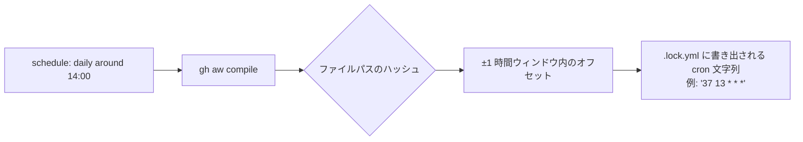
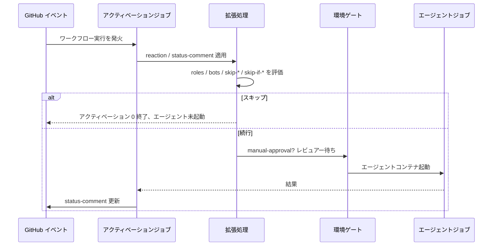

# トリガーとスケジューリング

> _gh-aw v0.61.0 を基準 · 最終レビュー 2026-04_

この詳細ガイドでは、GitHub Agentic Workflows (gh-aw) が **いつ** 実行されるかを
決める仕組みを解説します。GitHub Actions から継承される標準的な `on:` トリガー、
gh-aw 固有の **ファジースケジュール** 文法、gh-aw のコマンドトリガー
（`slash_command:` と `label_command:`）、ラベルフィルタリング、リアクション・
ステータスコメント・期限・承認ゲート・フォークフィルタ・ロール/ボットゲート・
カスタム事前ステップなどのトリガー拡張、そしてイベント受信からエージェント実行
までのライフサイクルを扱います。

## TL;DR

- gh-aw は GitHub Actions の標準トリガー（`push`、`pull_request`、`issues`、
  `schedule`、`workflow_dispatch`、…）に加え、gh-aw 拡張をすべて受け付けます。
- コマンドトリガーは **`on: slash_command:`** と **`on: label_command:`** を
  使います。レガシーの `on: command:` や `on: labeled:` の形式は v0.61.0 には
  **存在しません**。
- `workflow_dispatch:` ブロックは 4 種類の入力タイプ（`string`、`boolean`、
  `choice`、`environment`）をサポートし、入力は markdown 本文から
  `${{ github.event.inputs.NAME }}` で参照できます。
- **ファジースケジューリング**（`schedule: daily around 14:00`）により、
  コンパイラがワークフローファイルパスから決定的に時刻を分散させ、同時起動
  によるランナー圧迫を避けます。
- `reaction:`、`status-comment:`、`stop-after:`、`manual-approval:`、
  `forks:`、`roles:`、`bots:`、`skip-roles:`、`skip-bots:`、`skip-if-match:`、
  `skip-if-no-match:`、`steps:`、`permissions:`、`github-token:`、
  `github-app:` などの拡張は、エージェントが起動する前のアクティベーション
  ジョブで適用されます。
- `issues` と `issue_comment` トリガーは `lock-for-agent: true` で、
  エージェント実行中に issue をロックできます。
- `roles:` のデフォルトは `[admin, maintainer, write]`（または `all`）で、
  ロールベースのアクセスゲートを行います。

## Key Concepts

| 用語                       | 定義                                                                                                            |
| -------------------------- | --------------------------------------------------------------------------------------------------------------- |
| **トリガー**               | GitHub Actions にワークフローを起動させる `on:` 配下のエントリです。                                            |
| **アクティベーションジョブ** | gh-aw が生成する最初のジョブです。トリガーを検証し、拡張を適用し、エージェントジョブを呼ぶか判定します。          |
| **ファジースケジュール**   | gh-aw がファイルパスから決定的なオフセットを伴う cron 文字列にコンパイルする自然言語スケジュール表現です。       |
| **トリガー拡張**           | アクティベーション動作をカスタマイズする `on:` 配下の gh-aw キー（`reaction:`、`manual-approval:`、…）です。     |
| **スラッシュコマンド**     | `/command-name` 形式の issue / PR コメントで発火するトリガー。`on: slash_command:` で宣言します。               |
| **ラベルコマンド**         | 特定のラベルが付いたときに発火するトリガー（ワンショット: デフォルトでラベルは削除）。`on: label_command:` で宣言。 |
| **ラベルフィルタリング**   | `on: issues`（または `pull_request`）+ `types: [labeled]` + `names:`。ラベルは残る、ラベルコマンドではない。     |
| **ステータスコメント**     | gh-aw が自動管理する PR / issue コメント。`slash_command` と `label_command` ではデフォルトで有効。                |

> [!NOTE]
> トリガーは **アクティベーションジョブ** によって評価されます。アクティベーション
> ジョブが正常終了したときに限り、エージェントコンテナが起動します。

## Deep Dive

### 1. 標準的な GitHub Actions トリガー

通常の Actions ワークフローで `on:` に書ける内容はすべて gh-aw でも動作します。

```yaml
on:
  push:
    branches: [main]
    paths: ["src/**"]
  pull_request:
    types: [opened, synchronize, reopened]
  issues:
    types: [opened, labeled]
    lock-for-agent: true       # gh-aw extension: lock the issue while the agent runs
  issue_comment:
    types: [created]
    lock-for-agent: true
  discussion_comment:
    types: [created]
  workflow_run:
    workflows: ["CI"]
    branches: [main]            # required to limit triggering branches
  schedule:
    - cron: "0 9 * * 1-5"
  workflow_dispatch:
```

これらは生成された `.lock.yml` に渡されるため、馴染みのある
`branches` / `paths` / `types` / `tags` フィルタをそのまま利用できます。
`lock-for-agent: true` は `issues:` と `issue_comment:` 用の gh-aw 追加で、
エージェント作業中に会話スレッドをロックします。

### 2. `workflow_dispatch` の入力タイプ

`workflow_dispatch:` を使うと、ユーザー（または API）がパラメータ付きで
ワークフローを起動できます。gh-aw は GitHub ネイティブの 4 種類の入力タイプを
サポートします。

```yaml
on:
  workflow_dispatch:
    inputs:
      target_branch:
        description: "Branch to operate on"
        type: string
        default: "main"
      dry_run:
        description: "Preview only"
        type: boolean
        default: true
      severity:
        description: "Issue severity"
        type: choice
        options: [low, medium, high, critical]
        default: medium
      target_env:
        description: "Deployment environment"
        type: environment
```

入力はエージェントのプロンプト本文から次のように参照できます。

```markdown
Run a triage on the `${{ github.event.inputs.target_branch }}` branch.
Severity threshold: **${{ github.event.inputs.severity }}**.
```

> [!WARNING]
> `environment` 入力タイプは **Settings → Environments** からドロップダウンを
> 生成しますが、環境保護ルールを **強制しません**。値はただの文字列です。
> 承認による実行ゲートが必要な場合は `manual-approval:` を併用してください。

### 3. ファジースケジューリング — 目玉機能

gh-aw は標準 cron にコンパイルされる独自スケジュール文法を持ちますが、
**ファイルパスごとに決定的なオフセット** を加えるため、同じスケジュールを持つ
2 つのワークフローがまったく同時に発火することを防ぎます。

```yaml
on:
  schedule: daily around 14:00
```

代表的な書き方：

| 形式                                     | 例                                            | 結果                                               | 備考                                                        |
| ---------------------------------------- | --------------------------------------------- | -------------------------------------------------- | ----------------------------------------------------------- |
| `daily`                                  | `schedule: daily`                             | 1 日 1 回、パス由来の時刻                          | コンパイラが 24 時間内に分散させます。                     |
| `daily around HH:MM`                     | `schedule: daily around 14:00`                | 1 日 1 回、14:00 ±1 時間                           | ±1 時間のジッター窓。                                       |
| `daily between HH:MM and HH:MM`          | `schedule: daily between 9:00 and 17:00`      | 1 日 1 回、業務時間内                              | 範囲内で決定的に時刻を選択。                                |
| `weekly on DAY [around HH:MM]`           | `schedule: weekly on monday around 5pm`       | 月曜の 17:00 前後                                  | 曜日名は小文字。                                            |
| `hourly`                                 | `schedule: hourly`                            | 毎時                                               | 分はパス由来。                                              |
| `every N minutes`                        | `schedule: every 10 minutes`                  | 10 分ごと                                          | 最小許容間隔は **5 分**。                                   |
| `every Nh`                               | `schedule: every 2h`                          | 2 時間ごと                                         | ポーリングジョブに便利。                                    |
| UTC オフセット                           | `schedule: daily around 14:00 utc-5`          | UTC-5 の 14:00（= UTC 19:00）                      | `utc+N` / `utc-N`。                                         |

認識される時刻形式：

- `HH:MM` 24 時間表記（例: `14:30`）
- `midnight`（00:00）と `noon`（12:00）
- `1am`〜`12am`、`1pm`〜`12pm`

#### なぜファジーなのか

分散がないと、すべての `cron: '0 14 * * *'` が同時に発火してしまい、
レート制限や騒がしい隣人問題を引き起こします。オフセットは
**ワークフローファイルパスから決定的に** 計算されるため、コンパイルし直しても
cron が変わりません（`gh aw compile` のたびに別の cron が出てしまうことは
ありません）。



### 4. タイムゾーン付き標準 cron

精密な cron が必要な場合は、オプションの `timezone:`（IANA 名）を付けた
標準形式を使ってください。

```yaml
on:
  schedule:
    - cron: "30 9 * * 1-5"
      timezone: "America/New_York"
```

> [!TIP]
> コンプライアンスや業務時間の要件には標準形式、それ以外はファジー形式を
> 使うとよいです。

### 5. スラッシュコマンド (`slash_command:`)

スラッシュコマンドは、issue / PR / discussion コメントで `/my-bot` のように
投稿されたときに発火します。v0.61.0 では **ファーストクラス** のトリガーで、
**`on: slash_command:`** として宣言します（`on: command:` というフィールドは
存在しません）。

```yaml
# Full form:
on:
  slash_command:
    name: my-bot                       # OR an array for aliases: ["cmd1", "cmd2"]
    events: [issues, issue_comment]    # filter; default: all of issues / issue_comment / pull_request_review_comment / discussion_comment

# Shorthand:
on:
  slash_command: my-bot

# Ultra-short (auto-expands to slash_command + workflow_dispatch):
on: /my-bot
```

`status-comment:` は `slash_command:` トリガーで **デフォルト有効** になり、
ユーザーは追加設定なしで進捗フィードバックを受け取れます。

### 6. ラベルコマンド (`label_command:`)

ラベルコマンドは、issue または PR にラベルが付いたときに発火します。
デフォルトではアクティベーション後にラベルが削除されます（ワンショット）。
`remove_label: false` を設定すれば残せます。

```yaml
# Full form:
on:
  label_command:
    name: deploy
    events: [pull_request]
    remove_label: false                # default: true (label is removed)

# Shorthand:
on: "label-command deploy"
```

スラッシュコマンドと同様、`label_command:` トリガーでも `status-comment:` が
デフォルトで有効になります。

### 7. ラベルフィルタリング（ラベルコマンドではない）

ラベルが付いたことに反応したいが、**ラベルは残したい**、かつ **ワンショット
コマンドとして扱いたくない** 場合は、標準の `issues` / `pull_request`
トリガーを `types: [labeled]` と `names:` フィルタで使ってください。

```yaml
# Full form:
on:
  issues:
    types: [labeled]
    names: [bug, critical]

# Shorthand forms:
on: issue labeled bug
on: pull_request labeled needs-review, ready-to-merge
```

| 選ぶもの               | 用途                                                            |
| ---------------------- | --------------------------------------------------------------- |
| `label_command:`       | 「実行したらラベルを外す」ワンショットワークフロー。            |
| `issues` + `names:`    | ラベルをアイテムに残したまま反応するワークフロー。              |

### 8. トリガー拡張（`on:` 配下）

これらのキーは **`on:` の中に** 置かれ、アクティベーションジョブで処理されます。

#### `reaction:`

```yaml
on:
  issues:
    types: [opened]
  reaction: eyes
```

サポートされるリアクション: `+1`、`-1`、`laugh`、`confused`、`heart`、
`hooray`、`rocket`、`eyes`、`none`。

#### `status-comment:`

```yaml
on:
  issues:
    types: [opened]
  status-comment: true
  # or, scoped:
  # status-comment:
  #   issues: true
  #   pull-requests: true
  #   discussions: false
```

実行進捗に合わせて更新されます。`slash_command:` と `label_command:` では
**デフォルトで有効** です。

#### `stop-after:`

```yaml
on:
  schedule: every 2h
  stop-after: "+25h"          # relative duration: +7d, +25h, +1d12h30m
  # or absolute:
  # stop-after: "2026-12-31T23:59:59Z"
```

期限を過ぎるとアクティベーションジョブが早期終了します。

#### `manual-approval:`

GitHub の **environment** を経由させ、保護ルール（必須レビュアー、待機タイマー）
を適用します。

```yaml
on:
  pull_request:
    types: [opened]
  manual-approval: production-agent       # the environment name
```

> [!NOTE]
> `environment` の **入力タイプ**（単なる文字列）と異なり、こちらは
> 保護ルールを **強制します**。

#### `forks:`

`pull_request` のアクティベーションをフォークパターンでフィルタします。

```yaml
on:
  pull_request:
    types: [opened, synchronize]
  forks: ["myorg/*"]              # patterns: ["*"], ["owner/*"], ["owner/repo"]
```

#### `roles:` と `bots:`（許可リスト）

```yaml
on:
  issue_comment:
    types: [created]
  roles: [admin, maintainer, write]   # default
  # or roles: all
  bots: [dependabot, renovate]        # explicit allowed bot actors
```

`roles:` のデフォルトは `[admin, maintainer, write]` です。`all` を設定すれば
ロールを問わず誰でも許可されます。

#### `skip-roles:` と `skip-bots:`（拒否リスト）

```yaml
on:
  issue_comment:
    types: [created]
  skip-bots: [dependabot]
  skip-roles: [NONE]               # standard GitHub author associations
```

`skip-roles:` は標準的な GitHub author association（`OWNER`、`MEMBER`、
`COLLABORATOR`、`CONTRIBUTOR`、`FIRST_TIMER`、`FIRST_TIME_CONTRIBUTOR`、
`MANNEQUIN`、`NONE`）を受け付けます。

#### `skip-if-match:` と `skip-if-no-match:`

```yaml
on:
  issues:
    types: [opened, labeled]
  skip-if-no-match:
    query: "is:issue label:needs-triage"
    scope: none
  # skip-if-match:
  #   query: "label:wontfix"
  #   max: 5
```

トリガーアイテムがクエリに一致しない場合、アクティベーションは早期終了します。

#### カスタム `steps:` と `permissions:`

**アクティベーションジョブ** に決定的なステップを注入できます。追加データの
取得、環境変数の設定、入力の検証などに便利です。

```yaml
on:
  issues:
    types: [opened]
  permissions:                # extra scopes for the activation steps
    contents: read
    issues: read
  steps:
    - name: Pre-fetch context
      run: |
        echo "PROJECT_VERSION=$(cat VERSION)" >> $GITHUB_ENV
```

> [!IMPORTANT]
> `on.permissions:` は **アクティベーション** ジョブの権限を制御するもので、
> エージェントではありません。strict モードはここでも書き込みスコープを拒否
> します。

#### `github-token:` と `github-app:`

アクティベーションジョブの ID を上書きします。

```yaml
on:
  pull_request:
    types: [opened]
  github-token: ${{ secrets.MY_PAT }}
  # or
  github-app:
    app-id: ${{ vars.APP_ID }}
    private-key: ${{ secrets.APP_PRIVATE_KEY }}
```

デフォルトの `GITHUB_TOKEN` ではスコープが足りない場合（例: クロスリポジトリ
書き込み）に有用です。

### 9. トリガーライフサイクル



## Examples

### ファジースケジュールと承認付きの日次トリアージ

```yaml
---
on:
  schedule: daily between 9:00 and 17:00 utc+0
  workflow_dispatch:
    inputs:
      severity:
        type: choice
        options: [low, medium, high]
        default: medium
  reaction: rocket
  status-comment: true
  manual-approval: triage-bot

permissions:
  issues: read
  contents: read
safe-outputs:
  add-labels:
    max: 3
---

# Daily Triage

Scan open issues with severity `${{ github.event.inputs.severity || 'medium' }}` and label them.
```

### フォークを除外した PR 限定スラッシュコマンド

```yaml
---
on:
  slash_command:
    name: explain
    events: [pull_request_review_comment, issue_comment]
  forks: ["myorg/*"]
  skip-bots: [dependabot]
  reaction: eyes
---

# Explain Diff

Summarize the changes in this PR for a junior developer.
```

### ラベルコマンド（ワンショット deploy）

```yaml
---
on:
  label_command:
    name: deploy
    events: [pull_request]
    # remove_label defaults to true → one-shot
---

# Trigger Deploy

Kick off the deploy pipeline for this PR.
```

### ラベルフィルタリング（ラベルは残る）

```yaml
---
on:
  issues:
    types: [labeled]
    names: [needs-triage]
  status-comment: true
---

# Triage Helper

Review the issue and add a triage summary comment.
```

### 期限付きの長時間ロールアウト

```yaml
---
on:
  schedule: every 2h
  stop-after: "+30d"
---

# Rollout Watcher

Check rollout status and stop firing after 30 days.
```

### タイムゾーン付き cron

```yaml
---
on:
  schedule:
    - cron: "30 9 * * 1-5"
      timezone: "America/New_York"
---

# Business-hours job

Run weekday mornings, 9:30 NY time.
```

## Pitfalls & FAQ

> [!WARNING]
> **`on: command:` と `on: labeled:` は v0.61.0 には存在しません。**
> スラッシュコマンドには `on: slash_command:`、ワンショットラベルトリガー
> には `on: label_command:` を使ってください。「ラベルが付いたら反応するが、
> ラベルはアイテムに残しておきたい」場合は、`on: issues` を `types: [labeled]`
> と `names:` フィルタで使ってください。

> [!WARNING]
> **`environment` 入力 ≠ 環境ゲート。** 入力タイプは環境名のドロップダウンを
> 提供するだけで、保護ルールは発動しません。実行をゲートしたい場合は
> `manual-approval: <env>` を使ってください。

> [!WARNING]
> **`every 1 minute` は拒否されます。** `every N minutes` の最小値は 5 分です。
> GitHub-hosted ランナーはそれより短い間隔を確実に守れません。

**Q: コンパイルのたびにファジースケジュールが変わりますか？**
いいえ。オフセットはワークフローファイルパスから導出されるため、
同じファイルを再コンパイルすれば常に同じ cron 文字列になります。

**Q: `schedule:` と `workflow_dispatch:` を併用できますか？**
はい。両方を `on:` 配下に列挙してください。互いに独立したアクティベーション
経路です。`on: /my-bot` のショートハンドも `workflow_dispatch:` を自動で
含みます。

**Q: ファジースケジュールが生成した cron をどこで確認できますか？**
ワークフロー `.md` の隣にある `.lock.yml` を見てください。

**Q: `roles:` のデフォルトは？**
`[admin, maintainer, write]` です。`roles: all` でロールゲートを無効化できます。

**Q: `skip-bots:` は自分のワークフローのステータスコメントもスキップしますか？**
gh-aw は自身のボット ID を認識するため、トリガーループは回避されます。

## Related Docs

- [アーキテクチャとセキュリティ](./01-architecture-and-security.ja.md)
- [Frontmatter リファレンス](./03-frontmatter-reference.ja.md)
- [エンジンとモデル](./02-engines.ja.md)
- [ツールと MCP](./05-tools-and-mcp.ja.md)
- [Safe-Outputs カタログ](./06-safe-outputs-catalog.ja.md)
- 公式: [Triggers](https://github.github.io/gh-aw/reference/triggers/)
- 公式: [Command triggers](https://github.github.io/gh-aw/reference/command-triggers/)
