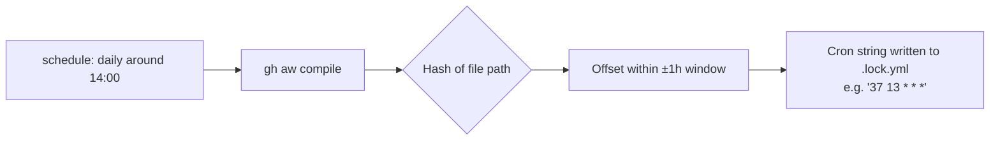
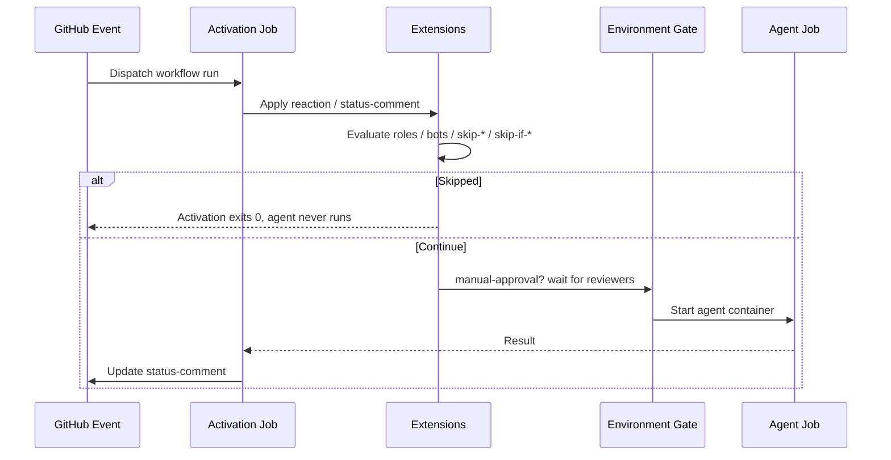

# Triggers & Scheduling

> _Based on gh-aw v0.61.0 · Last reviewed 2026-04_

This deep-dive explains how GitHub Agentic Workflows (gh-aw) decide **when** to run.
It covers the standard `on:` triggers inherited from GitHub Actions, the gh-aw–specific
**fuzzy schedule** language, the gh-aw command triggers (`slash_command:` and
`label_command:`), label filtering, the rich set of trigger extensions
(reactions, status comments, deadlines, approval gates, fork filtering,
role/bot gating, custom pre-activation steps), and the trigger lifecycle from
event reception to agent execution.

## TL;DR

- gh-aw accepts every standard GitHub Actions trigger (`push`, `pull_request`,
  `issues`, `schedule`, `workflow_dispatch`, …) plus gh-aw extensions.
- Command triggers use **`on: slash_command:`** and **`on: label_command:`** —
  the legacy `on: command:` and `on: labeled:` shapes do **not** exist in
  v0.61.0.
- The `workflow_dispatch:` block supports four input types (`string`,
  `boolean`, `choice`, `environment`) and inputs are referenced from the
  markdown body using `${{ github.event.inputs.NAME }}`.
- **Fuzzy scheduling** (`schedule: daily around 14:00`) lets the compiler
  scatter cron times deterministically per workflow file path so concurrent
  agent runs don't stampede the runner pool.
- Trigger extensions like `reaction:`, `status-comment:`, `stop-after:`,
  `manual-approval:`, `forks:`, `roles:`, `bots:`, `skip-roles:`,
  `skip-bots:`, `skip-if-match:`, `skip-if-no-match:`, `steps:`,
  `permissions:`, `github-token:`, and `github-app:` shape the activation job
  before the agent ever starts.
- Issues and `issue_comment` triggers can use `lock-for-agent: true` to lock
  the issue while the agent runs.
- `roles:` defaults to `[admin, maintainer, write]` (or set to `all`) for
  role-based access gating.

## Key Concepts

| Term                     | Definition                                                                                                                          |
| ------------------------ | ----------------------------------------------------------------------------------------------------------------------------------- |
| **Trigger**              | An entry under `on:` that causes GitHub Actions to dispatch the workflow.                                                           |
| **Activation job**       | The first job gh-aw generates. It validates the trigger, applies extensions, and decides whether to call the agent job.             |
| **Fuzzy schedule**       | A natural-language schedule expression that gh-aw compiles to a cron string with a deterministic, file-path–derived offset.         |
| **Trigger extension**    | A gh-aw key under `on:` (`reaction:`, `manual-approval:`, …) that customises activation behaviour.                                  |
| **Slash command**        | A trigger fired by an issue/PR comment of the form `/command-name`. Declared with `on: slash_command:`.                             |
| **Label command**        | A trigger fired when a specific label is added (one-shot: label is removed by default). Declared with `on: label_command:`.         |
| **Label filtering**      | `on: issues` (or `pull_request`) with `types: [labeled]` and `names:` — label stays put, NOT a label command.                       |
| **Status comment**       | An auto-managed PR/issue comment posted by gh-aw to surface run status. Auto-enabled for `slash_command` and `label_command`.       |

> [!NOTE]
> Triggers are evaluated by the **activation job**. Only when the activation job
> exits successfully does the agent container start.

## Deep Dive

### 1. Standard GitHub Actions triggers

Anything you can put under `on:` in a normal Actions workflow works in gh-aw:

```yaml
on:
  push:
    branches: [main]
    paths: ["src/**"]
  pull_request:
    types: [opened, synchronize, reopened]
  issues:
    types: [opened, labeled]
    lock-for-agent: true       # gh-aw extension: lock the issue while the agent runs
  issue_comment:
    types: [created]
    lock-for-agent: true
  discussion_comment:
    types: [created]
  workflow_run:
    workflows: ["CI"]
    branches: [main]            # required to limit triggering branches
  schedule:
    - cron: "0 9 * * 1-5"
  workflow_dispatch:
```

These are forwarded to the generated `.lock.yml` so you keep all the
filtering options (`branches`, `paths`, `types`, `tags`) you already know.
`lock-for-agent: true` is the gh-aw addition for `issues:` and
`issue_comment:` that locks the conversation thread while the agent works.

### 2. `workflow_dispatch` input types

`workflow_dispatch:` lets users (or the API) start a workflow with parameters.
gh-aw supports the four GitHub-native input types:

```yaml
on:
  workflow_dispatch:
    inputs:
      target_branch:
        description: "Branch to operate on"
        type: string
        default: "main"
      dry_run:
        description: "Preview only"
        type: boolean
        default: true
      severity:
        description: "Issue severity"
        type: choice
        options: [low, medium, high, critical]
        default: medium
      target_env:
        description: "Deployment environment"
        type: environment
```

Inputs are reachable from the agent prompt body via:

```markdown
Run a triage on the `${{ github.event.inputs.target_branch }}` branch.
Severity threshold: **${{ github.event.inputs.severity }}**.
```

> [!WARNING]
> The `environment` input type populates a dropdown from
> **Settings → Environments** but **does NOT enforce** environment protection
> rules. The value is just a string. To gate execution on approvals, combine
> with `manual-approval:` (see below).

### 3. Fuzzy scheduling — the headline feature

gh-aw ships its own scheduler grammar that compiles down to standard cron, but
applies a **deterministic per-file offset** so two workflows with the same
schedule don't fire at exactly the same moment.

```yaml
on:
  schedule: daily around 14:00
```

Common forms:

| Format                                   | Example                                       | Result                                                | Notes                                                         |
| ---------------------------------------- | --------------------------------------------- | ----------------------------------------------------- | ------------------------------------------------------------- |
| `daily`                                  | `schedule: daily`                             | Once per day at a path-derived time                   | Compiler scatters across 24 h.                                |
| `daily around HH:MM`                     | `schedule: daily around 14:00`                | Once per day, 14:00 ±1 hour                           | ±1 h jitter window.                                           |
| `daily between HH:MM and HH:MM`          | `schedule: daily between 9:00 and 17:00`      | Once per day inside business hours                    | Time picked deterministically inside range.                   |
| `weekly on DAY [around HH:MM]`           | `schedule: weekly on monday around 5pm`       | Mondays around 17:00                                  | Day names lower-case.                                         |
| `hourly`                                 | `schedule: hourly`                            | Every hour                                            | Minute is path-derived.                                       |
| `every N minutes`                        | `schedule: every 10 minutes`                  | Every 10 min                                          | Minimum allowed interval is **5 minutes**.                    |
| `every Nh`                               | `schedule: every 2h`                          | Every 2 hours                                         | Useful for polling jobs.                                      |
| UTC offset                               | `schedule: daily around 14:00 utc-5`          | 14:00 in UTC-5 (= 19:00 UTC)                          | `utc+N` / `utc-N`.                                            |

Recognised time formats:

- `HH:MM` 24-hour, e.g. `14:30`
- `midnight` (00:00) and `noon` (12:00)
- `1am`–`12am`, `1pm`–`12pm`

#### Why fuzzy?

Without scatter, every `cron: '0 14 * * *'` workflow on the runner pool fires
simultaneously — bad for rate limits and noisy-neighbour effects. Because the
offset is **deterministic per workflow file path**, the scattered time is
stable across compiles (you don't get a different cron on every `gh aw
compile`).



### 4. Standard cron with timezone

If you need precise cron, use the standard form with an optional `timezone:`
(IANA name):

```yaml
on:
  schedule:
    - cron: "30 9 * * 1-5"
      timezone: "America/New_York"
```

> [!TIP]
> Use the standard form for compliance/business-hours requirements; use fuzzy
> form for everything else.

### 5. Slash commands (`slash_command:`)

Slash commands fire when a user posts a comment like `/my-bot` on an issue,
PR, or discussion comment. They are **first-class** triggers in v0.61.0 and
are declared as **`on: slash_command:`** (not `on: command:` — that field
does not exist).

```yaml
# Full form:
on:
  slash_command:
    name: my-bot                       # OR an array for aliases: ["cmd1", "cmd2"]
    events: [issues, issue_comment]    # filter; default: all of issues / issue_comment / pull_request_review_comment / discussion_comment

# Shorthand:
on:
  slash_command: my-bot

# Ultra-short (auto-expands to slash_command + workflow_dispatch):
on: /my-bot
```

`status-comment:` is **auto-enabled** for `slash_command:` triggers so users
get progress feedback without extra configuration.

### 6. Label commands (`label_command:`)

Label commands fire when a label is added to an issue or PR. By default the
label is removed after activation (one-shot semantics) — set
`remove_label: false` to keep it.

```yaml
# Full form:
on:
  label_command:
    name: deploy
    events: [pull_request]
    remove_label: false                # default: true (label is removed)

# Shorthand:
on: "label-command deploy"
```

Like slash commands, `label_command:` triggers get `status-comment:`
auto-enabled.

### 7. Label filtering (NOT a label command)

If you just want to react to a label being added but **keep the label in
place** and **not** treat it as a one-shot command, use the standard
`issues` / `pull_request` triggers with `types: [labeled]` and a `names:`
filter:

```yaml
# Full form:
on:
  issues:
    types: [labeled]
    names: [bug, critical]

# Shorthand forms:
on: issue labeled bug
on: pull_request labeled needs-review, ready-to-merge
```

| Choose…                | When                                                           |
| ---------------------- | -------------------------------------------------------------- |
| `label_command:`       | One-shot "do this then drop the label" workflows.              |
| `issues` + `names:`    | Reactive workflows where the label should remain on the item.  |

### 8. Trigger extensions (under `on:`)

These keys live **inside `on:`** and are processed by the activation job.

#### `reaction:`

```yaml
on:
  issues:
    types: [opened]
  reaction: eyes
```

Supported reactions: `+1`, `-1`, `laugh`, `confused`, `heart`, `hooray`,
`rocket`, `eyes`, `none`.

#### `status-comment:`

```yaml
on:
  issues:
    types: [opened]
  status-comment: true
  # or, scoped:
  # status-comment:
  #   issues: true
  #   pull-requests: true
  #   discussions: false
```

The comment is updated as the run progresses. **Auto-enabled** for
`slash_command:` and `label_command:`.

#### `stop-after:`

```yaml
on:
  schedule: every 2h
  stop-after: "+25h"          # relative duration: +7d, +25h, +1d12h30m
  # or absolute:
  # stop-after: "2026-12-31T23:59:59Z"
```

The activation job exits early once the deadline has passed.

#### `manual-approval:`

Routes the agent job through a GitHub **environment** so its protection
rules (required reviewers, wait timers) apply.

```yaml
on:
  pull_request:
    types: [opened]
  manual-approval: production-agent       # the environment name
```

> [!NOTE]
> Unlike the `environment` *input type* (which is just a string), this **does**
> enforce protection rules.

#### `forks:`

Filter `pull_request` activations by which forks are allowed.

```yaml
on:
  pull_request:
    types: [opened, synchronize]
  forks: ["myorg/*"]              # patterns: ["*"], ["owner/*"], ["owner/repo"]
```

#### `roles:` and `bots:` (allow-lists)

```yaml
on:
  issue_comment:
    types: [created]
  roles: [admin, maintainer, write]   # default
  # or roles: all
  bots: [dependabot, renovate]        # explicit allowed bot actors
```

`roles:` defaults to `[admin, maintainer, write]`. Set it to `all` to permit
any actor regardless of role.

#### `skip-roles:` and `skip-bots:` (deny-lists)

```yaml
on:
  issue_comment:
    types: [created]
  skip-bots: [dependabot]
  skip-roles: [NONE]               # standard GitHub author associations
```

`skip-roles:` accepts standard GitHub author associations (`OWNER`,
`MEMBER`, `COLLABORATOR`, `CONTRIBUTOR`, `FIRST_TIMER`,
`FIRST_TIME_CONTRIBUTOR`, `MANNEQUIN`, `NONE`).

#### `skip-if-match:` and `skip-if-no-match:`

```yaml
on:
  issues:
    types: [opened, labeled]
  skip-if-no-match:
    query: "is:issue label:needs-triage"
    scope: none
  # skip-if-match:
  #   query: "label:wontfix"
  #   max: 5
```

If the triggering item doesn't match the query, activation exits early.

#### Custom `steps:` and `permissions:`

You can inject deterministic steps into the **activation job** — useful for
fetching extra data, populating environment variables, or validating inputs
before the agent runs.

```yaml
on:
  issues:
    types: [opened]
  permissions:                # extra scopes for the activation steps
    contents: read
    issues: read
  steps:
    - name: Pre-fetch context
      run: |
        echo "PROJECT_VERSION=$(cat VERSION)" >> $GITHUB_ENV
```

> [!IMPORTANT]
> `on.permissions:` controls the **activation** job, not the agent. Strict
> mode still rejects write scopes here.

#### `github-token:` and `github-app:`

Override the activation job identity:

```yaml
on:
  pull_request:
    types: [opened]
  github-token: ${{ secrets.MY_PAT }}
  # or
  github-app:
    app-id: ${{ vars.APP_ID }}
    private-key: ${{ secrets.APP_PRIVATE_KEY }}
```

Useful when the default `GITHUB_TOKEN` lacks scope (e.g. cross-repo writes).

### 9. Trigger lifecycle



## Examples

### Daily triage with fuzzy schedule and approval

```yaml
---
on:
  schedule: daily between 9:00 and 17:00 utc+0
  workflow_dispatch:
    inputs:
      severity:
        type: choice
        options: [low, medium, high]
        default: medium
  reaction: rocket
  status-comment: true
  manual-approval: triage-bot

permissions:
  issues: read
  contents: read
safe-outputs:
  add-labels:
    max: 3
---

# Daily Triage

Scan open issues with severity `${{ github.event.inputs.severity || 'medium' }}` and label them.
```

### Slash command on PRs only, ignoring forks

```yaml
---
on:
  slash_command:
    name: explain
    events: [pull_request_review_comment, issue_comment]
  forks: ["myorg/*"]
  skip-bots: [dependabot]
  reaction: eyes
---

# Explain Diff

Summarize the changes in this PR for a junior developer.
```

### Label command (one-shot deploy)

```yaml
---
on:
  label_command:
    name: deploy
    events: [pull_request]
    # remove_label defaults to true → one-shot
---

# Trigger Deploy

Kick off the deploy pipeline for this PR.
```

### Label filtering (label stays put)

```yaml
---
on:
  issues:
    types: [labeled]
    names: [needs-triage]
  status-comment: true
---

# Triage Helper

Review the issue and add a triage summary comment.
```

### Long-running rollout with deadline

```yaml
---
on:
  schedule: every 2h
  stop-after: "+30d"
---

# Rollout Watcher

Check rollout status and stop firing after 30 days.
```

### Cron with timezone

```yaml
---
on:
  schedule:
    - cron: "30 9 * * 1-5"
      timezone: "America/New_York"
---

# Business-hours job

Run weekday mornings, 9:30 NY time.
```

## Pitfalls & FAQ

> [!WARNING]
> **`on: command:` and `on: labeled:` do NOT exist in v0.61.0.** Use
> `on: slash_command:` for slash commands and `on: label_command:` for
> one-shot label triggers. For "react when this label is added but leave it
> on the item", use `on: issues` with `types: [labeled]` and a `names:` filter.

> [!WARNING]
> **`environment` input ≠ environment gate.** The input type just gives you a
> dropdown of environment names; it does not invoke protection rules. Use
> `manual-approval: <env>` to actually gate execution.

> [!WARNING]
> **`every 1 minute` is rejected.** The minimum interval for `every N minutes`
> is 5 minutes — GitHub-hosted runners can't reliably honour shorter cadences.

**Q: Will my fuzzy schedule change every time I compile?**
No. The offset is derived from the workflow file path, so re-compiling the
same file always produces the same cron string.

**Q: Can I combine `schedule:` and `workflow_dispatch:`?**
Yes, list both under `on:` — they are independent activation paths. The
`on: /my-bot` shorthand also auto-includes `workflow_dispatch:`.

**Q: How do I see what cron my fuzzy schedule produced?**
Check the generated `.lock.yml` next to your `.md` workflow.

**Q: What's the default for `roles:`?**
`[admin, maintainer, write]`. Set `roles: all` to disable role gating.

**Q: Does `skip-bots:` skip my own workflow's status comments?**
gh-aw recognises its own bot identity, so triggering loops are avoided.

## Related Docs

- [Architecture & Security Model](./01-architecture-and-security.md)
- [Frontmatter Reference](./03-frontmatter-reference.md)
- [Engines & Models](./02-engines.md)
- [Tools & MCP](./05-tools-and-mcp.md)
- [Safe-Outputs Catalog](./06-safe-outputs-catalog.md)
- Official: [Triggers](https://github.github.io/gh-aw/reference/triggers/)
- Official: [Command triggers](https://github.github.io/gh-aw/reference/command-triggers/)
