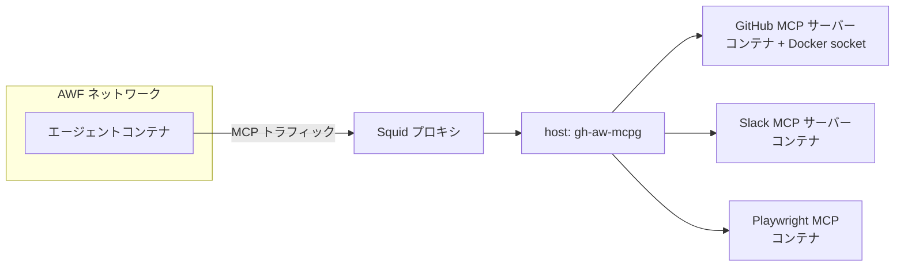

# ツールと MCP

> _Based on gh-aw v0.61.0 · Last reviewed 2026-04_

エージェントは呼び出せるツール次第で価値が決まります。gh-aw は、厳選された
**組み込みツール**、細かなツールセットを持つ深い **GitHub MCP** 統合、そして
それ以外の用途を満たす **カスタム MCP** 機構（プロセスコマンド・Docker コンテナ・
HTTP/URL・レジストリ参照）を提供します。本ドキュメントはその完全なツアーです。

## TL;DR

- 組み込みツール: `edit`、`bash`、`web-fetch`、`web-search`、`github`、
  `playwright`、`cache-memory`、`repo-memory`、`qmd`（実験的）、
  `agentic-workflows`。
- `bash:` は小さな安全許可リスト（`echo, ls, pwd, cat, head, tail, grep, wc,
  sort, uniq, date`）がデフォルト、`bash: []` でシェルを完全無効化、
  `bash: [":*"]` で許可リスト解除（細心の注意を）。
- **GitHub ツールはデフォルトで有効**、デフォルトのツールセットは
  `[context, repos, issues, pull_requests, users]`。範囲を広げる・狭める・
  強化する場合のみ `tools.github:` を宣言すれば足ります。
- `tools.timeout`（呼び出しごと、Claude デフォルト 60 秒、Codex 120 秒）と
  `tools.startup-timeout`（MCP 起動、デフォルト 120 秒）を設定可能。
- **`mcp-servers:` はトップレベルの frontmatter フィールド**（`tools:` の
  配下ではありません）。各サーバーは 4 種類のいずれか:
  `command`+`args`、`container`（Docker — **`image:` ではありません**）、
  `url`+`headers`、または `registry`。共通オプション: `env`、`allowed`。
- ランナー上（エージェントコンテナの外）で実行される独自インラインツールには
  `safe-outputs.scripts:`（インプロセス JS）か `safe-outputs.jobs:`（フル GitHub
  Actions ジョブ）を使用してください。詳細は doc 19（カスタム safe outputs）。
- ネットワーク送信は **MCP Gateway**（Squid プロキシ + ホスト側 `gh-aw-mcpg`）で
  仲介され、MCP サーバーはエージェントから隔離されます。

## Key Concepts

| 用語             | 定義                                                                                                  |
| ---------------- | ----------------------------------------------------------------------------------------------------- |
| **組み込みツール** | gh-aw ランタイムが選択エンジンへの結線方法を直接知っているファーストクラスの機能です。                |
| **ツールセット** | GitHub MCP ツールの論理グループ（例: `pull_requests` は約 12 個の PR ツールを公開します）。           |
| **MCP サーバー** | Model Context Protocol を実装し、構造化ツールをエージェントに公開するプロセスです。                   |
| **MCP Gateway**  | エージェントコンテナと MCP サーバーコンテナの間のトラフィックを仲介するホスト側コンポーネントです。   |
| **信頼ボット**   | `github-actions[bot]` のような、入力をサニタイズフラグなしで受理されるボット ID です。                |

## Deep Dive

### 1. 組み込みツール一覧

| ツール                | 用途                                                                            |
| --------------------- | ------------------------------------------------------------------------------- |
| `edit:`               | ワークスペース（エージェントコンテナにマウント）のファイル読み書き。            |
| `bash:`               | 許可リストに従ってシェルコマンドを実行。                                       |
| `web-fetch:`          | URL を取得して本文をエージェントに返却。                                        |
| `web-search:`         | Web 検索クエリを発行（エンジン依存）。                                          |
| `github:`             | ツールセットフィルタ付きで GitHub MCP サーバー経由 GitHub API を呼び出し。     |
| `playwright:`         | Playwright MCP 経由でヘッドレスブラウザを操作。                                 |
| `cache-memory:`       | 同じワークフローの実行間で共有される永続キーバリュー記憶。                      |
| `repo-memory:`        | ファイル / パスで識別されるリポジトリスコープの記憶。                           |
| `qmd:`（実験的）       | 専用インデックスジョブで構築されたドキュメント集合に対するベクター検索。        |
| `agentic-workflows:`  | 当該リポジトリの gh-aw ワークフローの自己参照（`actions: read` が必要）。      |

### 2. `bash:` の設定

`bash:` を値なしで書くと、小さな安全デフォルト許可リストが有効になります。

```yaml
tools:
  bash:                        # デフォルト許可リスト:
    # echo, ls, pwd, cat, head, tail, grep, wc, sort, uniq, date
```

バリエーション:

```yaml
tools:
  bash: []                              # シェルを完全に無効化
  bash: ["echo", "ls", "git status"]    # 明示的な許可リスト
  bash: ["git:*", "npm:*"]              # ワイルドカードファミリー
  bash: [":*"]                          # 制限なし — 注意して使用
```

> [!WARNING]
> `bash: [":*"]` は許可リストを取り除き、コンテナ内の任意のバイナリを実行できる
> ようにします。信頼できる内部ワークフローでのみ使用してください。

### 3. `web-search` のエンジン

検索の挙動はエンジンに依存します。

- **Codex**: エンジン組み込みのブラウジングを有効化するには `web-search:` の
  明示的宣言が必要です。
- **Claude / Copilot**: 通常はサードパーティ MCP サーバー経由で検索します。
  `web-search:` を宣言すれば配線が自動構成されます。

### 4. `playwright:` — ブラウザ自動化

```yaml
tools:
  playwright:
    version: "1.56.1"   # オプションの固定。未指定なら同梱版を使用
```

Playwright MCP のツール群（ページ遷移、クリック、入力、スナップショット、
スクリーンショット、評価など）を公開します。

### 5. メモリツール

```yaml
tools:
  cache-memory: {}     # ワークフロースコープの永続記憶
  repo-memory: {}      # パスでキー付けされるリポジトリスコープの記憶
```

ユースケース: 過去のトリアージ判断の記憶、高コスト埋め込みのキャッシュ、
長時間ロールアウトの状態保持など。

### 6. `qmd:` 実験的なドキュメントベクター検索

`qmd:` はコンパイル時に専用インデックスジョブを生成し、ドキュメントを
ベクトル化して検索ツールをエージェントに公開します。**実験的** 扱いで、
API は変更される可能性があります。

### 7. ツールタイムアウト

```yaml
tools:
  timeout: 90              # 呼び出し単位の秒数（Claude デフォルト 60 秒、Codex 120 秒）
  startup-timeout: 180     # MCP サーバー起動（デフォルト 120 秒）
```

両方のキーは **整数** または **GitHub Actions 式の文字列**（例:
`"${{ vars.AGENT_TIMEOUT }}"`）を受け付けます。

### 8. GitHub ツール — ツールセット

GitHub ツールはデフォルトで結線されています。デフォルトのツールセット束は
次のとおりです。

```text
context, repos, issues, pull_requests, users
```

ツールセット選択を変える、リモートモードに切り替える、カスタムトークンを渡す、
あるいは整合性 / レポフィルタを適用する場合のみ `tools.github:` を宣言すれば
足ります。

```yaml
tools:
  github:
    toolsets:
      - repos
      - issues
      - pull_requests
      - code_security
```

利用可能な全ツールセット（19 種）:

`context`、`repos`、`issues`、`pull_requests`、`users`、`actions`、
`code_security`、`discussions`、`labels`、`notifications`、`orgs`、
`projects`、`gists`、`search`、`dependabot`、`experiments`、
`secret_protection`、`security_advisories`、`stargazers`。

別名:

| 別名      | 展開先                                                                |
| --------- | --------------------------------------------------------------------- |
| `default` | `context`、`repos`、`issues`、`pull_requests`、`users`                |
| `all`     | `dependabot` を **除く** 全ツールセット                               |

#### remote モードと local モード

```yaml
tools:
  github:
    mode: remote               # デフォルト: local
    github-token: ${{ secrets.CUSTOM_PAT }}
```

`mode: remote` ではホスト型 GitHub MCP エンドポイントに接続するため、デフォルトの
`GITHUB_TOKEN` では認証できず、カスタムトークンが必要です。`mode: local`
（デフォルト）は GitHub MCP サーバーをサイドカーコンテナとして起動し、MCP
Gateway 経由で仲介します。

#### `min-integrity:` と `allowed-repos:`

```yaml
tools:
  github:
    min-integrity: approved      # public リポでは自動適用
    allowed-repos:
      - "myorg/*"                # 組織内すべて
      - "myorg/api-*"            # プレフィックス
      - "vendor/specific-repo"   # 完全一致
```

`allowed-repos:` は次を受け付けます。

- `"all"` — 制限なし（デフォルト）
- `"public"` — public リポジトリのみ
- パターン配列: `"owner/*"`、`"owner/repo"`、`"owner/prefix*"`

`min-integrity:` レベルはエージェントに到達できる入力をゲートします。
public リポでは `approved` が自動適用されます。完全な階層
（`merged` > `approved` > `unapproved` > `none` > `blocked`）は整合性
リファレンスを参照してください。

### 9. カスタム MCP サーバー

`mcp-servers:` は **トップレベルの frontmatter フィールド** です（`tools:`、
`safe-outputs:` などと同じ階層であり、`tools:` の子ではありません）。配下の
各エントリが 1 つの MCP サーバーを記述し、フィールドの選択でモードが決まります。

```yaml
mcp-servers:
  slack:
    command: "npx"                            # プロセスベース
    args: ["-y", "@slack/mcp-server"]
    env:
      SLACK_BOT_TOKEN: "${{ secrets.SLACK_BOT_TOKEN }}"
    allowed: ["send_message", "get_channel_history"]

  notion:
    container: "mcp/notion"                   # Docker — フィールドは `container:`（`image:` ではない）
    env:
      NOTION_TOKEN: "${{ secrets.NOTION_TOKEN }}"
    allowed: ["search_pages", "get_page"]

  remote-server:
    url: "https://example.com/mcp"            # HTTP エンドポイント
    headers:
      Authorization: "Bearer ${{ secrets.TOKEN }}"

  registry-server:
    registry: "https://api.mcp.github.com/v0/servers/modelcontextprotocol/filesystem"
    command: "npx"
    args: ["-y", "@modelcontextprotocol/server-filesystem"]
```

モード:

| モード    | 主要キー                                | 備考                                                       |
| --------- | --------------------------------------- | ---------------------------------------------------------- |
| Command   | `command:` / `args:` / `env:`           | MCP サーバーコンテナ内でプロセスを起動。                   |
| Docker    | `container:`（+ `args`、`env`）         | 任意のコンテナを実行。Gateway がトラフィックを仲介。        |
| HTTP/URL  | `url:` / `headers:`                     | リモート MCP エンドポイントに HTTP 接続。                   |
| Registry  | `registry:` 参照                        | キュレーション済 MCP レジストリから解決。                   |

> [!IMPORTANT]
> Docker MCP サーバーは **`container:`** を使います — **`image:` フィールドは
> 存在しません**。古いドラフトの一部に `image:` の記載があるかもしれませんが、
> その構文は無効でコンパイラに拒否されます。

`allowed:` はサーバーから呼び出せるツールをホワイトリスト化します。

### 10. インラインのユーザー定義ツール — `mcp-scripts:` とカスタム safe outputs

インラインのカスタムツールを持ち込む方法は 2 系統あり、アーキテクチャ上の位置
が異なります。**シークレットを誰に渡すか** で使い分けます。

**`mcp-scripts:`**（トップレベルのフロントマターフィールド）— JavaScript やシ
ェルスクリプトでカスタム MCP ツールをインライン定義します。スクリプトは
`github`、`safeoutputs`、`mcp-servers:` で宣言した外部サーバと並ぶ第一級の
MCP ツールとして実行されます。完全なスキーマと、シークレットアクセスを制御
するパターンは公式の
[MCP Scripts リファレンス](https://github.github.io/gh-aw/reference/mcp-scripts/)
を参照してください。エージェントのツールベルトを **エージェントサンドボッ
クス内で** 動く独自ロジックで拡張したいときに使います。

```yaml
mcp-scripts:
  word_count:
    description: "渡されたテキストの単語数を数える"
    inputs:
      text: { type: string, required: true }
    run: |
      echo "$INPUT_TEXT" | wc -w
```

そのインラインツールが **エージェントには見せたくないシークレット** を必要と
するなら、代わりに **カスタム safe outputs** を使ってください。これらはエージ
ェントコンテナの外、ランナー上で実行されます。

- **`safe-outputs.scripts:`** — safe-outputs ジョブ内で実行されるインプロセス
  JavaScript。デフォルトでシークレットアクセスはなく、エージェントは生成
  された MCP ツール経由で呼び出します。
- **`safe-outputs.jobs:`** — フル GitHub Actions ジョブ（`runs-on`、`steps`、
  `permissions`、`env` など指定可能）。外部バイナリ、サードパーティ
  アクション、シークレットを扱う CLI などを呼び出す場合に使います。

どちらの safe-output 系もエージェントから呼べる通常の MCP ツールに変換され、
シークレットはランナー上に留まります。完全なスキーマ、サンプル、ジョブ名の
ダッシュ→アンダースコア変換ルールは doc 19（カスタム safe outputs）を参照
してください。

### 11. MCP Gateway アーキテクチャ



このアーキテクチャの理由:

- **ネットワーク隔離**: エージェントコンテナはプロキシしか見えず、
  インターネットに直接アクセスできません。
- **サーバーごとのコンテナ**: 各 MCP サーバーは必要なシークレットのみを持つ
  独立コンテナで動きます。
- **監査可能**: Gateway がすべてのツール呼び出しをログ化するため、
  エージェントの挙動を一箇所で観測できます。

### 12. 信頼ボット

信頼ボットは、その投稿が本物の入力として扱われるボット ID です。gh-aw には
組み込みの信頼 ID（例: `github-actions[bot]`、`copilot-swe-agent[bot]`）が
同梱されています。ワークフローからリストを拡張することもできます（設定面は
バージョンに依存するため、整合性リファレンスを参照してください）。

## Examples

### 最小構成: edit + GitHub default ツールセット + 読み取り専用 bash

```yaml
---
on: workflow_dispatch
tools:
  edit: {}
  github:
    toolsets: [default]
  bash: ["git status", "ls"]
---
```

### ブラウザ駆動 QA ボット

```yaml
---
on:
  slash_command:
    name: smoke-test
tools:
  playwright:
    version: "1.56.1"
  github:
    toolsets: [pull_requests]
  cache-memory: {}
---
```

### カスタム Slack MCP（プロセス）+ Notion MCP（Docker コンテナ）

```yaml
---
on:
  schedule: daily around 9am
mcp-servers:
  slack:
    command: npx
    args: ["-y", "@slack/mcp-server"]
    env:
      SLACK_BOT_TOKEN: "${{ secrets.SLACK_BOT_TOKEN }}"
    allowed: ["send_message"]
  notion:
    container: "mcp/notion"
    env:
      NOTION_TOKEN: "${{ secrets.NOTION_TOKEN }}"
    allowed: ["search_pages", "get_page"]
---
```

### トリアージボット向けの厳格な GitHub アクセス

```yaml
tools:
  github:
    toolsets: [issues, labels, search]
    min-integrity: approved
    allowed-repos:
      - "myorg/customer-issues"
    timeout: 60
    startup-timeout: 90
```

## Pitfalls & FAQ

> [!WARNING]
> **`bash:` のデフォルトを忘れずに。** `tools: { bash: ["my-tool"] }` と
> 書くと、デフォルトの `echo` / `ls` などは **置き換えられます**（マージ
> されません）。プロンプトが想定するなら明示的に追加してください。

> [!WARNING]
> **PAT 無しの `mode: remote` は失敗します。** デフォルトの `GITHUB_TOKEN` は
> リモート GitHub MCP エンドポイントを認証できません。

> [!WARNING]
> **`mcp-servers:` を `tools:` の下に置かないでください。** これは
> frontmatter のトップレベルで `tools:` の兄弟です。ネストするとコンパイラ
> が拒否します。

> [!WARNING]
> **Docker MCP サーバーに `image:` を使わないでください。** 正しいフィールド
> は `container:` です。`image:` は認識されません。

> [!TIP]
> シークレットを扱うロジックには `safe-outputs.scripts:` または
> `safe-outputs.jobs:`（doc 19 参照）を優先してください。エージェントは
> 生のシークレットを見ることなく、ツールの出力だけを受け取ります。

**Q: どのツールセットにどのツールが含まれるかをどう確認しますか？**
生成された `.lock.yml` を見てください。ツールセットごとに解決済みの
ツール名が列挙されています。

**Q: 同じ名前の MCP サーバーを 2 つ持てますか？**
持てません。`mcp-servers:` の下のキーは一意である必要があります。

**Q: `playwright:` はヘッド付きモードをサポートしますか？**
デフォルトはヘッドレスです。同梱の MCP サーバーは GitHub-hosted ランナーで
表示可能なブラウザを公開しません。

**Q: `cache-memory` のスコープは？**
ワークフローファイルパス単位です。`.md` のパスが異なれば、同じリポジトリ内
でもキャッシュは分離されます。

## Related Docs

- [アーキテクチャとセキュリティ](./01-architecture-and-security.ja.md)
- [エンジンとモデル](./02-engines.ja.md)
- [脅威検出と XPIA](./08-threat-detection-and-xpia.ja.md)
- [Imports と共有コンポーネント](./09-imports-and-shared-components.ja.md)
