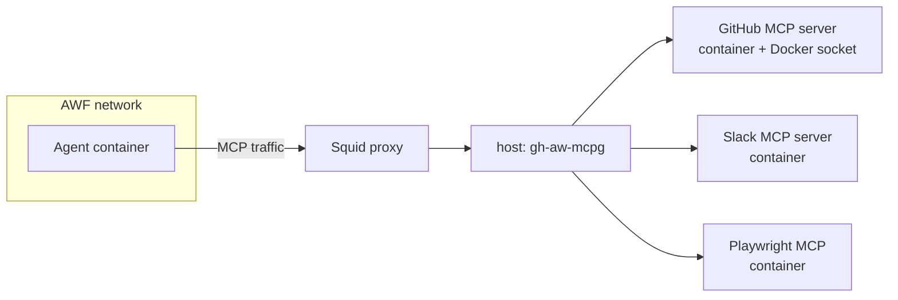

# Tools & MCP

> _Based on gh-aw v0.61.0 · Last reviewed 2026-04_

Agents are only as useful as the tools they can call. gh-aw exposes a curated
set of **built-in tools**, deep **GitHub MCP** integration with fine-grained
toolsets, and a **custom MCP** mechanism (process command, Docker container,
HTTP/URL, or registry reference) for everything else. This document is the
authoritative tour.

## TL;DR

- Built-in tools: `edit`, `bash`, `web-fetch`, `web-search`, `github`,
  `playwright`, `cache-memory`, `repo-memory`, `qmd` (experimental),
  `agentic-workflows`.
- `bash:` defaults to a tiny safe allowlist (`echo, ls, pwd, cat, head, tail,
  grep, wc, sort, uniq, date`); `bash: []` disables the shell entirely;
  `bash: [":*"]` removes the allowlist (use with extreme care).
- **GitHub tools are enabled by default** with toolsets
  `[context, repos, issues, pull_requests, users]`. You only need to declare
  `tools.github:` to widen, narrow, or harden access.
- `tools.timeout` (per-call; default 60s on Claude, 120s on Codex) and
  `tools.startup-timeout` (MCP boot; default 120s) are configurable.
- **`mcp-servers:` is a top-level frontmatter field** (NOT nested under
  `tools:`). Each server uses one of four shapes: `command`+`args`,
  `container` (Docker — **NOT `image:`**), `url`+`headers`, or `registry`.
  Common knobs: `env`, `allowed`.
- For inline user-defined tools the runner executes (outside the agent
  container) use `safe-outputs.scripts:` (in-process JS) or
  `safe-outputs.jobs:` (full GitHub Actions jobs). See doc 19 (custom safe
  outputs).
- Network egress is mediated by an **MCP Gateway** (Squid proxy + host-side
  `gh-aw-mcpg` controller) so MCP servers stay isolated from the agent.

## Key Concepts

| Term                | Definition                                                                                                  |
| ------------------- | ----------------------------------------------------------------------------------------------------------- |
| **Built-in tool**   | First-class capability the gh-aw runtime knows how to wire into the chosen engine.                          |
| **Toolset**         | A logical group of GitHub MCP tools (e.g. `pull_requests` exposes ~12 PR tools).                            |
| **MCP server**      | A process implementing the Model Context Protocol that exposes structured tools to the agent.               |
| **MCP Gateway**     | Host-side mediator that brokers traffic between the agent container and any MCP server containers.          |
| **Trusted bot**     | A bot identity (e.g. `github-actions[bot]`) whose actions are accepted as input without sanitisation flags. |

## Deep Dive

### 1. Built-in tools at a glance

| Tool                  | Purpose                                                                          |
| --------------------- | -------------------------------------------------------------------------------- |
| `edit:`               | Read/write files in the workspace (mounted into the agent container).            |
| `bash:`               | Execute shell commands subject to an allowlist.                                  |
| `web-fetch:`          | Fetch a URL and return the body to the agent.                                    |
| `web-search:`         | Issue web search queries (engine-dependent).                                     |
| `github:`             | Call the GitHub API via the GitHub MCP server with toolset filtering.            |
| `playwright:`         | Drive a headless browser via Playwright MCP.                                     |
| `cache-memory:`       | Persistent key-value memory shared across runs of the same workflow.             |
| `repo-memory:`        | Repo-scoped memory keyed by file/path identity.                                  |
| `qmd:` (experimental) | Vector search over a documentation corpus, populated by a dedicated index job.   |
| `agentic-workflows:`  | Introspect this repo's gh-aw workflows (requires `actions: read`).               |

### 2. `bash:` configuration

When `bash:` appears bare (no value), it activates a small safe default
allowlist:

```yaml
tools:
  bash:                        # default allowlist:
    # echo, ls, pwd, cat, head, tail, grep, wc, sort, uniq, date
```

Variants:

```yaml
tools:
  bash: []                              # disable shell entirely
  bash: ["echo", "ls", "git status"]    # explicit allowlist
  bash: ["git:*", "npm:*"]              # wildcard families
  bash: [":*"]                          # unrestricted — use with caution
```

> [!WARNING]
> `bash: [":*"]` removes the allowlist and lets the agent run any binary
> available in the container. Reserve it for trusted internal workflows.

### 3. `web-search` engines

Search behaviour depends on the engine:

- **Codex**: requires explicit declaration of `web-search:` to enable the
  engine's built-in browsing.
- **Claude / Copilot**: typically reach search through a third-party MCP
  server; declaring `web-search:` configures the wiring for you.

### 4. `playwright:` — browser automation

```yaml
tools:
  playwright:
    version: "1.56.1"   # optional pin; otherwise uses bundled default
```

Exposes the Playwright MCP toolset (page navigation, click, type, snapshot,
screenshot, evaluate, …).

### 5. Memory tools

```yaml
tools:
  cache-memory: {}     # workflow-scoped persistent memory
  repo-memory: {}      # repo-scoped memory keyed by paths
```

Use cases: remembering past triage decisions, caching expensive embeddings,
maintaining cross-run state for long-running rollouts.

### 6. `qmd:` experimental docs vector search

`qmd:` builds a dedicated indexing job at compile time that vectorises
documentation, then exposes a search tool to the agent. Treat as
**experimental** — APIs may change.

### 7. Tool timeouts

```yaml
tools:
  timeout: 90              # per-operation seconds (Claude default 60s, Codex default 120s)
  startup-timeout: 180     # MCP server boot (default 120s)
```

Both keys accept either an **integer** or a **GitHub Actions expression
string** (e.g. `"${{ vars.AGENT_TIMEOUT }}"`).

### 8. GitHub tools — toolsets

GitHub tools are wired in by default. The default toolset bundle is:

```text
context, repos, issues, pull_requests, users
```

You only need to declare `tools.github:` if you want to change the toolset
selection, switch to remote mode, supply a custom token, or apply integrity
or repo filters.

```yaml
tools:
  github:
    toolsets:
      - repos
      - issues
      - pull_requests
      - code_security
```

All available toolsets (19 total):

`context`, `repos`, `issues`, `pull_requests`, `users`, `actions`,
`code_security`, `discussions`, `labels`, `notifications`, `orgs`,
`projects`, `gists`, `search`, `dependabot`, `experiments`,
`secret_protection`, `security_advisories`, `stargazers`.

Aliases:

| Alias     | Expands to                                                          |
| --------- | ------------------------------------------------------------------- |
| `default` | `context`, `repos`, `issues`, `pull_requests`, `users`              |
| `all`     | All toolsets **except** `dependabot`                                |

#### Remote vs local mode

```yaml
tools:
  github:
    mode: remote               # default: local
    github-token: ${{ secrets.CUSTOM_PAT }}
```

`mode: remote` calls the hosted GitHub MCP endpoint and requires a custom
token because the default `GITHUB_TOKEN` cannot authenticate against it.
`mode: local` (the default) runs the GitHub MCP server in a sidecar
container, mediated by the MCP Gateway.

#### `min-integrity:` and `allowed-repos:`

```yaml
tools:
  github:
    min-integrity: approved      # auto-applied on public repos
    allowed-repos:
      - "myorg/*"                # all repos in org
      - "myorg/api-*"            # prefix
      - "vendor/specific-repo"   # exact
```

`allowed-repos:` accepts:

- `"all"` — no restriction (default)
- `"public"` — only public repositories
- An array of patterns: `"owner/*"`, `"owner/repo"`, `"owner/prefix*"`

`min-integrity:` levels gate which inputs reach the agent — `approved` is
applied automatically for public repos. See the integrity reference for the
full hierarchy (`merged` > `approved` > `unapproved` > `none` > `blocked`).

### 9. Custom MCP servers

`mcp-servers:` is a **top-level frontmatter field** (a sibling of `tools:`,
`safe-outputs:`, etc., NOT a child of `tools:`). Each entry under it
describes a single MCP server, and the choice of fields selects the mode.

```yaml
mcp-servers:
  slack:
    command: "npx"                            # process-based
    args: ["-y", "@slack/mcp-server"]
    env:
      SLACK_BOT_TOKEN: "${{ secrets.SLACK_BOT_TOKEN }}"
    allowed: ["send_message", "get_channel_history"]

  notion:
    container: "mcp/notion"                   # Docker — field is `container:` (NOT `image:`)
    env:
      NOTION_TOKEN: "${{ secrets.NOTION_TOKEN }}"
    allowed: ["search_pages", "get_page"]

  remote-server:
    url: "https://example.com/mcp"            # HTTP endpoint
    headers:
      Authorization: "Bearer ${{ secrets.TOKEN }}"

  registry-server:
    registry: "https://api.mcp.github.com/v0/servers/modelcontextprotocol/filesystem"
    command: "npx"
    args: ["-y", "@modelcontextprotocol/server-filesystem"]
```

Modes:

| Mode      | Trigger keys                            | Notes                                                |
| --------- | --------------------------------------- | ---------------------------------------------------- |
| Command   | `command:` / `args:` / `env:`           | Spawn a process inside an MCP server container.      |
| Docker    | `container:` (+ `args`, `env`)          | Run an arbitrary container; gateway brokers traffic. |
| HTTP/URL  | `url:` / `headers:`                     | Connect to a remote MCP endpoint over HTTP.          |
| Registry  | `registry:` reference                   | Resolve from a curated MCP registry.                 |

> [!IMPORTANT]
> Docker MCP servers use **`container:`** — there is **no `image:` field**.
> Older drafts of these docs used `image:`; that syntax is invalid and will
> be rejected by the compiler.

`allowed:` whitelists which tools from the server the agent may call.

### 10. Inline user-defined tools — `mcp-scripts:` and custom safe outputs

There are two distinct ways to ship inline custom tools, and they live
at different points in the architecture. Pick based on **who needs the
secrets**.

**`mcp-scripts:`** (top-level frontmatter field) — defines custom MCP
tools inline using JavaScript or shell scripts. The scripts run as
first-class MCP tools alongside `github`, `safeoutputs`, and any
`mcp-servers:` entries you declare. See the upstream
[MCP Scripts reference](https://github.github.io/gh-aw/reference/mcp-scripts/)
for the full schema and controlled-secret-access patterns. Use this when
you want to extend the agent's toolbelt with bespoke logic that runs
inside the agent sandbox.

```yaml
mcp-scripts:
  word_count:
    description: "Count words in the supplied text"
    inputs:
      text: { type: string, required: true }
    run: |
      echo "$INPUT_TEXT" | wc -w
```

If the inline tool needs **secrets the agent must not see**, use
**custom safe outputs** instead — they execute on the runner, outside
the agent container:

- **`safe-outputs.scripts:`** — in-process JavaScript executed inside the
  safe-outputs job. No secret access by default; the agent calls it via a
  generated MCP tool.
- **`safe-outputs.jobs:`** — full GitHub Actions jobs (with `runs-on`,
  `steps`, `permissions`, `env`, …). Use when you need to invoke external
  binaries, third-party actions, or secret-bearing CLI tools.

Both safe-output mechanisms turn into normal MCP tools the agent can
invoke; the secrets stay on the runner. See doc 19 (custom safe outputs)
for the full schema, examples, and the dashes→underscores renaming rule
applied to the generated tool name.

### 11. MCP Gateway architecture



Why this architecture?

- **Network isolation**: the agent container only sees the proxy, not the
  Internet directly.
- **Per-server containers**: each MCP server runs in its own container with
  only the secrets it needs.
- **Auditable**: the gateway logs every tool call; you get a single place to
  observe agent behaviour.

### 12. Trusted bots

Trusted bots are bot identities whose contributions are treated as
authentic input. gh-aw ships with built-in trusted identities (e.g.
`github-actions[bot]`, `copilot-swe-agent[bot]`); workflows can extend the
list (configuration surface depends on the version — consult the integrity
reference).

## Examples

### Minimal: edit + GitHub default toolset + read-only bash

```yaml
---
on: workflow_dispatch
tools:
  edit: {}
  github:
    toolsets: [default]
  bash: ["git status", "ls"]
---
```

### Browser-driving QA bot

```yaml
---
on:
  slash_command:
    name: smoke-test
tools:
  playwright:
    version: "1.56.1"
  github:
    toolsets: [pull_requests]
  cache-memory: {}
---
```

### Custom Slack MCP (process) + Notion MCP (Docker container)

```yaml
---
on:
  schedule: daily around 9am
mcp-servers:
  slack:
    command: npx
    args: ["-y", "@slack/mcp-server"]
    env:
      SLACK_BOT_TOKEN: "${{ secrets.SLACK_BOT_TOKEN }}"
    allowed: ["send_message"]
  notion:
    container: "mcp/notion"
    env:
      NOTION_TOKEN: "${{ secrets.NOTION_TOKEN }}"
    allowed: ["search_pages", "get_page"]
---
```

### Tight GitHub access for a triage bot

```yaml
tools:
  github:
    toolsets: [issues, labels, search]
    min-integrity: approved
    allowed-repos:
      - "myorg/customer-issues"
    timeout: 60
    startup-timeout: 90
```

## Pitfalls & FAQ

> [!WARNING]
> **Don't forget `bash:` defaults.** If you write `tools: { bash: ["my-tool"] }`,
> the previous defaults (`echo`, `ls`, …) are **replaced**, not merged. Add
> them back if your prompt expects them.

> [!WARNING]
> **`mode: remote` without a PAT fails.** The default `GITHUB_TOKEN` cannot
> authenticate against the remote GitHub MCP endpoint.

> [!WARNING]
> **Don't put `mcp-servers:` under `tools:`.** It is a sibling of `tools:`
> at the top level of the frontmatter. The compiler will reject nested
> placement.

> [!WARNING]
> **Don't use `image:` for Docker MCP servers.** The correct field is
> `container:`. `image:` is not recognised.

> [!TIP]
> For any secret-bearing logic, prefer `safe-outputs.scripts:` or
> `safe-outputs.jobs:` (see doc 19) — the agent never sees the raw secret,
> only the tool's output.

**Q: How do I know which toolset includes which tools?**
Look at the generated `.lock.yml`; gh-aw lists the resolved tool names per
toolset.

**Q: Can two MCP servers share a name?**
No — keys under `mcp-servers:` must be unique.

**Q: Does `playwright:` support headed mode?**
The default is headless; the bundled MCP server doesn't expose a visible
browser on GitHub-hosted runners.

**Q: How is `cache-memory` scoped?**
By workflow file path. Two workflows with different `.md` paths get distinct
caches even within the same repo.

## Related Docs

- [Architecture & Security Model](./01-architecture-and-security.md)
- [Engines & Models](./02-engines.md)
- [Threat Detection & XPIA](./08-threat-detection-and-xpia.md)
- [Imports & Shared Components](./09-imports-and-shared-components.md)
