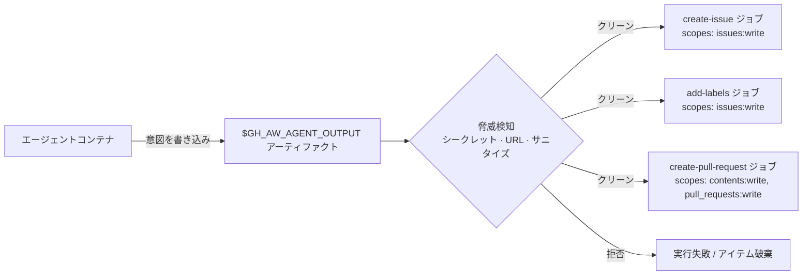

# Safe-Outputs カタログ

> _Based on gh-aw v0.61.0 · Last reviewed 2026-04_

Safe outputs は、エージェントがリポジトリへの変更（issue、PR、コメント、ラベル、
リリース、プロジェクトなど）を **提案** できるようにしつつ、書き込み自体は
最小限のスコープを持つ GitHub トークンで実行される **独立した監査可能な
後処理ジョブ** で行うための gh-aw の仕組みです。エージェントは決して書き込み
権限を持ちません。本ドキュメントはすべての組み込み safe-output タイプと、
それを保護する横断的機能を網羅します。

## TL;DR

- frontmatter の safe-output **宣言** が専用の後処理ジョブを生成します。
  エージェントは構造化された意図を `$GH_AW_AGENT_OUTPUT` に出力し、
  ジョブがそのアーティファクトを読んで GitHub API を呼び出します。
- 各 safe-output タイプには **デフォルト `max`** があり（例: `add-comment` は
  実行あたり 1 件）、多くは設定可能です。
- ほとんどの出力は `target-repo` でクロスリポジトリ書き込みが可能。
  動的指定は `target-repo: "*"` ＋ `allowed-repos` ガードで行います。
- 書き込み前に **脅威検知** ステージがアーティファクトを走査し、シークレット、
  許可されない URL、プロンプトインジェクションマーカーをチェックします。
- gh-aw が作成したすべてのアイテムには非表示マーカー
  `<!-- gh-aw-workflow-id: WORKFLOW_NAME -->` が埋め込まれます。
- `safe-outputs:` を宣言するすべてのワークフローでは 3 タイプが **自動有効化**
  されます: `noop`、`missing-tool`、`missing-data`。
- ユーザー定義の後処理（jobs / scripts / actions）は
  [19 — Custom Safe Outputs](./19-custom-safe-outputs.ja.md) を参照してください。

## Key Concepts

| 用語                       | 定義                                                                                                |
| -------------------------- | --------------------------------------------------------------------------------------------------- |
| **Safe output**            | エージェントが出力する型付き意図で、スコープ付き資格情報の別ジョブにより実行されます。              |
| **後処理ジョブ**           | `$GH_AW_AGENT_OUTPUT` を読んで API を呼び出す、ロックワークフロー内の自動生成ジョブ。               |
| **脅威検知**               | 書き込み前にエージェントアーティファクトをシークレットやプロンプトインジェクションでスキャン。      |
| **ワークフロー ID マーカー** | 作成アイテムに埋め込まれる HTML コメントで、生成元ワークフローを示します。                         |
| **保護ファイル**           | エージェント編集を禁止するパス宣言（ポリシー: `blocked` / `allowed` / `fallback-to-issue`）。       |
| **`target-repo`**          | safe output を別リポジトリへ向ける任意フィールド（`"owner/repo"` または動的指定の `"*"`）。         |
| **`allowed-repos`**        | `target-repo: "*"` を守るためのリポジトリ許可リスト。一致しない宛先は拒否されます。                 |



## Deep Dive

### 1. Issues と Discussions

| タイプ              | デフォルト最大 | 備考                                                          |
| ------------------- | -------------- | ------------------------------------------------------------- |
| `create-issue`      | 1              | `title-prefix`、`labels`、`close-older-issues` ほか            |
| `update-issue`      | 1              | タイトル / 本文 / 状態の編集                                  |
| `close-issue`       | 1              | 理由付きクローズ                                              |
| `link-sub-issue`    | 1              | サブイシューリンク（親子関係）                                |
| `create-discussion` | 1              | カテゴリ必須                                                  |
| `update-discussion` | 1              | 本文 / タイトル編集                                           |
| `close-discussion`  | 1              | 理由付きクローズ                                              |

```yaml
safe-outputs:
  create-issue:
    title-prefix: "[triage] "
    labels: [needs-triage, ai-generated]
    close-older-issues: true       # close prior issues with same prefix
    target-repo: "myorg/triage"    # cross-repo
```

### 2. Pull Requests

| タイプ                                     | デフォルト最大     | 備考                                                                            |
| ------------------------------------------ | ------------------ | ------------------------------------------------------------------------------- |
| `create-pull-request`                      | 1（設定可能）      | ブランチ名、ドラフト、ラベル、レビュアー。`protected-files` ポリシー対応        |
| `update-pull-request`                      | 1                  | タイトル / 本文編集                                                             |
| `close-pull-request`                       | 10                 | マージせずクローズ                                                              |
| `create-pull-request-review-comment`       | 10                 | コード行へのインラインレビューコメント                                          |
| `reply-to-pull-request-review-comment`     | 10                 | 既存レビュースレッドへの返信                                                    |
| `resolve-pull-request-review-thread`       | 10                 | スレッドを解決済みに                                                            |
| `add-reviewer`                             | 3                  | ユーザー / チームのレビュー依頼                                                 |
| `push-to-pull-request-branch`              | 1（設定可能）      | **同一リポジトリのみ**。既存 PR ブランチへ push                                 |

```yaml
safe-outputs:
  create-pull-request:
    draft: true
    labels: [ai-generated]
  create-pull-request-review-comment: {}
```

> [!WARNING]
> `push-to-pull-request-branch` は同一リポジトリの PR ブランチに対してのみ動作します。
> クロスリポジトリ push はサポートされません。

### 3. Labels と Assignments

| タイプ                | デフォルト最大 | 備考                                              |
| --------------------- | -------------- | ------------------------------------------------- |
| `add-comment`         | 1              | トリガー元の issue/PR にコメント追加              |
| `hide-comment`        | 5              | コメントを minimize                               |
| `add-labels`          | 3              | issue/PR にラベル追加                             |
| `remove-labels`       | 3              | ラベル削除                                        |
| `assign-milestone`    | 1              | マイルストーン設定                                |
| `assign-to-agent`     | 1              | **Copilot コーディングエージェント** をアサイン   |
| `assign-to-user`      | 1              | 人間ユーザーをアサイン                            |
| `unassign-from-user`  | 1              | ユーザーアサイン解除                              |

### 4. Projects と Releases

| タイプ                          | デフォルト最大 | 備考                                                                                  |
| ------------------------------- | -------------- | ------------------------------------------------------------------------------------- |
| `create-project`                | 1              | クロスリポジトリ / 組織プロジェクト                                                   |
| `update-project`                | 10             | プロジェクトフィールド編集（同一リポジトリ）                                          |
| `create-project-status-update`  | —              | プロジェクトのステータス更新を投稿                                                    |
| `update-release`                | 1              | 既存リリースの更新                                                                    |
| `upload-asset`                  | 10             | **孤立 git ブランチ** にアセットをアップロード。`upload-artifact` + `skip-archive` 推奨 |

> [!NOTE]
> `upload-asset` はアセットを通常履歴ではなく孤立ブランチに保存するため、
> main ブランチのツリーが肥大化しません。

### 5. Security と Agent Tasks

| タイプ                          | デフォルト最大 | 備考                                                              |
| ------------------------------- | -------------- | ----------------------------------------------------------------- |
| `dispatch-workflow`             | 3              | `workflow_dispatch` で別ワークフローをトリガー                    |
| `call-workflow`                 | 1              | 再利用可能ワークフローによる **コンパイル時 fan-out**             |
| `dispatch_repository`           | —              | クロスリポジトリ dispatch（experimental）                         |
| `create-code-scanning-alert`    | 無制限         | SARIF 出力（同一リポジトリ）。Code Scanning UI に表示             |
| `autofix-code-scanning-alert`   | 10             | Dependabot / Code Scanning の autofix を提案                       |
| `create-agent-session`          | 1              | **Copilot コーディングエージェントセッション** を起動             |

### 6. 自動有効化されるタイプ

`safe-outputs:` を宣言したすべてのワークフローで自動的に組み込まれます:

| タイプ          | デフォルト最大 | 用途                                                       |
| --------------- | -------------- | ---------------------------------------------------------- |
| `noop`          | 1              | "やることなし" の正常完了をログ                            |
| `missing-tool`  | 無制限         | エージェントが必要だったが利用できなかったツールを報告     |
| `missing-data`  | 無制限         | エージェントが必要だったが取得できなかったデータを報告     |

宣言は不要で、常にエージェントから出力可能です。

### 7. 共通の per-output フィールド

ほとんどの組み込み出力で以下のフィールドを受け付けます:

```yaml
safe-outputs:
  create-issue:
    title-prefix: "[ai] "
    labels: [automation]
    assignees: [user1, copilot]
    max: 5
    expires: 7d                # 7d / 2w / 1m / 1y / 2h / false
    group: true                # 親 issue 配下にサブイシューとしてまとめる
    close-older-issues: true
    group-by-day: true         # コメントとして日次集約
    target-repo: "owner/repo"  # または "*" で動的指定
    allowed-repos: ["org/*"]   # target-repo: "*" の場合に必須ガード
    github-token: ${{ secrets.PAT }}
    protected-files: blocked   # blocked | allowed | fallback-to-issue (PR 系)
```

`expires:` は古いアイテム（前回までに開かれた issue など）が
`close-older-issues` のクリーンアップ対象であり続ける期間を制御します。
`false` で無期限に保持します。

### 8. クロスリポジトリ safe outputs

別リポジトリへの書き込みは、`safe-outputs` レベルでトークンを宣言し、
出力ごとに `target-repo` を指定するか、`"*"` ＋ `allowed-repos` ガードを
使います:

```yaml
safe-outputs:
  github-token: ${{ secrets.CROSS_REPO_PAT }}
  create-issue:
    target-repo: "org/tracking-repo"
  add-comment:
    target-repo: "*"                       # 実行時に決定
    allowed-repos: ["org/repo-a", "org/repo-b"]
```

`allowed-repos` がない動的 `target-repo: "*"` は拒否されます。
書き込み許可リポジトリの宣言が必須です。

### 9. 保護ファイル

エージェントが変更してはいけないパスを宣言します。ポリシーは
`create-pull-request` と `push-to-pull-request-branch` の挙動を制御します:

```yaml
safe-outputs:
  create-pull-request:
    protected-files: fallback-to-issue
```

| ポリシー             | 動作                                                                              |
| -------------------- | --------------------------------------------------------------------------------- |
| `blocked`（既定）    | 編集試行を拒否し、safe-output ステップを失敗させる。                              |
| `allowed`            | 宣言があっても編集を許可（明示的な opt-in）。                                     |
| `fallback-to-issue`  | 編集を「提案を説明する `create-issue`」に変換。                                   |

保護リストには常に依存マニフェスト、エンジン指示ファイル
（AGENTS.md、CLAUDE.md、`.claude/`、`.codex/`）、`.github/`、`.agents/`、
`CODEOWNERS` が含まれます。

### 10. ワークフロー ID マーカー

作成された各アイテムには HTML コメントが埋め込まれます:

```html
<!-- gh-aw-workflow-id: my-triage-workflow -->
```

これにより、ワークフローは過去の実行成果物を発見できます
（例: `close-older-issues` の対象特定）。

### 11. カスタム safe outputs（概要）

上記の組み込みカタログに加え、gh-aw はユーザー定義の後処理をサポートします:

- `safe-outputs.jobs` — エージェントが MCP ツールとして呼び出せる完全な GitHub Actions ジョブ。
- `safe-outputs.scripts` — インプロセス JS ハンドラ（シークレットアクセス不可）。
- `safe-outputs.actions` — コンパイル時に SHA 固定されるアクションラッパー。

詳細は [19 — Custom Safe Outputs](./19-custom-safe-outputs.ja.md) を参照してください。

## Examples

### 日次スキャンからの `create-issue`

```yaml
---
on:
  schedule: daily around 9:00
safe-outputs:
  create-issue:
    title-prefix: "[scan] "
    labels: [security, ai-generated]
    close-older-issues: true
permissions:
  issues: write
---

# Daily Vulnerability Scan

Inspect dependencies and open one issue summarising findings.
```

### PR への `add-comment`

```yaml
---
on:
  pull_request:
    types: [opened]
safe-outputs:
  add-comment: {}
permissions:
  pull-requests: write
---

# PR Welcome

Comment on the new PR thanking the contributor.
```

### リファクタエージェントの `create-pull-request`

```yaml
---
on: workflow_dispatch
safe-outputs:
  create-pull-request:
    draft: true
    labels: [refactor, ai-generated]
    protected-files: fallback-to-issue
permissions:
  contents: write
  pull-requests: write
---

# Auto-Refactor

Apply the refactor and open a draft PR.
```

### 動的ターゲットによるクロスリポジトリ issue

```yaml
---
on: workflow_dispatch
safe-outputs:
  github-token: ${{ secrets.CROSS_REPO_PAT }}
  create-issue:
    target-repo: "*"
    allowed-repos: ["myorg/app", "myorg/infra"]
---

# Open Tracking Issue

Decide which repo to file the tracking issue against based on the input.
```

### `dispatch-workflow` によるチェーン実行

```yaml
---
on:
  slash_command: deploy
safe-outputs:
  dispatch-workflow:
    workflows:
      - "deploy-staging.yml"
      - "smoke-tests.yml"
permissions:
  actions: write
---

# Trigger Deploy Pipeline
```

## Pitfalls & FAQ

> [!WARNING]
> **デフォルト max は単なる目安ではありません。** プロンプトでエージェントに
> 「issue を 5 件作って」と指示しても、`max:` を上げ忘れると最初の 1 件しか
> 作成されません。

> [!WARNING]
> **`push-to-pull-request-branch` は同一リポジトリのみ。** GitHub の API モデル上、
> クロスリポジトリの PR ブランチ push は許可されません。

> [!WARNING]
> **`target-repo: "*"` には `allowed-repos` が必須。** ガードリストなしの
> 動的ターゲットはコンパイル時に拒否されます。

> [!TIP]
> ワークフロー ID マーカーと `close-older-issues: true` を組み合わせると、
> 定期レポートを自己クリーンアップできます。

**Q: 脅威検知が出力の一部を拒否したらどうなりますか？**
タイプに応じてアイテムが破棄されるか実行が失敗します。アーティファクトログに
発火したサニタイズルールが記録されます。

**Q: 複数のリポジトリに書き込みたい場合は？**
`safe-outputs.github-token` を設定し、出力ごとに `target-repo` を固定するか、
`target-repo: "*"` ＋ `allowed-repos` を使います。

**Q: `create-code-scanning-alert` は本当に無制限ですか？**
はい。SARIF アップロードはバッチ送信されるため、アイテム単位の上限はありません。
GitHub 側で SARIF 全体サイズの上限はあります。

**Q: エージェントは後処理ジョブのログを見られますか？**
いいえ。各 safe-output ジョブはエージェント終了後に走り、結果は別途
ワークフローを組まない限り戻されません。

## Related Docs

- [Architecture & Security Model](./01-architecture-and-security.ja.md)
- [Frontmatter Reference](./03-frontmatter-reference.ja.md)
- [Engines & Models](./02-engines.ja.md)
- [Triggers & Scheduling](./04-triggers-and-scheduling.ja.md)
- [Tools & MCP](./05-tools-and-mcp.ja.md)
- [Custom Safe Outputs](./19-custom-safe-outputs.ja.md)
