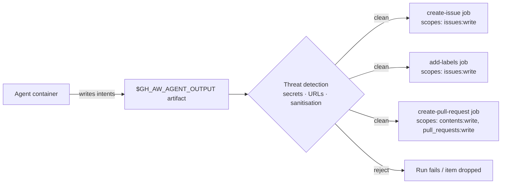

# Safe-Outputs Catalog

> _Based on gh-aw v0.61.0 · Last reviewed 2026-04_

Safe outputs are gh-aw's mechanism for letting an agent **propose** changes to your
repository (issues, PRs, comments, labels, releases, projects, …) while keeping the
write itself in a **separate, auditable post-processing job** with a tightly scoped
GitHub token. The agent never holds write credentials. This document catalogs every
built-in safe-output type and explains the cross-cutting features that protect them.

## TL;DR

- Safe-output **declarations** in frontmatter generate dedicated post-processing
  jobs. The agent emits structured intents into `$GH_AW_AGENT_OUTPUT`; the jobs
  read that artifact and call the GitHub API.
- Each safe-output type has a **default `max`** (e.g. `add-comment` defaults to
  1 per run); most are configurable.
- Most outputs accept `target-repo` to write cross-repository. Use
  `target-repo: "*"` for dynamic targeting plus `allowed-repos` as the guard.
- A **threat-detection** stage scans the artifact for secrets, disallowed URLs,
  and prompt-injection markers before any write happens.
- All gh-aw–created items carry a hidden marker
  `<!-- gh-aw-workflow-id: WORKFLOW_NAME -->` so future runs can find them.
- Three types are **auto-enabled** on every safe-outputs workflow: `noop`,
  `missing-tool`, `missing-data`.
- For custom user-defined post-processing (jobs / scripts / actions), see
  [19 — Custom Safe Outputs](./19-custom-safe-outputs.md).

## Key Concepts

| Term                       | Definition                                                                                          |
| -------------------------- | --------------------------------------------------------------------------------------------------- |
| **Safe output**            | A typed intent the agent emits, fulfilled by a separate job with scoped credentials.                |
| **Post-processing job**    | An auto-generated job in the lock workflow that reads `$GH_AW_AGENT_OUTPUT` and calls the API.      |
| **Threat detection**       | Pre-write scan of the agent artifact for secrets, prompt-injection, disallowed domains, etc.        |
| **Workflow-ID marker**     | An HTML comment embedded in created items identifying which workflow produced them.                 |
| **Protected files**        | Paths declared off-limits to agent edits with policy `blocked` / `allowed` / `fallback-to-issue`.   |
| **`target-repo`**          | Optional field to redirect a safe output to another repo (`"owner/repo"` or `"*"` for dynamic).     |
| **`allowed-repos`**        | Allowlist guarding `target-repo: "*"`; rejects writes to anything not matching.                     |



## Deep Dive

### 1. Issues & Discussions

| Type                | Default max | Notes                                                |
| ------------------- | ----------- | ---------------------------------------------------- |
| `create-issue`      | 1           | `title-prefix`, `labels`, `close-older-issues`, …    |
| `update-issue`      | 1           | Edit title, body, state                              |
| `close-issue`       | 1           | Close with reason                                    |
| `link-sub-issue`    | 1           | Link sub-issue (parent/child relationship)           |
| `create-discussion` | 1           | Category required                                    |
| `update-discussion` | 1           | Edit body / title                                    |
| `close-discussion`  | 1           | Close with reason                                    |

```yaml
safe-outputs:
  create-issue:
    title-prefix: "[triage] "
    labels: [needs-triage, ai-generated]
    close-older-issues: true       # close prior issues with same prefix
    target-repo: "myorg/triage"    # cross-repo
```

### 2. Pull Requests

| Type                                       | Default max          | Notes                                                                          |
| ------------------------------------------ | -------------------- | ------------------------------------------------------------------------------ |
| `create-pull-request`                      | 1 (configurable)     | Branch name, draft flag, labels, reviewers; supports `protected-files` policy  |
| `update-pull-request`                      | 1                    | Edit title/body                                                                |
| `close-pull-request`                       | 10                   | Close without merge                                                            |
| `create-pull-request-review-comment`       | 10                   | Inline code-line review comments                                               |
| `reply-to-pull-request-review-comment`     | 10                   | Reply within an existing review thread                                         |
| `resolve-pull-request-review-thread`       | 10                   | Mark thread resolved                                                           |
| `add-reviewer`                             | 3                    | Request user/team review                                                       |
| `push-to-pull-request-branch`              | 1 (configurable)     | **Same-repo only**; pushes commits onto an existing PR branch                  |

```yaml
safe-outputs:
  create-pull-request:
    draft: true
    labels: [ai-generated]
  create-pull-request-review-comment: {}
```

> [!WARNING]
> `push-to-pull-request-branch` only works against PR branches in the same
> repository. Cross-repo pushes are not supported.

### 3. Labels & Assignments

| Type                  | Default max | Notes                                       |
| --------------------- | ----------- | ------------------------------------------- |
| `add-comment`         | 1           | Adds a comment to the triggering issue/PR   |
| `hide-comment`        | 5           | Minimize a comment                          |
| `add-labels`          | 3           | Add labels to issue/PR                      |
| `remove-labels`       | 3           | Remove labels                               |
| `assign-milestone`    | 1           | Set milestone                               |
| `assign-to-agent`     | 1           | Assigns the **Copilot coding agent**        |
| `assign-to-user`      | 1           | Assigns a human user                        |
| `unassign-from-user`  | 1           | Removes user assignment                     |

### 4. Projects & Releases

| Type                            | Default max | Notes                                                                                  |
| ------------------------------- | ----------- | -------------------------------------------------------------------------------------- |
| `create-project`                | 1           | Cross-repo / org projects                                                              |
| `update-project`                | 10          | Edit project fields (same-repo)                                                        |
| `create-project-status-update`  | —           | Post a status update to a project                                                      |
| `update-release`                | 1           | Update an existing release                                                             |
| `upload-asset`                  | 10          | Asset uploaded to an **orphaned git branch**; prefer `upload-artifact` with `skip-archive` |

> [!NOTE]
> `upload-asset` stores assets on an orphaned branch (not in normal history)
> so they don't bloat your main branch tree.

### 5. Security & Agent Tasks

| Type                            | Default max | Notes                                                          |
| ------------------------------- | ----------- | -------------------------------------------------------------- |
| `dispatch-workflow`             | 3           | Trigger another workflow via `workflow_dispatch`               |
| `call-workflow`                 | 1           | **Compile-time fan-out** via reusable workflow                 |
| `dispatch_repository`           | —           | Cross-repo dispatch (experimental)                             |
| `create-code-scanning-alert`    | unlimited   | Emits SARIF (same-repo); surfaces in Code Scanning UI          |
| `autofix-code-scanning-alert`   | 10          | Submits a Dependabot/Code-Scanning autofix proposal            |
| `create-agent-session`          | 1           | Spawns a **Copilot coding agent session**                      |

### 6. Auto-enabled types

These are wired in automatically on every workflow that declares `safe-outputs:`:

| Type            | Default max | Purpose                                              |
| --------------- | ----------- | ---------------------------------------------------- |
| `noop`          | 1           | Log a successful "nothing to do" completion          |
| `missing-tool`  | unlimited   | Agent reports a tool it needed but did not have      |
| `missing-data`  | unlimited   | Agent reports data it needed but could not retrieve  |

You do not declare them; they are always available for the agent to emit.

### 7. Common per-output fields

Most built-in outputs accept the following knobs:

```yaml
safe-outputs:
  create-issue:
    title-prefix: "[ai] "
    labels: [automation]
    assignees: [user1, copilot]
    max: 5
    expires: 7d                # 7d / 2w / 1m / 1y / 2h / false
    group: true                # group as sub-issues under a parent
    close-older-issues: true
    group-by-day: true         # daily aggregation as comments
    target-repo: "owner/repo"  # OR "*" for dynamic targeting
    allowed-repos: ["org/*"]   # required guard when target-repo: "*"
    github-token: ${{ secrets.PAT }}
    protected-files: blocked   # blocked | allowed | fallback-to-issue (PR outputs)
```

`expires:` controls how long stale items (e.g. open issues from prior runs) remain
eligible for `close-older-issues` cleanup. Pass `false` to disable expiry.

### 8. Cross-repository safe outputs

To write into another repository, declare a token at the `safe-outputs` level
and either pin a `target-repo` per output or use `"*"` with an `allowed-repos`
guard:

```yaml
safe-outputs:
  github-token: ${{ secrets.CROSS_REPO_PAT }}
  create-issue:
    target-repo: "org/tracking-repo"
  add-comment:
    target-repo: "*"                       # decided at runtime
    allowed-repos: ["org/repo-a", "org/repo-b"]
```

Without `allowed-repos`, dynamic `target-repo: "*"` is rejected — you must
declare which repositories the agent may write to.

### 9. Protected files

Declare paths the agent must not modify. The policy controls how
`create-pull-request` and `push-to-pull-request-branch` react:

```yaml
safe-outputs:
  create-pull-request:
    protected-files: fallback-to-issue
```

| Policy               | Behaviour                                                                          |
| -------------------- | ---------------------------------------------------------------------------------- |
| `blocked` (default)  | Edit attempt is rejected; safe-output step fails.                                  |
| `allowed`            | Edit is allowed despite the path being declared (opt-in only).                     |
| `fallback-to-issue`  | Edit is converted to a `create-issue` describing the proposed change.              |

The protected list always includes dependency manifests, engine instruction
files (AGENTS.md, CLAUDE.md, `.claude/`, `.codex/`), `.github/`, `.agents/`,
and `CODEOWNERS`.

### 10. Workflow-ID markers

Every created item embeds an HTML comment:

```html
<!-- gh-aw-workflow-id: my-triage-workflow -->
```

This lets a workflow find prior runs' outputs (e.g. for `close-older-issues`).

### 11. Custom safe outputs (brief)

Beyond the built-in catalog above, gh-aw supports user-defined post-processing:

- `safe-outputs.jobs` — full GitHub Actions jobs the agent can invoke as MCP tools.
- `safe-outputs.scripts` — in-process JS handlers (no secret access).
- `safe-outputs.actions` — compile-time SHA-pinned action wrappers.

These are covered in detail in [19 — Custom Safe Outputs](./19-custom-safe-outputs.md).

## Examples

### `create-issue` from a daily scan

```yaml
---
on:
  schedule: daily around 9:00
safe-outputs:
  create-issue:
    title-prefix: "[scan] "
    labels: [security, ai-generated]
    close-older-issues: true
permissions:
  issues: write
---

# Daily Vulnerability Scan

Inspect dependencies and open one issue summarising findings.
```

### `add-comment` on a PR

```yaml
---
on:
  pull_request:
    types: [opened]
safe-outputs:
  add-comment: {}
permissions:
  pull-requests: write
---

# PR Welcome

Comment on the new PR thanking the contributor.
```

### `create-pull-request` from a refactor agent

```yaml
---
on: workflow_dispatch
safe-outputs:
  create-pull-request:
    draft: true
    labels: [refactor, ai-generated]
    protected-files: fallback-to-issue
permissions:
  contents: write
  pull-requests: write
---

# Auto-Refactor

Apply the refactor and open a draft PR.
```

### Cross-repo issue with dynamic targeting

```yaml
---
on: workflow_dispatch
safe-outputs:
  github-token: ${{ secrets.CROSS_REPO_PAT }}
  create-issue:
    target-repo: "*"
    allowed-repos: ["myorg/app", "myorg/infra"]
---

# Open Tracking Issue

Decide which repo to file the tracking issue against based on the input.
```

### `dispatch-workflow` chain

```yaml
---
on:
  slash_command: deploy
safe-outputs:
  dispatch-workflow:
    workflows:
      - "deploy-staging.yml"
      - "smoke-tests.yml"
permissions:
  actions: write
---

# Trigger Deploy Pipeline
```

## Pitfalls & FAQ

> [!WARNING]
> **Default maxes are not suggestions.** If your prompt instructs the agent to
> create 5 issues but you forgot to bump `max:`, only the first will be
> created.

> [!WARNING]
> **`push-to-pull-request-branch` is same-repo only.** Cross-repo PR branch
> pushes are not allowed by GitHub's API model.

> [!WARNING]
> **`target-repo: "*"` requires `allowed-repos`.** The compiler rejects
> dynamic targeting without a guard list.

> [!TIP]
> Use the workflow-ID marker plus `close-older-issues: true` to make a
> recurring report self-clean: each run closes the last and opens a new one.

**Q: What if threat detection rejects part of my output?**
The offending items are dropped or the run is failed depending on type. The
artifact log shows which sanitisation rule fired.

**Q: How do I write to multiple repos?**
Set `safe-outputs.github-token` and either pin `target-repo` per output or use
`target-repo: "*"` with `allowed-repos`.

**Q: Is `create-code-scanning-alert` really unlimited?**
Yes — SARIF uploads are batched, so there's no per-item ceiling. GitHub may
still cap total SARIF size.

**Q: Can the agent see the post-processing job's logs?**
No. Each safe-output job runs after the agent finishes; results aren't fed
back unless you wire a follow-up workflow.

## Related Docs

- [Architecture & Security Model](./01-architecture-and-security.md)
- [Frontmatter Reference](./03-frontmatter-reference.md)
- [Engines & Models](./02-engines.md)
- [Triggers & Scheduling](./04-triggers-and-scheduling.md)
- [Tools & MCP](./05-tools-and-mcp.md)
- [Custom Safe Outputs](./19-custom-safe-outputs.md)
