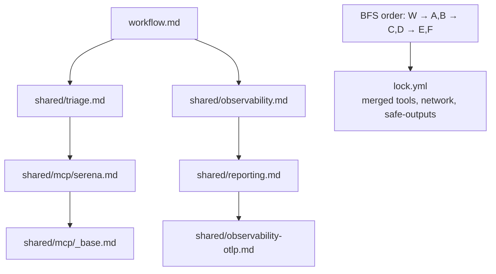

# 09 — インポートと共有コンポーネント

> _Based on gh-aw v0.61.0 · Last reviewed 2026-04_

リポジトリの最初のエージェント型ワークフローは職人芸的な一品物です。3 つ目は 2 つ目からのコピペです。10 個目はメンテナンスの悪夢です。gh-aw の **インポート** システムは、共有部分 — MCP サーバー設定、ツール付与、脅威検出プロンプト、組織横断ポリシー — を再利用可能なコンポーネントに切り出し、パラメータ化し、エージェント型ワークフローを書く楽しさを生んでいる単一ファイルの可読性を失わずに多くのワークフローに引き込めるようにするために存在します。

## TL;DR

- インポート構文は 2 つ: frontmatter `imports:` (宣言的、ツール/ポリシーに最適) と本文中の `{{#import path/to/file.md}}` (プロンプト断片に最適)。
- `on:` フィールドを持たない markdown ファイルは *共有コンポーネント* — バリデーションされますが、決してワークフローファイルへコンパイルされません。
- 慣習: 共有ファイルは `.github/workflows/shared/` 以下に置きます。
- パスは **相対**、**絶対** (`.github/...`)、**クロスリポ** (`owner/repo/path@ref`) として解決されます。
- **パラメータ化されたインポート**: `with:` で入力を渡し、消費側は型付きの `import-schema:` を宣言します。
- 同じファイルはインポートグラフ内に最大 **1 回** しか現れません。同一の入力は重複排除、競合する入力はコンパイルエラー。
- 解決は **幅優先 (BFS)**。インポート由来のツールと設定は最終ワークフローに統合されます。

## Key Concepts

| 概念 | 内容 |
|---|---|
| **共有コンポーネント** | `on:` を持たない markdown ファイル。インポート可能で、単独では動作しない |
| **frontmatter import** | YAML frontmatter 内の `imports:` 配列 |
| **body import** | markdown 本文中の `{{#import path/to/file.md}}` ディレクティブ |
| **相対パス** | インポート元ファイルのディレクトリを基準に解決 |
| **絶対パス** | `.github/` または `/` で始まり、レポルートから解決 |
| **クロスリポ参照** | `owner/repo/path@ref` (commit SHA、ブランチ、タグ) |
| **パラメータ化インポート** | インポート先に入力を渡す `with:` ブロック |
| **`import-schema:`** | 共有コンポーネントで宣言される型付きパラメータ契約 |
| **single-import 制約** | 各ファイルはグラフ内に最大 1 回。同入力は重複排除、異入力はエラー |
| **BFS 解決** | インポートを幅優先で解決。`tools:` はすべてのインポート間で統合 |

## Deep Dive

### 1. 2 つのインポート構文、2 つの目的

**frontmatter `imports:`** — `tools:`、`network:`、`safe-outputs:`、`mcp-servers:` のような構造的な貢献に最適。インポートされたファイルの frontmatter がインポート元ワークフローにマージされます。

```yaml
---
on: workflow_dispatch
imports:
  - shared/common-tools.md
  - shared/network-policies.md
---
```

**body `{{#import …}}`** — プロンプト断片、再利用可能な指示、ペルソナ定義に最適。インポートされたファイルの本文がディレクティブの位置にスプライスされます。

```markdown
# Triage workflow

{{#import shared/prompts/triage-persona.md}}

Read the new issue and propose labels.
```

両者は自由に組み合わせられます。

### 2. 共有コンポーネント: `on:` のないワークフロー

markdown ファイルは `on:` トリガーを持つとき **ワークフロー** です。`on:` を外せば、それは **共有コンポーネント** になります — コンパイラは検証はしますが `lock.yml` は出しません。情報メッセージが表示されます:

```text
ℹ shared/common-tools.md: no `on:` field, treated as shared component (not compiled).
```

慣習として、これらは `.github/workflows/shared/` 以下に置きます。コンパイラが要求するわけではありません。慣習が存在するのは、`.github/workflows/` を流し読みする人間が「本物のワークフロー」と「ライブラリファイル」を即座に区別できるようにするためです。

### 3. パス解決

3 つのモード、順に評価:

1. **相対パス** — `.github/`、`/`、または `owner/repo/…@…` のように見える接頭辞 *以外* で始まるもの。インポート元ファイルのディレクトリを基準に解決。デフォルトの `--dir .github/workflows` では:
   - `shared/common-tools.md` → `.github/workflows/shared/common-tools.md`
   - `../agents/helper.md` → `.github/agents/helper.md`
2. **絶対パス** — `.github/` または `/` で始まる。レポルートから解決。
3. **クロスリポ参照** — `owner/repo/path@ref`。コンパイラは指定された ref で参照先レポからファイルを取得します。

```yaml
imports:
  - shared/common-tools.md                       # relative
  - .github/policies/min-integrity.md            # absolute
  - yourorg/aw-shared/policies/triage.md@v1.2.0  # cross-repo
```

> [!TIP]
> クロスリポインポートは常にタグまたは commit SHA にピン止めしてください。`@main` 参照はコンパイル間で変わり得ます。

### 4. パラメータ化されたインポート

共有コンポーネントは `import-schema:` で型付きのパラメータ契約を宣言できます。消費側は `with:` で値を渡します。

```yaml
# shared/mcp/serena.md
---
import-schema:
  languages:
    type: array
    items: { type: string }
    required: true
  max-tokens:
    type: number
    default: 8000
mcp-servers:
  serena:
    command: serena
    args:
      - --langs
      - "${{ join(github.aw.import-inputs.languages, ',') }}"
      - --max-tokens
      - "${{ github.aw.import-inputs.max-tokens }}"
---
```

```yaml
# importing workflow
imports:
  - uses: shared/mcp/serena.md
    with:
      languages: ["go", "typescript"]
```

`uses:` は `path:` のエイリアス、`with:` は `inputs:` のエイリアスです。好きな表記を使ってください。多くのチームは GitHub Actions との視覚的対称性のため `uses`/`with` を選びます。

### 5. `import-schema:` 型システム

サポートされるフィールド型とそのオプション:

| 型 | オプション | 備考 |
|---|---|---|
| `string` | `default`, `required` | プレーン文字列 |
| `number` | `default`, `required` | 整数または浮動小数 |
| `boolean` | `default`, `required` | `true`/`false` |
| `choice` | `options:` (リスト), `default`, `required` | 列挙型 |
| `array` | `items.type`, `default`, `required` | 要素型を検証 |
| `object` | `properties:`, `default`, `required` | ネストしたスキーマ |

値は frontmatter でも本文でも `${{ github.aw.import-inputs.<key> }}` で参照します。オブジェクトのサブフィールドはドット記法を使います:

```yaml
import-schema:
  config:
    type: object
    properties:
      apiKey: { type: string, required: true }
      timeout: { type: number, default: 30 }
```

```yaml
mcp-servers:
  partner:
    env:
      API_KEY: "${{ github.aw.import-inputs.config.apiKey }}"
      TIMEOUT: "${{ github.aw.import-inputs.config.timeout }}"
```

コンパイル時バリデーションが捕捉するもの:
- 必須フィールドの欠落
- `choice` の `options` 外の値
- 配列要素の型違い
- オブジェクトプロパティの欠落・余剰
- `with:` 内の **未知のキー** (タイポガード)

### 6. single-import 制約

ある特定のファイルは、解決済みインポートグラフに最大 1 回しか現れません。

- **同一ファイル + 同一の `with:`** → 暗黙に重複排除 (エラーなし、1 回のインクルード)。
- **同一ファイル + 異なる `with:`** → コンパイル時エラー。同じ共有コンポーネントを 1 つのワークフロー内で異なるパラメータで 2 回インポートすることはできません。

```text
✗ shared/mcp/serena.md is imported twice with different inputs:
    workflow.md             with: { languages: ["go"] }
    shared/triage.md        with: { languages: ["python"] }
  Resolve by parameterizing the consumer or splitting the shared file.
```

このルールはマージ意味論を決定論的に保ち、「どの言語リストが勝ったの?」という微妙なバグを防ぎます。

### 7. BFS 解決とマージ

インポートはルートワークフローから **幅優先 (BFS)** に解決されます。各レベルでコンパイラは:

1. 各インポートファイルをロード。
2. 提供された `with:` に対して `import-schema:` を検証。
3. その frontmatter を作業セットへマージ (tools が結合、network エントリが union、safe-outputs が結合)。
4. そのファイル自身のインポートを次の BFS レベルへキュー。



マージは構造的な union です。`tools.github.allowed:` 項目を貢献する 2 つのインポートは、lock ファイル内で重複排除された単一の許可リストを生みます。

### 8. バンドルされた共有コンポーネント

共有コンポーネント自身を組み合わせることもできます。よくあるパターン:

```yaml
# shared/reporting-otlp.md
---
imports:
  - shared/reporting.md
  - shared/observability-otlp.md
---
```

これで消費側は単一の `shared/reporting-otlp.md` をインポートするだけで両方を推移的に取り込めます。

## Examples

### Example 1 — 再利用可能な MCP ラッパー

```yaml
# .github/workflows/shared/mcp/tavily.md
---
import-schema:
  api-key-secret:
    type: string
    default: TAVILY_API_KEY
  max-results:
    type: number
    default: 5
mcp-servers:
  tavily:
    command: npx
    args: ["-y", "@tavily/mcp-server"]
    env:
      TAVILY_API_KEY: "${{ secrets[github.aw.import-inputs.api-key-secret] }}"
      MAX_RESULTS: "${{ github.aw.import-inputs.max-results }}"
---
```

```yaml
# .github/workflows/research.md
---
on: workflow_dispatch
engine: copilot
imports:
  - uses: shared/mcp/tavily.md
    with:
      max-results: 10
safe-outputs:
  create-issue:
---

# Research the topic and open an issue with findings.
```

### Example 2 — クロスリポインポートで組織横断ポリシー

```yaml
imports:
  - yourorg/aw-shared/policies/min-integrity-collaborator.md@v3.0.1
  - yourorg/aw-shared/policies/network-defaults.md@v3.0.1
```

共有 org レポを中央で更新でき、消費側は ref を上げて `gh aw compile` で再ピンします。

### Example 3 — パラメータ化されたデプロイテンプレート

```yaml
# shared/deploy.md
---
import-schema:
  environment:
    type: choice
    options: [staging, production]
    required: true
  region:
    type: string
    default: us-east-1
tools:
  bash: {}
network:
  allowed: [defaults, github, containers]
---

Deploy to **${{ github.aw.import-inputs.environment }}** in **${{ github.aw.import-inputs.region }}**.
```

```yaml
# .github/workflows/deploy-staging.md
---
on: workflow_dispatch
imports:
  - uses: shared/deploy.md
    with:
      environment: staging
---
```

### Example 4 — プロンプト断片の body-import

```markdown
# .github/workflows/triage.md
---
on:
  issues: { types: [opened] }
imports:
  - shared/common-tools.md
---

# Triage Bot

{{#import shared/prompts/persona.md}}

{{#import shared/prompts/labels-rubric.md}}

Read the new issue and apply labels.
```

### Example 5 — 二重インポートできない競合

```yaml
# Will fail to compile
imports:
  - uses: shared/mcp/serena.md
    with: { languages: ["go"] }
  - uses: shared/mcp/serena.md
    with: { languages: ["python"] }
```

解決策: 消費側のレベルでパラメータ化する、または `shared/mcp/serena-go.md` と `shared/mcp/serena-python.md` に分割する。

## Pitfalls & FAQ

> [!WARNING]
> **クロスリポインポートで `@main` を使わないでください。** タグまたは commit SHA にピン止めしてください。strict モードは実際に GitHub Actions の SHA ピン止めを要求します — 同じ衛生をインポートにも適用してください。

> [!TIP]
> 同じコンポーネントを異なるパラメータでインポートしたくなったら、それは 1 段階上でパラメータ化するか、コンポーネントを分割するシグナルです。

> [!NOTE]
> 任意のインポートの `@ref` を上げたら `gh aw compile` を実行して、lock ファイルが新しい解決済みコンテンツを反映するようにしてください。

**Q: インポート元のワークフローはインポート内の値を上書きしますか?**
マージは union であり、上書きではありません。両方で同じキーが設定されているスカラーフィールドではインポート元のワークフローが勝ちます。リスト/マップフィールド (tools, allowed domains) ではエントリが union され、重複排除されます。

**Q: 複数のレポにまたがってコンポーネントを共有するにはどうしますか?**
専用の共有レポ (例: `yourorg/aw-shared`) に置き、クロスリポ参照を使います。リリースをタグ付けし、消費側をピン止めしてください。

**Q: 共有コンポーネント自身がインポートを宣言できますか?**
はい。BFS が推移的に解決します。single-import 制約に注意: 直接インポートと推移的インポートが同じファイルを異なる `with:` で取り込むと、コンパイルエラーになります。

**Q: 共有コンポーネント内のシークレットはどうしますか?**
常に `${{ secrets.NAME }}` を使ってください — シークレット名はスキーマの一部、値は消費側のレポにあります。シークレット値を共有コンポーネントにハードコードせず、シークレット様のコンテンツを持つ共有コンポーネントを公開リポにチェックインしないでください。

**Q: マージ結果はどこで見られますか?**
ソース `.md` の隣に生成される `lock.yml` が完全に解決された形です。`gh aw compile` 後にこれを読むのが、予期しないマージをデバッグする最良の方法です。

**Q: 深さ制限はありますか?**
ハードな制限はありませんが、BFS のおかげで深いグラフでも検証は安価です。実世界で見たことのある最深のグラフは実用上 3〜4 階層です。

## Related Docs

- [Safe Outputs Catalog](./06-safe-outputs-catalog.md)
- [AWF Firewall & Sandbox](./07-awf-firewall-and-sandbox.ja.md)
- [Threat Detection & XPIA](./08-threat-detection-and-xpia.ja.md)
- [`gh aw` CLI Reference](../gh-aw-cli-reference.md)
