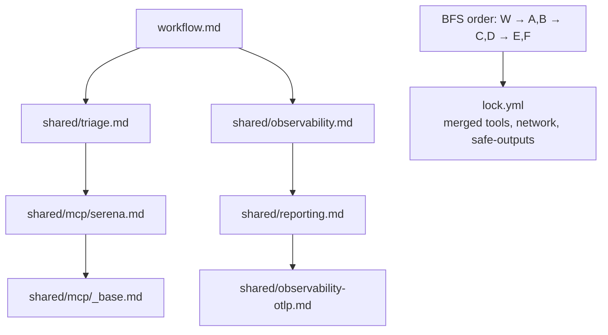

# 09 — Imports & Shared Components

> _Based on gh-aw v0.61.0 · Last reviewed 2026-04_

A repo's first agentic workflow is an artisanal one-off. The third one is copy-pasted from the second. The tenth one is a maintenance nightmare. gh-aw's **imports** system exists so that you can extract the shared parts — MCP server config, tool grants, threat-detection prompts, org-wide policies — into reusable components, parameterize them, and pull them into many workflows without losing the single-file readability that makes agentic workflows pleasant to write.

## TL;DR

- Two import syntaxes: frontmatter `imports:` (declarative, good for tools/policies) and `{{#import path/to/file.md}}` in the body (good for prompt fragments).
- A markdown file with **no `on:` field** is a *shared component* — validated but never compiled to a workflow file.
- Convention: put shared files under `.github/workflows/shared/`.
- Paths are resolved as **relative**, **absolute** (`.github/...`), or **cross-repo** (`owner/repo/path@ref`).
- **Parameterized imports**: pass `with:` inputs; consumers declare a typed `import-schema:`.
- A file may appear at most **once** per import graph; identical inputs deduplicate, conflicting inputs are a compile error.
- Resolution is **breadth-first**; tools and configs from imports are merged into the final lock file.

## Key Concepts

| Concept | What it is |
|---|---|
| **Shared component** | Markdown file without `on:`; importable, never standalone |
| **Frontmatter import** | `imports:` array in YAML frontmatter |
| **Body import** | `{{#import path/to/file.md}}` directive in markdown body |
| **Relative path** | Resolved against importing file's directory |
| **Absolute path** | Starts with `.github/` or `/`; resolved from repo root |
| **Cross-repo ref** | `owner/repo/path@ref` (commit SHA, branch, or tag) |
| **Parameterized import** | `with:` block supplying inputs to the imported file |
| **`import-schema:`** | Typed parameter contract declared in shared component |
| **Single-import constraint** | Each file at most once in graph; same inputs dedupe, different inputs error |
| **BFS resolution** | Imports resolved breadth-first; `tools:` merged across all imports |

## Deep Dive

### 1. Two import syntaxes, two purposes

**Frontmatter `imports:`** — best for structured contributions like `tools:`, `network:`, `safe-outputs:`, `mcp-servers:`. The imported file's frontmatter merges into the importing workflow.

```yaml
---
on: workflow_dispatch
imports:
  - shared/common-tools.md
  - shared/network-policies.md
---
```

**Body `{{#import …}}`** — best for prompt fragments, reusable instructions, persona definitions. The imported file's body content is spliced in at the directive's location.

```markdown
# Triage workflow

{{#import shared/prompts/triage-persona.md}}

Read the new issue and propose labels.
```

The two can be combined freely.

### 2. Shared components: workflows without an `on:`

A markdown file is a **workflow** when it has an `on:` trigger. Drop the `on:` and it becomes a **shared component** — the compiler validates it but does not emit a `lock.yml` for it. You will see an informational message:

```text
ℹ shared/common-tools.md: no `on:` field, treated as shared component (not compiled).
```

By convention, put these under `.github/workflows/shared/`. The compiler does not require it; the convention exists so that humans skimming `.github/workflows/` can immediately distinguish "real workflows" from "library files."

### 3. Path resolution

Three modes, evaluated in order:

1. **Relative paths** — anything that does *not* start with `.github/`, `/`, or look like `owner/repo/…@…`. Resolved against the importing file's directory. With the default `--dir .github/workflows`, that yields:
   - `shared/common-tools.md` → `.github/workflows/shared/common-tools.md`
   - `../agents/helper.md` → `.github/agents/helper.md`
2. **Absolute paths** — start with `.github/` or `/`. Resolved from the repo root.
3. **Cross-repo refs** — `owner/repo/path@ref`. The compiler fetches the file from the referenced repo at the given ref.

```yaml
imports:
  - shared/common-tools.md                       # relative
  - .github/policies/min-integrity.md            # absolute
  - yourorg/aw-shared/policies/triage.md@v1.2.0  # cross-repo
```

> [!TIP]
> Always pin cross-repo imports to a tag or commit SHA. A `@main` reference can change under you between compiles.

### 4. Parameterized imports

A shared component can declare a typed parameter contract via `import-schema:`. Consumers pass values with `with:`.

```yaml
# shared/mcp/serena.md
---
import-schema:
  languages:
    type: array
    items: { type: string }
    required: true
  max-tokens:
    type: number
    default: 8000
mcp-servers:
  serena:
    command: serena
    args:
      - --langs
      - "${{ join(github.aw.import-inputs.languages, ',') }}"
      - --max-tokens
      - "${{ github.aw.import-inputs.max-tokens }}"
---
```

```yaml
# importing workflow
imports:
  - uses: shared/mcp/serena.md
    with:
      languages: ["go", "typescript"]
```

`uses:` is an alias for `path:`; `with:` is an alias for `inputs:`. Use whichever spelling you prefer; many teams pick `uses`/`with` for visual symmetry with GitHub Actions.

### 5. The `import-schema:` type system

Supported field types and their options:

| Type | Options | Notes |
|---|---|---|
| `string` | `default`, `required` | Plain string |
| `number` | `default`, `required` | Integer or float |
| `boolean` | `default`, `required` | `true`/`false` |
| `choice` | `options:` (list), `default`, `required` | Enum |
| `array` | `items.type`, `default`, `required` | Validates element types |
| `object` | `properties:`, `default`, `required` | Nested schema |

Reference values via `${{ github.aw.import-inputs.<key> }}` in either frontmatter or body. Object sub-fields use dotted notation:

```yaml
import-schema:
  config:
    type: object
    properties:
      apiKey: { type: string, required: true }
      timeout: { type: number, default: 30 }
```

```yaml
mcp-servers:
  partner:
    env:
      API_KEY: "${{ github.aw.import-inputs.config.apiKey }}"
      TIMEOUT: "${{ github.aw.import-inputs.config.timeout }}"
```

Compile-time validation catches:
- Missing required fields
- `choice` values outside `options`
- Array elements of the wrong type
- Object properties missing or extra
- **Unknown keys** in `with:` (typo guard)

### 6. The single-import constraint

A given file appears at most once in the resolved import graph.

- **Same file, identical `with:`** → silently deduplicated (no error, single inclusion).
- **Same file, different `with:`** → compile-time error. You cannot import the same shared component twice with different parameters in one workflow.

```text
✗ shared/mcp/serena.md is imported twice with different inputs:
    workflow.md             with: { languages: ["go"] }
    shared/triage.md        with: { languages: ["python"] }
  Resolve by parameterizing the consumer or splitting the shared file.
```

This rule keeps the merge semantics deterministic and prevents subtle "which language list won?" bugs.

### 7. BFS resolution and merging

Imports are resolved **breadth-first** from the root workflow. At each level, the compiler:

1. Loads each imported file.
2. Validates its `import-schema:` against the supplied `with:`.
3. Merges its frontmatter into the working set (tools combine, network entries union, safe-outputs combine).
4. Queues that file's own imports for the next BFS level.



The merge is a structural union: two imports each contributing `tools.github.allowed:` items produce a single deduplicated allowlist in the lock file.

### 8. Bundled shared components

You can compose shared components themselves. A common pattern:

```yaml
# shared/reporting-otlp.md
---
imports:
  - shared/reporting.md
  - shared/observability-otlp.md
---
```

Now consumers import a single `shared/reporting-otlp.md` and pull in both pieces transitively.

## Examples

### Example 1 — Reusable MCP wrapper

```yaml
# .github/workflows/shared/mcp/tavily.md
---
import-schema:
  api-key-secret:
    type: string
    default: TAVILY_API_KEY
  max-results:
    type: number
    default: 5
mcp-servers:
  tavily:
    command: npx
    args: ["-y", "@tavily/mcp-server"]
    env:
      TAVILY_API_KEY: "${{ secrets[github.aw.import-inputs.api-key-secret] }}"
      MAX_RESULTS: "${{ github.aw.import-inputs.max-results }}"
---
```

```yaml
# .github/workflows/research.md
---
on: workflow_dispatch
engine: copilot
imports:
  - uses: shared/mcp/tavily.md
    with:
      max-results: 10
safe-outputs:
  create-issue:
---

# Research the topic and open an issue with findings.
```

### Example 2 — Org-wide policy via cross-repo import

```yaml
imports:
  - yourorg/aw-shared/policies/min-integrity-collaborator.md@v3.0.1
  - yourorg/aw-shared/policies/network-defaults.md@v3.0.1
```

The shared org repo can be updated centrally; consumers re-pin via `gh aw compile` after bumping the ref.

### Example 3 — Parameterized deployment template

```yaml
# shared/deploy.md
---
import-schema:
  environment:
    type: choice
    options: [staging, production]
    required: true
  region:
    type: string
    default: us-east-1
tools:
  bash: {}
network:
  allowed: [defaults, github, containers]
---

Deploy to **${{ github.aw.import-inputs.environment }}** in **${{ github.aw.import-inputs.region }}**.
```

```yaml
# .github/workflows/deploy-staging.md
---
on: workflow_dispatch
imports:
  - uses: shared/deploy.md
    with:
      environment: staging
---
```

### Example 4 — Body-import for prompt fragments

```markdown
# .github/workflows/triage.md
---
on:
  issues: { types: [opened] }
imports:
  - shared/common-tools.md
---

# Triage Bot

{{#import shared/prompts/persona.md}}

{{#import shared/prompts/labels-rubric.md}}

Read the new issue and apply labels.
```

### Example 5 — Conflict you cannot import twice

```yaml
# Will fail to compile
imports:
  - uses: shared/mcp/serena.md
    with: { languages: ["go"] }
  - uses: shared/mcp/serena.md
    with: { languages: ["python"] }
```

Resolution: parameterize at the consumer level, or split into `shared/mcp/serena-go.md` and `shared/mcp/serena-python.md`.

## Pitfalls & FAQ

> [!WARNING]
> **Don't use `@main` for cross-repo imports.** Pin to a tag or commit SHA. Strict mode actually requires SHA pinning of GitHub Actions — apply the same hygiene to your imports.

> [!TIP]
> If you find yourself wanting to import the same component with different parameters, that is a signal to either parameterize one level higher or split the component.

> [!NOTE]
> Run `gh aw compile` after bumping any import's `@ref` so the lock files reflect the new resolved content.

**Q: Does the importing workflow override values in imports?**
The merge is a union, not an override. For scalar fields where the same key is set in both places, the importing workflow wins. For list/map fields (tools, allowed domains), entries are unioned and deduplicated.

**Q: How do I share a component across multiple repos?**
Put it in a dedicated shared repo (e.g., `yourorg/aw-shared`) and use cross-repo refs. Tag releases and pin consumers.

**Q: Can a shared component declare its own imports?**
Yes. BFS resolves transitively. Watch out for the single-import constraint: if your direct imports and a transitive import both pull in the same file with different `with:`, you get a compile error.

**Q: What about secrets in shared components?**
Always use `${{ secrets.NAME }}` — the secret name is part of the schema, the value lives in the consuming repo. Never hard-code secret values into shared components, and never check shared components into a public repo with secret-like content.

**Q: Where do I see the merged result?**
The generated `lock.yml` next to the source `.md` is the fully resolved form. Reading it after `gh aw compile` is the best way to debug an unexpected merge.

**Q: Is there a depth limit?**
No hard limit, but BFS makes deep graphs cheap to validate. In practice the deepest real-world graphs we have seen are 3–4 levels.

## Related Docs

- [Safe Outputs Catalog](./06-safe-outputs-catalog.md)
- [AWF Firewall & Sandbox](./07-awf-firewall-and-sandbox.md)
- [Threat Detection & XPIA](./08-threat-detection-and-xpia.md)
- [`gh aw` CLI Reference](../gh-aw-cli-reference.md)
