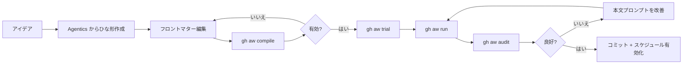

# ワークフロー作成クックブック

> _gh-aw v0.61.0 を基準 · 最終確認 2026-04_

GitHub Agentic Workflows を実装するための、レシピ駆動の実践ガイドです。本クックブックには、[`githubnext/agentics`](https://github.com/githubnext/agentics) コレクションおよび本リポジトリ同梱のワークフロー（[`daily-repo-status.md`](../../.github/workflows/daily-repo-status.md)、[`github-changelog-summary.md`](../../.github/workflows/github-changelog-summary.md) など）から抽出した、本番運用に耐える 10 のパターンを収録しています。`.github/workflows/` 配下に新しい `.md` ワークフローを作成するときの出発点として活用してください。

---

## TL;DR

- **ワークフローは 1 つの Markdown ファイル**であり、YAML フロントマターと自然言語の本文で構成されます。フロントマターは*何が許可されているか*を、本文は*何を行うべきか*を記述します。
- 反復は高速です: **書く → `gh aw compile` → `gh aw run` → `gh aw audit <run-id>` → 改善**。再コンパイルが必要なのはフロントマター変更時のみで、本文プロンプトは実行間に `github.com` 上で直接編集できます。
- 白紙から始めないでください。**[Agentics コレクション](https://github.com/githubnext/agentics) からレシピを取得**して `gh aw new <name> --source githubnext/agentics/workflows/<name>.md` でひな形を作り、そこからカスタマイズします。
- 3 つの原則を意識してください: (1) **権限は何が可能かを決める**、(2) **プロンプトは何をするかを決める**、(3) **safe-outputs は何を書き込めるかを決める** — エージェント本体から直接書き込みは行いません。



---

## 主要コンセプト

### 作者の思考モデル

優れたワークフロー作者と挫折する作者を分けるのは、次の 2 つの視点の切り替えです。

1. **「権限は何が可能かを、プロンプトは何をするかを記述する」**
   フロントマターは*能力の表面*、本文は*意図*です。エージェントはフロントマターで許可された範囲でしか動けず、かつ本文で要求されたことしか試みません。両者が噛み合っていないと、「Agent has no tools available」（能力ミスマッチ）や使われない権限（意図ミスマッチ）が発生します。

2. **「safe-outputs だけがエージェントの書き込み手段である」**
   エージェント本体は読み取り専用で実行されます。すべての副作用（issue、コメント、PR、ブランチ、ラベル、dispatch）は `safe-outputs:` ブロックを経由し、エージェント終了後に分離されたスコープ付きジョブとして実行されます。これがプロンプトインジェクションに耐える鍵です。

### 標準の 6 ブロック構造

整った構造のワークフローは、いずれも次の 6 つの論理ブロックを持ちます。

| ブロック | 目的 | 例 |
| ----- | ------- | ------- |
| `on:` | トリガー | `schedule: daily`、`slash_command: { name: review }` |
| `permissions:` | GitHub トークンのスコープ | `contents: read`、`issues: read` |
| `tools:` / `mcp-servers:` | エージェントが呼び出せるもの | `github: { toolsets: [issues] }`、`web-fetch:` |
| `safe-outputs:` | エージェントが書き込めるもの | `create-issue:`、`add-comment:` |
| `engine:` | 利用するモデル | `copilot`、`claude`、`codex` |
| body | 自然言語の指示 | `# Title \n ## Process \n 1. ...` |

すべてのファイルでこの順序を守ってください。レビュアーも `gh aw audit` のトレースもありがたく感じます。

### 共有コンポーネントを切り出す判断基準

`shared/foo.md` のインポートに切り出すのは、**2 つ以上のワークフロー**が以下を繰り返している場合のみです。
- `mcp-servers:` ブロック（社内 OTLP エンドポイントなど）
- プロンプト断片（Style ガイドブロックなど）
- ネットワーク許可リスト（社内レジストリのドメインなど）

先回りして切り出さないでください。Agentics コレクションでは 3 回目の利用まで待ちます。

---

## ディープダイブ — レシピ集

すべてのレシピで同じテンプレートを使います。

> **トリガー** · **フロントマター骨格** · **主要なプロンプトパターン** · **想定する safe-outputs** · **注意点**

---

### レシピ 1 — Issue オープン時の自動トリアージ

**ユースケース:** 新規 issue を内容に応じて自動ラベル付けし、丁寧な確認コメントを投稿します。

**トリガー:** `issues: types: [opened]`

```yaml
---
on:
  issues:
    types: [opened]

permissions:
  contents: read
  issues: read

tools:
  github:
    toolsets: [issues]

safe-outputs:
  add-labels:
    max: 5
    allowed: [bug, enhancement, question, documentation, good-first-issue]
  add-comment:
    max: 1

engine: copilot
---

# Triage New Issue

Read the new issue body and title. Decide which labels apply (from the allowed
set) and post a single welcoming comment that paraphrases the request and
states next steps.

## Process

1. Read `${{ github.event.issue.number }}`.
2. Choose at most 3 labels from the allowed set.
3. Post one comment of 3–5 sentences. Use a friendly, professional tone.
4. Do not mention the agent or this workflow.
```

**注意点:**
- `add-labels.allowed:` は**必須**です。指定がないと任意のラベルが作成可能となり、strict モードのコンパイラが警告を出します。
- エージェント自身に issue への `write` 権限はありません。ラベルは*labels* ジョブが付与します。

---

### レシピ 2 — オンデマンド PR レビュア（`/review`）

**ユースケース:** レビュアーが PR で `/review` とコメントすると、構造化されたレビューが投稿されます。

**トリガー:** `slash_command: { name: review, events: [pull_request_review_comment] }`

```yaml
---
on:
  slash_command:
    name: review
    events: [pull_request_review_comment, issue_comment]

permissions:
  contents: read
  pull-requests: read

tools:
  github:
    toolsets: [repos, pull_requests]

safe-outputs:
  create-pull-request-review-comment:
    max: 20
  add-comment:
    max: 1

engine: claude
---

# Opinionated PR Review

Review the pull request that triggered this command.

## Style

- Be terse. One observation per comment.
- Cite line numbers explicitly using the `path:line` form.
- Do not nitpick formatting handled by linters.

## Process

1. Read the PR diff via `get_pull_request_files`.
2. For each file, decide if there are **bugs**, **security issues**, or
   **logic errors**. Skip style.
3. Post each finding as a `create-pull-request-review-comment`.
4. Post one summary `add-comment` with: total findings, biggest concern,
   merge-ready verdict.
```

**注意点:**
- スラッシュコマンド系ワークフローでは `status-comment: true` が自動的に有効化されます。本文で「開始しました…」と二重投稿しないでください。
- `create-pull-request-review-comment` には正しい `commit_id`、`path`、`line` が必要です。エージェントは `get_pull_request_files` から取得します。エンジンが苦戦するなら `max:` を控えめに上げ、Process の手順を厳しくしてください。

---

### レシピ 3 — 日次リポジトリステータスレポート

**ユースケース:** クローズ可能な GitHub issue として投稿されるスケジュール式の健康診断です。（このリポジトリの [`daily-repo-status.md`](../../.github/workflows/daily-repo-status.md) がまさにこれを行っています。）

**トリガー:** `schedule: daily`

```yaml
---
on:
  schedule: daily
  workflow_dispatch:

permissions:
  contents: read
  issues: read
  pull-requests: read

tools:
  github:
    lockdown: false

safe-outputs:
  mentions: false
  allowed-github-references: []
  create-issue:
    title-prefix: "[repo-status] "
    labels: [report, daily-status]
    close-older-issues: true

engine: copilot
---

# Daily Repo Status

Create an upbeat daily status report for the repo as a GitHub issue.

## What to include

- Recent activity (issues, PRs, discussions, releases, code changes)
- Progress tracking, highlights, recommendations
- Actionable next steps for maintainers

## Style

- Be positive 🌟. Use emojis sparingly.
- Keep it concise — adjust length to actual activity.
```

**注意点:**
- `close-older-issues: true` が肝で、issue トラッカーが古いレポートで埋め尽くされるのを防ぎます。新しい実行が過去の `[repo-status] …` issue をクローズします。
- `mentions: false` と `allowed-github-references: []` は、エージェントの本文に紛れ込んだ偶発的な `@user` や `#1234` の相互参照を無効化します。
- `lockdown: false` は**公開**リポジトリでのみ意味を持ち、エージェントが第三者のコメントを読めるようにします。プライベートリポジトリでは効果はありません。

---

### レシピ 4 — 週次 Web リサーチ

**ユースケース:** 外部ページを週 1 回クロールして要約します。([`github-changelog-summary.md`](../../.github/workflows/github-changelog-summary.md) を参照。)

**トリガー:** `schedule: weekly on monday around 9am`

```yaml
---
on:
  schedule: weekly on monday around 9am
  workflow_dispatch:

permissions:
  contents: read
  issues: read

tools:
  web-fetch:
  github:
    toolsets: [repos, issues]

network:
  allowed:
    - defaults
    - github

safe-outputs:
  create-issue:
    title-prefix: "[changelog] "
    labels: [github-changelog, weekly-summary]
    close-older-issues: true

engine: copilot
---

# Weekly Industry Research

Fetch <https://example.com/blog> and summarize last 7 days of posts.

## Output Format

```markdown
## 🚀 New
- ...
## 🔄 Changes
- ...
## ⚠️ Deprecations
- ...
```
```

**注意点:**
- `tools: web-fetch:` が必須です。これがないとエージェントは HTTP リクエストを発行できません。
- `network.allowed:` ブロックは*追加式*です。`defaults` で主要エコシステムが有効になり、必要に応じて固有ドメイン（例: `- example.com`）を追加します。
- 厳密な cron ではなく `around 9am`（曖昧指定）を使ってください。gh-aw が時刻内に負荷を分散します。

---

### レシピ 5 — CI Doctor

**ユースケース:** ワークフロー実行が失敗したら原因を診断し、関連 PR に有用なコメントを投稿します。

**トリガー:** `workflow_run: types: [completed]` に失敗判定の条件を組み合わせます。

```yaml
---
on:
  workflow_run:
    workflows: [CI]
    types: [completed]

if: ${{ github.event.workflow_run.conclusion == 'failure' }}

permissions:
  contents: read
  actions: read
  pull-requests: read

tools:
  github:
    toolsets: [actions, pull_requests, repos]

safe-outputs:
  add-comment:
    max: 1
    target: triggering

engine: claude
---

# CI Doctor

The workflow `${{ github.event.workflow_run.name }}` failed
(run `${{ github.event.workflow_run.id }}`). Diagnose and comment on the PR.

## Process

1. Fetch the failed job logs via `download_workflow_run_logs`.
2. Identify the first real error (skip retry noise and pip warnings).
3. Classify: build / test / lint / flaky / infra.
4. Post **one** comment with: classification, root-cause line, suggested fix.
```

**注意点:**
- ログ取得には `actions: read` 権限が必要です。
- `target: triggering` は新しい issue ではなく、失敗したランの所属 PR にコメントします。
- ログは末尾を取得（`tail_lines: 200`）してください。フルログはコンテキストウィンドウを溢れさせます。

---

### レシピ 6 — サブ issue 起票付きスラッシュコマンド

**ユースケース:** メンテナーが機能 issue で `/plan` とコメントすると、エージェントがサブ issue へ分解します。

**トリガー:** `slash_command: { name: plan }`

```yaml
---
on:
  slash_command:
    name: plan

permissions:
  contents: read
  issues: read

tools:
  github:
    toolsets: [issues, repos]

safe-outputs:
  create-issue:
    max: 8
    title-prefix: "[plan] "
    labels: [task, planned]
  link-sub-issue:
    max: 8

engine: copilot
---

# Implementation Planner

Break the parent issue into 3–8 sub-issues.

## Output Format

For each sub-issue, emit:
- A clear title (imperative, ≤72 chars)
- A 5–10 line body with: Goal, Acceptance criteria, Files likely touched
- Then call `link-sub-issue` to attach it to the parent.

## Process

1. Read parent issue `${{ github.event.issue.number }}`.
2. Identify natural slices (model, API, tests, docs).
3. Emit sub-issues in dependency order.
```

**注意点:**
- `slash_command:` トリガーでは `status-comment: true` が自動有効になり、「🤖 starting…」「✅ done」コメントが付きます。
- `link-sub-issue` はトリガーコンテキストに親 issue が存在することを前提とします。

---

### レシピ 7 — MCP 連携: Slack 通知

**ユースケース:** ワークフローから Slack に通知し、issue に監査ログ用コメントを残します。

**トリガー:** 任意（ここでは `schedule: daily`）

```yaml
---
on:
  schedule: daily

permissions:
  contents: read
  issues: read

mcp-servers:
  slack:
    command: npx
    args: ["-y", "@slack/mcp-server"]
    env:
      SLACK_BOT_TOKEN: ${{ secrets.SLACK_BOT_TOKEN }}
    allowed: [send_message]

tools:
  github:
    toolsets: [issues]

network:
  allowed:
    - defaults
    - slack.com

safe-outputs:
  add-comment:
    max: 1
    target: "*"

engine: copilot
---

# Daily Slack Digest

Post a 3-bullet digest of yesterday's repo activity to `#dev` on Slack,
then add a comment on issue #1 (the digest tracking issue) with a copy.
```

> [!TIP]
> MCP の副作用には必ず `add-comment` の監査ログを組み合わせてください。Slack メッセージが失敗したり誤っていた場合でも、GitHub 上に「実際に何を送ったか」の永続記録が残ります。

**注意点:**
- MCP サーバーの `allowed:` ホワイトリストはエージェントが呼び出せるツールを限定します。指定がないとサーバーが公開する*すべて*のツールが呼び出せます。
- MCP のドメイン（`slack.com`）を `network.allowed` に追加してください。

---

### レシピ 8 — ドキュメンテーション保守

**ユースケース:** ドキュメントが変更されたときに誤字や明瞭さの調整を行い、PR ブランチに修正を push します。

**トリガー:** `pull_request: paths: [docs/**]`

```yaml
---
on:
  pull_request:
    paths: ["docs/**"]
    types: [opened, synchronize]

permissions:
  contents: read
  pull-requests: read

tools:
  edit:
  github:
    toolsets: [repos, pull_requests]

safe-outputs:
  push-to-pull-request-branch:
    max: 1
    title-prefix: "docs: "
  add-comment:
    max: 1

engine: claude
---

# Docs Polish

Polish prose in changed `docs/**.md` files: typos, grammar, link rot.

## Rules

- Do **not** change meaning. Style only.
- Do **not** edit code blocks.
- One commit, one comment summarizing edits.
```

**注意点:**
- ファイルを書き換えるには `tools: edit:` が必須です。これがないと `push-to-pull-request-branch` は差分なしと報告します。
- push ジョブは PR の head ブランチに push します。保護されたブランチでは拒否されるので、その場合は `create-pull-request` を使ってください。

---

### レシピ 9 — クロスリポ集約（PAT 利用）

**ユースケース:** Org 全体の issue を集約し、中央リポジトリに週次ロールアップを投稿します。

**トリガー:** `schedule: weekly`

```yaml
---
on:
  schedule: weekly on friday around 4pm

permissions:
  contents: read
  issues: read

tools:
  github:
    mode: remote
    github-token: ${{ secrets.MY_ORG_PAT }}
    allowed-repos: ["myorg/*"]
    toolsets: [issues, repos, search]

safe-outputs:
  create-issue:
    title-prefix: "[org-roll-up] "
    labels: [org-status]
    close-older-issues: true

engine: copilot
---

# Org Weekly Roll-up

Search every `myorg/*` repo for issues closed this week and group by repo.
```

**注意点:**
- `mode: remote` は、ワークフロー標準の `GITHUB_TOKEN` とは別のトークンをエージェントに使わせます。PAT には `repo` と `read:org` スコープが必要です。
- `allowed-repos:` は PAT の影響範囲を絞ります。Org 全体の PAT であっても必ず指定してください。

---

### レシピ 10 — オーケストレーター + ワーカーパターン

**ユースケース:** 専用ワーカーワークフローへ作業をファンアウトし、cache を介して状態を共有します。

**トリガー:** `schedule: daily`

**オーケストレーター:**

```yaml
---
on:
  schedule: daily

permissions:
  contents: read
  actions: write

tools:
  github:
    toolsets: [repos]
  cache-memory:

safe-outputs:
  dispatch-workflow:
    max: 3
    allowed:
      - worker-triage.lock.yml
      - worker-changelog.lock.yml
      - worker-security.lock.yml

engine: copilot
---

# Daily Orchestrator

Decide which of the 3 workers should run today based on `cache-memory`
("lastRunFor.<worker>") and dispatch them with a payload.
```

**ワーカー（抜粋）:**

```yaml
---
on:
  workflow_dispatch:
    inputs:
      from-orchestrator: { type: string }

tools:
  cache-memory:
# ... regular tools / safe-outputs ...
---
```

**注意点:**
- `dispatch-workflow.allowed:` には対象の**ロックファイル名**を列挙します。ソースの `.md` 名ではありません。
- ワーカーは「実行日時」キーを `cache-memory` に書き戻し、次回のオーケストレーターが正しく判断できるようにしてください。

---

### レシピ 11 — ARM64 ホストランナーで実行する

フロントマターを **1 行変える** だけで、任意のエージェント型ワークフローを ARM64
ホストランナーへ移行できます。ARM64 はパブリックリポジトリでは無料、プライベ
ートリポジトリでは x64 比 **約 37% 安い**。エージェント実行 1 回あたり 4 ジョブ
発火するため、この値引きは積み上がります。

```yaml
---
on:
  issues:
    types: [opened]
runs-on: ubuntu-24.04-arm   # ← この 1 行だけ

engine: copilot
permissions: { contents: read, issues: read }

safe-outputs:
  create-issue:
    title-prefix: "[triage] "
    labels: [triage]

tools:
  bash: ["uname", "uname:*"]
---

# 新規 Issue のトリアージ

issue #${{ github.event.issue.number }} を要約し、アクションアイテムを含む
フォローアップ issue を 1 件作成してください。
```

**実測で確認できた挙動（本リポジトリで検証済み）:**

- 生成される **4 つすべて** のジョブ（`activation`、`agent`、threat-detection
  スロット、`safe_outputs`）が、トップレベルの `runs-on:` ひとつから
  `ubuntu-24.04-arm` を継承します。ロックファイルには `runs-on:
  ubuntu-24.04-arm` が 4 回現れ、ジョブ単位の上書きは不要です。
- Copilot CLI のインストーラは `copilot-linux-arm64.tar.gz` を自動取得します。
  AWF（`v0.24.2`）と MCP ゲートウェイの各コンテナ（`awf-squid`、
  `awf-api-proxy`、`awf-agent`）はすべて aarch64 で起動します。
- エージェントサンドボックス内: `uname -m → aarch64`、カーネル
  `Linux … aarch64`、CPU は ARM Neoverse-N2（4 コア）、Ubuntu 24.04.3 LTS。

**注意点:**

- `runs-on-slim:` は公式ドキュメントには記載されているものの、v0.61.0 のコン
  パイラでは **拒否されます**（`Unknown property: runs-on-slim`）。このバージ
  ョンでは設定しないでください。`runs-on:` だけで 4 ジョブすべてに適用されます。
- `workflow_dispatch` はデフォルトブランチからしか発火できません。フィーチャ
  ブランチでランナー移行をスモークテストする場合は、対象ブランチに限定した
  `push:` トリガを一時的に追加し、push 自体で実行を発火させてからマージ前に
  外してください。
- 「実行コンクルージョン = success」は **エージェント推論の成功を意味しません**。
  GH Actions のジョブが完走したことを示すだけです。エージェントが safe output
  を一切出さなかった場合、フレームワークが `[aw] <name> failed` issue を自動
  起票します。ランナー切替の検証時は必ずエージェントログも確認してください。
- `mcp-servers.<name>.container:` で持ち込むカスタム MCP サーバの Docker イメ
  ージは **マルチアーキ対応** が必須です。マージ前に
  `docker manifest inspect <image>` で確認してください。
- ジョブ単位の上書きが必要な場合は `safe-outputs.<name>.runs-on:` を使えます。
  例: `safe-outputs.create-pull-request.runs-on: ubuntu-latest` とすれば、ワー
  クフロー全体は ARM64、特定の safe-output ジョブのみ x64 という構成も可能です。

---

## 実例

### 反復のコツ

- **`gh aw trial <workflow-spec>`** — サンドボックス／ステージングリポジトリに対して 1 回実行し、本番の issue トラッカーを汚しません。プロンプト書き換えのテストに最適です。
- **`github.com` 上で本文を編集する** — Markdown 本文は実行時に読み込まれます。再コンパイルが必要なのはフロントマター変更時のみで、プロンプト調整は 10 秒のループになります。
- **`gh aw audit <run-id>`** — *正確な*プロンプトと*正確な*応答を表示します。本文を「修正」する前に必ず読みましょう。

### プロンプトエンジニアリングのベストプラクティス

| テクニック | 悪い例 | 良い例 |
| --------- | --- | ---- |
| 具体的に | "summarize" | "Create one issue summarizing the 5 highest-impact changes" |
| 出力を制約 | "explain" | "Use no more than 5 bullet points, each ≤120 chars" |
| 形式を提示 | _(なし)_ | プレースホルダー入りのフェンスドコードテンプレを埋め込む |
| ステップを番号付け | _(散文)_ | 番号付き手順を持つ `## Process` セクション |
| トーンを設定 | _(暗黙)_ | `## Style` セクション: 絵文字方針、文長、声色 |

信頼できる本文の骨格:

```markdown
# <Workflow Title>

<one-sentence purpose>

## What to include
- ...

## Style
- ...

## Process
1. ...
2. ...

## Output Format
```markdown
<template>
```
```

> [!TIP]
> 4 セクションの型（`What / Style / Process / Output Format`）は Agentics のすべてのワークフローが採用しています。そのままコピーしてください。

---

## 落とし穴と FAQ

> [!WARNING]
> **エージェントが黙って間違ったことをする。** ほぼ必ず本文が曖昧で、モデルが穴を埋めています。フロントマターではなく、まず `## Process` セクションを引き締めてください。

> [!NOTE]
> **「safe-output が反映されないのはなぜ?」** `gh aw audit <run-id>` を確認してください。エージェントは `safe-output` の JSON ブロックを発行する必要があります。発行されていなければ、プロンプトが出力タイプを十分に明示できていません。「終了したら必ず `create-issue` を呼び出してください…」と再宣言しましょう。

> [!WARNING]
> **フロントマター変更には `gh aw compile` が必要。** 古いロックファイルは、`.md` が新しく見えても昨日のツール／権限で動作します。

**FAQ — スラッシュコマンドとスケジュール、どちらを使う?**
- スラッシュ: 人を介在させ、オンデマンドかつ素早いフィードバック（サブ issue、レビュー）。
- スケジュール: 手放しの定期実行（ステータス、changelog、ロールアップ）。

**FAQ — エンジンを切り替えるべきタイミングは?**
- `copilot`: 安価でデフォルト。要約とトリアージに最適。
- `claude`: 長文脈の推論に強い（PR レビュー、リファクタ）。
- `codex`: コード編集主体で diff の生成が必要な作業向け。

**FAQ — 複数のワークフローで内容を揃えるには?**
`shared/styling.md` を切り出し、各フロントマターの `imports:` で読み込みます。

---

## 関連ドキュメント

- [デバッグとオブザーバビリティ](./11-debugging-and-observability.ja.md)
- [Getting started tutorial](../getting-started-tutorial.md)
- [gh aw CLI リファレンス](../gh-aw-cli-reference.md)
- [Agentics コレクション（上流）](https://github.com/githubnext/agentics)
