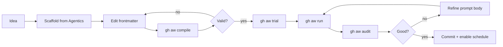

# Writing Workflows Cookbook

> _Based on gh-aw v0.61.0 · Last reviewed 2026-04_

A practical, recipe-driven guide for authoring GitHub Agentic Workflows. This cookbook collects 10 production-grade patterns derived from the [`githubnext/agentics`](https://github.com/githubnext/agentics) collection and the workflows shipped with this repository (e.g. [`daily-repo-status.md`](../../.github/workflows/daily-repo-status.md), [`github-changelog-summary.md`](../../.github/workflows/github-changelog-summary.md)). Use it as your starting point whenever you create a new `.md` workflow under `.github/workflows/`.

---

## TL;DR

- A **workflow is a single Markdown file** with a YAML frontmatter block and a natural-language body. The frontmatter declares *what is allowed*; the body describes *what should happen*.
- Iteration is fast: **write → `gh aw compile` → `gh aw run` → `gh aw audit <run-id>` → refine**. Only frontmatter changes require recompilation; you can edit the prompt body directly on `github.com` between runs.
- Don't start from a blank file. **Pull a recipe from the [Agentics collection](https://github.com/githubnext/agentics)** with `gh aw new <name> --source githubnext/agentics/workflows/<name>.md`, then customize.
- Keep three things in mind: (1) **permissions describe what's possible**, (2) **the prompt describes what should happen**, (3) **safe-outputs describe what writes are allowed** — never write directly from the agent.



---

## Key Concepts

### The author's mental model

Two mental shifts separate good agentic-workflow authors from frustrated ones:

1. **"Permissions describe what's possible; the prompt describes what should happen."**
   The frontmatter is your *capability surface*. The body is your *intent*. The agent can only do what the frontmatter allows, and it will only attempt what the body asks for. Both must agree, or you'll see "Agent has no tools available" (capability mismatch) or unused permissions (intent mismatch).

2. **"Safe outputs are the only way the agent writes."**
   The agent itself runs read-only. All side effects (issues, comments, PRs, branches, labels, dispatches) flow through the `safe-outputs:` block, which compiles into separate scoped jobs that run after the agent finishes. This is what makes prompt injection survivable.

### The canonical six-block structure

Every well-formed workflow has these six logical blocks:

| Block | Purpose | Example |
| ----- | ------- | ------- |
| `on:` | trigger(s) | `schedule: daily`, `slash_command: { name: review }` |
| `permissions:` | GitHub token scopes | `contents: read`, `issues: read` |
| `tools:` / `mcp-servers:` | what the agent can call | `github: { toolsets: [issues] }`, `web-fetch:` |
| `safe-outputs:` | what the agent can write | `create-issue:`, `add-comment:` |
| `engine:` | which model | `copilot`, `claude`, `codex` |
| body | natural-language instructions | `# Title \n ## Process \n 1. ...` |

Stick to this order in every file. Reviewers and `gh aw audit` traces will thank you.

### When to extract shared components

Extract a `shared/foo.md` import when **two or more workflows** repeat the same:
- `mcp-servers:` block (e.g., your private OTLP endpoint)
- prompt fragment (e.g., a Style guide block)
- network allowlist (e.g., your corp registry domains)

Don't pre-emptively extract. The Agentics collection waits until the third use.

---

## Deep Dive — Recipe Library

Every recipe below uses the same template:

> **Trigger** · **Frontmatter skeleton** · **Key prompt patterns** · **Expected safe-outputs** · **Watch out for**

---

### Recipe 1 — Issue Triage on `opened`

**Use case:** Auto-label new issues by content; post a friendly acknowledgement comment.

**Trigger:** `issues: types: [opened]`

```yaml
---
on:
  issues:
    types: [opened]

permissions:
  contents: read
  issues: read

tools:
  github:
    toolsets: [issues]

safe-outputs:
  add-labels:
    max: 5
    allowed: [bug, enhancement, question, documentation, good-first-issue]
  add-comment:
    max: 1

engine: copilot
---

# Triage New Issue

Read the new issue body and title. Decide which labels apply (from the allowed
set) and post a single welcoming comment that paraphrases the request and
states next steps.

## Process

1. Read `${{ github.event.issue.number }}`.
2. Choose at most 3 labels from the allowed set.
3. Post one comment of 3–5 sentences. Use a friendly, professional tone.
4. Do not mention the agent or this workflow.
```

**Watch out for:**
- `add-labels.allowed:` is **mandatory** — without it any label can be created and the strict-mode compiler will warn.
- The agent has no `write` permission on issues; the *labels* job adds them.

---

### Recipe 2 — On-demand PR Reviewer (`/review`)

**Use case:** A reviewer comments `/review` on a pull request and a structured review is posted.

**Trigger:** `slash_command: { name: review, events: [pull_request_review_comment] }`

```yaml
---
on:
  slash_command:
    name: review
    events: [pull_request_review_comment, issue_comment]

permissions:
  contents: read
  pull-requests: read

tools:
  github:
    toolsets: [repos, pull_requests]

safe-outputs:
  create-pull-request-review-comment:
    max: 20
  add-comment:
    max: 1

engine: claude
---

# Opinionated PR Review

Review the pull request that triggered this command.

## Style

- Be terse. One observation per comment.
- Cite line numbers explicitly using the `path:line` form.
- Do not nitpick formatting handled by linters.

## Process

1. Read the PR diff via `get_pull_request_files`.
2. For each file, decide if there are **bugs**, **security issues**, or
   **logic errors**. Skip style.
3. Post each finding as a `create-pull-request-review-comment`.
4. Post one summary `add-comment` with: total findings, biggest concern,
   merge-ready verdict.
```

**Watch out for:**
- Slash-command workflows automatically get `status-comment: true`. Don't double-post a "starting…" message in the body.
- `create-pull-request-review-comment` requires correct `commit_id`, `path`, `line` — the agent gets them from `get_pull_request_files`. If your engine struggles, raise `max:` cautiously and tighten the Process steps.

---

### Recipe 3 — Daily Repo Status report

**Use case:** A scheduled health check posted as a closable GitHub issue. (This is exactly what [`daily-repo-status.md`](../../.github/workflows/daily-repo-status.md) in this repo does.)

**Trigger:** `schedule: daily`

```yaml
---
on:
  schedule: daily
  workflow_dispatch:

permissions:
  contents: read
  issues: read
  pull-requests: read

tools:
  github:
    lockdown: false

safe-outputs:
  mentions: false
  allowed-github-references: []
  create-issue:
    title-prefix: "[repo-status] "
    labels: [report, daily-status]
    close-older-issues: true

engine: copilot
---

# Daily Repo Status

Create an upbeat daily status report for the repo as a GitHub issue.

## What to include

- Recent activity (issues, PRs, discussions, releases, code changes)
- Progress tracking, highlights, recommendations
- Actionable next steps for maintainers

## Style

- Be positive 🌟. Use emojis sparingly.
- Keep it concise — adjust length to actual activity.
```

**Watch out for:**
- `close-older-issues: true` is the magic that prevents the issue tracker from drowning in old reports — each new run closes prior `[repo-status] …` issues.
- `mentions: false` and `allowed-github-references: []` neutralize accidental `@user` or `#1234` cross-references in the agent's text.
- `lockdown: false` is only meaningful in **public** repos: it lets the agent read 3rd-party comments. In private repos it has no effect.

---

### Recipe 4 — Weekly Web Research

**Use case:** Crawl an external page once a week and summarize. (See [`github-changelog-summary.md`](../../.github/workflows/github-changelog-summary.md).)

**Trigger:** `schedule: weekly on monday around 9am`

```yaml
---
on:
  schedule: weekly on monday around 9am
  workflow_dispatch:

permissions:
  contents: read
  issues: read

tools:
  web-fetch:
  github:
    toolsets: [repos, issues]

network:
  allowed:
    - defaults
    - github

safe-outputs:
  create-issue:
    title-prefix: "[changelog] "
    labels: [github-changelog, weekly-summary]
    close-older-issues: true

engine: copilot
---

# Weekly Industry Research

Fetch <https://example.com/blog> and summarize last 7 days of posts.

## Output Format

```markdown
## 🚀 New
- ...
## 🔄 Changes
- ...
## ⚠️ Deprecations
- ...
```
```

**Watch out for:**
- `tools: web-fetch:` is required. Without it, the agent has no way to issue an HTTP request.
- The `network.allowed:` block is *additive* — `defaults` enables core ecosystems; add specific domains as needed (e.g., `- example.com`).
- Use `around 9am` (fuzzy) instead of exact cron strings — gh-aw spreads load across the hour.

---

### Recipe 5 — CI Doctor

**Use case:** When a workflow run fails, diagnose and post a helpful comment on the originating PR.

**Trigger:** `workflow_run: types: [completed]` with a conditional on conclusion.

```yaml
---
on:
  workflow_run:
    workflows: [CI]
    types: [completed]

if: ${{ github.event.workflow_run.conclusion == 'failure' }}

permissions:
  contents: read
  actions: read
  pull-requests: read

tools:
  github:
    toolsets: [actions, pull_requests, repos]

safe-outputs:
  add-comment:
    max: 1
    target: triggering

engine: claude
---

# CI Doctor

The workflow `${{ github.event.workflow_run.name }}` failed
(run `${{ github.event.workflow_run.id }}`). Diagnose and comment on the PR.

## Process

1. Fetch the failed job logs via `download_workflow_run_logs`.
2. Identify the first real error (skip retry noise and pip warnings).
3. Classify: build / test / lint / flaky / infra.
4. Post **one** comment with: classification, root-cause line, suggested fix.
```

**Watch out for:**
- `actions: read` permission is required to fetch logs.
- `target: triggering` posts on the PR that owned the failed run, not on a fresh issue.
- Tail logs (`tail_lines: 200`) — full logs blow the context window.

---

### Recipe 6 — Slash-command Workflow with Sub-issues

**Use case:** A maintainer comments `/plan` on a feature issue; the agent breaks it into sub-issues.

**Trigger:** `slash_command: { name: plan }`

```yaml
---
on:
  slash_command:
    name: plan

permissions:
  contents: read
  issues: read

tools:
  github:
    toolsets: [issues, repos]

safe-outputs:
  create-issue:
    max: 8
    title-prefix: "[plan] "
    labels: [task, planned]
  link-sub-issue:
    max: 8

engine: copilot
---

# Implementation Planner

Break the parent issue into 3–8 sub-issues.

## Output Format

For each sub-issue, emit:
- A clear title (imperative, ≤72 chars)
- A 5–10 line body with: Goal, Acceptance criteria, Files likely touched
- Then call `link-sub-issue` to attach it to the parent.

## Process

1. Read parent issue `${{ github.event.issue.number }}`.
2. Identify natural slices (model, API, tests, docs).
3. Emit sub-issues in dependency order.
```

**Watch out for:**
- `status-comment: true` is automatic for `slash_command:` triggers — you'll see "🤖 starting…" / "✅ done" comments.
- `link-sub-issue` requires the parent issue to be present in the trigger context.

---

### Recipe 7 — MCP Integration: Slack Notifier

**Use case:** Send a Slack notification from a workflow, with an audit-trail comment on the issue.

**Trigger:** any (here: `schedule: daily`)

```yaml
---
on:
  schedule: daily

permissions:
  contents: read
  issues: read

mcp-servers:
  slack:
    command: npx
    args: ["-y", "@slack/mcp-server"]
    env:
      SLACK_BOT_TOKEN: ${{ secrets.SLACK_BOT_TOKEN }}
    allowed: [send_message]

tools:
  github:
    toolsets: [issues]

network:
  allowed:
    - defaults
    - slack.com

safe-outputs:
  add-comment:
    max: 1
    target: "*"

engine: copilot
---

# Daily Slack Digest

Post a 3-bullet digest of yesterday's repo activity to `#dev` on Slack,
then add a comment on issue #1 (the digest tracking issue) with a copy.
```

> [!TIP]
> Always pair an MCP side-effect with an `add-comment` audit trail. If the Slack message fails or is wrong, you have a permanent record on GitHub of exactly what was sent.

**Watch out for:**
- `allowed:` whitelist on the MCP server caps which tools the agent can call. Without it, *any* tool the server exposes is callable.
- Add the MCP's domain (`slack.com`) to `network.allowed`.

---

### Recipe 8 — Documentation Maintainer

**Use case:** When docs change, run a typo/clarity pass and push fixes back to the PR branch.

**Trigger:** `pull_request: paths: [docs/**]`

```yaml
---
on:
  pull_request:
    paths: ["docs/**"]
    types: [opened, synchronize]

permissions:
  contents: read
  pull-requests: read

tools:
  edit:
  github:
    toolsets: [repos, pull_requests]

safe-outputs:
  push-to-pull-request-branch:
    max: 1
    title-prefix: "docs: "
  add-comment:
    max: 1

engine: claude
---

# Docs Polish

Polish prose in changed `docs/**.md` files: typos, grammar, link rot.

## Rules

- Do **not** change meaning. Style only.
- Do **not** edit code blocks.
- One commit, one comment summarizing edits.
```

**Watch out for:**
- `tools: edit:` is required for the agent to modify files. Without it, `push-to-pull-request-branch` will report no diff.
- The push job uses the PR's head branch — protected branches will refuse it; use `create-pull-request` instead.

---

### Recipe 9 — Cross-repo Aggregator (PAT)

**Use case:** Aggregate issues across an org and post a weekly roll-up in a central repo.

**Trigger:** `schedule: weekly`

```yaml
---
on:
  schedule: weekly on friday around 4pm

permissions:
  contents: read
  issues: read

tools:
  github:
    mode: remote
    github-token: ${{ secrets.MY_ORG_PAT }}
    allowed-repos: ["myorg/*"]
    toolsets: [issues, repos, search]

safe-outputs:
  create-issue:
    title-prefix: "[org-roll-up] "
    labels: [org-status]
    close-older-issues: true

engine: copilot
---

# Org Weekly Roll-up

Search every `myorg/*` repo for issues closed this week and group by repo.
```

**Watch out for:**
- `mode: remote` lets the agent use a different token than the workflow's `GITHUB_TOKEN`. The PAT must have `repo` and `read:org` scopes.
- `allowed-repos:` restricts the PAT's blast radius — always set this even if your PAT is org-wide.

---

### Recipe 10 — Orchestrator + Worker Pattern

**Use case:** Fan out work to specialized worker workflows; share state via cache.

**Trigger:** `schedule: daily`

**Orchestrator:**

```yaml
---
on:
  schedule: daily

permissions:
  contents: read
  actions: write

tools:
  github:
    toolsets: [repos]
  cache-memory:

safe-outputs:
  dispatch-workflow:
    max: 3
    allowed:
      - worker-triage.lock.yml
      - worker-changelog.lock.yml
      - worker-security.lock.yml

engine: copilot
---

# Daily Orchestrator

Decide which of the 3 workers should run today based on `cache-memory`
("lastRunFor.<worker>") and dispatch them with a payload.
```

**Worker (excerpt):**

```yaml
---
on:
  workflow_dispatch:
    inputs:
      from-orchestrator: { type: string }

tools:
  cache-memory:
# ... regular tools / safe-outputs ...
---
```

**Watch out for:**
- `dispatch-workflow.allowed:` must list **lock-file names** of the targets, not source `.md` names.
- Workers should write a "ran-on" key into `cache-memory` so the orchestrator's next run can decide accurately.

---

### Recipe 11 — Run on ARM64 hosted runners

Migrate any agentic workflow to ARM64 hosted runners by setting **one
frontmatter field**. ARM64 is free on public repos and ~37 % cheaper per
runner-minute on private repos — and that discount stacks across the
four jobs every agentic run produces.

```yaml
---
on:
  issues:
    types: [opened]
runs-on: ubuntu-24.04-arm   # ← the only change

engine: copilot
permissions: { contents: read, issues: read }

safe-outputs:
  create-issue:
    title-prefix: "[triage] "
    labels: [triage]

tools:
  bash: ["uname", "uname:*"]
---

# Triage New Issue

Summarize issue #${{ github.event.issue.number }} and create one
follow-up issue with action items.
```

**What this does (verified empirically on this repo).**

- All **four** generated jobs (`activation`, `agent`, threat-detection
  slot, `safe_outputs`) inherit `runs-on: ubuntu-24.04-arm` from the
  single top-level field. The lock file shows `runs-on:
  ubuntu-24.04-arm` four times — no per-job override needed.
- The Copilot CLI installer auto-pulls `copilot-linux-arm64.tar.gz`;
  AWF (`v0.24.2`) and the MCP gateway containers (`awf-squid`,
  `awf-api-proxy`, `awf-agent`) all run on aarch64.
- Inside the agent sandbox: `uname -m → aarch64`, kernel
  `Linux … aarch64`, CPU ARM Neoverse-N2 (4 cores), Ubuntu 24.04.3 LTS.

**Watch out for:**

- `runs-on-slim:` is documented upstream but **rejected by the v0.61.0
  compiler** (`Unknown property: runs-on-slim`). Don't set it on this
  version — `runs-on:` alone covers all four jobs.
- `workflow_dispatch` only runs from the default branch. To smoke-test a
  runner-migration on a feature branch, add a scoped `push:` trigger so
  the push itself fires the run, then revert before merging.
- "Run conclusion = success" does **not** mean the agent inference
  succeeded; it only means the GH Actions jobs finished. If the agent
  produced no safe output, the framework files an `[aw] <name> failed`
  issue. Always check the agent log when validating runner-image changes.
- Custom MCP servers shipped via `mcp-servers.<name>.container:` must
  resolve to a multi-arch image. Verify with
  `docker manifest inspect <image>` before merging.
- Per-safe-output overrides exist if you need them: e.g.
  `safe-outputs.create-pull-request.runs-on: ubuntu-latest` keeps one
  particular safe-output job on x64 even when the rest of the workflow
  is on ARM64.

---

## Examples

### Iteration tips

- **`gh aw trial <workflow-spec>`** — runs once against a sandbox/staging repo so production issue trackers are not polluted. Ideal for testing prompt rewrites.
- **Edit the body on `github.com`** — the markdown body is loaded at runtime; only frontmatter changes need `gh aw compile`. This makes prompt-tuning a 10-second loop.
- **`gh aw audit <run-id>`** — shows the *exact* prompt and the *exact* response. Read these before you "fix" anything in the body.

### Prompt-engineering best practices

| Technique | Bad | Good |
| --------- | --- | ---- |
| Be specific | "summarize" | "Create one issue summarizing the 5 highest-impact changes" |
| Constrain output | "explain" | "Use no more than 5 bullet points, each ≤120 chars" |
| Provide format | _(none)_ | Embed a fenced-code template with placeholders |
| Number steps | _(prose)_ | A `## Process` section with numbered steps |
| Set tone | _(implied)_ | A `## Style` section: emoji policy, length, voice |

A reliable body skeleton:

```markdown
# <Workflow Title>

<one-sentence purpose>

## What to include
- ...

## Style
- ...

## Process
1. ...
2. ...

## Output Format
```markdown
<template>
```
```

> [!TIP]
> The four-section pattern (`What / Style / Process / Output Format`) is what every Agentics workflow uses. Copy it.

---

## Pitfalls & FAQ

> [!WARNING]
> **The agent silently does the wrong thing.** Almost always: the body is ambiguous and the model is filling gaps. Tighten the `## Process` section first, *not* the frontmatter.

> [!NOTE]
> **"Why isn't my safe-output applied?"** Check `gh aw audit <run-id>` — the agent must emit a `safe-output` JSON block. If it didn't, the prompt didn't make the output type obvious. Restate it: "When you finish, you **must** call `create-issue` with…"

> [!WARNING]
> **Frontmatter changes need `gh aw compile`.** A stale lock file will run yesterday's tools/permissions even if your `.md` looks new.

**FAQ — When should I use a slash command vs. a schedule?**
- Slash: human-in-the-loop, on demand, fast feedback (sub-issues, reviews).
- Schedule: hands-off recurring (status, changelog, roll-ups).

**FAQ — When should I switch engines?**
- `copilot`: cheap, default, great for summarization and triage.
- `claude`: better at long-context reasoning (PR reviews, refactors).
- `codex`: code-edit heavy tasks where it must produce diffs.

**FAQ — How do I keep multiple workflows in sync?**
Extract a `shared/styling.md` file and import it via `imports:` in each frontmatter.

---

## Related Docs

- [Debugging & Observability](./11-debugging-and-observability.md)
- [Getting started tutorial](../getting-started-tutorial.md)
- [gh aw CLI reference](../gh-aw-cli-reference.md)
- [Agentics collection (upstream)](https://github.com/githubnext/agentics)
