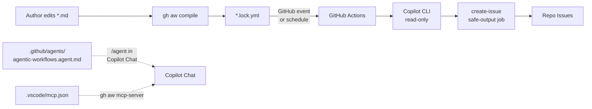

# 12 — このリポジトリのワークフロー徹底ウォークスルー

> _gh-aw v0.61.0 ベース · 最終確認 2026-04_

このドキュメントは **`shinyay/agentic-worflows-quick-start`** に含まれるすべてのエージェント関連アセットを 1 つずつ案内するガイドです。`gh aw` を実例で学ぶためにこのリポジトリをクローンしたのなら、ファイルを別ウィンドウで開いて最後まで読んでみてください。

## TL;DR

- リポジトリには **3 本の稼働ワークフロー** + **1 つのディスパッチャエージェント** + **1 本のサポート用 GitHub Actions ワークフロー**(Copilot コーディングエージェント向け)が同梱されています
- 3 本のワークフローはすべて **`engine: copilot`** を使用し、単一の **`safe-outputs.create-issue`** 出力に `close-older-issues: true` を設定しています
- リポジトリは **作成 → コンパイル → 実行 → モニタ** のライフサイクル全体を実演しており、SHA pin された Actions(`actions-lock.json`)、VSCode の MCP 配線、Copilot Chat ディスパッチャエージェントを含みます
- **バイリンガルレポート** は `github-changelog-summary`(英語版)と `github-changelog-summary-jp`(日本語版)で示されています

## 主要な概念

最初に、定番のペアを思い出しておきましょう。

| ファイルパターン                  | 役割                                                | 編集する? |
| -------------------------------- | --------------------------------------------------- | --------- |
| `<workflow>.md`                  | ソース — フロントマター + 自然言語                  | ✅ あなたが編集 |
| `<workflow>.lock.yml`            | コンパイル済 GitHub Actions YAML(ハードン化済) | ⚠️ 自動生成    |
| `.github/agents/*.agent.md`      | エージェントペルソナ(`engine.agent` から参照)    | ✅ あなたが編集 |
| `.github/aw/actions-lock.json`   | 利用するすべての Actions の SHA pin レジストリ      | ⚠️ 自動管理    |

## 詳細解説

### リポジトリレイアウト

```
agentic-worflows-quick-start/
├── .github/
│   ├── agents/
│   │   └── agentic-workflows.agent.md       # Copilot Chat ディスパッチャ
│   ├── aw/
│   │   └── actions-lock.json                # SHA pin Actions レジストリ
│   └── workflows/
│       ├── copilot-setup-steps.yml          # Copilot Agent ブートストラップ
│       ├── daily-repo-status.md             # AW ソース
│       ├── daily-repo-status.lock.yml       # AW コンパイル成果物
│       ├── github-changelog-summary.md      # AW ソース(EN)
│       ├── github-changelog-summary.lock.yml
│       ├── github-changelog-summary-jp.md   # AW ソース(JP)
│       ├── github-changelog-summary-jp.lock.yml
│       └── sample-wf.md                     # `gh aw new` の雛形
├── .vscode/
│   ├── mcp.json                             # VSCode 用 `gh aw mcp-server`
│   └── settings.json                        # Markdown で Copilot を有効化
├── doc/                                     # 人間向けドキュメント
└── .gitattributes                           # lock file マージ戦略
```



---

### 1. `.github/agents/agentic-workflows.agent.md` — ディスパッチャ

このファイルは Copilot Chat で `/agent` と入力して `agentic-workflows` を選んだときのエントリポイントです。エージェント型ワークフローとしては実行されません。`github/gh-aw` がホストする 8 種類の専門プロンプトファイルへ自然言語のリクエストをルーティングする **Copilot カスタムエージェント** として動作します。

**フロントマター(3 フィールド):**

```yaml
---
description: GitHub Agentic Workflows (gh-aw) - Create, debug, and upgrade AI-powered workflows…
disable-model-invocation: true
---
```

- `description:` — エージェントピッカーに表示される説明
- `disable-model-invocation: true` — このエージェントは**ディスパッチャ**であり、自身ではモデルを呼ばずにルーティング先プロンプトを読み込んでそのまま従います

**ルーティングテーブル(8 プロンプト):**

| ユーザの意図                       | ルーティング先プロンプト                                                            |
| --------------------------------- | ----------------------------------------------------------------------------------- |
| 新規ワークフロー作成               | `github/gh-aw/.github/aw/create-agentic-workflow.md`                                |
| 既存ワークフロー更新               | `github/gh-aw/.github/aw/update-agentic-workflow.md`                                |
| 失敗ワークフローのデバッグ         | `github/gh-aw/.github/aw/debug-agentic-workflow.md`                                 |
| gh-aw バージョンのアップグレード   | `github/gh-aw/.github/aw/upgrade-agentic-workflows.md`                              |
| レポート生成ワークフロー作成       | `github/gh-aw/.github/aw/report.md`                                                 |
| 共有コンポーネント作成             | `github/gh-aw/.github/aw/create-shared-agentic-workflow.md`                         |
| Dependabot PR 修正                 | `github/gh-aw/.github/aw/dependabot.md`                                             |
| テストカバレッジ分析               | `github/gh-aw/.github/aw/test-coverage.md`                                          |

> [!TIP]
> ディスパッチャパターンは**スケーリングのコツ**です。すべての gh-aw タスクを 1 つの巨大なプロンプトで賄うのではなく、必要な専門家を都度ロードします。自分のエージェントにも流用しましょう。

---

### 2. `.github/workflows/daily-repo-status.md` — 最初のエージェント型ワークフロー

これは `gh aw add-wizard githubnext/agentics/daily-repo-status` がインストールしたワークフローです。

**ソース(注釈付き):**

```yaml
---
description: |
  This workflow creates daily repo status reports. It gathers recent repository
  activity (issues, PRs, discussions, releases, code changes) and generates
  engaging GitHub issues with productivity insights, community highlights,
  and project recommendations.

on:
  schedule: daily          # ← ファジースケジュール: コンパイラが分散時刻を選択
  workflow_dispatch:        # ← `gh aw run` で手動実行可能

permissions:
  contents: read            # ← コードを読む(「code changes」のため)
  issues: read              # ← 既存 issue を読む
  pull-requests: read       # ← PR を読む

network: defaults           # ← AWF allowlist: 証明書、schema、Ubuntu、パッケージミラー

tools:
  github:
    lockdown: false         # ← 公開リポジトリで第三者コンテンツの読み取りを許可
                            #    (信頼されていないユーザの issue/PR/コメント)
                            #    プライベートリポジトリでは効果なし

safe-outputs:
  mentions: false                        # ← 出力から @mentions を除去
  allowed-github-references: []          # ← 出力に GH refs を埋め込ませない
  create-issue:
    title-prefix: "[repo-status] "       # ← 作成 issue のタイトル接頭辞(必須)
    labels: [report, daily-status]       # ← 自動付与ラベル
    close-older-issues: true             # ← 新規投稿時に過去の同種 issue をクローズ

source: githubnext/agentics/workflows/daily-repo-status.md@1199e4a230756fb94a382496a73e689091aa4b6b
engine: copilot
---

# Daily Repo Status

Create an upbeat daily status report for the repo as a GitHub issue.

## What to include

- Recent repository activity (issues, PRs, discussions, releases, code changes)
- Progress tracking, goal reminders and highlights
- Project status and recommendations
- Actionable next steps for maintainers

## Style

- Be positive, encouraging, and helpful 🌟
- Use emojis moderately for engagement
- Keep it concise - adjust length based on actual activity

## Process

1. Gather recent activity from the repository
2. Study the repository, its issues and its pull requests
3. Create a new GitHub issue with your findings and insights
```

**注目ポイント:**

- **`source:`** はインストールした上流ワークフローのバージョン(コミット SHA で pin)を記録します。上流が更新を出すと `gh aw update` がこのポインタを辿ります。
- **`safe-outputs.mentions: false`** + **`allowed-github-references: []`** は出力サニタイズの最も厳格な姿勢です。`@you` も `#42` のリンクバックも残らず、通知スパムを防ぎます。
- **`tools.github.lockdown: false`** — これがないと公開リポジトリでは GitHub MCP が信頼されていない投稿者のコンテンツを除外します(XPIA 緩和)。ステータスレポートには全可視性が必要なので明示的にオプトインしています。
- 本文には `What to include`、`Style`、`Process` の 3 セクションがあります。「レポート」型ワークフローの定型パターンです。

**トリガー実態チェック:** `schedule: daily` は `cron: "55 1 * * *"` にコンパイルされます(lock file 35 行目)。コンパイラは**このファイルパス**から決定論的に **01:55 UTC** を選びました。別リポジトリへ持っていけば時刻は変わります — 意図した負荷分散です。

---

### 3. `.github/workflows/github-changelog-summary.md` — web-fetch + カテゴリ化

GitHub blog の changelog を取得し、エントリを分類してサマリ issue を投稿する週次ワークフローです。

**ソース抜粋:**

```yaml
---
description: |
  Checks the GitHub Changelog (https://github.blog/changelog/) for recent
  updates, summarizes them by category, and creates a GitHub issue with
  the highlights.

on:
  schedule: weekly on monday around 9am   # ← ファジー週次: 09:00 UTC を中心に ±1h で分散
  workflow_dispatch:

permissions:
  contents: read
  issues: read

tools:
  web-fetch:                              # ← 任意の HTTP(S) ページを取得可能に
  github:
    toolsets: [repos, issues]             # ← デフォルトからこの 2 つに絞り込み

network:
  allowed:
    - defaults                            # ← 必須ベース
    - github                              # ← github.blog(github エコシステムドメイン)へ到達

safe-outputs:
  create-issue:
    title-prefix: "[changelog] "
    labels: [github-changelog, weekly-summary]
    close-older-issues: true

engine: copilot
---
```

**本文構造**(AI への指示):

1. **Goal** — 高位の意図(「チームが GitHub 最新情報を把握できるようにする」)
2. **Instructions** — 番号付き手順: 取得 → 過去 7 日のエントリ抽出 → タイトル/日付/要約/リンクの取得 → カテゴリで分類 → issue 作成
3. **Output Format** — `[Title]`、`[DATE]`、`[link]` のプレースホルダ入り Markdown 雛形と 5 つの絵文字付きカテゴリ: 🚀 New Features、🔄 Changes & Improvements、⚠️ Deprecations & Removals、🔒 Security、📦 API & Integrations
4. **Rules** — 制約: 過去 7 日のみ、空カテゴリは省略、要約 1〜2 文、エントリなし時は「No updates this week」、プロフェッショナルなトーン

> [!TIP]
> このワークフローで最大の効果を生むプロンプトエンジニアリングテクニックは **Output Format の雛形**です。エージェントは構造を発明するのではなく雛形を埋めていくため、issue が週ごとに一貫した形で並びます。

**ネットワークの注意点:** `github.blog` は `github` エコシステム識別子に含まれます。`news.ycombinator.com` から取得したい場合は次のいずれか:
- `network.allowed:` にドメインを明示追加(strict モードでもカスタムドメインは**許可される**ので `strict: false` は不要)
- strict モードでエコシステム識別子のみに留める — つまり HN へは到達できない

これが **strict モードのトレードオフ**です: セキュリティ最大化 vs 柔軟性。

---

### 4. `.github/workflows/github-changelog-summary-jp.md` — バイリンガルバリアント

英語 changelog ワークフローの日本語版です。フロントマターはほぼ同じで、`title-prefix` と `labels` のみ異なります。

```yaml
safe-outputs:
  create-issue:
    title-prefix: "[changelog-jp] "
    labels: [github-changelog, weekly-summary, japanese]
    close-older-issues: true
```

本文は完全に日本語化されています: 目的(Goal)、手順(Instructions)、出力フォーマット(Output Format)、ルール(Rules)。5 カテゴリは 🚀 新機能、🔄 変更・改善、⚠️ 廃止・削除、🔒 セキュリティ、📦 API・インテグレーション です。

> [!NOTE]
> **すべてのテキストは日本語で記述すること** — エージェントを日本語出力に固定するルールです。これがないと、ドキュメント途中で英語に戻ってしまうことがあります。

**なぜパラメータ付きの 1 ワークフローではなく 2 ワークフローなのか?** 各ワークフローの `safe-outputs.create-issue` は実行ごとに 1 つの issue を生成します。1 ワークフローで言語タグ付きの 2 issue を出すのは容易ではありません。分割すれば各 `close-older-issues` も独立に追跡できます。

> [!TIP]
> プロンプトロジックを共通化したい場合は、共有部分を `.github/workflows/shared/changelog-summary.md` コンポーネントに切り出し、両ワークフローから `imports:` で読み込みます。[09 — Imports & Shared Components](./09-imports-and-shared-components.ja.md) を参照。

---

### 5. `.github/workflows/sample-wf.md` — `gh aw new` の雛形

このファイルは `gh aw new sample-wf` が生成する**テンプレート**です。よく使う設定すべてをコメント付きで含むフロントマターと、プレースホルダ本文を持ちます。**コンパイルされていません**(`.lock.yml` も存在しない) — 新規ワークフロー作者向けのインラインリファレンスとしてリポジトリに残されています。

注目点:
- コメントアウトされたトリガー節に最頻パターンが並ぶ: `issues`、`pull_request`、`schedule: daily`、`schedule: weekly on monday`
- `permissions:` は all-read プリセット(エージェント型ワークフローの安全な既定値)
- `network: defaults` で AWF 最小 allowlist を提示
- `safe-outputs:` には `create-issue` を `max: 5`(既定 1 を上書き)で示し、他の出力タイプもコメントで列挙
- 本文はプレースホルダの `## Instructions` / `## Notes` のみ

> [!TIP]
> `sample-wf.md` をリポジトリ内のチートシートとして扱いましょう。新規ワークフローを起こすときはこのファイルをコピーしてリネームし、編集して `gh aw compile` を実行します。

---

### 6. `.github/workflows/copilot-setup-steps.yml` — サポート用 GH Actions ワークフロー

これは**エージェント型ワークフローではありません** — 特定のジョブ名を持つ通常の `.yml` GitHub Actions ワークフローです。ジョブ ID `copilot-setup-steps` は **GitHub Copilot コーディングエージェント**(`assign-to-agent` で issue を割り当てるエージェント)に認識されます。Copilot エージェントがこのリポジトリの issue を取り上げると、GitHub Actions が**事前**にこのジョブを自動で実行して環境を整えます。

**内容:**

```yaml
jobs:
  copilot-setup-steps:                    # ← マジック名(完全一致が必要)
    runs-on: ubuntu-latest
    permissions:
      contents: read                      # ← 最小権限
    steps:
      - uses: actions/checkout@v6
      - name: Install gh-aw extension
        uses: github/gh-aw-actions/setup-cli@df014dd7d03b638e860b2aeca95c833fd97c8cf1 # v0.61.0
        with:
          version: v0.61.0
```

唯一の有用なステップが **`gh aw` CLI 拡張**をインストールします。これにより Copilot コーディングエージェントは(典型的には `agentic-workflows` MCP サーバ経由で)このリポジトリに関する issue に応答するときに `gh aw` を呼び出せます。

> [!IMPORTANT]
> Action は**SHA pin** されています(`df014dd7d03b638e860b2aeca95c833fd97c8cf1`、バージョンタグ参照ではない) — strict モードの要件です。このリポジトリのすべての `.lock.yml` 内のすべての Action は同様に pin され、`.github/aw/actions-lock.json` から供給されます。

---

### 7. `.github/aw/actions-lock.json` — SHA pin レジストリ

小さいが重要なファイル。リポジトリ内のいずれかのワークフローが使うすべての Action を特定のコミット SHA に対応付けます。

```json
{
  "entries": {
    "actions/github-script@v8": {
      "repo": "actions/github-script",
      "version": "v8",
      "sha": "ed597411d8f924073f98dfc5c65a23a2325f34cd"
    },
    "github/gh-aw-actions/setup@v0.61.0": {
      "repo": "github/gh-aw-actions/setup",
      "version": "v0.61.0",
      "sha": "df014dd7d03b638e860b2aeca95c833fd97c8cf1"
    }
  }
}
```

`gh aw compile` は lock file 生成時にこのレジストリを参照し、未 pin 参照の出力を拒否します。`gh aw fix` は上流が新しいタグを切ったときにエントリを再取得できます。

---

### 8. `.vscode/mcp.json` — Copilot Chat ↔ gh-aw ブリッジ

```json
{
  "servers": {
    "github-agentic-workflows": {
      "command": "gh",
      "args": ["aw", "mcp-server"],
      "cwd": "${workspaceFolder}"
    }
  }
}
```

このリポジトリを GitHub Copilot 拡張機能と一緒に VSCode で開くと、Copilot Chat が `github-agentic-workflows` という名前の MCP サーバを発見します。裏では workspace ルートで `gh aw mcp-server` を起動します。これにより Copilot Chat に次のツールが備わります:

- ワークフロー一覧
- ワークフローソース / lock file の読み取り
- ワークフローのコンパイル
- 実行ログの読み取り
- audit データの取得
- テンプレートからの新規ワークフロー作成

`agentic-workflows.agent.md` ディスパッチャと組み合わせることで、IDE 内で完結する作成 + デバッグ体験が得られます。

---

### 9. `.vscode/settings.json` — Markdown で Copilot を有効化

```json
{
  "github.copilot.enable": {
    "markdown": true
  }
}
```

GitHub Copilot のインライン補完は既定では `.md` ファイルでは**無効**です。エージェント型ワークフローは Markdown なので、この一行で `*.md` ワークフローファイル編集時の補完を再有効化します。

---

### 10. `.gitattributes` — lock file マージ戦略

`gh aw init` が作成します。`*.lock.yml` ファイルを次のようにマークします:
- `linguist-generated=true` — GitHub の言語統計から除外し、PR diff を折りたたむ
- `merge=ours`(または同等) — 複数ブランチが同じワークフローを再コンパイルしたときのマージコンフリクトを防ぐ

普段は意識しませんが、複数の作者がワークフローを編集し始めると効いてきます。

---

### `gh aw run daily-repo-status` 1 回の流れ

```mermaid
sequenceDiagram
    participant You
    participant Lock as daily-repo-status.lock.yml
    participant Activate as activation job
    participant Agent as Copilot CLI<br/>(read-only)
    participant Detect as detection job
    participant Issue as create-issue job
    participant GH as GitHub API

    You->>Lock: gh aw run daily-repo-status
    Lock->>Activate: workflow_dispatch fires
    Activate->>Activate: validate COPILOT_GITHUB_TOKEN
    Activate->>Activate: sparse-checkout .github + .agents
    Activate->>Agent: hand off prompt + tool list
    Agent->>GH: read issues, PRs, commits (read token)
    Agent->>Activate: structured agent_output.json artifact
    Activate->>Detect: pass artifact
    Detect->>Detect: AI scan for prompt-injection / secrets / bad patches
    alt safe
        Detect->>Issue: approve
        Issue->>GH: POST /repos/.../issues<br/>(issues:write scoped token)
        Issue-->>You: new "[repo-status] …" issue 🎉
    else suspicious
        Detect-->>You: workflow fails, no writes
    end
```

実際に追体験したい場合は、いずれかのワークフローを 1 度実行してから `gh aw audit <run-id>` でこの流れをタイミング・出力付きで確認できます。

## 例

### プロンプトだけ編集する(再コンパイル不要)

`daily-repo-status.md` の本文(例: `## Length: max 5 paragraphs` ルールを追加)を直接 github.com 上で編集できます。変更は再コンパイル不要で**次回実行**から反映されます。再コンパイルが必要なのはフロントマター変更(triggers / permissions / tools / safe-outputs / network / engine)のみです。

```bash
# github.com で編集 → 保存 → 次回スケジュール実行で新プロンプトが使われる
gh aw run daily-repo-status        # すぐに検証
gh aw audit <run-id>               # 新プロンプトが反映されたことを確認
```

### 3 つ目の言語の changelog を追加する

JP バリアントをコピーしてラベルとプロンプトの言語を入れ替えます。

```bash
cp .github/workflows/github-changelog-summary-jp.md .github/workflows/github-changelog-summary-fr.md
# 編集: title-prefix を "[changelog-fr] " に、labels に "french" を追加し、
#       本文をフランス語に翻訳。
gh aw compile github-changelog-summary-fr
git add .github/workflows/github-changelog-summary-fr.{md,lock.yml}
git commit -m "Add French changelog summary"
git push
```

### ワークフローを削除せずに一時停止する

トリガーに `stop-after:` を設定:

```yaml
on:
  schedule: weekly on monday around 9am
  stop-after: 2026-12-31  # この日付以降は実行されない
```

または CLI から一時的に無効化:

```bash
gh aw disable github-changelog-summary
gh aw enable  github-changelog-summary
```

## 落とし穴 & FAQ

**Q: 各ワークフローに `.md` と `.lock.yml` が両方あるのはなぜ?**
A: `.md` が編集可能なソース、`.lock.yml` が GitHub が実際に実行するハードン化済 GitHub Actions YAML です。両方コミットします。`gh aw compile` が `.lock.yml` を再生成します。lock file を直接編集してはいけません — 次回コンパイルで上書きされます。

**Q: 本文プロンプトを編集して `gh aw compile` を忘れた。問題ない?**
A: はい — 本文変更は実行時に読み込まれます(lock file は本文を環境変数経由で参照)。再コンパイルが必要なのは**フロントマター**変更(triggers、permissions、tools、safe-outputs、network、engine)だけです。

**Q: 「daily」ワークフローが 01:55 UTC に走り、深夜 0 時ではない。なぜ?**
A: ファジースケジューリング — コンパイラはファイルパスから決定論的に時刻を分散します。固定したい場合は cron 構文を使用: `schedule: - cron: "0 9 * * *"`。

**Q: なぜ EN/JP 両方の changelog ワークフローが必要? 1 本でできない?**
A: 各 `safe-outputs.create-issue` は 1 issue を出力します。2 言語 = 2 ワークフロー。代わりに `max:` を増やしてエージェントに各言語 1 つずつ作成させることもできますが、その場合は `close-older-issues:` が独立に追跡できなくなります。

**Q: Copilot Chat ディスパッチャが `disable-model-invocation: true` なのはどういう意味?**
A: ディスパッチャ自身は LLM を呼びません。ルーティング先プロンプトファイルを読み込み、LLM はそのプロンプトに従います。ディスパッチャを安価かつ予測可能に保つためです。

**Q: なぜ `copilot-setup-steps.yml` は `.md` ではなく通常の `.yml`?**
A: これは**エージェント型ワークフローではない**からです。ジョブ名(`copilot-setup-steps`)で GitHub の Copilot コーディングエージェント基盤に認識される通常の GitHub Actions ワークフローです。Copilot コーディングエージェントがこのリポジトリの issue に取り組むときに `gh aw` を利用できるよう存在しています。

**Q: `actions-lock.json` を削除したらどうなる?**
A: 次の `gh aw compile` で再生成されます(全 Action SHA を再解決)。ただし lock file は一時的に同期外れになります — コミットしておきましょう。

**Q: 1 つのワークフローだけ非 Copilot エンジン(Claude/Codex/Gemini)に切り替えられる?**
A: はい — `engine: copilot` を `engine: claude`(または codex/gemini)に変更し、対応するシークレット(`gh aw secrets set ANTHROPIC_API_KEY ...`)を追加して再コンパイルします。lock file はエンジン固有のジョブ構成で再生成されます。

## 関連ドキュメント

- [10 — ワークフロー作成クックブック](./10-writing-workflows-cookbook.ja.md) — 新規ワークフロー向けレシピ集
- [11 — デバッグと可観測性](./11-debugging-and-observability.ja.md) — `gh aw audit`、`logs`、`health`、`trial`
- [03 — フロントマターリファレンス](./03-frontmatter-reference.ja.md) — 全フィールド解説
- [06 — Safe Outputs カタログ](./06-safe-outputs-catalog.ja.md) — 全出力タイプ(このリポジトリでは `create-issue` のみ使用)
- [07 — AWF ファイアウォールとサンドボックス](./07-awf-firewall-and-sandbox.ja.md) — `network: defaults` の実態
- トップレベル [Getting Started Tutorial](../getting-started-tutorial.md)
- トップレベル [`gh aw` CLI リファレンス](../gh-aw-cli-reference.md)
