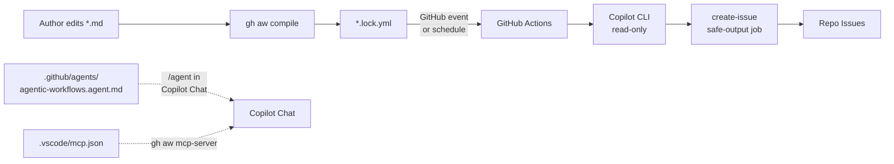

# 12 — This Repo's Workflows: Line-by-Line Walkthrough

> _Based on gh-aw v0.61.0 · Last reviewed 2026-04_

This document is a guided tour of every agentic asset in **`shinyay/agentic-worflows-quick-start`**. If you cloned this repo to learn `gh aw` by example, read this end-to-end with the files open in another window.

## TL;DR

- The repo ships **3 working agentic workflows** + **1 dispatcher agent** + **1 supporting GitHub Actions workflow** for the Copilot coding agent
- All 3 workflows use **`engine: copilot`** and a single **`safe-outputs.create-issue`** output with `close-older-issues: true`
- The repo demonstrates the **full author → compile → run → monitor lifecycle** including SHA-pinned actions (`actions-lock.json`), VSCode MCP wiring, and a Copilot Chat dispatcher agent
- **Bilingual reporting** is shown by `github-changelog-summary` (EN) and `github-changelog-summary-jp` (JP)

## Key Concepts

Before diving in, recall the canonical pair:

| File pattern               | Role                                       | Edit?               |
| -------------------------- | ------------------------------------------ | ------------------- |
| `<workflow>.md`            | Source — frontmatter + natural language    | ✅ You edit this    |
| `<workflow>.lock.yml`      | Compiled GitHub Actions YAML (hardened)    | ⚠️ Auto-generated   |
| `.github/agents/*.agent.md`| Agent personas (referenced by `engine.agent`) | ✅ You edit         |
| `.github/aw/actions-lock.json` | SHA pin registry for all actions used  | ⚠️ Auto-managed     |

## Deep Dive

### Repo layout

```
agentic-worflows-quick-start/
├── .github/
│   ├── agents/
│   │   └── agentic-workflows.agent.md       # Copilot Chat dispatcher
│   ├── aw/
│   │   └── actions-lock.json                # SHA-pinned action registry
│   └── workflows/
│       ├── copilot-setup-steps.yml          # Bootstrap for Copilot Agent
│       ├── daily-repo-status.md             # AW source
│       ├── daily-repo-status.lock.yml       # AW compiled
│       ├── github-changelog-summary.md      # AW source (EN)
│       ├── github-changelog-summary.lock.yml
│       ├── github-changelog-summary-jp.md   # AW source (JP)
│       ├── github-changelog-summary-jp.lock.yml
│       └── sample-wf.md                     # Template scaffold from `gh aw new`
├── .vscode/
│   ├── mcp.json                             # `gh aw mcp-server` for VSCode
│   └── settings.json                        # Enable Copilot for markdown
├── doc/                                     # Human-facing documentation
└── .gitattributes                           # Lock-file merge strategy
```



---

### 1. `.github/agents/agentic-workflows.agent.md` — the dispatcher

This file is the entry point when you type `/agent` in Copilot Chat and pick `agentic-workflows`. It does **not** run as an agentic workflow; it is a **Copilot custom agent** that routes your natural-language request to one of 8 specialized prompt files hosted in `github/gh-aw`.

**Frontmatter (3 fields):**

```yaml
---
description: GitHub Agentic Workflows (gh-aw) - Create, debug, and upgrade AI-powered workflows…
disable-model-invocation: true
---
```

- `description:` — what shows up in the agent picker
- `disable-model-invocation: true` — this agent is a **dispatcher**: it does not itself call the model; it loads and follows the routed prompt verbatim

**Routing table (the 8 prompts):**

| User intent                     | Routed prompt                                                                       |
| ------------------------------- | ----------------------------------------------------------------------------------- |
| Create new workflow             | `github/gh-aw/.github/aw/create-agentic-workflow.md`                                |
| Update existing workflow        | `github/gh-aw/.github/aw/update-agentic-workflow.md`                                |
| Debug a failing workflow        | `github/gh-aw/.github/aw/debug-agentic-workflow.md`                                 |
| Upgrade gh-aw version           | `github/gh-aw/.github/aw/upgrade-agentic-workflows.md`                              |
| Create report-generating WF     | `github/gh-aw/.github/aw/report.md`                                                 |
| Create shared component         | `github/gh-aw/.github/aw/create-shared-agentic-workflow.md`                         |
| Fix Dependabot PRs              | `github/gh-aw/.github/aw/dependabot.md`                                             |
| Analyze test coverage           | `github/gh-aw/.github/aw/test-coverage.md`                                          |

> [!TIP]
> The dispatcher pattern is a **scaling trick**: instead of one giant prompt covering every gh-aw task, you load the right specialist on demand. Steal this pattern for your own agents.

---

### 2. `.github/workflows/daily-repo-status.md` — your first agentic workflow

This is the workflow `gh aw add-wizard githubnext/agentics/daily-repo-status` installed for you.

**Source (annotated):**

```yaml
---
description: |
  This workflow creates daily repo status reports. It gathers recent repository
  activity (issues, PRs, discussions, releases, code changes) and generates
  engaging GitHub issues with productivity insights, community highlights,
  and project recommendations.

on:
  schedule: daily          # ← Fuzzy schedule: compiler picks a scattered time
  workflow_dispatch:        # ← Lets you run it manually with `gh aw run`

permissions:
  contents: read            # ← Read code (for "code changes")
  issues: read              # ← Read existing issues
  pull-requests: read       # ← Read PRs

network: defaults           # ← AWF allowlist: certs, schema, Ubuntu, package mirrors

tools:
  github:
    lockdown: false         # ← In a public repo, allow reading 3rd-party content
                            #    (issues/PRs/comments from non-trusted users).
                            #    No effect in private repos.

safe-outputs:
  mentions: false                        # ← Strip @mentions from output
  allowed-github-references: []          # ← Disallow embedding ANY GH refs in output
  create-issue:
    title-prefix: "[repo-status] "       # ← Required prefix for created issues
    labels: [report, daily-status]       # ← Auto-applied labels
    close-older-issues: true             # ← Close yesterday's issue when posting today's

source: githubnext/agentics/workflows/daily-repo-status.md@1199e4a230756fb94a382496a73e689091aa4b6b
engine: copilot
---

# Daily Repo Status

Create an upbeat daily status report for the repo as a GitHub issue.

## What to include

- Recent repository activity (issues, PRs, discussions, releases, code changes)
- Progress tracking, goal reminders and highlights
- Project status and recommendations
- Actionable next steps for maintainers

## Style

- Be positive, encouraging, and helpful 🌟
- Use emojis moderately for engagement
- Keep it concise - adjust length based on actual activity

## Process

1. Gather recent activity from the repository
2. Study the repository, its issues and its pull requests
3. Create a new GitHub issue with your findings and insights
```

**What's notable:**

- **`source:`** records exactly which version of the upstream workflow you installed (commit SHA pinned). When upstream releases an update, `gh aw update` follows this pointer.
- **`safe-outputs.mentions: false`** + **`allowed-github-references: []`** is the strictest output-sanitization stance: no `@you`, no `#42` linkbacks. Prevents notification spam.
- **`tools.github.lockdown: false`** — without this, in a public repo the GitHub MCP would filter out content from untrusted authors (XPIA mitigation). The workflow opts in to reading everything because a status report needs full visibility.
- The body has 3 prose sections (`What to include`, `Style`, `Process`) — a common pattern for "report" style workflows.

**Trigger reality check:** `schedule: daily` compiles to `cron: "55 1 * * *"` (see lock file line 35). The compiler picked **01:55 UTC** based on this file's path. If you copy this workflow to another repo, the time will differ — that's intentional load-distribution.

---

### 3. `.github/workflows/github-changelog-summary.md` — web-fetch + categorization

A weekly workflow that fetches the GitHub blog changelog, classifies entries, and posts a summary issue.

**Source highlights:**

```yaml
---
description: |
  Checks the GitHub Changelog (https://github.blog/changelog/) for recent
  updates, summarizes them by category, and creates a GitHub issue with
  the highlights.

on:
  schedule: weekly on monday around 9am   # ← Fuzzy weekly: ±1h scatter from 09:00 UTC
  workflow_dispatch:

permissions:
  contents: read
  issues: read

tools:
  web-fetch:                              # ← Enables fetching arbitrary HTTP(S) pages
  github:
    toolsets: [repos, issues]             # ← Narrows from default to just these two

network:
  allowed:
    - defaults                            # ← Required base
    - github                              # ← Reaches github.blog (an github ecosystem domain)

safe-outputs:
  create-issue:
    title-prefix: "[changelog] "
    labels: [github-changelog, weekly-summary]
    close-older-issues: true

engine: copilot
---
```

**Body structure** (the AI instructions):

1. **Goal** — high-level intent ("help the team stay informed…")
2. **Instructions** — numbered steps: fetch → identify last-7-day entries → capture title/date/summary/link → group by category → create issue
3. **Output Format** — a markdown skeleton with placeholder `[Title]`, `[DATE]`, `[link]` slots and 5 emoji-prefixed categories: 🚀 New Features, 🔄 Changes & Improvements, ⚠️ Deprecations & Removals, 🔒 Security, 📦 API & Integrations
4. **Rules** — constraints: only last 7 days, skip empty categories, 1-2 sentence summaries, fallback "no updates this week" message, professional tone

> [!TIP]
> The **Output Format skeleton** is the single highest-leverage prompt-engineering trick in this workflow. The agent fills in the template instead of inventing structure, so your issues stay consistent week-to-week.

**Network nuance:** `github.blog` is included in the `github` ecosystem identifier. If you wanted to fetch from `news.ycombinator.com`, you would need to either:
- Add the domain explicitly under `network.allowed:` AND set `strict: false` (since custom domains are forbidden in strict mode), OR
- Stay in strict mode and use only ecosystem identifiers — meaning you couldn't reach HN

This is the **strict-mode tradeoff**: maximum security vs. flexibility.

---

### 4. `.github/workflows/github-changelog-summary-jp.md` — bilingual variant

A Japanese clone of the English changelog workflow. Almost identical frontmatter — only the `title-prefix` and `labels` differ:

```yaml
safe-outputs:
  create-issue:
    title-prefix: "[changelog-jp] "
    labels: [github-changelog, weekly-summary, japanese]
    close-older-issues: true
```

The body is fully translated to Japanese: 目的 (Goal), 手順 (Instructions), 出力フォーマット (Output Format), ルール (Rules). The 5 categories become 🚀 新機能, 🔄 変更・改善, ⚠️ 廃止・削除, 🔒 セキュリティ, 📦 API・インテグレーション.

> [!NOTE]
> **すべてのテキストは日本語で記述すること** — the rule that pins the agent to Japanese output. Without it the model sometimes lapses to English mid-document.

**Why two workflows instead of one with a parameter?** Because each workflow's `safe-outputs.create-issue` produces one issue per run; a single workflow cannot easily produce two language-tagged issues. Splitting also lets each track `close-older-issues` independently.

> [!TIP]
> If you want to deduplicate the prompt logic, extract the shared sections into a `.github/workflows/shared/changelog-summary.md` component and import it into both workflows with `imports:`. See [09 — Imports & Shared Components](./09-imports-and-shared-components.md).

---

### 5. `.github/workflows/sample-wf.md` — the scaffold from `gh aw new`

This file is a **template** generated by `gh aw new sample-wf`. It contains heavily commented frontmatter showing every common option and a placeholder body. It is **not compiled** (no `.lock.yml` exists for it) — kept in the repo as an inline reference for new workflow authors.

Notable bits:
- The commented-out triggers section shows the most common alternatives: `issues`, `pull_request`, `schedule: daily`, `schedule: weekly on monday`
- `permissions:` is preset to all-read (the safe default for an agentic workflow)
- `network: defaults` shows the minimum AWF allowlist
- `safe-outputs:` shows `create-issue` with `max: 5` (override default of 1) and a comment block listing the other common output types
- The body has placeholder `## Instructions` / `## Notes` sections

> [!TIP]
> Treat `sample-wf.md` as a cheat-sheet you keep in the repo. When you spin up a new workflow, copy this file, rename, edit, run `gh aw compile`.

---

### 6. `.github/workflows/copilot-setup-steps.yml` — supporting GH Actions workflow

This is **not** an agentic workflow — it is a regular `.yml` GitHub Actions workflow with a magic name. The job ID `copilot-setup-steps` is recognized by the **GitHub Copilot coding agent** (the one you assign issues to with `assign-to-agent`). When the Copilot agent picks up an issue in this repo, GitHub Actions automatically runs this job to prepare the environment **before** the agent starts work.

**What it does:**

```yaml
jobs:
  copilot-setup-steps:                    # ← Magic name (must be exact)
    runs-on: ubuntu-latest
    permissions:
      contents: read                      # ← Bare minimum
    steps:
      - uses: actions/checkout@v6
      - name: Install gh-aw extension
        uses: github/gh-aw-actions/setup-cli@df014dd7d03b638e860b2aeca95c833fd97c8cf1 # v0.61.0
        with:
          version: v0.61.0
```

The single useful step installs the **`gh aw` CLI extension** so the Copilot coding agent can call it (typically via the `agentic-workflows` MCP server) when responding to issues about this repo.

> [!IMPORTANT]
> The action is **SHA-pinned** (`df014dd7d03b638e860b2aeca95c833fd97c8cf1`), not version-tagged — strict-mode requirement. Every action in every `.lock.yml` in this repo is similarly pinned, sourced from `.github/aw/actions-lock.json`.

---

### 7. `.github/aw/actions-lock.json` — SHA pin registry

Tiny but critical. Maps every action used by any workflow in this repo to a specific commit SHA:

```json
{
  "entries": {
    "actions/github-script@v8": {
      "repo": "actions/github-script",
      "version": "v8",
      "sha": "ed597411d8f924073f98dfc5c65a23a2325f34cd"
    },
    "github/gh-aw-actions/setup@v0.61.0": {
      "repo": "github/gh-aw-actions/setup",
      "version": "v0.61.0",
      "sha": "df014dd7d03b638e860b2aeca95c833fd97c8cf1"
    }
  }
}
```

`gh aw compile` reads this when generating lock files and refuses to emit unpinned references. `gh aw fix` can refresh entries when upstream tags new releases.

---

### 8. `.vscode/mcp.json` — Copilot Chat ↔ gh-aw bridge

```json
{
  "servers": {
    "github-agentic-workflows": {
      "command": "gh",
      "args": ["aw", "mcp-server"],
      "cwd": "${workspaceFolder}"
    }
  }
}
```

When you open this repo in VSCode with the GitHub Copilot extension, Copilot Chat discovers an MCP server named `github-agentic-workflows`. Behind the scenes it spawns `gh aw mcp-server` in the workspace root. This gives Copilot Chat tools to:

- List workflows
- Read workflow source / lock file
- Compile workflows
- Read run logs
- Fetch audit data
- Create new workflows from templates

Combined with the `agentic-workflows.agent.md` dispatcher, you get a complete in-IDE authoring + debugging experience.

---

### 9. `.vscode/settings.json` — Copilot in markdown

```json
{
  "github.copilot.enable": {
    "markdown": true
  }
}
```

By default GitHub Copilot's inline suggestions are **disabled** for `.md` files. Since agentic workflows are markdown, this one-liner re-enables suggestions when you're editing `*.md` workflow files.

---

### 10. `.gitattributes` — lock file merge strategy

Created by `gh aw init`. Marks `*.lock.yml` files as:
- `linguist-generated=true` — excluded from GitHub's language stats and collapsed in PR diffs
- `merge=ours` (or similar) — prevents merge conflicts when multiple branches recompile the same workflow

This is mostly invisible but matters when you start having multiple authors editing workflows.

---

### How a single `gh aw run daily-repo-status` plays out

```mermaid
sequenceDiagram
    participant You
    participant Lock as daily-repo-status.lock.yml
    participant Activate as activation job
    participant Agent as Copilot CLI<br/>(read-only)
    participant Detect as detection job
    participant Issue as create-issue job
    participant GH as GitHub API

    You->>Lock: gh aw run daily-repo-status
    Lock->>Activate: workflow_dispatch fires
    Activate->>Activate: validate COPILOT_GITHUB_TOKEN
    Activate->>Activate: sparse-checkout .github + .agents
    Activate->>Agent: hand off prompt + tool list
    Agent->>GH: read issues, PRs, commits (read token)
    Agent->>Activate: structured agent_output.json artifact
    Activate->>Detect: pass artifact
    Detect->>Detect: AI scan for prompt-injection / secrets / bad patches
    alt safe
        Detect->>Issue: approve
        Issue->>GH: POST /repos/.../issues<br/>(issues:write scoped token)
        Issue-->>You: new "[repo-status] …" issue 🎉
    else suspicious
        Detect-->>You: workflow fails, no writes
    end
```

If you want to follow along, run any workflow once and then `gh aw audit <run-id>` to see this exact sequence with timings and outputs.

## Examples

### Edit only the prompt (no recompile)

You can edit the body of `daily-repo-status.md` directly on github.com — say, adding a `## Length: max 5 paragraphs` rule — and the change takes effect on the **next run** without recompilation. Only frontmatter changes (triggers, permissions, tools, safe-outputs) require `gh aw compile`.

```bash
# Edit on github.com → save → on the next scheduled run, the new prompt is used.
gh aw run daily-repo-status        # Verify immediately
gh aw audit <run-id>               # Confirm the new prompt appears
```

### Add a third changelog language

Copy the JP variant, swap labels and prompt language:

```bash
cp .github/workflows/github-changelog-summary-jp.md .github/workflows/github-changelog-summary-fr.md
# Edit: change title-prefix to "[changelog-fr] ", labels to include "french",
#       and translate the body to French.
gh aw compile github-changelog-summary-fr
git add .github/workflows/github-changelog-summary-fr.{md,lock.yml}
git commit -m "Add French changelog summary"
git push
```

### Pause a workflow without deleting it

Set `stop-after:` in the trigger:

```yaml
on:
  schedule: weekly on monday around 9am
  stop-after: 2026-12-31  # No runs after this date
```

Or temporarily disable from the CLI:

```bash
gh aw disable github-changelog-summary
gh aw enable  github-changelog-summary
```

## Pitfalls & FAQ

**Q: Why do I have both `.md` and `.lock.yml` for each workflow?**
A: The `.md` is your editable source; the `.lock.yml` is the hardened compiled GitHub Actions YAML that GitHub actually executes. Both are committed. `gh aw compile` regenerates the `.lock.yml`. Never edit the lock file directly — your changes will be overwritten on next compile.

**Q: I edited the prompt body and didn't run `gh aw compile`. Is that OK?**
A: Yes — body changes are loaded at runtime (the lock file references the body via env vars). Only **frontmatter** changes (triggers, permissions, tools, safe-outputs, network, engine) require recompile.

**Q: Why does my "daily" workflow run at 01:55 UTC and not midnight?**
A: Fuzzy scheduling — the compiler deterministically scatters times to avoid load spikes. The exact time is a hash of the file path. To pin a time, use cron syntax instead: `schedule: - cron: "0 9 * * *"`.

**Q: Why both EN and JP changelog workflows? Couldn't one workflow do both?**
A: Each `safe-outputs.create-issue` produces one issue. Two languages = two workflows. Alternatively, increase `max:` and instruct the agent to create one of each — but then `close-older-issues:` doesn't track them separately.

**Q: The Copilot Chat dispatcher has `disable-model-invocation: true`. What does that mean?**
A: The dispatcher itself doesn't call the LLM. It loads the routed prompt file and the LLM follows that prompt instead — keeps the dispatcher cheap and predictable.

**Q: Why is `copilot-setup-steps.yml` a regular `.yml` and not a `.md`?**
A: It is **not** an agentic workflow. It's a normal GitHub Actions workflow that GitHub's Copilot coding-agent infrastructure recognizes by job name (`copilot-setup-steps`). It exists so the Copilot coding agent has `gh aw` available when it works on issues in this repo.

**Q: What happens if I delete `actions-lock.json`?**
A: Next `gh aw compile` will regenerate it (re-resolving all action SHAs). But your lock files become temporarily out of sync — keep it committed.

**Q: Can I add a non-Copilot engine (Claude/Codex/Gemini) to one workflow?**
A: Yes — change `engine: copilot` to `engine: claude` (or codex/gemini), add the corresponding secret (`gh aw secrets set ANTHROPIC_API_KEY ...`), recompile. The lock file regenerates with engine-specific job structure.

## Related Docs

- [10 — Writing Workflows Cookbook](./10-writing-workflows-cookbook.md) — recipe library for new workflows
- [11 — Debugging & Observability](./11-debugging-and-observability.md) — `gh aw audit`, `logs`, `health`, `trial`
- [03 — Frontmatter Reference](./03-frontmatter-reference.md) — every field explained
- [06 — Safe Outputs Catalog](./06-safe-outputs-catalog.md) — all output types (this repo only uses `create-issue`)
- [07 — AWF Firewall & Sandbox](./07-awf-firewall-and-sandbox.md) — what `network: defaults` actually allows
- Top-level [Getting Started Tutorial](../getting-started-tutorial.md)
- Top-level [`gh aw` CLI Reference](../gh-aw-cli-reference.md)
