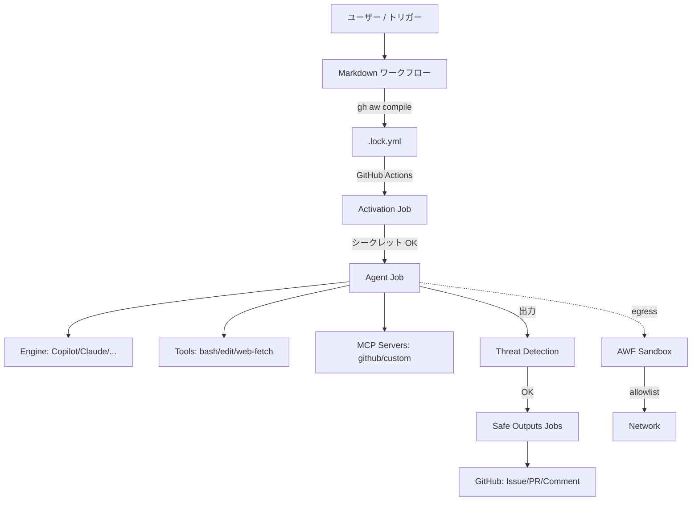

# 13 — 用語集と概念マップ

> _gh-aw v0.61.0 ベース · 最終確認 2026-04_

GitHub Agentic Workflows で頻出する用語の A-Z 集。各エントリにクロスリンク付き。

## TL;DR

- **gh-aw**: GitHub CLI 拡張。Markdown を `.lock.yml` (GitHub Actions ワークフロー) にコンパイル。
- **Agentic Workflow**: AI エージェントを呼び出す Markdown ファイル。frontmatter で挙動を制御。
- **Safe Outputs**: エージェント出力を構造化された安全な GitHub アクションに変換するレイヤ。
- **AWF**: Agentic Workflow Firewall。Squid + iptables ベースのネットワークサンドボックス。
- **MCP**: Model Context Protocol。外部ツール/データソースをエージェントに接続。
- **Threat Detection**: 出力前にプロンプトインジェクションや機密漏洩を検出。
- **Lockdown / Strict Mode**: セキュリティのデフォルト挙動を厳格化するモード。

## 用語集

### A

**Action SHA pin** — `actions/checkout@<SHA>` のように、タグ/ブランチではなく SHA で固定する手法。サプライチェーン攻撃を防ぐ。`actions-lock.json` で集中管理。

**Activation job** — 各 lock file の最初に走るジョブ。シークレット存在確認、トリガー条件評価、エージェント起動の前提を整える。失敗するとエージェントジョブはスキップされる。

**Agent** — gh-aw 内で 2 つの意味:
1. ディスパッチャ用の `.agent.md` ファイル(`disable-model-invocation: true`)
2. 一般に「エージェント」=ワークフロー内で動作する AI 主体

**Agentic Workflow** — `.github/workflows/<name>.md` の Markdown ファイル。frontmatter で設定、本文でプロンプト記述。

**Agentics** — `githubnext/agentics` リポジトリ。公式の上流ワークフロー集(import 元)。

**AWF** — Agentic Workflow Firewall。Squid + iptables 構成のエージェント用 egress プロキシ。`network:` 設定の実装。詳細は [07](./07-awf-firewall-and-sandbox.ja.md)。

### B

**Bash allowlist** — `tools.bash:` で明示許可されたコマンドのみ実行可能。デフォルト: `echo, ls, pwd, cat, head, tail, grep, wc, sort, uniq, date`。ワイルドカード(`git:*`)でファミリ指定可。

### C

**Cache memory** — `cache-memory:` で過去実行間の状態を保持(GitHub Actions cache 経由)。

**Codemod** — `gh aw fix --write` で適用される自動コード変換。非推奨フィールドの書き換え等。

**Command trigger** — `on: command: { name: foo }` でスラッシュコマンド `/foo` をトリガーに。

**Compile** — `gh aw compile` で `.md` から `.lock.yml` を生成。frontmatter 変更時に必須。

**Copilot engine** — `engine: copilot`。GitHub Copilot を LLM バックエンドとして利用。

### D

**Defaults (network)** — `network.allowed: [defaults]` でインフラ系ドメイン(NTP, DNS, Ubuntu リポジトリ等)を許可。空 allowlist でも自動許可される点に注意。

**Dispatcher agent** — `disable-model-invocation: true` のエージェントファイル。Copilot Chat からのリクエストを `prompts/` 配下にルーティング。

### E

**Ecosystem identifier** — `python`, `node`, `containers` 等の名前で関連ドメイン群をまとめて許可。strict-mode で必須。

**Engine** — エージェントを駆動する LLM バックエンド。`copilot`, `claude`, `codex`, `gemini`, `crush` の 5 種。詳細は [02](./02-engines.ja.md)。

### F

**Frontmatter** — `.md` 先頭の YAML ブロック。トリガー、権限、ツール、エンジン、safe outputs 等を定義。詳細は [03](./03-frontmatter-reference.ja.md)。

**Fuzzy schedule** — `schedule: daily` 等の人間語形式。コンパイル時にファイルパスベースで時刻が決定論的に分散される。

### G

**GitHub MCP** — GitHub API への MCP インターフェイス。`tools.github:` 配下で toolset, lockdown, allowed-repos 等を設定。

### I

**Imports** — `imports:` で他ワークフローや共通コンポーネントを取り込み。BFS 解決、循環検出、`with:` パラメータ化対応。

**Inputs (workflow_dispatch)** — 手動実行時のパラメータ。`${{ inputs.X }}` で本文参照。

### L

**Lock file** — `.lock.yml`。`.md` から生成された通常の GitHub Actions YAML。実行されるのはこれ。

**Lockdown** — `tools.github.lockdown: true`(公開リポジトリのデフォルト)。非信頼ユーザーコンテンツをフィルタ。

### M

**Max turns** — Claude エンジン用。エージェントの反復回数上限。

**MCP** — Model Context Protocol。エージェントが外部ツールにアクセスする標準プロトコル。詳細は [05](./05-tools-and-mcp.ja.md)。

**MCP Gateway / MCPG** — `gh-aw-mcpg` リポジトリ。MCP サーバを集約・ルーティングするゲートウェイ。

**Min-integrity** — `tools.github.min-integrity: approved` 等で、信頼度の低い投稿者からのコンテンツをフィルタ。階層(高→低): `merged > approved > unapproved > none > blocked`。公開リポジトリは自動で `approved`。詳細は [17 — Min-Integrity & Content Trust](./17-min-integrity-and-content-trust.ja.md)。

### N

**Network sandbox** — AWF 提供の egress 制御。`network:` で設定。

### P

**Prompt injection** — 信頼できないコンテンツ内に攻撃命令が埋め込まれる脅威。`threat-detection` ジョブで検出。

### R

**Redirect** — ファイル移動時に `redirect:` で旧パス→新パスを示す。`gh aw update` が追跡。

### S

**Safe Outputs** — エージェントの自由記述出力を、構造化された GitHub 操作(Issue 作成、PR 作成、コメント等)に変換するレイヤ。約 30 種類。詳細は [06](./06-safe-outputs-catalog.ja.md)。

**Schedule** — cron または fuzzy 形式でのスケジュール実行。

**Secret leak detection** — `threat-detection` ジョブの一機能。出力に含まれるトークン/キー疑いを検出。

**Slash command** — `/foo` 形式の Issue/PR コメントトリガー。`on: command:` で設定。

**Source pointer** — `source: owner/repo/workflows/X.md@ref` で上流ワークフローを参照。`gh aw update` で更新追従。

**SSL bump** — AWF 機能。HTTPS トラフィックを復号して URL パス単位で許可制御。`network.firewall.ssl-bump: true`。

**Strict mode** — gh-aw のデフォルト動作。書き込み権限の禁止、ワイルドカード `*` 禁止、エコシステム識別子強制、SHA pin 強制、非推奨フィールド禁止等。

**Stop after** — `stop-after:` で実行時間を制限。試験運用に有用。

### T

**Threat detection** — エージェント出力前に走る別エージェントによるレビュー。プロンプトインジェクション、機密漏洩を検出。詳細は [08](./08-threat-detection-and-xpia.ja.md)。

**Three trust layers (Layer 1 / 2 / 3)** — アーキテクチャにおける 3 つの信頼レイヤ:
- **Layer 1 (Substrate / 基盤)** — ハードウェア、カーネル、コンテナランタイム、AWF、API プロキシ、MCP Gateway
- **Layer 2 (Configuration / 構成)** — 宣言的設定とそれを解釈するツールチェーン。認証トークンはインポートされた capability として扱う
- **Layer 3 (Plan / 計画)** — 信頼されたコンパイラがワークフローをステージに分解し、各ステージで有効なコンポーネント・権限・データ・後段への引き渡し方を明示する。SafeOutputs はその主要な具現化

詳細は [01 — Architecture & Security](./01-architecture-and-security.ja.md)。

**Toolset** — `tools.github.toolsets: [issues, pull_requests]` 等。GitHub MCP の API 範囲を限定。

**Trial** — `gh aw trial` で本番影響なくワークフローを試行。

### W

**Web-fetch / web-search** — エージェントが URL を取得・検索するツール。`tools.web-fetch:` / `tools.web-search:` で有効化。

**With** — `imports:` の `with:` パラメータ。共通コンポーネントへの引数渡し。`${{ github.aw.import-inputs.X }}` で参照。

### X

**XPIA** — Cross-Prompt Injection Attack。複数のドキュメント/コメントにまたがる組み合わせ攻撃。脅威検出の主要対象の一つ。

## 概念マップ

## 関連ドキュメント

- [01 — アーキテクチャとセキュリティ](./01-architecture-and-security.ja.md)
- [03 — Frontmatter リファレンス](./03-frontmatter-reference.ja.md)
- [14 — FAQ とトラブルシューティング](./14-faq-and-troubleshooting.ja.md)
