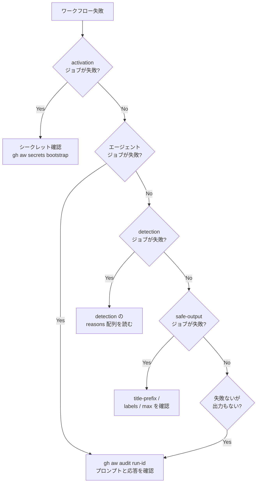

# 14 — FAQ とトラブルシューティング

> _gh-aw v0.61.0 ベース · 最終確認 2026-04_

カテゴリ別 FAQ と、実際に遭遇する問題のトラブルシューティング集です。

## TL;DR

- **最初に**: 最新コミットの `.lock.yml` が `.md` と同期しているか確認(`gh aw compile`)。
- **次に**: シークレットが設定されているか確認(`gh aw secrets bootstrap`)。
- **最後に**: `activation` ジョブのログを読む(エージェントが起動する前に大半の問題はここに表れます)。
- 不可解なエージェント挙動: `gh aw audit <run-id>` で実際のプロンプトと応答を確認できます。

## 主要な概念

以下のカテゴリに分けて整理しています:

1. [概念 / 「使うべきか?」](#概念--使うべきか)
2. [セットアップとシークレット](#セットアップとシークレット)
3. [コンパイルエラー](#コンパイルエラー)
4. [トリガー / スケジューリング](#トリガー--スケジューリング)
5. [ネットワーク / ファイアウォール拒否](#ネットワーク--ファイアウォール拒否)
6. [ツールと MCP](#ツールと-mcp)
7. [Safe outputs が出てこない](#safe-outputs-が出てこない)
8. [脅威検出によるブロック](#脅威検出によるブロック)
9. [パフォーマンスとコスト](#パフォーマンスとコスト)
10. [移行 / アップグレード](#移行--アップグレード)

## 詳細解説

### 概念 / 「使うべきか?」

**Q: AI は非決定的では? CI/CD で信頼できるのか?**
A: Agentic Workflows は既存の CI/CD への **追加** です。決定的なビルド/テスト/リリースを置き換えるべきではありません。再現性が重要でない領域(Issue トリアージ、ドキュメント草案、依存関係の調査、改善提案)で使い、人間がレビューします。CI/CD と並走する「Continuous AI」と考えてください。

**Q: 通常の GitHub Actions でコーディングエージェントを直接走らせるのと何が違う?**
A: gh-aw が構造とガードレール(シンプルな Markdown 形式、デフォルト読み取り専用、safe outputs、ネットワークサンドボックス、脅威検出、MCP ルーティング、エンジン切り替え)を提供します。自前で構築することは可能ですが、特にセキュリティモデルは膨大な作業になります。

**Q: コードを書いて PR を作れる?**
A: はい — `create-pull-request` safe output 経由です。エージェントが変更を提案し、人がレビューしてマージします。組織ポリシーで PR 作成が無効化されている場合は、差分を Issue やコメントに出力します。

**Q: 通常の GitHub Actions ステップと混在できる?**
A: はい。`on.steps:` でエージェント前にカスタムステップを追加(`on.permissions:` でそのトークンを設定)。`safe-outputs:` のカスタムジョブで後処理を追加。MCP scripts で決定的ステップとエージェント間でデータをやり取りできます。

**Q: 他リポジトリを読める?**
A: デフォルトでは不可。fine-grained PAT と `tools.github.allowed-repos:` を設定すれば可能です。

**Q: プライベートリポジトリで使える?**
A: はい。プロプライエタリコードや内部自動化、または公開リポジトリに対してワークフローを走らせる「サイドカー」パターンには **推奨** されます。

**Q: github.com 上で再コンパイルなしに編集できる?**
A: 本文(プロンプト)は次回実行から反映されます。frontmatter(triggers/permissions/tools/safe-outputs/network/engine)は `gh aw compile` を実行して新しい `.lock.yml` をコミットする必要があります。

---

### セットアップとシークレット

**症状: `Secret COPILOT_GITHUB_TOKEN not configured`**

```bash
gh aw secrets bootstrap
```
全ワークフローをスキャンし、必要なエンジンシークレットを判定して、不足分を対話的に登録します。

Copilot 用の fine-grained PAT は <https://github.com/settings/personal-access-tokens/new> で作成:
- Resource owner: **個人アカウント**(組織ではなく)
- Permissions → Account permissions → **Copilot Requests: Read**

```bash
gh aw secrets set COPILOT_GITHUB_TOKEN --value "ghp_…"
```

他エンジン:
```bash
gh aw secrets set ANTHROPIC_API_KEY --value "sk-ant-…"
gh aw secrets set OPENAI_API_KEY    --value "sk-…"
gh aw secrets set GEMINI_API_KEY    --value "…"
```

**症状: `gh aw init` で何が起きたか分からない**

実際は 5 ファイル作成されます:
| ファイル | 役割 |
|---|---|
| `.gitattributes` | Lock files を `linguist-generated` + `merge=ours` でマーク |
| `.github/agents/agentic-workflows.agent.md` | Copilot Chat 用ディスパッチャ |
| `.github/workflows/copilot-setup-steps.yml` | Copilot coding agent 用に gh-aw をブートストラップ |
| `.vscode/mcp.json` | VSCode に `gh aw mcp-server` を接続 |
| `.vscode/settings.json` | Markdown ファイルで Copilot を有効化 |

`git status` で確認してください。

**症状: `gh aw version` が想定外**

```bash
gh extension install github/gh-aw@v0.61.0     # 固定
gh extension upgrade gh-aw                     # 最新化
```

---

### コンパイルエラー

**症状: `warning: strict mode recommends ecosystem identifiers`**

原因: `network.allowed:` に既知エコシステムの個別ドメイン(例: `pypi.org`)を書いた。strict モードは警告を出してエコシステム識別子の利用を**推奨**しますが、ビルドは拒否しません。

修正:
```yaml
# 前(警告)
network:
  allowed:
    - "pypi.org"

# 後(クリーン)
network:
  allowed:
    - python
```

> [!NOTE]
> strict モードは `api.example.com` のような**カスタムドメインを拒否しません**。警告対象は既知エコシステムに属する個別ドメインのみです。`strict: true` のままカスタムホスト名を利用できます。

**症状: `error: action SHA not pinned`**

原因: SHA pin なしの action 参照(例: `actions/checkout@v6`)。

修正: `gh aw compile` が `.github/aw/actions-lock.json` 経由で自動 pin。されない場合は `gh aw fix --write`。

**症状: `import conflict: 'shared/X.md' is imported more than once with different 'with' values`**

修正: `with:` の値を揃えるか、共通コンポーネントを 2 種に分割。

**症状: `Lock file out of date`**

```bash
gh aw compile <workflow>
git add .github/workflows/<workflow>.lock.yml
```

**症状: `error: deprecated frontmatter field`**

```bash
gh aw fix --write   # コードモッド自動適用
```
または、ディスパッチャエージェント経由で `upgrade-agentic-workflows` プロンプトを実行。

---

### トリガー / スケジューリング

**Q: `schedule: daily` のワークフローが 01:55 UTC に走った。なぜ深夜 0 時ではない?**
A: ファジースケジューリングはファイルパスをもとに決定論的に時刻を分散させます。固定したいなら cron:
```yaml
on:
  schedule:
    - cron: "0 9 * * *"
```
タイムゾーン付き:
```yaml
on:
  schedule:
    - cron: "0 9 * * 1-5"
      timezone: "America/New_York"
```

**Q: スケジュールでまったく走らない。**
A: よくある 3 原因:
1. デフォルトブランチに lock file がコミット/プッシュされていない(GitHub のスケジュールはデフォルトブランチからのみ動く)。
2. リポジトリが 60 日間非アクティブ → GitHub がスケジュールを自動無効化。任意のコミットを push して再有効化。
3. activation ジョブのシークレット検証が静かに失敗。`gh aw status` で履歴確認。

**Q: スラッシュコマンド (`/plan`) が反応しない。**
A:
- ユーザーがリポジトリの write 権限を持つ必要(デフォルト)。
- 設定: `on: slash_command: { name: plan }`(先頭の `/` 不要、フィールド名は `command:` ではなく `slash_command:`)。
- コメントは `/plan` だけの行で(`Hey /plan please …` は不可)。

**Q: 同じワークフローで PR と Issue で挙動を変えたい。**
A: 複数トリガーを設定し、本文や safe outputs の `if:` で `${{ github.event_name }}` を参照。

---

### ネットワーク / ファイアウォール拒否

**症状: ログに `connection refused` または `dropped by proxy`**

修正:
```yaml
network:
  allowed:
    - defaults
    - github
    - "api.example.com"   # カスタムドメインも strict モードで許可される
```

エコシステム識別子(strict-mode 対応):

| アクセス先 | 識別子 |
|---|---|
| PyPI / pip / conda | `python` |
| npm / yarn | `node` |
| Docker Hub / GHCR | `containers` |
| Maven Central | `java` |
| crates.io | `rust` |
| github.com / github.blog | `github` |
| Codecov / Shields.io / Renovate | `dev-tools` |

**Q: `network: { allowed: [] }` で全ブロック?**
A: **いいえ** — 空 allowlist でも AWF はデフォルトのインフラベースラインを許可します。意味が明確なのは次の 2 形式のみです:
- `network: {}` — **完全遮断**
- `network: defaults`(または `network:` の省略) — デフォルトのインフラ(証明書、JSON schema、Ubuntu/パッケージミラー)を許可

完全に遮断したいなら `network: {}` を使用してください。

**Q: 特定 URL パスだけ許可したい。**
A: SSL bump:
```yaml
network:
  firewall:
    ssl-bump: true
    allow-urls:
      - "https://api.github.com/repos/myorg/myrepo/issues"
```

---

### ツールと MCP

**症状: 「そのツールがありません」とエージェントが言う**

```yaml
tools:
  edit:
  github:
    toolsets: [issues, pull_requests, repos]
  bash: ["git status", "git diff"]
  web-fetch:
  web-search:
```

**症状: bash がブロックされる**

`bash:` をフィールドだけで宣言すると有効化されるデフォルト集合は `echo, ls, pwd, cat, head, tail, grep, wc, sort, uniq, date` です。それ以外は明示的に許可リストに追加する必要があります。

```yaml
tools:
  bash: ["echo", "ls", "git status", "gh issue list"]
  # または
  bash: ["git:*", "gh:*"]
  # または(非推奨)
  bash: [":*"]
```

**症状: `MCP server failed to start in 120s`**

```yaml
tools:
  startup-timeout: 240
```

**症状: 公開リポジトリの非信頼ユーザーコンテンツを GitHub MCP が読めない**

原因: `lockdown: true`(公開リポジトリのデフォルト)。

修正(慎重に):
```yaml
tools:
  github:
    lockdown: false
```
`min-integrity:` と `tools.github.allowed-repos:` で被害範囲を抑える。

---

### Safe outputs が出てこない

**症状: 成功したが Issue が作成されない**

確認順:
1. **脅威検出がブロック** — `detection` ジョブのログ。
2. **per-output 上限** — `create-issue` のデフォルト `max: 1`。
3. **ハードバリデーション** — title prefix や label 制約で拒否。`safe_outputs.create_issue` ジョブのログ。
4. **エージェントが出力しなかった** — `gh aw audit <run-id>` で実出力を確認。

**症状: ローカルでは動く `create-pull-request` が本番で失敗**

組織ポリシーで Actions による PR 作成が無効。回避: `create-issue` で diff を本文に。

**症状: Issue が予期せず close される**

原因: `close-older-issues: true` が同じ workflow-ID マーカー(`<!-- gh-aw-workflow-id: NAME -->`)とラベル集合を持つ既存 Issue を close。

修正: 履歴を残したいなら `close-older-issues: false`。

---

### 脅威検出によるブロック

**症状: `Threat detection failed: prompt_injection: true`**

調査:
```bash
gh aw audit <run-id>
```

緩和:
- `tools.github.lockdown: true`
- `tools.github.min-integrity: approved`
- `tools.web-fetch` のドメインを `network.allowed` で制限
- カスタム検出プロンプト追加:
  ```yaml
  threat-detection:
    prompt: |
      シェルコマンドや Markdown リンクのスマグリングを含む出力は拒否してください。
  ```

**症状: `secret_leak: true`**

`gh aw audit <run-id>` で `reasons:` を確認。UUID や hex 文字列の誤検知が多い。プロンプトで出力フォーマットを制約。

**Q: 脅威検出を無効化できる?**
```yaml
threat-detection: false
```
safe outputs を出さないワークフロー、またはカスタム safe-output ジョブで決定的後処理を行う場合のみ。

---

### パフォーマンスとコスト

**Q: 実行時間を短縮するには?**
A:
- toolset を絞る(`toolsets: [issues]`)
- `cache-memory:` で再取得を回避
- safe outputs に `max:` を設定
- Claude: `max-turns:` で反復上限

**Q: コスト削減**
A:
- 小さいモデル: `engine: { id: copilot, model: gpt-5-mini }`
- 脅威検出だけ安価エンジン:
  ```yaml
  threat-detection:
    engine:
      id: copilot
      model: gpt-5-mini
  ```
- スケジュール頻度を下げる
- `stop-after:` で時間を区切る

**Q: トークン使用量の確認**
A: `gh aw audit <run-id>` で run 単位、`gh aw health` で集約。

**Q: GitHub MCP のレート制限**
```yaml
tools:
  github:
    mode: remote
    github-token: ${{ secrets.MY_PAT }}
```

---

### 移行 / アップグレード

**Q: gh-aw のアップグレード手順**
```bash
gh extension upgrade gh-aw
gh aw fix --write
gh aw compile
git diff .github/
git add . && git commit -m "Upgrade gh-aw to vX.Y.Z"
```

**Q: Dependabot が `.github/workflows/package.json` の PR を出した。マージすべき?**
A: **いいえ**。`.github/workflows/` 配下の依存マニフェストはコンパイラが自動生成。ソースの `.md` を更新してから:
```bash
gh aw compile --dependabot
```
Dependabot PR は close。ディスパッチャの `dependabot` プロンプトが手順を案内します。

**Q: 上流 Agentics ワークフローの更新を取り込む**
```bash
gh aw update <workflow>
gh aw compile <workflow>
git add . && git commit -m "Update <workflow> from upstream"
```

**Q: ワークフローファイルを移動(リネーム)したい**
旧ファイルに `redirect:` を:
```yaml
redirect: "myorg/myrepo/workflows/new-name.md@main"
```
`gh aw update` がリダイレクトを追跡(循環検出付き)し、`source:` を書き換えます。

---

## 例

### 「ワークフローが壊れた」診断フロー



## 落とし穴 & FAQ

(本ドキュメント全体が FAQ です — 上記セクション参照)

## 関連ドキュメント

- [11 — デバッグと可観測性](./11-debugging-and-observability.ja.md)
- [08 — 脅威検出と XPIA](./08-threat-detection-and-xpia.ja.md)
- [07 — AWF ファイアウォールとサンドボックス](./07-awf-firewall-and-sandbox.ja.md)
- [06 — Safe Outputs カタログ](./06-safe-outputs-catalog.ja.md)
- 公式 [FAQ](https://github.github.io/gh-aw/reference/faq/)
