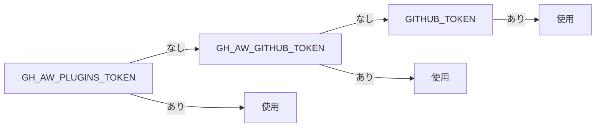

# 認証とシークレット

> _gh-aw v0.61.0 ベース_

すべての gh-aw ワークフローには **2 層の認証情報** が必要です。1 つはエージェント
を駆動する AI エンジン (Copilot、Claude、Codex、Gemini) 用、もう 1 つはエージェント
が MCP ツールおよび safe-outputs を介して行う GitHub 操作用です。本ドキュメントでは
各エンジンに対応するシークレット、デフォルトの Copilot エンジンで使用する
fine-grained PAT のセットアップ、カスタムエンドポイント (Azure OpenAI、GitHub
Enterprise、社内プロキシ) の指定方法、gh-aw が自動で認識する "魔法の" 環境変数を
整理します。

## TL;DR

- 各エンジンには **正規のシークレットが 1 つ** あります: `COPILOT_GITHUB_TOKEN`、
  `ANTHROPIC_API_KEY`、`OPENAI_API_KEY` (または `CODEX_API_KEY`)、`GEMINI_API_KEY`。
- Copilot エンジンには *Account → Copilot Requests: Read* 権限のみを付与した
  **fine-grained PAT** が必要 (リソースオーナーは自分のユーザーアカウント)。
- 単発の登録には `gh aw secrets set` を、ワークフローを走査して未設定の項目を対話的に
  尋ねるには `gh aw secrets bootstrap` を使います。
- カスタムエンドポイント (Azure、GHE Cloud、社内プロキシ) は `engine.env` の
  `GITHUB_COPILOT_BASE_URL`、`ANTHROPIC_BASE_URL`、`OPENAI_BASE_URL` で設定します。
  対応するホストを `network.allowed` に追加するのを忘れずに。
- `GH_AW_GITHUB_MCP_SERVER_TOKEN` は GitHub MCP サーバーが自動認識します。
  `tools.github.github-token:` を書く必要はありません。
- プライベート APM パッケージや imports については、gh-aw がトークンカスケードで
  順に試行します: `GH_AW_PLUGINS_TOKEN` → `GH_AW_GITHUB_TOKEN` → `GITHUB_TOKEN`。

## 主要概念

| 用語                              | 意味                                                                                                |
| --------------------------------- | --------------------------------------------------------------------------------------------------- |
| **Engine secret**                 | LLM プロバイダーへの呼び出しを認可する API キー (Copilot は PAT)。                                |
| **Fine-grained PAT**              | 自分のユーザーアカウントが所有する、単一権限のスコープ付き GitHub PAT。                          |
| **Magic secret**                  | フロントマター記述なしで gh-aw や MCP サーバーが自動参照するシークレット名。                     |
| **Token cascade**                 | APM パッケージや imports をダウンロードする際に gh-aw が順番に試すシークレット名のフォールバック。 |
| **カスタムエンドポイント**         | エンジンの既定ベース URL を上書きしたもの (Azure OpenAI、GHE Cloud、オンプレプロキシ)。           |

## 詳細解説

### 1. エンジン別シークレット早見表

| エンジン                | 必須シークレット           | 代替                  | 備考                                                                                                       |
| ----------------------- | -------------------------- | --------------------- | ---------------------------------------------------------------------------------------------------------- |
| **Copilot** (デフォルト) | `COPILOT_GITHUB_TOKEN`     | —                     | fine-grained PAT、リソースオーナー = ユーザーアカウント、Account → **Copilot Requests: Read** が必要。      |
| **Claude**              | `ANTHROPIC_API_KEY`        | —                     | `CLAUDE_CODE_OAUTH_TOKEN` は **未対応**。                                                                  |
| **Codex**               | `OPENAI_API_KEY`           | `CODEX_API_KEY`       | `CODEX_API_KEY` が先に試されます。Codex と通常の OpenAI 利用を併用したい場合に便利。                       |
| **Gemini**              | `GEMINI_API_KEY`           | —                     | Google AI Studio の標準 API キー。                                                                          |

> Claude は Claude デスクトップアプリで使う OAuth トークンを **受け付けません**。
> Anthropic コンソールで API キーを発行してください。

### 2. Copilot 用 fine-grained PAT

デフォルトの Copilot エンジンは *あなたのユーザーアイデンティティとして*
`api.githubcopilot.com` を呼び出します。そのため、ワークフローには非常に限定的な
権限を持つ PAT が必要です。

1. <https://github.com/settings/personal-access-tokens/new> を開きます。
2. **Resource owner**: 自分のユーザーアカウント (組織ではなく)。
3. **Repository access**: *Public repositories (read-only)* で十分です。Copilot の
   スコープはリポジトリの内容を読みません。
4. **Account permissions** → **Copilot Requests** → **Access: Read-only**。
5. 生成、コピーして以下で保存:

   ```bash
   gh aw secrets set COPILOT_GITHUB_TOKEN --value "<paste-token-here>"
   ```

6. (任意) `gh secret list` で確認。

> リソースオーナーの選択を間違えて自分が所有していない組織にしてしまうと、UI 上は
> 作成できても Copilot スコープが付与されません。

### 3. `gh aw secrets` コマンド

```bash
# 単一シークレットを登録 (デフォルトでカレントリポジトリへ書き込み)
gh aw secrets set ANTHROPIC_API_KEY --value "sk-ant-..."
gh aw secrets set ANTHROPIC_API_KEY --env "MyEnvironment" --value "..."

# .github/workflows/ 内のすべてのワークフローを走査し、参照されているシークレットを
# 検出し、未設定のものを対話的に入力させる
gh aw secrets bootstrap

# 便利オプション
gh aw secrets bootstrap --dry-run     # 何が要求されるかを確認
gh aw secrets bootstrap --org         # 組織レベルに設定
```

`bootstrap` はオンボーディングに最適です。複数のエージェントワークフローが入った
リポジトリをクローンしたら一度実行し、聞かれた順にキーを貼り付けるだけ。

### 4. カスタムエンドポイント (Azure OpenAI、GHE Cloud、プロキシ)

エンジンのベース URL は `engine.env` で上書きします。エンジンごとの変数:

| エンジン  | ベース URL 変数            |
| --------- | -------------------------- |
| Copilot   | `GITHUB_COPILOT_BASE_URL`  |
| Claude    | `ANTHROPIC_BASE_URL`       |
| Codex     | `OPENAI_BASE_URL`          |

**Codex を Azure OpenAI 経由で:**

```yaml
engine:
  id: codex
  env:
    OPENAI_BASE_URL: "https://my-azure-endpoint.openai.azure.com/openai/deployments/gpt-4o"
    OPENAI_API_KEY: ${{ secrets.AZURE_OPENAI_API_KEY }}
network:
  allowed:
    - github.com
    - my-azure-endpoint.openai.azure.com
```

**Copilot を GitHub Enterprise Cloud 経由で:**

```yaml
engine:
  id: copilot
  env:
    GITHUB_COPILOT_BASE_URL: "https://api.githubcopilot.example-ghe.com"
    COPILOT_GITHUB_TOKEN: ${{ secrets.GHE_COPILOT_TOKEN }}
network:
  allowed:
    - api.githubcopilot.example-ghe.com
    - example-ghe.com
```

> 新しいホストを必ず `network.allowed` に追加してください。AWF ファイアウォールは
> どのエンジンにも適用され、未宣言の宛先は遮断されます。

### 5. 魔法の GitHub MCP トークン

GitHub MCP サーバー (`tools.github` で使用) は、フロントマター記述なしで以下の
シークレット名を理解します。

```text
GH_AW_GITHUB_MCP_SERVER_TOKEN
```

このシークレットが存在すれば、GitHub MCP サーバーはワークフローの `GITHUB_TOKEN`
の代わりにこちらを使います。`tools.github.github-token: ${{ secrets.MY_PAT }}` を
あちこちに書かずに、別のプライベートリポジトリの読み取りや Projects API の利用を
許可する fine-grained PAT を 1 か所で渡せます。

```bash
gh aw secrets set GH_AW_GITHUB_MCP_SERVER_TOKEN --value "<fine-grained-pat>"
```

ワークフロー単位で上書きしたい場合は明示形式が優先されます。

```yaml
tools:
  github:
    github-token: ${{ secrets.WORKFLOW_SPECIFIC_PAT }}
```

### 6. APM と imports のトークンカスケード

ワークフローが `imports:` や APM パッケージを使うと、gh-aw はコンパイル時に対象の
リポジトリをクローンするためにトークンを必要とします。次の順番で探します。



- `GH_AW_PLUGINS_TOKEN` — プライベート APM リポジトリを読める fine-grained PAT を
  渡したい場合に推奨。`GITHUB_TOKEN` で届かないリポジトリ向け。
- `GH_AW_GITHUB_TOKEN` — gh-aw のクロスリポ操作全般に 1 本の PAT を使いたい場合の
  汎用トークン。
- `GITHUB_TOKEN` — ワークフローが自動で受け取るトークン。公開パッケージや、権限が
  許す同一組織内のリポジトリで動作。

トポロジに応じて設定:

```bash
gh aw secrets set GH_AW_PLUGINS_TOKEN --value "<fine-grained-pat>"
```

### 7. よくあるエラーと対処

| 症状                                                       | 原因                                                                       | 対処                                                                                            |
| ---------------------------------------------------------- | -------------------------------------------------------------------------- | ----------------------------------------------------------------------------------------------- |
| Copilot 初回呼び出しで `401 Unauthorized`                   | `COPILOT_GITHUB_TOKEN` が未設定または期限切れ                              | `gh aw secrets set COPILOT_GITHUB_TOKEN --value "..."`                                          |
| Copilot で `403`、トークンは登録済み                        | リソースオーナーを組織にしてしまい、スコープが付与されていない              | リソースオーナーを **ユーザーアカウント** にして PAT を再発行。                                  |
| Anthropic から `403`                                        | API キーではなく Claude Desktop の OAuth トークンを設定してしまった         | console.anthropic.com で `ANTHROPIC_API_KEY` を発行。                                            |
| `Network access denied: my-azure-endpoint…`                | カスタムエンドポイントのホストが AWF ファイアウォールで未許可               | `network.allowed` に追加。                                                                      |
| GitHub MCP サーバーが他のプライベートリポで 403            | デフォルト `GITHUB_TOKEN` にアクセス権がない                               | `GH_AW_GITHUB_MCP_SERVER_TOKEN` を設定するか `tools.github.github-token` を指定。                |
| `apm` ジョブがプライベートパッケージのクローンに失敗        | カスケードが `GITHUB_TOKEN` に行き着き、対象リポを読めない                | パッケージリポへの読み取り権を持つ fine-grained PAT を `GH_AW_PLUGINS_TOKEN` に設定。            |
| `Resource not accessible by integration`                  | ワークフローの `permissions:` が厳しすぎる                                | 不足しているスコープを (read-only で) `permissions:` に追加 — [権限ドキュメント](./16-permissions-and-rbac.md) 参照。 |

## 落とし穴 & FAQ

**Q: `COPILOT_GITHUB_TOKEN` を env のデフォルトとしてリポジトリにコミットしても良い?**
ダメです。GitHub Actions Secrets に保管してください。gh-aw はフロントマターのリテラルから
エンジン認証情報を読みません。

**Q: PAT はローカルでは動くのにワークフローでは 403 になる。**
ほぼリソースオーナーの罠です。ユーザーをオーナーに指定し直してください。

**Q: `GITHUB_TOKEN` で足りるのに `GH_AW_GITHUB_MCP_SERVER_TOKEN` を設定する意味は?**
ありません。追加スコープ (他のプライベートリポ、Projects、dependabot ツールセット、
リモートモード) が必要なときだけ使います。

**Q: Copilot エンジンの呼び先は?**
`api.githubcopilot.com` (`GITHUB_COPILOT_BASE_URL` で上書き可)。`defaults` 系を
使っていないなら `network.allowed` に必ず含めてください。

**Q: `COPILOT_GITHUB_TOKEN` のローテーションにデプロイは必要?**
いいえ。シークレットはワークフロー実行時に読まれるので、更新は次回実行から有効です。

**Q: シークレットをローカルでテストするには?**
エージェントを完全にローカルで動かすことはまだできませんが、
`gh aw secrets bootstrap --dry-run` でワークフローが期待するシークレット名一覧を
確認できます。

## 関連ドキュメント

- [Engines & Models](./02-engines.ja.md)
- [Frontmatter Reference](./03-frontmatter-reference.ja.md)
- [Permissions & RBAC](./16-permissions-and-rbac.ja.md)
- [APM & Dependencies](./18-apm-and-dependencies.ja.md)
- [AWF Firewall & Sandbox](./07-awf-firewall-and-sandbox.ja.md)
- [Cross-Repository Patterns](./20-cross-repo-patterns.ja.md)
