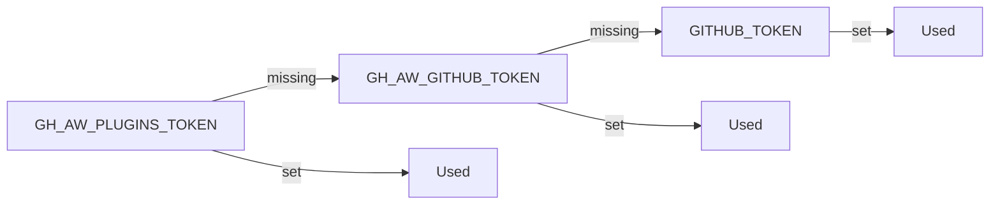

# Authentication & Secrets

> _Based on gh-aw v0.61.0_

Every gh-aw workflow needs **two layers of credentials**: one for the AI engine
that runs the agent (Copilot, Claude, Codex, Gemini) and one for the GitHub
operations the agent performs through MCP tools and safe outputs. This document
maps each engine to its required secret, walks through the fine-grained PAT
setup for the default Copilot engine, explains how to point engines at custom
endpoints (Azure OpenAI, GitHub Enterprise, internal proxies), and lists the
"magic" environment variables gh-aw recognises automatically.

## TL;DR

- Each engine has **one canonical secret**: `COPILOT_GITHUB_TOKEN`,
  `ANTHROPIC_API_KEY`, `OPENAI_API_KEY` (or `CODEX_API_KEY`), `GEMINI_API_KEY`.
- The Copilot engine needs a **fine-grained PAT** with the single permission
  *Account → Copilot Requests: Read*, owner = your user account.
- Use `gh aw secrets set` for one-off entries and `gh aw secrets bootstrap` to
  scan workflows and prompt for everything that's missing.
- Custom endpoints (Azure, GHE Cloud, internal proxies) are configured through
  `engine.env`: `GITHUB_COPILOT_BASE_URL`, `ANTHROPIC_BASE_URL`,
  `OPENAI_BASE_URL`. Don't forget to allow the host in `network.allowed`.
- `GH_AW_GITHUB_MCP_SERVER_TOKEN` is auto-recognised by the GitHub MCP server —
  no `tools.github.github-token:` indirection required.
- For private APM packages and shared imports, gh-aw walks a token cascade:
  `GH_AW_PLUGINS_TOKEN` → `GH_AW_GITHUB_TOKEN` → `GITHUB_TOKEN`.

## Key Concepts

| Term                              | Meaning                                                                                                 |
| --------------------------------- | ------------------------------------------------------------------------------------------------------- |
| **Engine secret**                 | The API key (or PAT for Copilot) that authorises calls to the LLM provider.                             |
| **Fine-grained PAT**              | A scoped GitHub personal access token with a single permission, owned by your user account.             |
| **Magic secret**                  | A secret name that gh-aw or its MCP servers look up automatically without any frontmatter wiring.       |
| **Token cascade**                 | A fallback order of secret names that gh-aw tries when downloading APM packages or imports.             |
| **Custom endpoint**               | A non-default base URL for an engine (Azure OpenAI, GitHub Enterprise Cloud, on-prem proxy).            |

## Deep Dive

### 1. Per-engine secret matrix

| Engine                  | Required secret           | Alternative           | Notes                                                                                                    |
| ----------------------- | ------------------------- | --------------------- | -------------------------------------------------------------------------------------------------------- |
| **Copilot** (default)   | `COPILOT_GITHUB_TOKEN`    | —                     | Must be a fine-grained PAT, resource owner = user account, Account → **Copilot Requests: Read**.         |
| **Claude**              | `ANTHROPIC_API_KEY`       | —                     | `CLAUDE_CODE_OAUTH_TOKEN` is **not** supported.                                                          |
| **Codex**               | `OPENAI_API_KEY`          | `CODEX_API_KEY`       | `CODEX_API_KEY` is tried first; useful when one repo runs both Codex and direct OpenAI tooling.          |
| **Gemini**              | `GEMINI_API_KEY`          | —                     | Standard Google AI Studio API key.                                                                       |

> Claude does **not** accept the OAuth token used by the Claude desktop app. You
> must mint an API key in the Anthropic Console.

### 2. Fine-grained PAT for Copilot

The default Copilot engine talks to `api.githubcopilot.com` on behalf of *your
user identity*, so the workflow needs a personal access token with one very
specific permission.

1. Open <https://github.com/settings/personal-access-tokens/new>.
2. **Resource owner**: your user account (not an organisation).
3. **Repository access**: *Public repositories (read-only)* is sufficient — the
   Copilot scope doesn't read repo contents.
4. **Account permissions** → **Copilot Requests** → **Access: Read-only**.
5. Generate, copy the token, then store it:

   ```bash
   gh aw secrets set COPILOT_GITHUB_TOKEN --value "<paste-token-here>"
   ```

6. (Optional) Verify with `gh secret list` in the repo.

> If you forget the resource-owner step and pick an org you don't own, the
> token will not have the Copilot scope even though the UI lets you create it.

### 3. `gh aw secrets` commands

```bash
# Set a single secret (writes to the current repo by default)
gh aw secrets set ANTHROPIC_API_KEY --value "sk-ant-..."
gh aw secrets set ANTHROPIC_API_KEY --env "MyEnvironment" --value "..."

# Scan all workflows in .github/workflows/, find which secrets they reference,
# and prompt interactively for any that aren't already set
gh aw secrets bootstrap

# Useful flags
gh aw secrets bootstrap --dry-run     # show what would be requested
gh aw secrets bootstrap --org         # set at org level
```

`bootstrap` is the recommended onboarding command: clone a repo with several
agentic workflows, run it once, paste keys when prompted.

### 4. Custom endpoints (Azure OpenAI, GHE Cloud, proxies)

You override the engine's base URL through `engine.env`. The relevant variables
per engine:

| Engine   | Base-URL variable          |
| -------- | -------------------------- |
| Copilot  | `GITHUB_COPILOT_BASE_URL`  |
| Claude   | `ANTHROPIC_BASE_URL`       |
| Codex    | `OPENAI_BASE_URL`          |

**Codex against Azure OpenAI:**

```yaml
engine:
  id: codex
  env:
    OPENAI_BASE_URL: "https://my-azure-endpoint.openai.azure.com/openai/deployments/gpt-4o"
    OPENAI_API_KEY: ${{ secrets.AZURE_OPENAI_API_KEY }}
network:
  allowed:
    - github.com
    - my-azure-endpoint.openai.azure.com
```

**Copilot against GitHub Enterprise Cloud:**

```yaml
engine:
  id: copilot
  env:
    GITHUB_COPILOT_BASE_URL: "https://api.githubcopilot.example-ghe.com"
    COPILOT_GITHUB_TOKEN: ${{ secrets.GHE_COPILOT_TOKEN }}
network:
  allowed:
    - api.githubcopilot.example-ghe.com
    - example-ghe.com
```

> Always update `network.allowed` to include the new host. The AWF firewall is
> enforced for every engine and will block traffic to undeclared destinations.

### 5. The magic GitHub MCP token

The GitHub MCP server (used by `tools.github`) understands one secret name
without any frontmatter wiring:

```text
GH_AW_GITHUB_MCP_SERVER_TOKEN
```

If this secret exists, the GitHub MCP server uses it instead of the workflow's
`GITHUB_TOKEN`. This is the cleanest way to give the agent a fine-grained PAT
that can read additional private repos or use the Projects API, without
sprinkling `tools.github.github-token: ${{ secrets.MY_PAT }}` everywhere.

```bash
gh aw secrets set GH_AW_GITHUB_MCP_SERVER_TOKEN --value "<fine-grained-pat>"
```

For per-workflow overrides, the explicit form still wins:

```yaml
tools:
  github:
    github-token: ${{ secrets.WORKFLOW_SPECIFIC_PAT }}
```

### 6. APM and imports token cascade

When a workflow uses `imports:` or APM packages, gh-aw needs a token to clone
the source repos at compile time. It looks for tokens in this order:



- `GH_AW_PLUGINS_TOKEN` — recommended for fine-grained PATs that can read
  private APM repos. Set this if your APM packages live in repos that
  `GITHUB_TOKEN` can't reach.
- `GH_AW_GITHUB_TOKEN` — convenience token if you want one PAT for all
  cross-repo gh-aw operations.
- `GITHUB_TOKEN` — the workflow's automatic token. Works for public packages
  and same-org repos when permissions allow.

Set whichever fits your topology:

```bash
gh aw secrets set GH_AW_PLUGINS_TOKEN --value "<fine-grained-pat>"
```

### 7. Common errors and fixes

| Symptom                                                    | Likely cause                                                               | Fix                                                                                              |
| ---------------------------------------------------------- | -------------------------------------------------------------------------- | ------------------------------------------------------------------------------------------------ |
| `401 Unauthorized` on first Copilot call                   | `COPILOT_GITHUB_TOKEN` missing or expired                                  | `gh aw secrets set COPILOT_GITHUB_TOKEN --value "..."`                                           |
| `403` from Copilot, token clearly present                  | PAT was created with org as resource owner, scope didn't apply             | Recreate PAT with **user account** as resource owner.                                            |
| `403` from Anthropic                                       | Used Claude Desktop OAuth token instead of an API key                      | Mint an `ANTHROPIC_API_KEY` in console.anthropic.com.                                            |
| `Network access denied: my-azure-endpoint…`                | Custom endpoint host not allowed by AWF firewall                           | Add the host to `network.allowed`.                                                               |
| GitHub MCP server returns 403 reading another private repo | Default `GITHUB_TOKEN` doesn't have access                                 | Set `GH_AW_GITHUB_MCP_SERVER_TOKEN` or use `tools.github.github-token`.                          |
| `apm` job fails to clone a private package                 | Token cascade resolved to `GITHUB_TOKEN`, which can't read the source repo | Set `GH_AW_PLUGINS_TOKEN` to a fine-grained PAT with read access to the package repo.            |
| `Resource not accessible by integration`                   | Workflow `permissions:` block is too restrictive                           | Add the missing scope (read-only) to `permissions:` — see [permissions doc](./16-permissions-and-rbac.md). |

## Pitfalls & FAQ

**Q: Can I commit `COPILOT_GITHUB_TOKEN` into the repo as an env default?**
No. It must live in GitHub Actions secrets. gh-aw never reads engine credentials
from frontmatter literals.

**Q: My PAT works locally but the workflow still 403s.**
Almost always the resource-owner trap. Re-create with your user as owner.

**Q: Do I need `GH_AW_GITHUB_MCP_SERVER_TOKEN` if `GITHUB_TOKEN` already works?**
No — the magic secret is only useful when you need extra scope (other private
repos, projects, dependabot toolset, remote mode).

**Q: Where does the Copilot engine call out to?**
`api.githubcopilot.com` (or the override you set with
`GITHUB_COPILOT_BASE_URL`). Make sure that host is in `network.allowed` if
you're not using the `defaults` ecosystem.

**Q: Can I rotate `COPILOT_GITHUB_TOKEN` without a deploy?**
Yes — secrets are read at workflow-run time. Updating the secret takes effect
on the next run.

**Q: How do I test secrets locally?**
You can't run the agent fully locally yet, but
`gh aw secrets bootstrap --dry-run` will tell you exactly which secret names a
workflow expects.

## Related Docs

- [Engines & Models](./02-engines.md)
- [Frontmatter Reference](./03-frontmatter-reference.md)
- [Permissions & RBAC](./16-permissions-and-rbac.md)
- [APM & Dependencies](./18-apm-and-dependencies.md)
- [AWF Firewall & Sandbox](./07-awf-firewall-and-sandbox.md)
- [Cross-Repository Patterns](./20-cross-repo-patterns.md)
