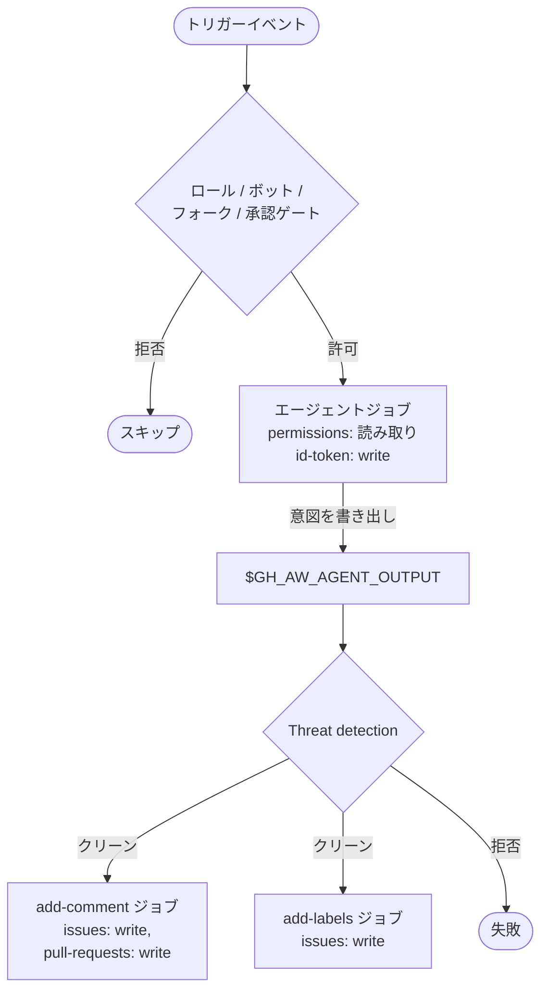

# 権限と RBAC

> _gh-aw v0.61.0 ベース_

gh-aw は通常の GitHub Actions の権限モデルを反転させます。エージェントジョブは
**read-only** で動作し、書き込みは出力タイプごとに用意された専用かつ最小権限の
ポストプロセスジョブで行われます。さらに `on:` トリガーには、人間/ボットの判定、
ロールベース、承認ゲートなどが追加され、**正しい人だけ** がワークフローを起動
できるようにします。本ドキュメントでは権限まわりの全体像を解説します。

## TL;DR

- `permissions:` は **デフォルトで read-only**。書き込みは `safe-outputs:` ジョブが
  出力ごとに必要な write スコープを付けて行います。
- ショートカットは 2 種類: `read-all` で全読み取り、`{}` で何も付与しない。
- エージェントレベルで唯一許される write スコープは `id-token: write` (OIDC) のみ。
  それ以外は `read` または `none` でなければなりません。
- アプリ専用権限 (administration、environments、組織系、ユーザー系) は常に `read`。
- `roles:`、`bots:`、`skip-roles:`、`skip-bots:` で *誰が* 起動できるかをフィルタ。
- `manual-approval: <environment>` で GitHub 環境保護ゲートを挟み、人手承認を要求。
- `forks:` でフォーク PR からの起動可否を制御。

## 主要概念

| 用語                       | 意味                                                                                                |
| -------------------------- | --------------------------------------------------------------------------------------------------- |
| **エージェントジョブ**       | LLM がツールを実行するコンテナ。read スコープのみ保持。                                            |
| **safe-output ジョブ**      | gh-aw が自動生成するポストプロセスジョブ。出力タイプごとの write スコープを持つ。                  |
| **アプリ専用権限**          | GitHub App が公開するスコープ。gh-aw は `read` を強制。                                              |
| **ロールゲート**             | アクターのリポジトリ権限 (admin、maintainer、write…) によるフィルタ。                              |
| **ボットゲート**             | 起動を許可するボットアカウントのアロー / スキップリスト。                                            |
| **環境承認**                 | required reviewers が設定された GitHub 環境を経由して、人手承認まで実行を一時停止。                |

## 詳細解説

### 1. 標準 `permissions:` スコープ

```yaml
permissions:
  contents: read           # リポジトリコード
  issues: read             # Issue
  pull-requests: read      # PR
  discussions: read
  actions: read
  checks: read
  deployments: read
  packages: read
  pages: read
  statuses: read
  id-token: write          # 唯一の `write` 許容スコープ (OIDC)
```

ショートカット 2 種:

```yaml
permissions: read-all       # 全読み取り
permissions: {}             # 何も付与しない
```

> `id-token` 以外を `write` にしようとすると strict モードのコンパイルエラーに
> なります。これは仕様であり、書き込みは `safe-outputs:` で表現するという設計思想
> を強制するためです。

### 2. アプリ専用権限 (常に `read`)

これらは GitHub MCP サーバーがメタデータを取得するためだけに gh-aw が露出させて
いる GitHub App の権限バケットです。それ以外の値は拒否されます。

**リポジトリバケット:**
`administration, environments, git-signing, vulnerability-alerts, workflows,
repository-hooks, single-file, codespaces, repository-custom-properties`

**組織バケット:**
`organization-projects, members, organization-administration,
team-discussions, organization-hooks, organization-members,
organization-packages, organization-self-hosted-runners,
organization-custom-org-roles, organization-custom-properties,
organization-custom-repository-roles, organization-announcement-banners,
organization-events, organization-plan, organization-user-blocking,
organization-personal-access-token-requests,
organization-personal-access-tokens, organization-copilot,
organization-codespaces`

**ユーザーバケット:**
`email-addresses, codespaces-lifecycle-admin, codespaces-metadata`

例:

```yaml
permissions:
  contents: read
  members: read              # 組織メンバー (read 強制)
  organization-projects: read
  id-token: write
```

### 3. トリガーレベルのアクセス制御

`on:` の下で、GitHub Actions のイベントマッチングに加えて gh-aw が複数のフィルタを
重ねます。

```yaml
on:
  issue_comment:
    types: [created]
  roles: [admin, maintainer, write]   # デフォルト
  bots: [dependabot[bot], renovate[bot]]
  skip-roles: [triage]
  skip-bots: [github-actions[bot]]
  manual-approval: production-agent
  forks: ["org/*"]                   # org/* 配下のフォーク
```

**`roles:`**
デフォルトは `[admin, maintainer, write]`。`all` に設定すると read 権限以上の
任意のユーザーを許可。`[]` にすればボット (`bots:` と組み合わせ) のみ許可。

**`bots:`**
許可するボットログインのリスト。ここに無いボットからのトリガーはデフォルトで拒否
されます。

**`skip-roles:` / `skip-bots:`**
マッチしたアクターを除外。ノイジーな自動化を黙らせるのに便利。

**`manual-approval:`**
GitHub の *環境* を指定します。エージェントジョブは `environment: <name>` を
付けて実行され、必須レビュアー / wait-timer 設定が適用されます。これが正規の
"human-in-the-loop" スイッチです。

**`forks:`**
デフォルトは *フォーク PR を許可しない* (セキュア優先)。`["*"]`、`["owner/*"]`、
`["owner/repo"]` のパターン配列でフォーク元を明示できます。

### 4. エンドツーエンドの例

メンテナーと一部の信頼ボットがスラッシュコマンドで起動でき、人手承認を経て実行され、
1 つの提携組織からのフォーク PR のみ受け付けるワークフロー:

```yaml
---
on:
  slash_command: triage-bot
  pull_request:
    types: [opened, synchronize]
  roles: [admin, maintainer]
  bots: [renovate[bot]]
  skip-bots: [dependabot[bot]]
  manual-approval: agent-approvals
  forks: ["partner-org/*"]

permissions:
  contents: read
  issues: read
  pull-requests: read
  members: read
  id-token: write

engine: copilot

safe-outputs:
  add-comment:
  add-labels:
    max: 3
---
```

### 5. ジョブ間の権限分離



エージェントは `issues: write` も `contents: write` も保持しません。各 safe-output
ジョブは、その出力に必要な *最小限* の書き込みスコープだけを与えられて生成されます。

### 6. カスタム GitHub App / トークン

エージェントの GitHub MCP 呼び出しに追加スコープが必要な場合 (例: 別のプライベート
リポを読みたい) は、次のいずれかが推奨です:

- `tools.github.github-token: ${{ secrets.MY_PAT }}` に fine-grained PAT を渡す
- 魔法のシークレット `GH_AW_GITHUB_MCP_SERVER_TOKEN` を設定 ([認証ドキュメント](./15-auth-and-secrets.ja.md) 参照)
- アクティベーションジョブの `github-app:` フィールドで GitHub App を渡す

これらは ワークフローの `permissions:` ブロックを変更しません。エージェントジョブ
内の MCP サーバーが使うアイデンティティを切り替えるだけです。

## 落とし穴 & FAQ

**Q: ブランチを push したいので `contents: write` を付けたい。**
`safe-outputs.push-to-pull-request-branch` か `safe-outputs.create-pull-request`
を使ってください。生成されるジョブが `contents: write` を持ち、エージェントは
read-only のままです。

**Q: なぜ strict モードは `issues: write` を拒否するのか?**
エージェント本体に持たせるべきではないからです。`add-comment` の safe-output
ジョブが自動的に `issues: write` を宣言します。

**Q: `permissions:` を空にしても問題ない?**
はい。`permissions: {}` は有効です。その場合 GitHub MCP サーバーの読み取りが
非常に限定されるため、追加で `tools.github.github-token` を渡してください。

**Q: ロールゲートはどうやって自分を判定するのか?**
gh-aw はリポジトリのコラボレーター API でトリガーアクターを解決します。組織所有の
ボットは `[bot]` アクターとして扱われます。

**Q: `manual-approval:` はスケジュール実行もブロックする?**
はい。環境保護ルールはすべての実行 (`schedule:` トリガー含む) に適用されます。
required reviewers をそれに合わせて設定してください。

**Q: フォーク PR トリガーが発火しない。**
デフォルトで `forks:` は未設定 = フォーク PR は遮断されます。フォークパターンを
明示してください。なお GitHub Actions 自体もフォーク PR からのシークレット参照を
制限している点に注意。

**Q: ロールではなくチームメンバーシップでゲートしたい。**
`roles: all` に設定し、`skip-if-no-match:` クエリで org-team API を呼んでアクター
を検証する、または `manual-approval:` でそのチームに限定した環境を使ってください。

## 関連ドキュメント

- [Architecture & Security Model](./01-architecture-and-security.ja.md)
- [Triggers & Scheduling](./04-triggers-and-scheduling.ja.md)
- [Safe-Outputs Catalog](./06-safe-outputs-catalog.ja.md)
- [Authentication & Secrets](./15-auth-and-secrets.ja.md)
- [min-integrity & Content Trust](./17-min-integrity-and-content-trust.ja.md)
