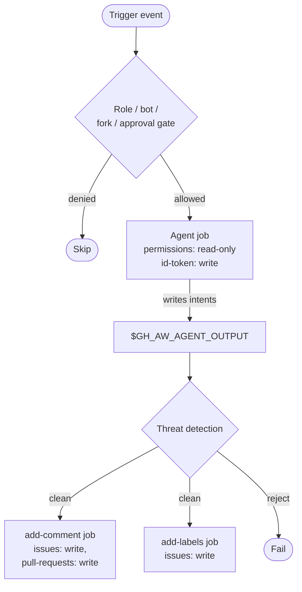

# Permissions & RBAC

> _Based on gh-aw v0.61.0_

gh-aw inverts the usual GitHub Actions permission model: the agent job runs
with **read-only** scopes, and writes happen in dedicated, narrowly scoped
post-processing jobs. On top of that, `on:` triggers grow several
human-vs-bot, role-based, and approval gates so that the **right people** can
launch the workflow. This document walks through the entire permissions surface.

## TL;DR

- `permissions:` is **read-only by default**. Writes go through `safe-outputs:`
  jobs, which add the necessary write scopes per output.
- Two shortcuts: `read-all` grants every readable scope, `{}` grants nothing.
- The single legitimate write scope at the agent level is `id-token: write`
  (for OIDC). Everything else must be `read` or `none`.
- App-only permissions (administration, environments, organisation buckets,
  user buckets) must always be `read`.
- `roles:`, `bots:`, `skip-roles:`, `skip-bots:` filter *who* can trigger.
- `manual-approval: <environment>` puts the agent behind a GitHub
  environment-protection gate (human-in-the-loop).
- `forks:` controls whether PRs from forks can trigger the workflow at all.

## Key Concepts

| Term                       | Meaning                                                                                                  |
| -------------------------- | -------------------------------------------------------------------------------------------------------- |
| **Agent job**              | The container in which the LLM runs tools — must hold only read scopes.                                  |
| **Safe-output job**        | A separate post-processing job created by gh-aw; carries write scopes for one output type.               |
| **App-only permission**    | A scope that GitHub Apps surface; gh-aw enforces `read`.                                                  |
| **Role gate**              | Filter on the actor's repository role (admin, maintainer, write, …).                                     |
| **Bot gate**               | Allow- or skip-list of bot accounts permitted to trigger the workflow.                                   |
| **Environment approval**   | A GitHub environment with required reviewers used to pause the agent until a human approves.             |

## Deep Dive

### 1. The standard `permissions:` scopes

```yaml
permissions:
  contents: read           # repository code
  issues: read             # issues
  pull-requests: read      # PRs
  discussions: read
  actions: read
  checks: read
  deployments: read
  packages: read
  pages: read
  statuses: read
  id-token: write          # ONLY valid `write` scope (OIDC)
```

Two shortcuts:

```yaml
permissions: read-all       # every readable scope
permissions: {}             # explicitly grant nothing
```

> Trying to set anything other than `id-token` to `write` triggers a strict-mode
> compile error. The intent is uncomfortable on purpose: writes belong in
> `safe-outputs:`.

### 2. App-only permissions (always `read`)

These map to GitHub App permission buckets that gh-aw exposes solely for the
GitHub MCP server (so it can query metadata). Any other value is rejected.

**Repository bucket:**
`administration, environments, git-signing, vulnerability-alerts, workflows,
repository-hooks, single-file, codespaces, repository-custom-properties`

**Organisation bucket:**
`organization-projects, members, organization-administration,
team-discussions, organization-hooks, organization-members,
organization-packages, organization-self-hosted-runners,
organization-custom-org-roles, organization-custom-properties,
organization-custom-repository-roles, organization-announcement-banners,
organization-events, organization-plan, organization-user-blocking,
organization-personal-access-token-requests,
organization-personal-access-tokens, organization-copilot,
organization-codespaces`

**User bucket:**
`email-addresses, codespaces-lifecycle-admin, codespaces-metadata`

Example:

```yaml
permissions:
  contents: read
  members: read              # org members (read-only forced)
  organization-projects: read
  id-token: write
```

### 3. Trigger-level access controls

Under `on:`, gh-aw layers several filters on top of GitHub Actions' built-in
event matching.

```yaml
on:
  issue_comment:
    types: [created]
  roles: [admin, maintainer, write]   # default
  bots: [dependabot[bot], renovate[bot]]
  skip-roles: [triage]
  skip-bots: [github-actions[bot]]
  manual-approval: production-agent
  forks: ["org/*"]                   # forks owned by org/*
```

**`roles:`**
Defaults to `[admin, maintainer, write]`. Set to `all` to allow anyone with at
least *read* access. Use `[]` to allow only bots (combined with `bots:`).

**`bots:`**
Allow-list of bot logins. By default, bot triggers are rejected unless the bot
appears here.

**`skip-roles:` / `skip-bots:`**
Exempt actors that match. Useful for muting noisy automation.

**`manual-approval:`**
Names a GitHub *environment*. The agent job will run with
`environment: <name>`, picking up its required-reviewers / wait-timer
configuration. This is the canonical "human-in-the-loop" knob.

**`forks:`**
Defaults to *no fork PRs* (security default). Pass an array of patterns
(`["*"]`, `["owner/*"]`, `["owner/repo"]`) to allow specific fork sources.

### 4. End-to-end example

A workflow that lets maintainers and a couple of trusted bots trigger via
slash command, requires a human approval before running, and accepts fork PRs
only from one partner organisation:

```yaml
---
on:
  slash_command: triage-bot
  pull_request:
    types: [opened, synchronize]
  roles: [admin, maintainer]
  bots: [renovate[bot]]
  skip-bots: [dependabot[bot]]
  manual-approval: agent-approvals
  forks: ["partner-org/*"]

permissions:
  contents: read
  issues: read
  pull-requests: read
  members: read
  id-token: write

engine: copilot

safe-outputs:
  add-comment:
  add-labels:
    max: 3
---
```

### 5. How permissions split between jobs



The agent never holds `issues: write` or `contents: write`. Each safe-output
job is generated with the *minimum* write scopes for that single output.

### 6. Custom GitHub App / token

When you need extra scope for the agent's GitHub MCP calls (for example to read
another private repo), prefer either:

- a fine-grained PAT in `tools.github.github-token: ${{ secrets.MY_PAT }}`, or
- the magic secret `GH_AW_GITHUB_MCP_SERVER_TOKEN` (see [auth doc](./15-auth-and-secrets.md)),
- or a GitHub App via the activation-job `github-app:` field.

These do **not** change the workflow's `permissions:` block — they change the
identity used by the MCP server inside the agent job.

## Pitfalls & FAQ

**Q: My workflow needs `contents: write` to push a branch. What now?**
Use `safe-outputs.push-to-pull-request-branch` or
`safe-outputs.create-pull-request`. The generated job carries `contents: write`;
the agent stays read-only.

**Q: Why does strict mode reject `issues: write`?**
Because the agent itself shouldn't have it. The safe-output job for
`add-comment` already declares `issues: write` automatically.

**Q: Can I keep `permissions:` empty?**
Yes — `permissions: {}` is valid. The GitHub MCP server may then have very
limited read access; supply a token via `tools.github.github-token` if the
agent needs more.

**Q: How do role gates know who I am?**
gh-aw resolves the triggering actor against the repository collaborators API.
Org-owned bots count as `[bot]` actors.

**Q: Does `manual-approval:` block scheduled runs too?**
Yes — environment protection rules apply to every run, including
`schedule:` triggers. Configure the environment with required reviewers
accordingly.

**Q: My fork-PR trigger never fires.**
By default `forks:` is unset, which means fork PRs are blocked. Add the fork
patterns explicitly, and remember that GitHub Actions itself restricts secret
exposure to fork PRs.

**Q: Can I gate by team membership rather than role?**
Use `roles: all` and add a `skip-if-no-match:` query that calls the org-team
API to validate the actor — or use `manual-approval:` with an environment
restricted to the team.

## Related Docs

- [Architecture & Security Model](./01-architecture-and-security.md)
- [Triggers & Scheduling](./04-triggers-and-scheduling.md)
- [Safe-Outputs Catalog](./06-safe-outputs-catalog.md)
- [Authentication & Secrets](./15-auth-and-secrets.md)
- [min-integrity & Content Trust](./17-min-integrity-and-content-trust.md)
