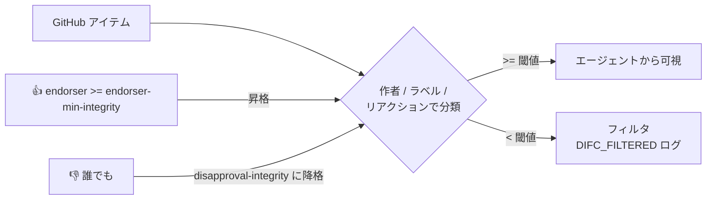

# `min-integrity` とコンテンツ信頼

> _gh-aw v0.61.0 ベース_

エージェントが GitHub から Issue やコメント、PR の内容を読むということは、
**ユーザー入力** を読むということであり、そこにはプロンプトインジェクションが
混ざり得ます。gh-aw の `min-integrity` 機構は、各 GitHub コンテンツを *作成者の信頼度*
(と出所) で分類し、エージェントが読み取ってよい最低水準を設定できるようにします。
水準に満たないものはフィルタされ、エージェントには見えなくなりますが、実行ログには
記録されます。

## TL;DR

- 信頼度の階層 (高 → 低): `merged > approved > unapproved > none > blocked`。
- **公開リポ** はデフォルトで `min-integrity: approved`。**プライベートリポ** には
  デフォルトなし (全て通る)。
- `allowed-repos:` でエージェントの GitHub MCP サーバーが読めるリポジトリを限定
  (`"all"`、`"public"`、`["org/*"]` のようなパターン配列)。
- `blocked-users:`、`trusted-users:`、`approval-labels:` でアクター単位 / ラベル単位の
  分類を調整。
- `integrity-proxy: true` (デフォルト) は事前ステップの `gh` CLI 呼び出しにも同じ
  フィルタを適用。ブートストラップ段階から信頼コンテンツのみ見えるように。
- `features.integrity-reactions: true` (v0.68.2+) で、リアクション (👍 / ❤️ で昇格、
  👎 / 😕 で降格) による信頼シグナルを有効化。
- フィルタされた項目は実行ログに `DIFC_FILTERED` イベントとして表示。

## 主要概念

| 用語                     | 意味                                                                                                          |
| ------------------------ | ------------------------------------------------------------------------------------------------------------- |
| **Integrity level**      | gh-aw が GitHub アイテムに付与する分類 (`merged`、`approved`、`unapproved`、`none`、`blocked`)。              |
| **min-integrity 閾値**   | 受け入れる最低水準。これを下回るアイテムはエージェントに渡る前にフィルタされる。                              |
| **Author association**   | リポに対するアクターの関係性 (`OWNER`、`MEMBER`、`COLLABORATOR`、`CONTRIBUTOR` 等) の GitHub 表現。           |
| **DIFC**                 | Dynamic Information Flow Control。信頼度に基づいてフィルタリングを行う gh-aw のサブシステム。                |
| **Integrity proxy**      | 事前ステップの gh CLI を包み、閾値以上のアイテムだけ返すラッパー。                                            |
| **Approval label**       | 付与すると分類を昇格させるリポジトリラベル (例: `human-reviewed`)。                                            |

## 詳細解説

### 1. 信頼度階層

```
merged > approved > unapproved > none > blocked
```

| Level         | 適用条件                                                                                                                                                  |
| ------------- | --------------------------------------------------------------------------------------------------------------------------------------------------------- |
| `merged`      | マージ済み PR、デフォルトブランチから到達可能なコミット。                                                                                                  |
| `approved`    | 作者が `OWNER`、`MEMBER`、`COLLABORATOR`、**公開リポ** の非フォーク PR、**プライベートリポの全アイテム**、信頼ボット、`trusted-users:` のユーザー。      |
| `unapproved`  | `CONTRIBUTOR` または `FIRST_TIME_CONTRIBUTOR`。                                                                                                            |
| `none`        | それ以外 (`FIRST_TIMER`、`NONE` を含む)。                                                                                                                  |
| `blocked`     | `blocked-users:` に該当する作者。常に拒否。                                                                                                                |

> 公開リポは自動的に `min-integrity: approved`。プライベートリポはデフォルトなしです。
> フィルタしたい場合は明示的に設定してください。

### 2. 設定面

```yaml
tools:
  github:
    min-integrity: approved
    allowed-repos: ["myorg/*", "partner/shared-repo"]
    blocked-users: ["spam-bot"]
    trusted-users: ["contractor-1"]
    approval-labels: ["human-reviewed", "safe-for-agent"]
    integrity-proxy: true                # デフォルト
```

`allowed-repos` は次を受け付けます:

- `"all"` — デフォルト。トークンが届く全リポ。
- `"public"` — 公開リポのみ。
- glob パターン配列: `["myorg/*", "partner/shared-repo"]`。

`approval-labels` は *昇格* 機構です。これらのラベルが付いたアイテムは作者の関係性
に関わらず `approved` として扱われます。

### 3. 水準の選び方

| 設定値           | エージェントに見えるもの                                                                                                                                   | 採用シーン                                                                                          |
| ---------------- | ---------------------------------------------------------------------------------------------------------------------------------------------------------- | --------------------------------------------------------------------------------------------------- |
| `merged`         | マージ済み PR と デフォルトブランチコミットのみ。                                                                                                          | コードを読む高リスク自動化 (リリースノート生成など)。                                              |
| `approved`       | オーナー / メンバー / コラボレーター / 信頼ユーザー、プライベートリポ全件。                                                                                | **公開リポのデフォルト。** トリアージ、計画、要約系。                                              |
| `unapproved`     | 上記に first-time contributor と通常 contributor を追加。                                                                                                  | 初回貢献者向けオンボーディングヘルパー。                                                          |
| `none`           | `blocked` 以外すべて。                                                                                                                                     | 全コメントを読む必要があり、別の防御層を併用する公開コミュニティボット。                          |
| `blocked`        | 何も許可されない (`blocked-users:` 自身の用途のみ)。                                                                                                       | ユーザー単位の拒否リスト。                                                                          |

### 4. 事前ステップの integrity proxy

`integrity-proxy: true` (デフォルト) は *事前ステップ* の `gh` CLI を包み、`gh issue list`
や `gh pr view` などが閾値以上のアイテムだけを返すようにします。`false` にすると
ラッパーが外れ、生の `gh` 出力が得られます (独自フィルタ実装がある場合に有用)。

```yaml
tools:
  github:
    min-integrity: approved
    integrity-proxy: false   # 自前でフィルタする
```

### 5. リアクションベースの信頼シグナル (v0.68.2+)

実験機能を有効化:

```yaml
features:
  integrity-reactions: true

tools:
  github:
    min-integrity: approved
    endorsement-reactions: ["THUMBS_UP", "HEART"]
    disapproval-reactions: ["THUMBS_DOWN", "CONFUSED"]
    endorser-min-integrity: approved
    disapproval-integrity: none
```

挙動:

- *自身の信頼度が `endorser-min-integrity` 以上* のユーザーが
  `endorsement-reactions` のいずれかでリアクションすると、アイテムは `approved`
  に **昇格**。
- 任意のユーザーが `disapproval-reactions` でリアクションすると、アイテムは
  `disapproval-integrity` (例: `none`) に **降格** = 実質フィルタ。
- 評価はアイテム単位。降格が同点では優先。

これにより、人手レビュアーが微妙な Issue に 👍 して bot に拾わせたり、明白な荒らし
コメントに 👎 してリポ全体で除外したりできます。



### 6. DIFC ログイベント

フィルタされた各アイテムは `DIFC_FILTERED` イベントとして記録されます。
ワークフロー実行ログ、または `gh aw runs view` で確認可能:

```
DIFC_FILTERED type=issue_comment id=12345 author=spam-bot reason=blocked
DIFC_FILTERED type=issue id=42 author=newcomer association=FIRST_TIMER required=approved
DIFC_FILTERED type=pull_request id=99 reason=demoted-by-reaction
```

エージェントが特定アイテムを "見落とした" 理由のデバッグに使えます。

### 7. 実例

公開リポのコミュニティ向けトリアージボット。信頼レビュアー由来の Issue だけを
読み、特例はチームが手動で昇格できる構成:

```yaml
---
on:
  schedule: daily around 9am
  workflow_dispatch:
permissions:
  contents: read
  issues: read

features:
  integrity-reactions: true

tools:
  github:
    toolsets: [issues, pull_requests]
    min-integrity: approved
    trusted-users: ["external-contractor-1"]
    blocked-users: ["spam-bot"]
    approval-labels: ["bot-approved", "safe-for-agent"]
    endorsement-reactions: ["THUMBS_UP"]
    endorser-min-integrity: approved
    disapproval-reactions: ["THUMBS_DOWN"]
    disapproval-integrity: none

engine: copilot

safe-outputs:
  add-comment:
  add-labels:
    max: 3
---
```

## 落とし穴 & FAQ

**Q: 公開リポのエージェントが急にコミュニティ PR を見なくなった。**
公開リポのデフォルト `min-integrity: approved` が原因です。`unapproved` に下げるか、
該当貢献者を `trusted-users:` に追加するか、approval-label を貼ってください。

**Q: プライベートリポでもデフォルト (none) より厳しくフィルタしたい。**
`min-integrity: approved` (または `merged`) を明示してください。プライベートは
後方互換のためデフォルト無効です。

**Q: 信頼ユーザーのリアクションがアイテムを昇格させない。**
`features.integrity-reactions: true` を確認、リアクションが `endorsement-reactions`
に含まれているか、リアクションした本人の信頼度が `endorser-min-integrity` を満たして
いるかをチェック。

**Q: 新規アカウントのリアクションでも降格が効いてしまう。**
仕様です。誰でも降格可能。降格権限を限定したい場合はロールゲートと組み合わせ。

**Q: トリガーの `forks:` との関係は?**
`forks:` は *トリガー発火そのもの* を制御。`min-integrity` はワークフロー開始後に
*エージェントが何を読めるか* を制御します。多層防御として両方を使ってください。

**Q: ツールセット単位で integrity を変えられる?**
できません。`min-integrity` は `tools.github` レベルで設定し、有効な全ツールセットに
適用されます。

**Q: `merged` が最も活きる場面は?**
コードを要約 / リファクタするワークフロー (リリースノート、ドキュメント再生成
など)。`min-integrity: merged` を設定すれば、レビュー / マージされていないコミットを
取り込まないことが保証できます。

## 関連ドキュメント

- [Architecture & Security Model](./01-architecture-and-security.ja.md)
- [Tools & MCP](./05-tools-and-mcp.ja.md)
- [Threat Detection & XPIA](./08-threat-detection-and-xpia.ja.md)
- [Permissions & RBAC](./16-permissions-and-rbac.ja.md)
- [Cross-Repository Patterns](./20-cross-repo-patterns.ja.md)
