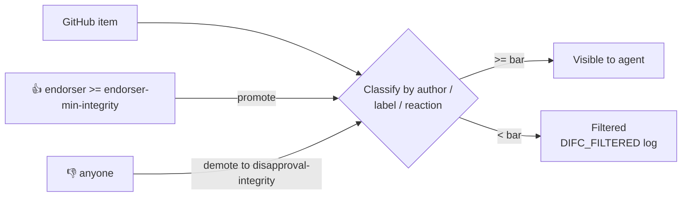

# `min-integrity` & Content Trust

> _Based on gh-aw v0.61.0_

When an agent reads issues, comments, or PR content from GitHub, it is reading
**user-supplied input** that may contain prompt-injection attempts. gh-aw's
`min-integrity` system classifies each piece of GitHub content by the
*trustworthiness* of its author (and where it came from), and lets you set a
minimum bar that everything must clear before the agent is allowed to consume
it. Items below the bar are filtered out — silently from the agent, but
visibly in the run log.

## TL;DR

- Integrity hierarchy (highest → lowest):
  `merged > approved > unapproved > none > blocked`.
- **Public repos** default to `min-integrity: approved`. **Private repos** have
  no default (everything is allowed).
- `allowed-repos:` constrains which repositories the agent's GitHub MCP server
  may read at all (`"all"`, `"public"`, or pattern array like `["org/*"]`).
- `blocked-users:`, `trusted-users:`, `approval-labels:` adjust the default
  classification per actor or per labelled item.
- `integrity-proxy: true` (default) routes pre-agent `gh` CLI calls through the
  same filter so even bootstrap steps see only trusted content.
- `features.integrity-reactions: true` (v0.68.2+) lets reviewers promote
  (👍 / ❤️) or demote (👎 / 😕) items using GitHub reactions.
- Filtered items show up as `DIFC_FILTERED` events in the run logs.

## Key Concepts

| Term                     | Meaning                                                                                                       |
| ------------------------ | ------------------------------------------------------------------------------------------------------------- |
| **Integrity level**      | A classification (`merged`, `approved`, `unapproved`, `none`, `blocked`) gh-aw assigns to a GitHub item.       |
| **min-integrity bar**    | The lowest acceptable level; anything below is filtered before reaching the agent.                            |
| **Author association**   | GitHub's view of the actor's relationship to the repo (`OWNER`, `MEMBER`, `COLLABORATOR`, `CONTRIBUTOR`, …).  |
| **DIFC**                 | Dynamic Information Flow Control — the gh-aw subsystem that filters by integrity.                             |
| **Integrity proxy**      | A pre-agent gh CLI wrapper that returns only items above the integrity bar.                                   |
| **Approval label**       | A repository label (e.g. `human-reviewed`) that promotes an item's integrity.                                 |

## Deep Dive

### 1. Integrity hierarchy

```
merged > approved > unapproved > none > blocked
```

| Level         | Qualifies when…                                                                                                                                              |
| ------------- | ------------------------------------------------------------------------------------------------------------------------------------------------------------ |
| `merged`      | Merged PRs; commits reachable from the default branch.                                                                                                       |
| `approved`    | Author is `OWNER`, `MEMBER`, or `COLLABORATOR`; non-fork PRs in **public** repos; **all items in private repos**; trusted bots; users in `trusted-users:`.  |
| `unapproved`  | `CONTRIBUTOR` or `FIRST_TIME_CONTRIBUTOR`.                                                                                                                   |
| `none`        | Everything else, including `FIRST_TIMER` and `NONE`.                                                                                                         |
| `blocked`     | Author appears in `blocked-users:` — always denied.                                                                                                          |

> Public repos automatically get `min-integrity: approved`. Private repos have
> no default; you must opt in if you want filtering.

### 2. Configuration surface

```yaml
tools:
  github:
    min-integrity: approved
    allowed-repos: ["myorg/*", "partner/shared-repo"]
    blocked-users: ["spam-bot"]
    trusted-users: ["contractor-1"]
    approval-labels: ["human-reviewed", "safe-for-agent"]
    integrity-proxy: true                # default
```

`allowed-repos` accepts:

- `"all"` — default; any repo the token can reach.
- `"public"` — public repos only.
- An array of glob patterns: `["myorg/*", "partner/shared-repo"]`.

`approval-labels` is a *promotion* mechanism: any item carrying one of these
labels is treated as `approved` regardless of author association.

### 3. Choosing a level

| Level you set    | What the agent sees                                                                                                                                       | When to choose                                                                                          |
| ---------------- | --------------------------------------------------------------------------------------------------------------------------------------------------------- | ------------------------------------------------------------------------------------------------------- |
| `merged`         | Only merged PRs and default-branch commits.                                                                                                               | High-stakes automation reading code (e.g., release-notes generation).                                   |
| `approved`       | Items from owners, members, collaborators, trusted users; everything in private repos.                                                                    | **Default for public repos.** Triage, planning, summary work.                                            |
| `unapproved`     | Adds first-time contributors and casual contributors.                                                                                                     | Onboarding helpers that must read first-time-contributor PRs.                                           |
| `none`           | Everything that isn't outright blocked.                                                                                                                   | Public-facing community bots that *must* see all comments, but you've layered other defences.            |
| `blocked`        | Nothing is allowed (only useful for `blocked-users:` itself).                                                                                             | Per-user denylist.                                                                                       |

### 4. Integrity proxy for pre-agent steps

`integrity-proxy: true` (default) wraps the `gh` CLI in your *pre-agent* steps
so that `gh issue list`, `gh pr view`, etc. return only items at or above the
configured bar. Setting it `false` disables the wrapper and gives you raw `gh`
output — useful when you have your own custom filtering logic.

```yaml
tools:
  github:
    min-integrity: approved
    integrity-proxy: false   # I'll filter myself
```

### 5. Reaction-based trust signals (v0.68.2+)

Enable the experimental feature:

```yaml
features:
  integrity-reactions: true

tools:
  github:
    min-integrity: approved
    endorsement-reactions: ["THUMBS_UP", "HEART"]
    disapproval-reactions: ["THUMBS_DOWN", "CONFUSED"]
    endorser-min-integrity: approved
    disapproval-integrity: none
```

Behaviour:

- A user *whose own integrity is at least `endorser-min-integrity`* can react
  with one of `endorsement-reactions` to **promote** an item to `approved`.
- Any user can react with one of `disapproval-reactions` to **demote** an item
  down to `disapproval-integrity` (e.g. `none`, effectively filtering it).
- Promotions are evaluated per-item; demotions win ties.

This lets a human reviewer 👍 a borderline issue to let the bot pick it up,
or 👎 an obvious troll comment to filter it out repo-wide.



### 6. DIFC log events

Every filtered item is logged with the `DIFC_FILTERED` event. Look for it in
the workflow run logs or in `gh aw runs view`:

```
DIFC_FILTERED type=issue_comment id=12345 author=spam-bot reason=blocked
DIFC_FILTERED type=issue id=42 author=newcomer association=FIRST_TIMER required=approved
DIFC_FILTERED type=pull_request id=99 reason=demoted-by-reaction
```

Use these to debug why the agent appears to "miss" an item.

### 7. Worked example

A community-facing triage bot in a public repo, reading issues only from
trusted reviewers, but allowing the team to manually promote special cases:

```yaml
---
on:
  schedule: daily around 9am
  workflow_dispatch:
permissions:
  contents: read
  issues: read

features:
  integrity-reactions: true

tools:
  github:
    toolsets: [issues, pull_requests]
    min-integrity: approved
    trusted-users: ["external-contractor-1"]
    blocked-users: ["spam-bot"]
    approval-labels: ["bot-approved", "safe-for-agent"]
    endorsement-reactions: ["THUMBS_UP"]
    endorser-min-integrity: approved
    disapproval-reactions: ["THUMBS_DOWN"]
    disapproval-integrity: none

engine: copilot

safe-outputs:
  add-comment:
  add-labels:
    max: 3
---
```

## Pitfalls & FAQ

**Q: My public-repo agent suddenly stops seeing community PRs.**
That's `min-integrity: approved` (the public default). Either lower it
(`unapproved`) or add the contributors to `trusted-users:` / approval-label
the PRs.

**Q: Private repo, but I want stricter filtering than the default (none).**
Set `min-integrity: approved` (or `merged`) explicitly. Private repos default
to no filtering for backward compatibility.

**Q: A trusted user's reaction isn't promoting an item.**
Check that `features.integrity-reactions: true` is set, that the reaction
matches `endorsement-reactions`, and that the reactor's *own* integrity meets
`endorser-min-integrity`.

**Q: Disapproval is being applied even when only a brand-new account reacts.**
That's the design: any user can demote. Combine with role-based gates if you
want demotion authority restricted.

**Q: How does this interact with `forks:` on the trigger?**
`forks:` controls *whether the trigger fires at all*; `min-integrity` controls
*what the agent reads* once the workflow starts. Use both for layered defence.

**Q: Can I per-toolset configure integrity?**
No — `min-integrity` is set at `tools.github` level and applies to all
toolsets you enable.

**Q: Where does `merged` matter most?**
For workflows that summarise or refactor code (e.g., release notes, doc
regeneration). Setting `min-integrity: merged` ensures the agent never
ingests commits that weren't reviewed and merged.

## Related Docs

- [Architecture & Security Model](./01-architecture-and-security.md)
- [Tools & MCP](./05-tools-and-mcp.md)
- [Threat Detection & XPIA](./08-threat-detection-and-xpia.md)
- [Permissions & RBAC](./16-permissions-and-rbac.md)
- [Cross-Repository Patterns](./20-cross-repo-patterns.md)
