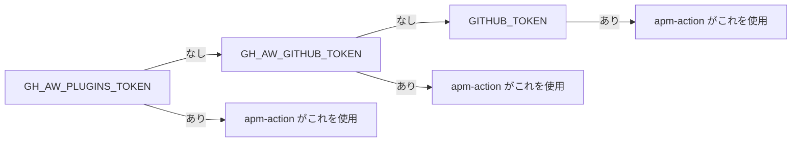

# APM と依存関係

> _gh-aw v0.61.0 ベース_

**Agent Package Manager (APM)** は、再利用可能なプロンプト、スキル、共有
コンポーネントをリポジトリ間で共有するための gh-aw の仕組みです。削除された
`plugins:` フィールドを置き換え、`imports:` 機構を介して接続されます。APM
パッケージはロックファイル `apm.lock` で SHA 固定されるため、ピンを意図的に
更新しない限りワークフローの挙動は再現可能です。

## TL;DR

- APM は旧 `plugins:` フィールドを **置き換え** ます。パッケージの取り込みは
  `imports: - uses: shared/apm.md  with: { packages: [...] }` で行います。
- パッケージ識別子: `owner/repo`、`owner/repo/path`、または ref ピン
  `owner/repo#tag-or-branch-or-sha`。
- `apm.lock` が各パッケージの解決済み SHA を記録。コミット必須。
- コンパイル時に `microsoft/apm-action` を実行する `apm` ジョブが注入され、
  エージェントジョブの前にパッケージをインストール / バンドル。
- ローカルデバッグ: `apm pack` で tarball を作成、`apm unpack` で展開して確認。
- プライベートパッケージ用に `GH_AW_PLUGINS_TOKEN` を設定 (カスケードは
  `GH_AW_GITHUB_TOKEN` → `GITHUB_TOKEN` の順)。
- Dependabot がロックファイルの PR を作りますが **直接マージ禁止**。
  `gh aw compile --dependabot` を再実行してロックワークフローを再生成してください。

## 主要概念

| 用語                 | 意味                                                                                                |
| -------------------- | --------------------------------------------------------------------------------------------------- |
| **APM**              | Agent Package Manager。再利用可能なプロンプト / スキル / コンポーネントを配布する gh-aw の仕組み。 |
| **APM パッケージ**   | gh-aw が組み込み可能な共有 markdown / 設定を含む GitHub リポ内のディレクトリ。                      |
| **ロックファイル**    | `apm.lock`。各パッケージをコミット SHA に固定する JSON 風ファイル。                                  |
| **`apm` ジョブ**      | `imports: shared/apm.md` によって自動注入される、パッケージを実行に取り込む事前ジョブ。              |
| **Token cascade**    | プライベートパッケージ向けの `GH_AW_PLUGINS_TOKEN` → `GH_AW_GITHUB_TOKEN` → `GITHUB_TOKEN` の順序。 |

## 詳細解説

### 1. APM パッケージのインポート

```yaml
imports:
  - uses: shared/apm.md
    with:
      packages:
        - microsoft/apm-sample-package
        - github/awesome-copilot/skills/review-and-refactor
        - microsoft/apm-sample-package#v2.0   # tag / branch / SHA
```

`shared/apm.md` は gh-aw に同梱された特殊なメタコンポーネントです。これがあると
コンパイラは `apm` という名前のジョブを注入し、`microsoft/apm-action` で次を実行します。

1. 各パッケージ識別子を SHA に解決 (`apm.lock` があれば優先)。
2. パッケージのソースをクローン。
3. パッケージ内容をエージェントが読めるワークスペースパスにバンドル。

### 2. パッケージ識別子の形式

| 形式                       | 例                                                     | 意味                                                |
| -------------------------- | ------------------------------------------------------ | --------------------------------------------------- |
| `owner/repo`               | `microsoft/apm-sample-package`                         | デフォルトブランチの HEAD (lock で再ピン)。         |
| `owner/repo/path`          | `github/awesome-copilot/skills/review-and-refactor`    | リポ内のサブパス。                                  |
| `owner/repo#ref`           | `microsoft/apm-sample-package#v2.0`                    | tag / branch / SHA 固定。                           |
| `owner/repo/path#ref`      | `github/awesome-copilot/skills/foo#main`               | サブパス + ref。                                    |

> 本番ではタグまたは SHA を推奨。`apm.lock` には解決済み SHA が記録されますが、
> 明示ピンは意図がはっきりします。

### 3. `apm.lock` ファイル

```json
{
  "packages": {
    "microsoft/apm-sample-package": {
      "ref": "v2.0",
      "sha": "abc123def456..."
    },
    "github/awesome-copilot/skills/review-and-refactor": {
      "sha": "789ghi..."
    }
  }
}
```

このファイルはコミットしてください。再現可能な実行のための契約書であり、
`package-lock.json` や `Cargo.lock` と同じ扱いです。

### 4. プライベートパッケージのトークンカスケード



```bash
gh aw secrets set GH_AW_PLUGINS_TOKEN --value "<fine-grained-pat>"
```

PAT には対象パッケージを置く全リポへの `Contents: Read` 権限が必要です。

### 5. ローカルデバッグ — `apm pack` / `apm unpack`

gh-aw が何をバンドルするかを確認するには:

```bash
# パッケージのソースリポでローカルに tarball を作成
apm pack ./skills/review-and-refactor

# インストールされたパッケージの中身を展開
apm unpack ./skills/review-and-refactor.apm.tar.gz /tmp/apm-extracted
```

パッケージのディレクトリ構造やフロントマターがエージェントの期待と合わない疑いが
あるときに有用です。

### 6. APM vs imports vs MCP サーバー

APM は再利用機構の 1 つ。3 つは少し被りますが、それぞれ得意分野があります。

| 機構                          | 再利用するもの                                  | 著述形式                                | 適用シーン                                                                          |
| ----------------------------- | ----------------------------------------------- | --------------------------------------- | ----------------------------------------------------------------------------------- |
| **APM パッケージ**             | プロンプト、スキル、共有フロントマター断片        | リポまたはリポ内サブパス                | クロスリポ、バージョン管理、SHA ピン配布。本番再利用。                              |
| **Imports (共有コンポ)**      | ローカル共有 markdown コンポーネント              | `.github/workflows/shared/` 配下のファイル | 同一リポ / 同一組織内の再利用、バージョニング不要。                                  |
| **MCP サーバー**               | 実行時のツール機能 (HTTP / プロセス / Docker)   | サーバープロセスまたはコンテナ          | エージェントが実行時に *何かをする* 必要がある場合 (API 呼び出し、DB 問い合わせ等)。 |

経験則:

- **実行時の振る舞い** → MCP サーバー。
- **静的な再利用コンテンツ** → imports (ローカル) か APM (クロスリポ + バージョン)。

### 7. Dependabot との統合

`microsoft/apm-action` は Dependabot と相性良好です。パッケージバージョンが上がると
`apm.lock` への PR が自動生成されます。**ロックファイル PR を直接マージしないで
ください**。`.github/workflows/*.lock.yml` 配下のコンパイル済みロックワークフローは
再コンパイルしないと新しいピンを反映しません。

推奨フロー:

```bash
# Dependabot がロックファイル PR を作ったら、そのブランチのクリーンチェックアウトで:
gh aw compile --dependabot
git add .github/workflows/*.lock.yml apm.lock
git commit -m "chore(apm): refresh lock workflows"
```

このリポの `.gitattributes` は `*.lock.yml` を `linguist-generated=true merge=ours`
としているため、再生成されたファイルが優先されます。

### 8. エンドツーエンド例

```yaml
---
on:
  schedule: weekly on monday around 9am
  workflow_dispatch:
permissions:
  contents: read
  issues: read

imports:
  - uses: shared/apm.md
    with:
      packages:
        - github/awesome-copilot/skills/release-notes#v1.4.0
        - myorg/internal-prompts/triage#main

network:
  allowed:
    - defaults
    - github

engine: copilot

safe-outputs:
  create-issue:
    title-prefix: "[release-notes] "
    labels: [release, weekly]
    close-older-issues: true
---

バンドル済みの `release-notes` スキルで前回リリースタグ以降のコミットを要約し、
社内 `triage` プロンプトでフォローアップを生成してください。
```

## 落とし穴 & FAQ

**Q: APM パッケージを追加したのにエージェントが読み込んでくれない。**
`shared/apm.md` を `with.packages` 付きで import しているか確認してください。
パッケージ自体への素の `uses:` では取り込まれません。APM パッケージは通常の
`imports:` リゾルバでは読まれません。

**Q: `apm` ジョブが `Repository not accessible` で落ちる。**
カスケードでパッケージを読めないトークンが選ばれています。`GH_AW_PLUGINS_TOKEN`
にパッケージリポへの `Contents: Read` を持つ fine-grained PAT を設定してください。

**Q: ピンにブランチを使っているが最新を追従する?**
ロックファイルは *コンパイル時点* のブランチ解決 SHA を記録します。再コンパイル時に
再解決されます。自動で追従したいなら Dependabot にロックファイルを bump させて
ください。

**Q: `plugins:` をそのまま使えない?**
使えません。フィールドは削除済みです。残ったまま strict モードで動かすと拒否
されます。`imports: shared/apm.md` に移行してください。

**Q: APM でバイナリを配布できる?**
APM はコンテンツ (プロンプト、スキル、設定) 用です。バイナリ / 実行時機能は
MCP サーバーで提供してください。

**Q: Dependabot のロックファイル PR が CI で赤くなる。**
`.lock.yml` ファイルが古いままだからです。ブランチ上で `gh aw compile --dependabot`
を実行して再生成し、push してください。

**Q: 自分の APM パッケージを公開できる?**
できます。任意の GitHub リポ (またはサブパス) が有効なパッケージです。再利用したい
markdown / 共有フロントマターを安定したパスに置き、バージョンタグを切ってください。

## 関連ドキュメント

- [Imports & Shared Components](./09-imports-and-shared-components.ja.md)
- [Tools & MCP](./05-tools-and-mcp.ja.md)
- [Authentication & Secrets](./15-auth-and-secrets.ja.md)
- [Frontmatter Reference](./03-frontmatter-reference.ja.md)
- [Custom Safe-Outputs](./19-custom-safe-outputs.ja.md)
