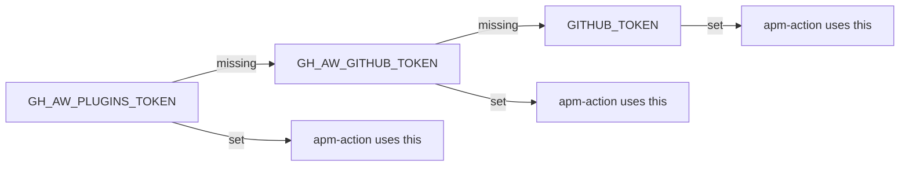

# APM & Dependencies

> _Based on gh-aw v0.61.0_

The **Agent Package Manager (APM)** is gh-aw's mechanism for sharing reusable
prompts, skills, and shared components across repositories. It replaces the
removed `plugins:` field and is wired in through the `imports:` mechanism. APM
packages are SHA-pinned in a lock file (`apm.lock`), so a workflow's behaviour
is reproducible run-to-run unless you intentionally bump the pins.

## TL;DR

- APM **replaces** the legacy `plugins:` field. Pulling a package is done via
  `imports: - uses: shared/apm.md  with: { packages: [...] }`.
- Package identifiers: `owner/repo`, `owner/repo/path`, or with a ref pin
  `owner/repo#tag-or-branch-or-sha`.
- `apm.lock` records the resolved SHA for every package. Commit it.
- Compile time injects an `apm` job that runs `microsoft/apm-action` to install
  and bundle packages before the agent job starts.
- Local debugging: `apm pack` to build a tarball, `apm unpack` to inspect.
- For private packages, set `GH_AW_PLUGINS_TOKEN` (token cascade falls back to
  `GH_AW_GITHUB_TOKEN` → `GITHUB_TOKEN`).
- Dependabot opens lock-file PRs — **don't merge them directly**. Re-run
  `gh aw compile --dependabot` so the lock workflow regenerates from the new
  pins.

## Key Concepts

| Term                 | Meaning                                                                                                |
| -------------------- | ------------------------------------------------------------------------------------------------------ |
| **APM**              | Agent Package Manager — gh-aw's distribution mechanism for reusable prompts/skills/components.         |
| **APM package**      | A directory in a GitHub repo containing shared markdown / configuration that gh-aw can splice in.      |
| **Lock file**        | `apm.lock` — JSON-like file pinning every package to a commit SHA.                                     |
| **`apm` job**        | The pre-agent job auto-injected by `imports: shared/apm.md` that materialises packages into the run.   |
| **Token cascade**    | The `GH_AW_PLUGINS_TOKEN` → `GH_AW_GITHUB_TOKEN` → `GITHUB_TOKEN` lookup order for private packages.   |

## Deep Dive

### 1. Importing APM packages

```yaml
imports:
  - uses: shared/apm.md
    with:
      packages:
        - microsoft/apm-sample-package
        - github/awesome-copilot/skills/review-and-refactor
        - microsoft/apm-sample-package#v2.0   # tag/branch/SHA
```

`shared/apm.md` is a special meta-component bundled with gh-aw. When present,
the compiler injects a job named `apm` that runs `microsoft/apm-action` to:

1. Resolve each package identifier to a SHA (using `apm.lock` if present).
2. Clone the package source.
3. Bundle the package contents into a workspace path the agent can read.

### 2. Package identifier formats

| Form                       | Example                                                | Meaning                                                |
| -------------------------- | ------------------------------------------------------ | ------------------------------------------------------ |
| `owner/repo`               | `microsoft/apm-sample-package`                         | Default branch HEAD (re-pinned in lock).               |
| `owner/repo/path`          | `github/awesome-copilot/skills/review-and-refactor`    | Subpath inside the repo.                               |
| `owner/repo#ref`           | `microsoft/apm-sample-package#v2.0`                    | Pin to tag, branch, or commit SHA.                     |
| `owner/repo/path#ref`      | `github/awesome-copilot/skills/foo#main`               | Subpath + ref.                                         |

> Always prefer a tag or SHA in production. `apm.lock` will record the
> resolved SHA either way, but explicit pins make the intent obvious.

### 3. The `apm.lock` file

```json
{
  "packages": {
    "microsoft/apm-sample-package": {
      "ref": "v2.0",
      "sha": "abc123def456..."
    },
    "github/awesome-copilot/skills/review-and-refactor": {
      "sha": "789ghi..."
    }
  }
}
```

Commit this file. It's the contract for reproducible runs. Treat it like
`package-lock.json` or `Cargo.lock`.

### 4. Token cascade for private packages



```bash
gh aw secrets set GH_AW_PLUGINS_TOKEN --value "<fine-grained-pat>"
```

The PAT needs `Contents: Read` on every repository that hosts a package.

### 5. Local debugging — `apm pack` / `apm unpack`

To inspect what gh-aw will bundle:

```bash
# Build a tarball locally (in the package source repo)
apm pack ./skills/review-and-refactor

# Inspect what an installed package looks like
apm unpack ./skills/review-and-refactor.apm.tar.gz /tmp/apm-extracted
```

Useful when you suspect a package's directory layout or front-matter doesn't
match what the agent expects.

### 6. APM vs imports vs MCP servers

APM is one of three reuse mechanisms. They overlap a little but have distinct
sweet spots.

| Mechanism                     | Reuses…                                          | Authored as…                            | When to use                                                                          |
| ----------------------------- | ------------------------------------------------ | --------------------------------------- | ------------------------------------------------------------------------------------ |
| **APM packages**              | Prompts, skills, shared frontmatter snippets     | A repo or subpath in a repo             | Cross-repo, versioned, SHA-pinned distribution. Production reuse.                    |
| **Imports (shared comps.)**   | Local shared markdown components                 | Files under `.github/workflows/shared/` | Same-repo or same-org reuse without versioning ceremony.                             |
| **MCP servers**               | Live tool capabilities (HTTP / process / Docker) | A server process or container           | When the agent needs to *do something* at runtime (call an API, query a DB, etc.).   |

Rule of thumb:

- **Behaviour at runtime** → MCP server.
- **Static reusable content** → imports (local) or APM (cross-repo + versioned).

### 7. Dependabot integration

`microsoft/apm-action` plays nicely with Dependabot: bumps to a package version
generate PRs against `apm.lock`. **Do not merge the lock-file PR directly** —
the compiled lock workflow under `.github/workflows/*.lock.yml` won't reflect
the new pins until you re-compile.

Recommended flow:

```bash
# After Dependabot opens a lock-file PR, on a clean checkout of that branch:
gh aw compile --dependabot
git add .github/workflows/*.lock.yml apm.lock
git commit -m "chore(apm): refresh lock workflows"
```

The `.gitattributes` in this repo already marks `*.lock.yml` as
`linguist-generated=true merge=ours`, so the regenerated file is what wins.

### 8. End-to-end example

```yaml
---
on:
  schedule: weekly on monday around 9am
  workflow_dispatch:
permissions:
  contents: read
  issues: read

imports:
  - uses: shared/apm.md
    with:
      packages:
        - github/awesome-copilot/skills/release-notes#v1.4.0
        - myorg/internal-prompts/triage#main

network:
  allowed:
    - defaults
    - github

engine: copilot

safe-outputs:
  create-issue:
    title-prefix: "[release-notes] "
    labels: [release, weekly]
    close-older-issues: true
---

Use the bundled `release-notes` skill to summarise commits since the last
release tag, and the internal `triage` prompt for follow-ups.
```

## Pitfalls & FAQ

**Q: I added an APM package but the agent doesn't seem to load it.**
Check that you imported `shared/apm.md` (with `with.packages`), not a bare
`uses:` to the package itself. APM packages are not loaded by the regular
`imports:` resolver.

**Q: The `apm` job fails with `Repository not accessible`.**
Token cascade resolved to a token that can't read the package. Set
`GH_AW_PLUGINS_TOKEN` to a fine-grained PAT with `Contents: Read` on the
package repo.

**Q: My pin uses a branch — will it stay current?**
The lock file pins to the SHA the branch resolved to *at compile time*. Future
compiles re-resolve. To stay current automatically, let Dependabot bump the
lock file.

**Q: Can I use `plugins:` instead?**
No — the field is removed. Old workflows that still have it will be rejected
in strict mode. Migrate to `imports: shared/apm.md`.

**Q: Can I bundle binaries via APM?**
APM is for content (prompts, skills, configs). Use MCP servers for
binary/runtime capabilities.

**Q: Why is my Dependabot lock-file PR red on CI?**
Because the `.lock.yml` files are stale. Run `gh aw compile --dependabot`
locally on the branch to regenerate them, then push.

**Q: Can I publish my own APM package?**
Yes — any GitHub repo (or subpath) is a valid package. Put your reusable
markdown / shared frontmatter at a stable path and publish a versioned tag.

## Related Docs

- [Imports & Shared Components](./09-imports-and-shared-components.md)
- [Tools & MCP](./05-tools-and-mcp.md)
- [Authentication & Secrets](./15-auth-and-secrets.md)
- [Frontmatter Reference](./03-frontmatter-reference.md)
- [Custom Safe-Outputs](./19-custom-safe-outputs.md)
