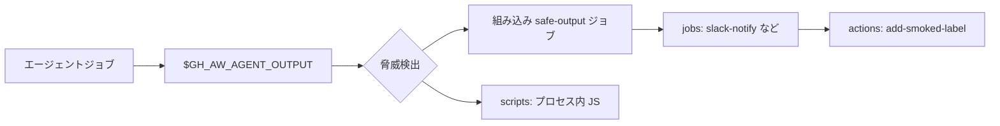

# カスタム safe-outputs

> _gh-aw v0.61.0 ベース_

組み込みの safe-outputs (Issue / PR / コメント / ラベル …) で大半の書き込み操作は
カバーできますが、いずれ gh-aw 標準にない処理 — Slack 投稿、独自アナライザ実行、
社内 API 呼び出し — をエージェントから *提案* したくなります。gh-aw はそのために
3 段階のレイヤを提供します: **scripts**、**jobs**、**actions**。順に強力になりますが、
信頼境界も広がります。

## TL;DR

- **3 つのレイヤ** — 必要十分な最も弱いものを選ぶ:
  - `safe-outputs.scripts:` — プロセス内 JavaScript、**シークレット不可**、軽量。
  - `safe-outputs.jobs:` — runner / steps / secrets が使えるフル GitHub Actions ジョブ。
  - `safe-outputs.actions:` — SHA ピン済み Action のコンパイル時ラッパー。
- それぞれエージェントが呼べる MCP ツールとして登録されます。job / script 名は
  ツール名で **ダッシュ → アンダースコア** に変換 (`slack-notify` → `slack_notify`)。
- `inputs:` はエージェントが渡す JSON スキーマを記述。型は `string | boolean | choice`。
- `needs:` で `agent`、`safe_outputs`、独自 `detection`、または他のカスタムジョブと
  順序付け可能。
- 脅威検出は先に走ります。カスタム出力は `$GH_AW_AGENT_OUTPUT` のサニタイズ済み
  アーティファクトを読みます。

## 主要概念

| 用語                   | 意味                                                                                                |
| ---------------------- | --------------------------------------------------------------------------------------------------- |
| **カスタム safe-output** | ユーザー定義のポストプロセスハンドラ (script / job / action ラッパー) を MCP ツールとして登録。     |
| **ツール名**            | MCP から見えるツール名。YAML キーのダッシュはアンダースコアに変換。                                  |
| **`$GH_AW_AGENT_OUTPUT`** | エージェントが発した全意図を含む JSON アーティファクトのパス (脅威検出後)。                       |
| **ジョブ依存**           | このジョブが走る前に完了すべきジョブを示す `needs:` フィールド。                                    |
| **SHA ピン Action**     | コミット SHA で参照される GitHub Action。gh-aw の strict モードが強制。                              |

## 詳細解説

### 1. 3 つのレイヤ比較

| レイヤ      | 実行場所                       | シークレット利用 | runner | 採用シーン                                                                              |
| ----------- | ------------------------------ | ---------------- | ------ | --------------------------------------------------------------------------------------- |
| `scripts:`  | safe-outputs ジョブのプロセス内 | **不可**         | n/a    | 純粋な変換 / 検証 / ログ整形。外部呼び出しや認証情報は不要。                            |
| `jobs:`     | 別の Actions ジョブ             | **可**           | あり (`runs-on`) | 外部 API (Slack、Jira、社内サービス) 呼び出し、シェルパイプライン実行。                  |
| `actions:`  | safe-outputs ジョブ内           | env 経由可        | n/a    | SHA ピンと使いやすいツール表面で、既知のサードパーティ Action をラップしたい場合。       |

ジョブを達成できる最弱レイヤを選んでください。権限が小さいほど影響範囲も小さくなります。

### 2. `safe-outputs.scripts:` — プロセス内 JavaScript

```yaml
safe-outputs:
  scripts:
    post-message:
      description: "メッセージ行を整形してログ出力"
      inputs:
        channel:
          description: "論理チャンネル名"
          required: true
          type: string
        text:
          description: "本文"
          required: true
          type: string
      script: |
        const channel = item.channel;
        const text = item.text;
        core.info(`[${channel}] ${text}`);
        return { logged: true, length: text.length };
```

ランタイム:

- グローバル `item` はエージェントが発した JSON 意図。
- グローバル `core` は `@actions/core`。
- 戻り値は run summary に追記。
- **シークレットは公開されません。** プロセス内 VM は `secrets.*` を読めません。

エージェントから見えるツール名: `post_message` (ダッシュ → アンダースコア)。

### 3. `safe-outputs.jobs:` — フル GitHub Actions ジョブ

```yaml
safe-outputs:
  jobs:
    slack-notify:
      description: "Slack にメッセージ送信"
      runs-on: ubuntu-latest
      output: "Message sent!"
      inputs:
        message:
          description: "Markdown 本文"
          required: true
          type: string
        channel:
          description: "Slack チャンネル"
          required: false
          type: string
      needs: safe_outputs   # 標準 safe-output ジョブ群の後で実行
      permissions: {}
      timeout-minutes: 10
      env: {}
      if: ${{ always() }}
      steps:
        - name: Send
          env:
            SLACK_WEBHOOK: ${{ secrets.SLACK_WEBHOOK }}
          run: |
            MSG=$(jq -r '.items[] | select(.type == "slack_notify") | .message' \
              "$GH_AW_AGENT_OUTPUT")
            curl -sS -X POST -H 'Content-Type: application/json' \
              -d "{\"text\": ${MSG@Q}}" "$SLACK_WEBHOOK"
```

主なフィールド:

- `runs-on:` — 任意の標準 runner。
- `output:` — エージェントに返される短い文字列 (次回エージェント呼び出し時のみ可視)。
- `inputs:` — ジョブ実行前にスキーマ検証。
- `needs:` — `agent`、`safe_outputs`、`detection`、または任意のカスタムジョブ名を
  指定可能。デフォルトは `safe_outputs`。
- `permissions:` — ジョブ単位スコープ (`{}` が普通。認証はシークレットで運ぶ)。
- `if:` — 標準 Actions の条件式。

ツール名: `slack_notify` (YAML キーのダッシュ変換)。

### 4. `safe-outputs.actions:` — SHA ピン Action ラッパー

```yaml
safe-outputs:
  actions:
    add-smoked-label:
      uses: actions-ecosystem/action-add-labels@v1
      description: "トリガーアイテムに 'smoked' ラベルを付与"
      env:
        GITHUB_TOKEN: ${{ github.token }}
```

コンパイル時:

- gh-aw は Action を SHA に解決して固定 (strict モード必須)。
- エージェントの意図 JSON を env 経由で渡し、この Action *のみ* を実行する
  ラッパージョブを生成。

`actions-ecosystem/action-add-labels` のような既知の Action を、自前のシェル接着剤
なしで露出したい場合に最適です。

### 5. `needs:` による順序付け

カスタムジョブをポストエージェントパイプラインに織り込めます:

```yaml
safe-outputs:
  jobs:
    custom-analyzer:
      runs-on: ubuntu-latest
      needs: agent          # エージェント直後、組み込み safe-outputs より前
      steps:
        - run: ./scripts/analyze.sh "$GH_AW_AGENT_OUTPUT"
    notify-team:
      runs-on: ubuntu-latest
      needs: custom-analyzer
      steps:
        - run: ./scripts/notify.sh
```

有効な `needs:` ターゲット:

| 名前             | 参照対象                                                 |
| ---------------- | -------------------------------------------------------- |
| `agent`          | エージェントジョブ本体。                                  |
| `safe_outputs`   | 組み込み safe-output ジョブ群の集合。                     |
| `detection`      | 脅威検出ジョブ (有効化時)。                              |
| `<custom name>`  | YAML キー名で参照する別の `safe-outputs.jobs:` エントリ。 |

### 6. 命名規則

MCP ツール名は YAML キーのダッシュをアンダースコアに変換したもの:

| YAML キー           | ツール名             |
| ------------------- | ------------------- |
| `slack-notify`      | `slack_notify`      |
| `add-smoked-label`  | `add_smoked_label`  |
| `post-message`      | `post_message`      |

ツール名はバージョン間で安定させてください。エージェントが既に呼ぶよう指示されて
いる可能性があります。

### 7. パイプライン図



### 8. エンドツーエンド例

Issue をトリアージし、ラベル付与、Slack 通知、独自バリデーションを走らせる
ワークフロー:

```yaml
---
on:
  issues:
    types: [opened, reopened]
permissions:
  contents: read
  issues: read

engine: copilot

network:
  allowed:
    - defaults
    - github

safe-outputs:
  add-labels:
    max: 3

  scripts:
    validate-summary:
      description: "30 文字未満の要約を拒否"
      inputs:
        summary: { description: "Issue summary", required: true, type: string }
      script: |
        if (item.summary.length < 30) {
          core.setFailed(`Summary too short (${item.summary.length} chars)`);
          return { ok: false };
        }
        return { ok: true };

  actions:
    add-triage-label:
      uses: actions-ecosystem/action-add-labels@v1
      description: "'triaged' ラベルを付与"
      env:
        GITHUB_TOKEN: ${{ github.token }}

  jobs:
    slack-notify:
      description: "トリアージ済み Issue を Slack へ通知"
      runs-on: ubuntu-latest
      needs: safe_outputs
      inputs:
        message: { description: "Slack body", required: true, type: string }
      steps:
        - env:
            SLACK_WEBHOOK: ${{ secrets.SLACK_WEBHOOK }}
          run: |
            MSG=$(jq -r '.items[] | select(.type == "slack_notify") | .message' \
              "$GH_AW_AGENT_OUTPUT")
            curl -sS -X POST -H 'Content-Type: application/json' \
              -d "{\"text\": ${MSG@Q}}" "$SLACK_WEBHOOK"
---
```

## 落とし穴 & FAQ

**Q: `safe-outputs.scripts` で API キーが必要。**
レイヤ選択ミスです。`safe-outputs.jobs:` に昇格し、`env:` でシークレットを渡して
ください。

**Q: エージェントがツール名を認識しない。**
ダッシュ → アンダースコア規則を確認してください。エージェントから見えるのは
`slack-notify` ではなく `slack_notify`。

**Q: ジョブが脅威検出より先に走ってしまう。**
デフォルトのカスタムジョブは `needs: safe_outputs` で、これが既に detection に依存
しています。`needs: agent` にすると detection をバイパスします。エージェント出力を
信頼増幅しないジョブだけにしてください。

**Q: 1 回の実行で複数の意図を発行できる?**
できます。エージェントはツールを複数回呼べます。各呼び出しが対応する `type:` の
アイテムをアーティファクト JSON に追記します。ジョブで `jq` を使って反復処理してください。

**Q: `actions:` を `jobs:` より優先する理由は?**
既知 Action のラップであれば boilerplate が少なく、SHA ピンも自動。多段ステップや
シェルロジックが必要なら `jobs:` を使ってください。

**Q: ローカルでカスタム safe-output をテストするには?**
`gh aw compile` でコンパイルし、生成された `.lock.yml` を確認、`act` か小さな
`agent_output.json` フィクスチャでテスト実行します。

**Q: scripts 間でヘルパー関数を共有できる?**
直接はできません。共通ロジックは `.github/workflows/shared/` 配下の静的ファイルに
切り出し、薄い script から `require()` してください。

**Q: inputs はスキーマ検証される?**
されます。gh-aw は宣言された `inputs:` 型 (`string | boolean | choice`) に合わない
呼び出しを拒否します。`choice` には `options:` リストを与えてください。

## 関連ドキュメント

- [Safe-Outputs Catalog](./06-safe-outputs-catalog.ja.md)
- [Threat Detection & XPIA](./08-threat-detection-and-xpia.ja.md)
- [Tools & MCP](./05-tools-and-mcp.ja.md)
- [Imports & Shared Components](./09-imports-and-shared-components.ja.md)
- [Permissions & RBAC](./16-permissions-and-rbac.ja.md)
