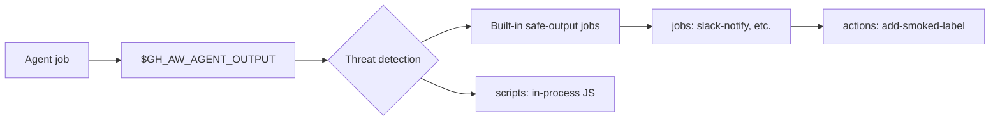

# Custom Safe-Outputs

> _Based on gh-aw v0.61.0_

The built-in safe-outputs (issue / PR / comment / label / …) cover most common
write operations, but eventually you'll want the agent to *propose* something
gh-aw doesn't ship out of the box — post to Slack, run a custom analyser,
trigger an internal API. gh-aw provides three escalating layers for this:
**scripts**, **jobs**, and **actions**. Each adds power but also widens the
trust boundary.

## TL;DR

- **Three layers** — pick the least powerful that fits:
  - `safe-outputs.scripts:` — in-process JavaScript, **no secrets**, fast.
  - `safe-outputs.jobs:` — full GitHub Actions jobs with steps, runners, secrets.
  - `safe-outputs.actions:` — compile-time wrappers around an SHA-pinned action.
- Each registers an MCP tool the agent can call. Job/script names are converted
  **dashes → underscores** for the tool name (`slack-notify` → `slack_notify`).
- `inputs:` describe the JSON schema the agent must pass; types are
  `string | boolean | choice`.
- `needs:` lets you order the job relative to `agent`, `safe_outputs`, custom
  `detection`, or other custom jobs.
- Threat detection still runs first; custom outputs read the sanitised
  artifact at `$GH_AW_AGENT_OUTPUT`.

## Key Concepts

| Term                   | Meaning                                                                                                |
| ---------------------- | ------------------------------------------------------------------------------------------------------ |
| **Custom safe-output** | A user-defined post-processing handler (script, job, or action wrapper) registered as an MCP tool.     |
| **Tool name**          | The MCP-visible name. Dashes in the YAML key become underscores in the tool name.                       |
| **`$GH_AW_AGENT_OUTPUT`** | Path to the JSON artifact containing all intents the agent emitted, after threat detection.          |
| **Job dependency**     | The `needs:` field controlling which jobs must complete before this one runs.                           |
| **SHA-pinned action**  | A GitHub Action referenced by commit SHA, enforced by gh-aw's strict mode.                              |

## Deep Dive

### 1. The three layers compared

| Layer       | Runs in…                       | Has secrets?    | Has runner?   | Use when…                                                                              |
| ----------- | ------------------------------ | --------------- | ------------- | -------------------------------------------------------------------------------------- |
| `scripts:`  | The safe-outputs job process   | **No**          | n/a           | Pure transformation, validation, log formatting; no external calls or credentials.     |
| `jobs:`     | A separate Actions job         | **Yes**         | Yes (`runs-on`) | Calling external APIs (Slack, Jira, internal services), running shell pipelines.       |
| `actions:`  | Inside the safe-outputs job    | Yes (env)       | n/a           | Wrapping a well-known third-party Action with SHA pinning and a friendly tool surface. |

Choose the lowest layer that gets the job done — less power = smaller blast
radius.

### 2. `safe-outputs.scripts:` — in-process JavaScript

```yaml
safe-outputs:
  scripts:
    post-message:
      description: "Format and log a message line"
      inputs:
        channel:
          description: "Logical channel name"
          required: true
          type: string
        text:
          description: "Body"
          required: true
          type: string
      script: |
        const channel = item.channel;
        const text = item.text;
        core.info(`[${channel}] ${text}`);
        return { logged: true, length: text.length };
```

What runs:

- The `item` global is the JSON intent the agent emitted.
- The `core` global is `@actions/core`.
- Return value is appended to the run summary.
- **Secrets are not exposed.** This is enforced; the in-process VM can't read
  `secrets.*`.

Tool name visible to the agent: `post_message` (dashes → underscores).

### 3. `safe-outputs.jobs:` — full GitHub Actions job

```yaml
safe-outputs:
  jobs:
    slack-notify:
      description: "Send a message to Slack"
      runs-on: ubuntu-latest
      output: "Message sent!"
      inputs:
        message:
          description: "Markdown message body"
          required: true
          type: string
        channel:
          description: "Slack channel"
          required: false
          type: string
      needs: safe_outputs   # run after the standard safe-output jobs
      permissions: {}
      timeout-minutes: 10
      env: {}
      if: ${{ always() }}
      steps:
        - name: Send
          env:
            SLACK_WEBHOOK: ${{ secrets.SLACK_WEBHOOK }}
          run: |
            MSG=$(jq -r '.items[] | select(.type == "slack_notify") | .message' \
              "$GH_AW_AGENT_OUTPUT")
            curl -sS -X POST -H 'Content-Type: application/json' \
              -d "{\"text\": ${MSG@Q}}" "$SLACK_WEBHOOK"
```

Key fields:

- `runs-on:` — any standard runner.
- `output:` — short message displayed back to the agent (visible only via the
  next agent invocation).
- `inputs:` — schema validated before the job runs.
- `needs:` — accepts `agent`, `safe_outputs`, `detection`, or any custom job
  name. Default is `safe_outputs`.
- `permissions:` — scoped per-job (often `{}`; secrets carry the auth).
- `if:` — standard Actions conditional.

Tool name: `slack_notify` (the YAML key with dashes converted).

### 4. `safe-outputs.actions:` — SHA-pinned action wrappers

```yaml
safe-outputs:
  actions:
    add-smoked-label:
      uses: actions-ecosystem/action-add-labels@v1
      description: "Apply the 'smoked' label to the triggering item"
      env:
        GITHUB_TOKEN: ${{ github.token }}
```

Compile-time:

- gh-aw resolves the action to a SHA and pins it (strict mode requires this).
- A wrapper job is generated that runs *only* this Action with the agent's
  intent JSON exposed via env.

This is the right layer when you want to expose a well-known third-party
Action — like `actions-ecosystem/action-add-labels` — without writing your own
shell glue.

### 5. `needs:` ordering

You can stitch custom jobs into the post-agent pipeline:

```yaml
safe-outputs:
  jobs:
    custom-analyzer:
      runs-on: ubuntu-latest
      needs: agent          # right after agent, before the built-in safe-outputs
      steps:
        - run: ./scripts/analyze.sh "$GH_AW_AGENT_OUTPUT"
    notify-team:
      runs-on: ubuntu-latest
      needs: custom-analyzer
      steps:
        - run: ./scripts/notify.sh
```

Valid `needs:` targets:

| Name             | Refers to…                                              |
| ---------------- | ------------------------------------------------------- |
| `agent`          | The agent job itself.                                   |
| `safe_outputs`   | The aggregate of built-in safe-output jobs.             |
| `detection`      | The threat-detection job (when enabled).                |
| `<custom name>`  | Another `safe-outputs.jobs:` entry by its YAML key.     |

### 6. Naming convention

The MCP tool name is the YAML key with dashes converted to underscores:

| YAML key            | Tool name           |
| ------------------- | ------------------- |
| `slack-notify`      | `slack_notify`      |
| `add-smoked-label`  | `add_smoked_label`  |
| `post-message`      | `post_message`      |

Tool names should remain consistent across versions — agents may have already
been prompted to call them.

### 7. Pipeline diagram



### 8. End-to-end example

A workflow that triages issues, adds a label, posts a Slack notification, and
runs a custom validation script:

```yaml
---
on:
  issues:
    types: [opened, reopened]
permissions:
  contents: read
  issues: read

engine: copilot

network:
  allowed:
    - defaults
    - github

safe-outputs:
  add-labels:
    max: 3

  scripts:
    validate-summary:
      description: "Reject summaries shorter than 30 chars"
      inputs:
        summary: { description: "Issue summary", required: true, type: string }
      script: |
        if (item.summary.length < 30) {
          core.setFailed(`Summary too short (${item.summary.length} chars)`);
          return { ok: false };
        }
        return { ok: true };

  actions:
    add-triage-label:
      uses: actions-ecosystem/action-add-labels@v1
      description: "Add the 'triaged' label"
      env:
        GITHUB_TOKEN: ${{ github.token }}

  jobs:
    slack-notify:
      description: "Notify Slack of triaged issues"
      runs-on: ubuntu-latest
      needs: safe_outputs
      inputs:
        message: { description: "Slack body", required: true, type: string }
      steps:
        - env:
            SLACK_WEBHOOK: ${{ secrets.SLACK_WEBHOOK }}
          run: |
            MSG=$(jq -r '.items[] | select(.type == "slack_notify") | .message' \
              "$GH_AW_AGENT_OUTPUT")
            curl -sS -X POST -H 'Content-Type: application/json' \
              -d "{\"text\": ${MSG@Q}}" "$SLACK_WEBHOOK"
---
```

## Pitfalls & FAQ

**Q: My `safe-outputs.scripts` script needs an API key.**
That's the wrong layer — promote it to `safe-outputs.jobs:` and pass the secret
via `env:`.

**Q: The agent doesn't seem to know my tool name.**
Check the dash → underscore rule. The agent sees `slack_notify`, not
`slack-notify`.

**Q: My job runs before threat detection.**
By default, custom jobs `needs: safe_outputs`, which already depends on
detection. If you set `needs: agent` you bypass detection — only do this for
jobs that don't trust-amplify the agent output.

**Q: Can I emit multiple intents per run?**
Yes — the agent can call the tool multiple times. Each call appends an item
of that `type:` to the artifact JSON. Iterate with `jq` in your job.

**Q: Why use `actions:` over `jobs:`?**
Less boilerplate when wrapping a well-known Action, and the SHA pinning is
automatic. For anything multi-step or with shell logic, use `jobs:`.

**Q: How do I test a custom safe-output locally?**
Compile the workflow with `gh aw compile`, inspect the generated
`.lock.yml`, and `act` (or trigger a test run) with a small fixture
`agent_output.json`.

**Q: Can scripts share helper functions?**
Not directly across script entries. Factor shared logic into a static file
under `.github/workflows/shared/` and `require()` it via a thin script.

**Q: Are inputs validated against the schema?**
Yes — gh-aw rejects calls that don't match the declared `inputs:` types
(`string | boolean | choice`). For `choice`, supply an `options:` list.

## Related Docs

- [Safe-Outputs Catalog](./06-safe-outputs-catalog.md)
- [Threat Detection & XPIA](./08-threat-detection-and-xpia.md)
- [Tools & MCP](./05-tools-and-mcp.md)
- [Imports & Shared Components](./09-imports-and-shared-components.md)
- [Permissions & RBAC](./16-permissions-and-rbac.md)
