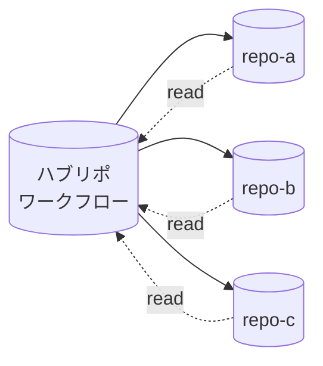

# クロスリポジトリパターン

> _gh-aw v0.61.0 ベース_

ワークフローは単一リポの中だけで完結する必要はありません。gh-aw は独立した 3 つの
ノブを提供します: **`checkout:`** で追加のリポを runner ワークスペースに展開、
**`tools.github.github-token`** (および `allowed-repos`) で他のプライベートリポから
読み取り、**`safe-outputs.target-repo`** (専用 `github-token` + `allowed-repos`) で
ホストリポ外への書き込み。

## TL;DR

- `checkout:` は追加リポチェックアウトのリスト。各エントリは `repository:`、`path:`、
  `ref:`、`fetch-depth:`、`sparse-checkout:`、`github-token:`、エージェントのプライマリ
  ターゲットを示す `current: true` をサポート。
- `checkout: false` でデフォルトのチェックアウトを完全に無効化 (API のみで動く
  読み取り専用エージェント向け)。
- 他のプライベートリポから GitHub MCP 経由で **読み取る** には
  `tools.github.github-token: ${{ secrets.PAT }}` と `allowed-repos:` を設定。
- ホストリポ外へ **書き込む** には `safe-outputs.github-token` と各出力の
  `target-repo:` + `allowed-repos:` を設定。実行時決定のターゲットには `target-repo: "*"`。
- 3 つの代表トポロジ: hub-and-spoke (中央エージェントから多リポへ)、クロスリポ
  Issue トラッキング (ワーカーリポからトラッカーリポへ)、モノレポ分割 (1 ワークフロー
  から複数サブプロジェクト)。

## 主要概念

| 用語                        | 意味                                                                                                         |
| --------------------------- | ------------------------------------------------------------------------------------------------------------ |
| **チェックアウトエントリ**    | runner ワークスペースにリポを展開する `checkout:` リストの 1 項目。                                          |
| **`current:` マーカー**      | エージェントのプライマリ作業リポを示すフラグ。                                                                 |
| **`allowed-repos:`**        | GitHub MCP サーバーが読み書きできるリポを限定するパターンアロウリスト。                                        |
| **`target-repo:`**          | 出力ごとの宛先。リテラル `owner/repo` または `"*"` (実行時にエージェント意図から決定)。                       |
| **Hub-and-spoke**           | 1 つのワークフローが多数のスポークリポを駆動するトポロジ。                                                     |

## 詳細解説

### 1. `checkout:` フィールド

```yaml
checkout:
  - fetch-depth: 0                       # ホストリポの全履歴
    fetch: ["refs/pulls/open/*"]
  - repository: org/other-repo
    path: ./libs/other
    ref: main
    sparse-checkout: |
      defaults/
      overrides/
    github-token: ${{ secrets.CROSS_REPO_PAT }}
    current: true                        # エージェントのプライマリターゲット
```

各エントリは `actions/checkout` 呼び出しに対応します。注目フィールド:

- `repository:` — ホスト以外のリポは `owner/repo`。
- `path:` — ワークスペースパス (デフォルトはリポ名)。
- `ref:` — branch / tag / SHA。
- `fetch-depth:` — 全履歴は `0`、デフォルトは shallow。
- `fetch:` — 追加 refspec (例: 全 open PR)。
- `sparse-checkout:` — 改行区切りのパスフィルタ。
- `github-token:` — プライベートリポ用の認証情報。
- `current: true` — このリポをエージェントのプライマリターゲットとしてマーク。
  エージェントの `cwd` 扱いと、GitHub MCP に流れるメタデータの基準リポに影響。

チェックアウト全停止:

```yaml
checkout: false
```

ソースをディスクに置かない API 駆動エージェント向けです。

### 2. 他のプライベートリポからの読み取り

追加設定なしの場合、GitHub MCP サーバーはワークフローの `GITHUB_TOKEN` を使い、
ホストリポと一部の公開コンテンツしか触れません。追加プライベートリポを読むには:

```yaml
tools:
  github:
    toolsets: [repos, issues, pull_requests]
    github-token: ${{ secrets.CROSS_REPO_PAT }}
    allowed-repos: ["myorg/*", "partner/shared-repo"]
    min-integrity: approved
```

PAT には対象全リポへの `Contents: Read` (および有効化したツールセットに応じて
`Issues: Read`、`Pull requests: Read`) が必要です。

代替: 魔法のシークレット `GH_AW_GITHUB_MCP_SERVER_TOKEN` を設定して
`github-token:` 行を省く方法もあります — [認証ドキュメント](./15-auth-and-secrets.ja.md) 参照。

### 3. safe-outputs によるクロスリポ書き込み

```yaml
safe-outputs:
  github-token: ${{ secrets.CROSS_REPO_PAT }}
  create-issue:
    target-repo: "org/tracking-repo"
    allowed-repos: ["org/repo-a", "org/repo-b", "org/tracking-repo"]
    title-prefix: "[from-agent] "
```

- `safe-outputs.github-token` はクロスリポ書き込みを行う各出力の *デフォルト* トークン。
- `target-repo:` は次のいずれか:
  - リテラル `owner/repo`、または
  - `"*"` でエージェントが意図 JSON 内で実行時にターゲットを *選択* (値は
    `allowed-repos:` にマッチする必要あり)。
- `allowed-repos:` はクロスリポモードで **必須**。指定しないと実行時ターゲットは拒否。

PAT には対象リポに対する `Issues: Write` (または safe-output 種別に応じたスコープ) が
必要です。

### 4. 動的ターゲットの `target-repo: "*"`

```yaml
safe-outputs:
  github-token: ${{ secrets.CROSS_REPO_PAT }}
  create-issue:
    target-repo: "*"
    allowed-repos: ["myorg/repo-a", "myorg/repo-b", "myorg/repo-c"]
```

エージェントの意図 JSON で `target-repo` フィールドを指定:

```json
{
  "type": "create_issue",
  "target_repo": "myorg/repo-b",
  "title": "Investigate flaky test",
  "body": "..."
}
```

エージェントが `allowed-repos:` 外を選ぶと safe-output ジョブが実行を失敗させます。
LLM に多リポへ自由に Issue を投げさせつつ範囲を限定する安全な方法です。

### 5. トポロジ: hub-and-spoke

ハブリポに置かれた 1 つの制御ワークフローが多数のスポークリポへ展開:



```yaml
---
on:
  schedule: daily around 6am
  workflow_dispatch:

permissions:
  contents: read
  issues: read

tools:
  github:
    toolsets: [repos, issues, pull_requests]
    github-token: ${{ secrets.HUB_AND_SPOKE_PAT }}
    allowed-repos: ["myorg/repo-a", "myorg/repo-b", "myorg/repo-c"]
    min-integrity: approved

safe-outputs:
  github-token: ${{ secrets.HUB_AND_SPOKE_PAT }}
  create-issue:
    target-repo: "*"
    allowed-repos: ["myorg/repo-a", "myorg/repo-b", "myorg/repo-c"]
    title-prefix: "[hub] "

engine: copilot
---
```

### 6. トポロジ: クロスリポ Issue トラッキング

多数のワーカーリポが、それぞれ単一のトラッカーリポへ Issue を起票するワークフローを
持つ構成:

```yaml
safe-outputs:
  github-token: ${{ secrets.TRACKER_PAT }}
  create-issue:
    target-repo: "myorg/release-tracker"
    allowed-repos: ["myorg/release-tracker"]
    title-prefix: "[from ${{ github.repository }}] "
    labels: [from-worker]
```

トラッカーリポは多数のソースからの作業を集約します。各ワーカーが独自に可視性を
持つ必要はありません。

### 7. トポロジ: モノレポ分割

モノレポ内の単一ワークフローが、複数のサブプロジェクト (それぞれ別リポ) を
チェックアウトして横断推論:

```yaml
checkout:
  - fetch-depth: 0
  - repository: org/api
    path: ./services/api
    sparse-checkout: |
      src/
      tests/
    github-token: ${{ secrets.CROSS_REPO_PAT }}
  - repository: org/frontend
    path: ./services/frontend
    sparse-checkout: |
      src/
      package.json
    github-token: ${{ secrets.CROSS_REPO_PAT }}
    current: true     # frontend がプライマリターゲット

tools:
  github:
    toolsets: [repos, issues, pull_requests]
    github-token: ${{ secrets.CROSS_REPO_PAT }}
    allowed-repos: ["org/api", "org/frontend"]
```

### 8. 適切な組み合わせ選択

| シナリオ                                 | `checkout:`                       | `tools.github.github-token` | `safe-outputs.github-token` + `target-repo` |
| ---------------------------------------- | --------------------------------- | --------------------------- | ------------------------------------------- |
| ホストリポのみで完結                       | デフォルト (ホスト)               | 不要                        | 不要                                        |
| 別プライベートリポのメタデータを読む       | 不要                              | 必須                        | 不要                                        |
| 別プライベートリポの *ファイル* を読む     | 必須 (`repository:` 付き)         | 必須                        | 不要                                        |
| 別リポに Issue を起票                     | 不要                              | 任意                        | 必須 (`target-repo:` リテラル)              |
| 実行時に動的にターゲットリポを選ぶ         | 不要                              | 任意                        | 必須 (`target-repo: "*"` + allow-list)      |
| API 駆動 (ソース不要)                      | `checkout: false`                 | 必須                        | クロスリポ書き込みなら必須                  |

## 落とし穴 & FAQ

**Q: `target-repo: "*"` が dev では動くが CI で失敗する。**
ほぼ `allowed-repos:` の指定漏れ。指定しない動的ターゲットはそのまま拒否されます。

**Q: PAT で読み取りはできるが、safe-output ジョブが 403 で書き込めない。**
PAT に対象リポへの明示的な *write* 権限 (Issues、Contents 等) が必要です。スコープを
更新してください。

**Q: 2 つ目のリポをチェックアウトしたのにエージェントがホストで動いている。**
2 つ目の checkout エントリに `current: true` を付けてください。エージェントの
プライマリ作業ディレクトリとしてマークされます。

**Q: クロスリポに `GITHUB_TOKEN` を頼って良い?**
ダメです。デフォルトトークンはホストリポに対する操作しか認可しません。それ以外は
fine-grained PAT (読み取り専用なら `GH_AW_GITHUB_MCP_SERVER_TOKEN`) を使ってください。

**Q: `safe-outputs.create-pull-request` をクロスリポで使える?**
同一リポ専用です。`push-to-pull-request-branch` も設計上同一リポ専用。クロスリポで
PR を提案したい場合は対象リポに Issue を起票するか、
`dispatch-workflow` / `dispatch_repository` を使ってください。

**Q: スポークリポへのシークレット漏洩を防ぐには?**
最小限のリポにスコープした *fine-grained* PAT を使ってください。classic PAT や
`Repo: All` トークンは避けます。

**Q: checkout を無効化しつつ imports は使える?**
できます。`checkout: false` はワークスペースのクローンを止めるだけ。imports は
コンパイル時に解決されてバンドルされます。

**Q: クロスリポ読み取りにも `min-integrity` が効く?**
効きます。GitHub MCP サーバーが返すアイテムは出所リポに関わらず integrity 分類器を
通ります。

## 関連ドキュメント

- [Architecture & Security Model](./01-architecture-and-security.ja.md)
- [Frontmatter Reference](./03-frontmatter-reference.ja.md)
- [Safe-Outputs Catalog](./06-safe-outputs-catalog.ja.md)
- [Authentication & Secrets](./15-auth-and-secrets.ja.md)
- [Permissions & RBAC](./16-permissions-and-rbac.ja.md)
- [min-integrity & Content Trust](./17-min-integrity-and-content-trust.ja.md)
