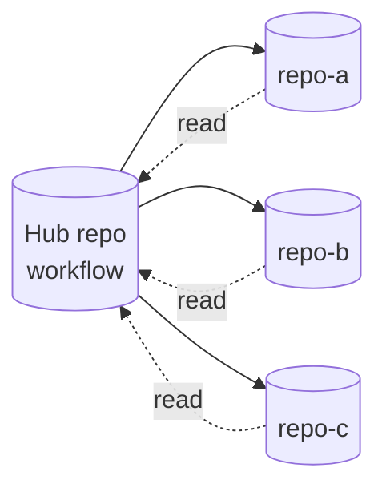

# Cross-Repository Patterns

> _Based on gh-aw v0.61.0_

A workflow doesn't have to live and breathe inside a single repo. gh-aw
provides three independent knobs for cross-repository operation: **`checkout:`**
to materialise additional repos in the runner workspace, **`tools.github.github-token`**
(and `allowed-repos`) to read from other private repos, and
**`safe-outputs.target-repo`** (with its own `github-token` and
`allowed-repos`) to write outside the repo that hosts the workflow.

## TL;DR

- `checkout:` is a list of additional repository checkouts. Each entry supports
  `repository:`, `path:`, `ref:`, `fetch-depth:`, `sparse-checkout:`,
  `github-token:`, and `current: true` to mark the agent's primary target.
- `checkout: false` disables the default checkout entirely (useful for
  read-only-via-API agents).
- To **read** from other private repos through the GitHub MCP server, set
  `tools.github.github-token: ${{ secrets.PAT }}` and constrain with
  `allowed-repos:`.
- To **write** outside the host repo, set `safe-outputs.github-token` and
  per-output `target-repo:` + `allowed-repos:`. Use `target-repo: "*"` for
  runtime-determined targets.
- Three common topologies: hub-and-spoke (central agent → many target repos),
  cross-repo issue tracking (worker repos → tracking repo), and monorepo split
  (one workflow → multiple sub-projects).

## Key Concepts

| Term                        | Meaning                                                                                                     |
| --------------------------- | ----------------------------------------------------------------------------------------------------------- |
| **Checkout entry**          | An item in the `checkout:` list that materialises a repo in the runner workspace.                           |
| **`current:` marker**       | Flag identifying which checkout is the agent's primary working repo.                                        |
| **`allowed-repos:`**        | Pattern allowlist constraining which repos the GitHub MCP server may read or write to.                      |
| **`target-repo:`**          | Per-output destination; can be a literal `owner/repo` or `"*"` (decided at runtime via the agent's intent). |
| **Hub-and-spoke**           | Topology where one workflow drives many spoke repositories.                                                 |

## Deep Dive

### 1. The `checkout:` field

```yaml
checkout:
  - fetch-depth: 0                       # full history of the host repo
    fetch: ["refs/pulls/open/*"]
  - repository: org/other-repo
    path: ./libs/other
    ref: main
    sparse-checkout: |
      defaults/
      overrides/
    github-token: ${{ secrets.CROSS_REPO_PAT }}
    current: true                        # mark as agent's primary target
```

Each entry maps onto an `actions/checkout` invocation. Notable fields:

- `repository:` — `owner/repo` for non-host repos.
- `path:` — workspace path (defaults to repo name).
- `ref:` — branch / tag / SHA.
- `fetch-depth:` — `0` for full history; default is shallow.
- `fetch:` — extra refspecs to fetch (e.g. all open PRs).
- `sparse-checkout:` — newline-separated path filters.
- `github-token:` — credentials for private repos.
- `current: true` — marks this repo as the agent's primary target. Affects
  which path the agent treats as `cwd` and which repo's metadata flows into
  GitHub MCP.

Disable checkout entirely:

```yaml
checkout: false
```

Use this for purely API-driven agents that don't need source on disk.

### 2. Reading from other private repos

Without any extra config, the GitHub MCP server uses the workflow's
`GITHUB_TOKEN`, which only works for the host repo and (sometimes) public
content. To read from additional private repos:

```yaml
tools:
  github:
    toolsets: [repos, issues, pull_requests]
    github-token: ${{ secrets.CROSS_REPO_PAT }}
    allowed-repos: ["myorg/*", "partner/shared-repo"]
    min-integrity: approved
```

The PAT needs `Contents: Read` (and `Issues: Read`, `Pull requests: Read` per
the toolsets you enable) on every target repo.

Alternative: set the magic secret `GH_AW_GITHUB_MCP_SERVER_TOKEN` and skip the
`github-token:` line — see [auth doc](./15-auth-and-secrets.md).

### 3. Writing cross-repo via safe-outputs

```yaml
safe-outputs:
  github-token: ${{ secrets.CROSS_REPO_PAT }}
  create-issue:
    target-repo: "org/tracking-repo"
    allowed-repos: ["org/repo-a", "org/repo-b", "org/tracking-repo"]
    title-prefix: "[from-agent] "
```

- `safe-outputs.github-token` sets the *default* token for every output that
  needs cross-repo writes.
- `target-repo:` may be:
  - a literal `owner/repo`, or
  - `"*"` to allow the agent to *choose* the target at runtime via its intent
    JSON (the value must still match `allowed-repos:`).
- `allowed-repos:` is mandatory in cross-repo mode — without it, runtime
  targets are rejected.

The PAT needs `Issues: Write` (or whichever scope matches the safe-output
type) on the target repos.

### 4. `target-repo: "*"` for dynamic targets

```yaml
safe-outputs:
  github-token: ${{ secrets.CROSS_REPO_PAT }}
  create-issue:
    target-repo: "*"
    allowed-repos: ["myorg/repo-a", "myorg/repo-b", "myorg/repo-c"]
```

In the agent's intent JSON, the `target-repo` field is supplied by the agent:

```json
{
  "type": "create_issue",
  "target_repo": "myorg/repo-b",
  "title": "Investigate flaky test",
  "body": "..."
}
```

If the agent picks a repo *not* in `allowed-repos:`, the safe-output job
fails the run. This is the safe way to let an LLM dispatch issues into many
repos without giving it carte blanche.

### 5. Topology: hub-and-spoke

One control workflow in a hub repo, fanning out to many spoke repos:



```yaml
---
on:
  schedule: daily around 6am
  workflow_dispatch:

permissions:
  contents: read
  issues: read

tools:
  github:
    toolsets: [repos, issues, pull_requests]
    github-token: ${{ secrets.HUB_AND_SPOKE_PAT }}
    allowed-repos: ["myorg/repo-a", "myorg/repo-b", "myorg/repo-c"]
    min-integrity: approved

safe-outputs:
  github-token: ${{ secrets.HUB_AND_SPOKE_PAT }}
  create-issue:
    target-repo: "*"
    allowed-repos: ["myorg/repo-a", "myorg/repo-b", "myorg/repo-c"]
    title-prefix: "[hub] "

engine: copilot
---
```

### 6. Topology: cross-repo issue tracking

Many worker repos each run a workflow that opens issues into a single tracker
repo:

```yaml
safe-outputs:
  github-token: ${{ secrets.TRACKER_PAT }}
  create-issue:
    target-repo: "myorg/release-tracker"
    allowed-repos: ["myorg/release-tracker"]
    title-prefix: "[from ${{ github.repository }}] "
    labels: [from-worker]
```

The tracker repo aggregates work from many sources without each worker needing
its own visibility.

### 7. Topology: monorepo split

A single workflow in a monorepo checks out several sub-projects (each a
distinct repo) and reasons across them:

```yaml
checkout:
  - fetch-depth: 0
  - repository: org/api
    path: ./services/api
    sparse-checkout: |
      src/
      tests/
    github-token: ${{ secrets.CROSS_REPO_PAT }}
  - repository: org/frontend
    path: ./services/frontend
    sparse-checkout: |
      src/
      package.json
    github-token: ${{ secrets.CROSS_REPO_PAT }}
    current: true     # frontend is the primary target

tools:
  github:
    toolsets: [repos, issues, pull_requests]
    github-token: ${{ secrets.CROSS_REPO_PAT }}
    allowed-repos: ["org/api", "org/frontend"]
```

### 8. Picking the right combination

| Scenario                                 | `checkout:`                       | `tools.github.github-token` | `safe-outputs.github-token` + `target-repo` |
| ---------------------------------------- | --------------------------------- | --------------------------- | ------------------------------------------- |
| Host-repo only, fully managed            | default (host)                    | not needed                  | not needed                                  |
| Read another private repo's metadata     | not strictly needed               | required                    | not needed                                  |
| Read another private repo's *files*      | required (with `repository:`)     | required                    | not needed                                  |
| Open issues in another repo              | not needed                        | optional                    | required (`target-repo:` literal)           |
| Dynamically pick target repo at runtime  | not needed                        | optional                    | required (`target-repo: "*"` + allow-list)  |
| Pure API-driven agent (no source on disk)| `checkout: false`                 | required                    | required (if writing cross-repo)            |

## Pitfalls & FAQ

**Q: `target-repo: "*"` works in dev but fails in CI.**
Almost always missing `allowed-repos:`. Without it, dynamic targets are
rejected outright.

**Q: My fine-grained PAT can read but the safe-output job 403s on write.**
The token needs explicit *write* permission on the right resource (Issues,
Contents, etc.) on every target repo. Update the PAT scopes.

**Q: I checked out a second repo but the agent is still operating on the host.**
Add `current: true` to the second checkout entry. That marks it as the agent's
primary working directory.

**Q: Should I rely on `GITHUB_TOKEN` for cross-repo?**
No. The default token only authorises actions against the host repo. Use a
fine-grained PAT (or `GH_AW_GITHUB_MCP_SERVER_TOKEN` for read-only) for
anything else.

**Q: Can I `safe-outputs.create-pull-request` cross-repo?**
Same-repo only. `push-to-pull-request-branch` is also same-repo only by
design. For cross-repo PR proposals, file an issue in the target repo or use
`dispatch-workflow`/`dispatch_repository`.

**Q: How do I avoid leaking secrets into spoke repos?**
Use a *fine-grained* PAT scoped to the minimum required repos. Don't use a
classic PAT or a token with `Repo: All`.

**Q: Can I disable checkout but keep imports?**
Yes — `checkout: false` only removes the workspace clone; imports are still
resolved at compile time and bundled.

**Q: Will `min-integrity` filter cross-repo reads too?**
Yes. The integrity classifier is applied to every item the GitHub MCP server
returns, regardless of which repo it came from.

## Related Docs

- [Architecture & Security Model](./01-architecture-and-security.md)
- [Frontmatter Reference](./03-frontmatter-reference.md)
- [Safe-Outputs Catalog](./06-safe-outputs-catalog.md)
- [Authentication & Secrets](./15-auth-and-secrets.md)
- [Permissions & RBAC](./16-permissions-and-rbac.md)
- [min-integrity & Content Trust](./17-min-integrity-and-content-trust.md)
