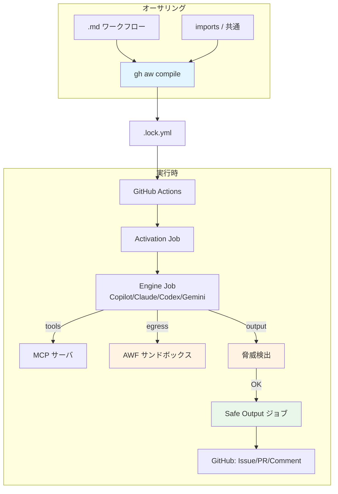

# Deep Dive ドキュメント

> _gh-aw v0.61.0 ベース · 最終確認 2026-04_
> 🇬🇧 [English version](./README.md)

**GitHub Agentic Workflows** (gh-aw) の包括的・階層的ガイド。各ドキュメントは **TL;DR → 主要な概念 → 詳細解説 → 例 → 落とし穴 / FAQ → 関連ドキュメント** という統一構成、Mermaid 図つき。

## 一覧

| # | トピック | EN | JP | 対象読者 |
|---|---|---|---|---|
| 01 | アーキテクチャとセキュリティ | [📘](./01-architecture-and-security.md) | [📗](./01-architecture-and-security.ja.md) | 全員 |
| 02 | エンジン (Copilot/Claude/Codex/Gemini/Crush) | [📘](./02-engines.md) | [📗](./02-engines.ja.md) | 開発者 |
| 03 | Frontmatter リファレンス | [📘](./03-frontmatter-reference.md) | [📗](./03-frontmatter-reference.ja.md) | 開発者 |
| 04 | トリガーとスケジューリング | [📘](./04-triggers-and-scheduling.md) | [📗](./04-triggers-and-scheduling.ja.md) | 開発者 |
| 05 | ツールと MCP | [📘](./05-tools-and-mcp.md) | [📗](./05-tools-and-mcp.ja.md) | 開発者 |
| 06 | Safe Outputs カタログ | [📘](./06-safe-outputs-catalog.md) | [📗](./06-safe-outputs-catalog.ja.md) | 開発者 |
| 07 | AWF ファイアウォールとサンドボックス | [📘](./07-awf-firewall-and-sandbox.md) | [📗](./07-awf-firewall-and-sandbox.ja.md) | セキュリティ |
| 08 | 脅威検出と XPIA | [📘](./08-threat-detection-and-xpia.md) | [📗](./08-threat-detection-and-xpia.ja.md) | セキュリティ |
| 09 | Imports と共通コンポーネント | [📘](./09-imports-and-shared-components.md) | [📗](./09-imports-and-shared-components.ja.md) | 開発者 |
| 10 | ワークフロー作成クックブック | [📘](./10-writing-workflows-cookbook.md) | [📗](./10-writing-workflows-cookbook.ja.md) | 開発者 |
| 11 | デバッグと可観測性 | [📘](./11-debugging-and-observability.md) | [📗](./11-debugging-and-observability.ja.md) | 運用 |
| 12 | このリポジトリのワークフロー徹底解説 | [📘](./12-this-repos-workflows-walkthrough.md) | [📗](./12-this-repos-workflows-walkthrough.ja.md) | 初学者 |
| 13 | 用語集と概念マップ | [📘](./13-glossary-and-concepts.md) | [📗](./13-glossary-and-concepts.ja.md) | 全員 |
| 14 | FAQ とトラブルシューティング | [📘](./14-faq-and-troubleshooting.md) | [📗](./14-faq-and-troubleshooting.ja.md) | 全員 |
| 15 | 認証とシークレット | [📘](./15-auth-and-secrets.md) | [📗](./15-auth-and-secrets.ja.md) | 開発者 / 運用 |
| 16 | 権限と RBAC | [📘](./16-permissions-and-rbac.md) | [📗](./16-permissions-and-rbac.ja.md) | 開発者 / セキュリティ |
| 17 | Min-Integrity とコンテンツ信頼 | [📘](./17-min-integrity-and-content-trust.md) | [📗](./17-min-integrity-and-content-trust.ja.md) | セキュリティ |
| 18 | APM と依存関係 | [📘](./18-apm-and-dependencies.md) | [📗](./18-apm-and-dependencies.ja.md) | 開発者 |
| 19 | カスタム Safe Outputs | [📘](./19-custom-safe-outputs.md) | [📗](./19-custom-safe-outputs.ja.md) | 開発者 |
| 20 | クロスリポジトリパターン | [📘](./20-cross-repo-patterns.md) | [📗](./20-cross-repo-patterns.ja.md) | 開発者 |

## 学習パス

### 🟢 初学者 — 「とりあえず動かしたい」
1. [12 — このリポジトリのワークフロー](./12-this-repos-workflows-walkthrough.ja.md) — 実例から学ぶ
2. [13 — 用語集](./13-glossary-and-concepts.ja.md) — 語彙を押さえる
3. [04 — トリガーとスケジューリング](./04-triggers-and-scheduling.ja.md) — いつ動くのか
4. [06 — Safe Outputs カタログ](./06-safe-outputs-catalog.ja.md) — 何が出力できるのか
5. [14 — FAQ](./14-faq-and-troubleshooting.ja.md) — よくある落とし穴

### 🔵 開発者 — 「新しいワークフローを作りたい」
1. [01 — アーキテクチャとセキュリティ](./01-architecture-and-security.ja.md)
2. [15 — 認証とシークレット](./15-auth-and-secrets.ja.md) — エンジンを接続
3. [03 — Frontmatter リファレンス](./03-frontmatter-reference.ja.md)
4. [16 — 権限と RBAC](./16-permissions-and-rbac.ja.md) — 誰が起動できるか
5. [05 — ツールと MCP](./05-tools-and-mcp.ja.md)
6. [10 — クックブック](./10-writing-workflows-cookbook.ja.md) — レシピを応用
7. [09 — Imports](./09-imports-and-shared-components.ja.md) + [18 — APM](./18-apm-and-dependencies.ja.md) — DRY 化
8. [19 — カスタム Safe Outputs](./19-custom-safe-outputs.ja.md) — 書き込みレイヤを拡張
9. [20 — クロスリポジトリパターン](./20-cross-repo-patterns.ja.md) — 複数リポジトリ連携
10. [02 — エンジン](./02-engines.ja.md) — LLM 選定
11. [11 — デバッグ](./11-debugging-and-observability.ja.md)

### 🔴 セキュリティ / プラットフォームエンジニア — 「有効化して安全か?」
1. [01 — アーキテクチャとセキュリティ](./01-architecture-and-security.ja.md) — 3 つの信頼レイヤ
2. [16 — 権限と RBAC](./16-permissions-and-rbac.ja.md) — 起動権限と操作権限
3. [17 — Min-Integrity とコンテンツ信頼](./17-min-integrity-and-content-trust.ja.md) — 投稿者信頼度フィルタ
4. [07 — AWF ファイアウォール](./07-awf-firewall-and-sandbox.ja.md) — egress 制御
5. [08 — 脅威検出と XPIA](./08-threat-detection-and-xpia.ja.md) — 出力安全性
6. [06 — Safe Outputs](./06-safe-outputs-catalog.ja.md) — 何が出るか
7. [15 — 認証とシークレット](./15-auth-and-secrets.ja.md) — エンジンごとのシークレットモデル

## システム全体マップ

## ドキュメント全体の規約

- **バージョン明記**: 全ファイルが gh-aw v0.61.0 基準。
- **バイリンガル**: 全 EN ファイルに `.ja.md` 兄弟ファイル(忠実な翻訳)。
- **クロスリンク**: ドキュメント間は相対リンクのみ(リンク切れ防止)。
- **コールアウト**: `> [!NOTE]`, `> [!WARNING]`, `> [!TIP]` で強調。
- **Mermaid**: 全図が GitHub 上で直接レンダリングされる。

## 参照

- [トップレベル README](../../README.md)
- [既存チュートリアル](../getting-started-tutorial.md)
- [CLI リファレンス](../gh-aw-cli-reference.md)
- [調査レポート](../github-agentic-workflows-https-github-github-io-gh.md)
- 公式ドキュメント: <https://github.github.io/gh-aw/>
