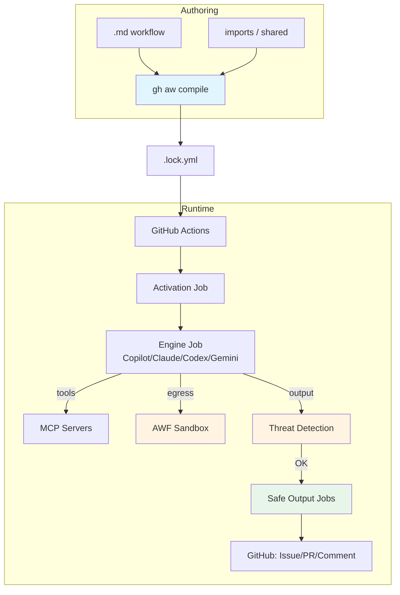

# Deep Dive Documentation

> _Based on gh-aw v0.61.0 · Last reviewed 2026-04_
> 🇯🇵 [日本語版はこちら](./README.ja.md)

A comprehensive, layered guide to **GitHub Agentic Workflows** (gh-aw). Each document follows a consistent structure: **TL;DR → Key Concepts → Deep Dive → Examples → Pitfalls/FAQ → Related Docs**, with Mermaid diagrams.

## At a glance

| # | Topic | EN | JP | Audience |
|---|---|---|---|---|
| 01 | Architecture & Security | [📘](./01-architecture-and-security.md) | [📗](./01-architecture-and-security.ja.md) | All |
| 02 | Engines (Copilot/Claude/Codex/Gemini/Crush) | [📘](./02-engines.md) | [📗](./02-engines.ja.md) | Dev |
| 03 | Frontmatter Reference | [📘](./03-frontmatter-reference.md) | [📗](./03-frontmatter-reference.ja.md) | Dev |
| 04 | Triggers & Scheduling | [📘](./04-triggers-and-scheduling.md) | [📗](./04-triggers-and-scheduling.ja.md) | Dev |
| 05 | Tools & MCP | [📘](./05-tools-and-mcp.md) | [📗](./05-tools-and-mcp.ja.md) | Dev |
| 06 | Safe Outputs Catalog | [📘](./06-safe-outputs-catalog.md) | [📗](./06-safe-outputs-catalog.ja.md) | Dev |
| 07 | AWF Firewall & Sandbox | [📘](./07-awf-firewall-and-sandbox.md) | [📗](./07-awf-firewall-and-sandbox.ja.md) | Security |
| 08 | Threat Detection & XPIA | [📘](./08-threat-detection-and-xpia.md) | [📗](./08-threat-detection-and-xpia.ja.md) | Security |
| 09 | Imports & Shared Components | [📘](./09-imports-and-shared-components.md) | [📗](./09-imports-and-shared-components.ja.md) | Dev |
| 10 | Writing Workflows Cookbook | [📘](./10-writing-workflows-cookbook.md) | [📗](./10-writing-workflows-cookbook.ja.md) | Dev |
| 11 | Debugging & Observability | [📘](./11-debugging-and-observability.md) | [📗](./11-debugging-and-observability.ja.md) | Ops |
| 12 | This Repo's Workflows (Walkthrough) | [📘](./12-this-repos-workflows-walkthrough.md) | [📗](./12-this-repos-workflows-walkthrough.ja.md) | Beginner |
| 13 | Glossary & Concepts | [📘](./13-glossary-and-concepts.md) | [📗](./13-glossary-and-concepts.ja.md) | All |
| 14 | FAQ & Troubleshooting | [📘](./14-faq-and-troubleshooting.md) | [📗](./14-faq-and-troubleshooting.ja.md) | All |
| 15 | Auth & Secrets | [📘](./15-auth-and-secrets.md) | [📗](./15-auth-and-secrets.ja.md) | Dev / Ops |
| 16 | Permissions & RBAC | [📘](./16-permissions-and-rbac.md) | [📗](./16-permissions-and-rbac.ja.md) | Dev / Security |
| 17 | Min-Integrity & Content Trust | [📘](./17-min-integrity-and-content-trust.md) | [📗](./17-min-integrity-and-content-trust.ja.md) | Security |
| 18 | APM & Dependencies | [📘](./18-apm-and-dependencies.md) | [📗](./18-apm-and-dependencies.ja.md) | Dev |
| 19 | Custom Safe Outputs | [📘](./19-custom-safe-outputs.md) | [📗](./19-custom-safe-outputs.ja.md) | Dev |
| 20 | Cross-Repo Patterns | [📘](./20-cross-repo-patterns.md) | [📗](./20-cross-repo-patterns.ja.md) | Dev |

## Learning paths

### 🟢 Beginner — "I just want to run a workflow"
1. [12 — This Repo's Workflows](./12-this-repos-workflows-walkthrough.md) — see real examples
2. [13 — Glossary](./13-glossary-and-concepts.md) — get the vocabulary
3. [04 — Triggers & Scheduling](./04-triggers-and-scheduling.md) — when does it run?
4. [06 — Safe Outputs Catalog](./06-safe-outputs-catalog.md) — what can it produce?
5. [14 — FAQ](./14-faq-and-troubleshooting.md) — common gotchas

### 🔵 Developer — "I'm building new workflows"
1. [01 — Architecture & Security](./01-architecture-and-security.md)
2. [15 — Auth & Secrets](./15-auth-and-secrets.md) — wire up your engine
3. [03 — Frontmatter Reference](./03-frontmatter-reference.md)
4. [16 — Permissions & RBAC](./16-permissions-and-rbac.md) — who can trigger it
5. [05 — Tools & MCP](./05-tools-and-mcp.md)
6. [10 — Cookbook](./10-writing-workflows-cookbook.md) — recipes to adapt
7. [09 — Imports](./09-imports-and-shared-components.md) + [18 — APM](./18-apm-and-dependencies.md) — DRY across workflows
8. [19 — Custom Safe Outputs](./19-custom-safe-outputs.md) — extend the write layer
9. [20 — Cross-Repo Patterns](./20-cross-repo-patterns.md) — multi-repo orchestration
10. [02 — Engines](./02-engines.md) — pick your LLM
11. [11 — Debugging](./11-debugging-and-observability.md)

### 🔴 Security / Platform Engineer — "Is this safe to enable?"
1. [01 — Architecture & Security](./01-architecture-and-security.md) — three trust layers
2. [16 — Permissions & RBAC](./16-permissions-and-rbac.md) — who can trigger, what can they do
3. [17 — Min-Integrity & Content Trust](./17-min-integrity-and-content-trust.md) — author-trust filtering
4. [07 — AWF Firewall & Sandbox](./07-awf-firewall-and-sandbox.md) — egress control
5. [08 — Threat Detection & XPIA](./08-threat-detection-and-xpia.md) — output safety
6. [06 — Safe Outputs](./06-safe-outputs-catalog.md) — what gets emitted
7. [15 — Auth & Secrets](./15-auth-and-secrets.md) — secret model per engine

## System map

## Conventions used in these docs

- **Version stamp**: every file is dated against gh-aw v0.61.0.
- **Bilingual**: every EN file has a `.ja.md` sibling that is a faithful translation.
- **Cross-links**: relative links between docs only — no external link rot.
- **Callouts**: `> [!NOTE]`, `> [!WARNING]`, `> [!TIP]` for emphasis.
- **Mermaid**: all diagrams render natively on GitHub.

## See also

- [Top-level README](../../README.md)
- [Existing tutorial](../getting-started-tutorial.md)
- [CLI reference](../gh-aw-cli-reference.md)
- [Research report](../github-agentic-workflows-https-github-github-io-gh.md)
- Official docs: <https://github.github.io/gh-aw/>
